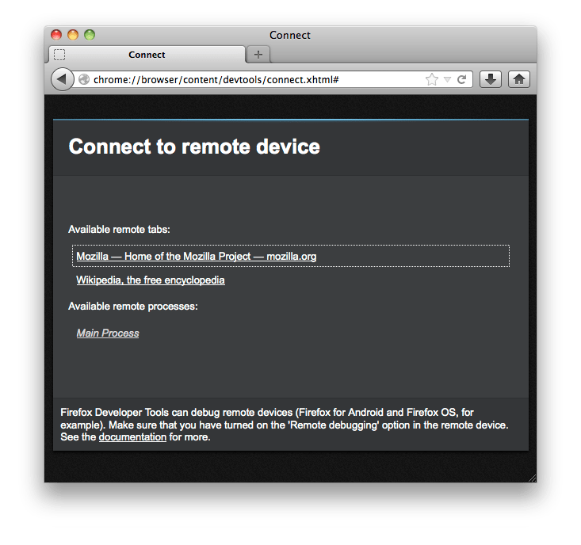

==============================
Remotely debugging Thunderbird
==============================

This guide explains how to use remote debugging to inspect or debug code running in Thunderbird.

Various developer tools are supported by Thunderbird using the remote connection mechanism in Firefox. The currently supported toolset is the Web Console, Inspector, Debugger, Style Editor, Profiler and Network Monitor. Other Tools may become available in the future.

Setting up Thunderbird
**********************

All that needs to be done in Thunderbird is enabling the debugger server. This can be done using ``Tools`` from the Menu Bar (alt + Tools) and selecting ``Allow Remote Debugging``. By default, a debugger server will be started on port 6000. If you would like to change this port, for example to debug multiple profiles, you must open the advanced config editor and change the preference ``devtools.debugger.remote-port``.

Setting up Firefox
******************

Firefox acts as the client and provides the user interface to control the developer tools for Thunderbird. It's best to use a Firefox and Thunderbird version with a matching major version number, but in some cases it will work even with differing versions.

To set up Firefox, remote debugging is enabled by a setting in the Toolbox. :doc:`Open the Toolbox <../../tools_toolbox/index>`, click the "Settings" button in the :ref:`toolbar <tools-toolbox-toolbar>`, and check "Enable remote debugging" in the :ref:`Settings <tool-toolbox-settings>` tab:

.. image:: remote-debugger-toolbox-settings.png
  :class: center

Now you can open the connection page in Firefox via the tools menu:

A page will open in the browser; you can add this to your bookmarks toolbar if you like. In case you didn't change the remote port, the fields will already be filled out correctly. Click on the Connect button to initiate the developer tools remote connection.

.. image:: remote-debugging-desktop-connect.png
  :class: center

Afterwards you will be presented with a list of remote tabs and processes. As Thunderbird's notion of tabs doesn't match Firefox, the remote tabs area shows all xul:browser elements in Thunderbird. This can be a content tab, or the message reader. In most cases you will want to select "Main Process" to debug the Thunderbird code itself. A new window opens containing a set of developer tools that can be used with your Thunderbird instance.

Using the Developer Tools
*************************

Usage of the tools is mostly self explanatory. If you are having trouble with a certain tool, check the :doc:`Developer Tools documentation <../index>`. Due to a remote connection being used there might be some slight differences. Some tools might not be available, and it is also possible that performance is not comparable. For example, using the remote debugger tool takes quite some time to load because the files must be transferred over an internal network connection.

Troubleshooting
***************

If you encounter an error, the first thing you should check is if you are using matching version numbers. If you are using Thunderbird 24, you should also use Firefox 24 to connect. Next, it important to figure out if it is a problem with the Firefox Developer Tools or with the remote connection code in Thunderbird. To verify this, please try to reproduce the problem using only Firefox. For example, if you notice that you cannot set an attribute value in the Inspector tool, try changing an attribute in the Browser Debugger in Firefox. If you cannot reproduce it there, file a bug in the Thunderbird product, otherwise file a bug in Firefox/Developer Tools.
