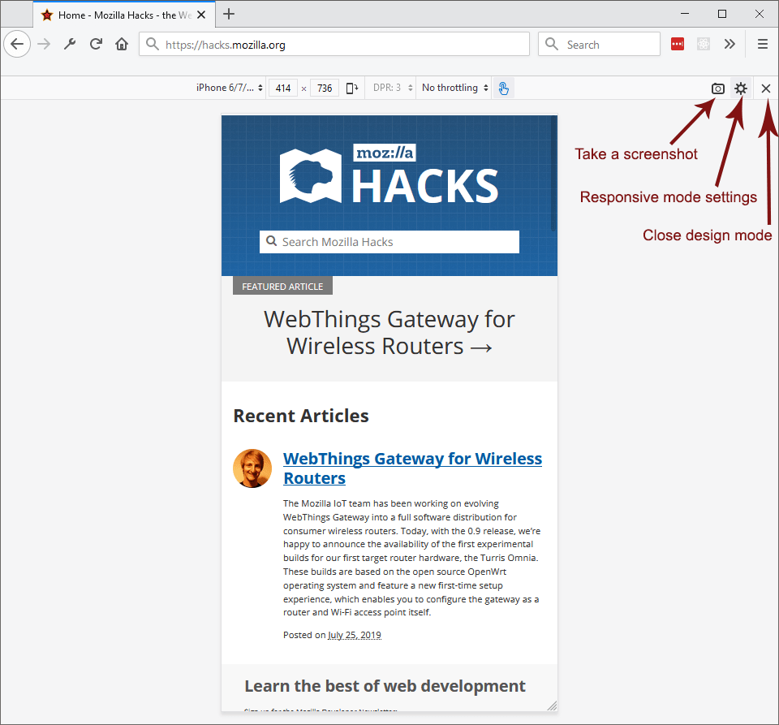
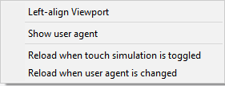
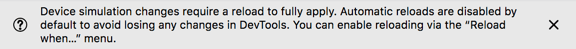
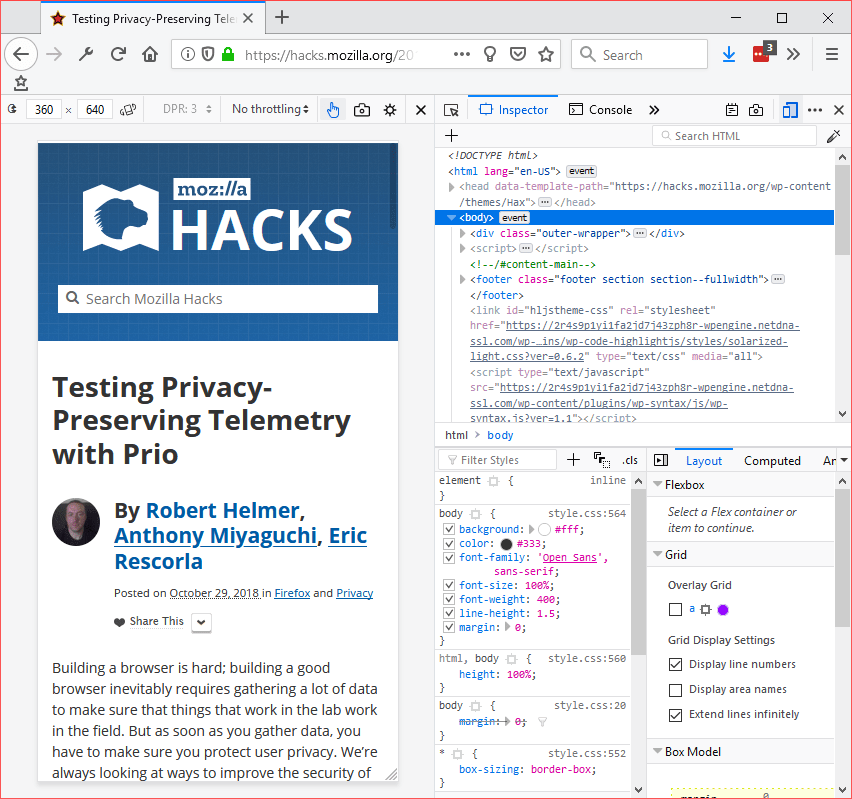
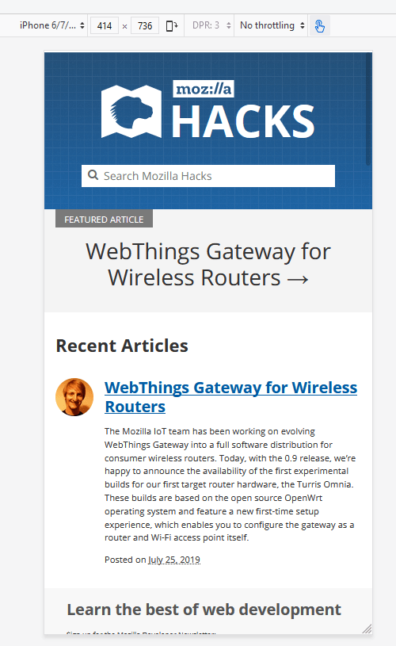

======================
Responsive Design Mode
======================

`Responsive design <https://developer.mozilla.org/en-US/docs/Web/Progressive_web_apps/Responsive/responsive_design_building_blocks>`_ is the practice of designing a website so it looks and works properly on a range of different devices — particularly mobile phones and tablets as well as desktops and laptops.

The most obvious factor here is screen size, but there are other factors as well, including the pixel density of the display and whether it supports touch. Responsive Design Mode gives you a simple way to simulate these factors, to test how your website will look and behave on different devices.

Toggling Responsive Design Mode
*******************************

There are three ways to toggle Responsive Design Mode:

- From the Firefox menu: Select **Responsive Design Mode** from the **Browser Tools** submenu in the Firefox Menu (or **Tools** menu if you display the menu bar or are on macOS).
- From the Developer Tools toolbox: Press the **Responsive Design Mode** button in the :ref:`Toolbox's toolbar <tools-toolbox-toolbar>`
- From the keyboard: Press :kbd:`Ctrl` + :kbd:`Shift` + :kbd:`M` (or :kbd:`Cmd` + :kbd:`Opt` + :kbd:`M` on macOS).

Controlling Responsive Design Mode
**********************************

With Responsive Design Mode enabled, the content area for web pages is set to the screen size for a mobile device. Initially, it's set to 320 x 480 pixels.

.. note::

  The device you select when in Responsive Design Mode and the orientation (portrait or landscape) is saved between sessions.

Information for the selected device is centered over the display. From left to right, the display includes:

- *Name of the selected device* - A drop-down list that includes whatever devices you have selected from the Device Settings screen.
- *Screen size* - You can edit the width and height values to change the device size by editing a number directly or using the :kbd:`Up` and :kbd:`Down` keys to increase or decrease the value by 1 pixels on each keypress or hold and :kbd:`Shift` to change the value by 10.

  - The mouse wheel changes the size values by 1 pixel at a time
  - You can also change the device's screen size by grabbing the bottom-right corner of the viewport and dragging it to the size you want.

- *Orientation (portrait or landscape)* - This setting persists between sessions
- *DPR (pixel ratio)* - Beginning with Firefox 68, the DPR is no longer editable; create a custom device in order to change the DPR
- *Throttling* - A drop-down list where you can select the connection throttling to apply, for example 2G, 3G, or LTE
- *Enable/Disable touch simulation* - Toggles whether or not Responsive Design Mode simulates touch events. While touch event simulation is enabled, mouse events are translated into `touch events <https://developer.mozilla.org/en-US/docs/Web/API/Touch_events>`_; this includes (starting in Firefox 79) translating a mouse-drag event into a touch-drag event. (Note that when touch simulation is enabled, this toolbar icon is blue; when simulation is disabled, it is black.

On the right end of the screen, three buttons allow you to:

.. _responsive-design-mode-camera-button:

- *Camera button* - take a screenshot

  - Screenshots are saved to Firefox's default download location.
  - If you checked "Screenshot to clipboard" in the Developer Tools :doc:`Settings <../settings/index>` page, then the screenshot will be copied to the system clipboard.

- *Settings button* - Opens the RDM settings menu
- *Close button* - closes RDM mode and returns to regular browsing

The Settings menu includes the following commands:

- *Left-align Viewport* - when checked moves the RDM viewport to the left side of the browser window
- *Show user agent* - when checked displays the user agent string
- The final two options define when the page is reloaded:

  - *Reload when touch simulation is toggled:* when this option is enabled, the page is reloaded whenever you toggle touch support.
  - *Reload when user agent is changed:* when this option is enabled, the page is reloaded whenever the user agent is changed.

Reloading on these changes can be helpful because certain page behaviors would otherwise not be applied. For example, many pages check for touch support on load and only add event handlers if it is supported, or only enable certain features on certain browsers.

However, if you are not interested in examining such features (maybe you are just checking the overall layout at different sizes), these reloads can waste time and possibly result in the loss of productive work, so it is useful to be able to control these reloads.

Now when you change such settings for the first time, you are given a warning message that tells you these reloads are no longer automatic, and informed about how you can make them automatic. For example:

Developer Toolbox with RDM
**************************

You can show or hide the Developer Tools toolbox independently of toggling Responsive Design Mode itself:

While Responsive Design Mode is enabled, you can continue browsing as you normally would in the resized content area.

Device selection
****************

Just above the viewport there is a label "no device selected"; click this to see a list of device names. Select a device, and Responsive Design Mode sets the following properties to match the selected device:

- Screen size
- Device pixel ratio (the ratio of device physical pixels to device-independent pixels)
- Touch event simulation

Additionally, Firefox sets the `User-Agent <https://developer.mozilla.org/en-US/docs/Web/HTTP/Headers/User-Agent>`_ HTTP request header to identify itself as the default browser on the selected device. For example, if you've selected an iPhone, then Firefox identifies itself as Safari. The `navigator.userAgent <https://developer.mozilla.org/en-US/docs/Web/API/Navigator/userAgent>`_ property is set to the same value.

.. raw:: html

  <iframe width="560" height="315" src="https://www.youtube.com/embed/JNAyKemudv0" title="YouTube video player" frameborder="0" allow="accelerometer; autoplay; clipboard-write; encrypted-media; gyroscope; picture-in-picture" allowfullscreen></iframe>
   
   

The devices listed in the drop-down are just a subset of the devices that can be selected. At the end of the drop-down, there is an item labeled **Edit list**. Select this to see a panel containing all the choices, which enables you to check the devices you want to see in the drop-down.

Creating custom devices
-----------------------

You can create and save custom devices in Responsive Design Mode by clicking the **Add Custom Device** button. Each device can have its own:

- Name
- Size
- DevicePixelRatio
- User Agent String
- Touch Screen

Also, you can preview the properties of existing devices by hovering over the name in the device modal, where they display in a tooltip.

.. raw:: html

  <iframe width="560" height="315" src="https://www.youtube.com/embed/SA0RlGtOCmE" title="YouTube video player" frameborder="0" allow="accelerometer; autoplay; clipboard-write; encrypted-media; gyroscope; picture-in-picture" allowfullscreen></iframe>
   
   

Network throttling
******************

If you do all your development and testing using a very fast network connection, users may experience problems with your site if they are using a slower connection. In Responsive Design Mode, you can instruct the browser to emulate, very approximately, the characteristics of various different types of networks.

The characteristics emulated are:

- Download speed
- Upload speed
- Minimum latency

The table below lists the numbers associated with each network type, but please do not rely on this feature for exact performance measurements; it's intended to give an approximate idea of the user experience in different conditions.

.. list-table::
  :widths: 25 25 25 25
  :header-rows: 1

  * - Selection
    - Download speed
    - Upload speed
    - Minimum latency (ms)

  * - GPRS
    - 50 Kb/s
    - 20 Kb/s
    - 500

  * - Regular 2G
    - 250 Kb/s
    - 50 Kb/s
    - 300

  * - Good 2G
    - 450 Kb/s
    - 150 Kb/s
    - 150

  * - Regular 3G
    - 750 Kb/s
    - 250 Kb/s
    - 100

  * - Good 3G
    - 1.5 Mb/s
    - 750 Kb/s
    - 40

  * - Regular 4G/LTE
    - 4 Mb/s
    - 3 Mb/s
    - 20

  * - DSL
    - 2 Mb/s
    - 1 Mb/s
    - 5

  * - Wi-Fi
    - 30 Mb/s
    - 15 Mb/s
    - 2

  * - Offline
    - 0 Mb/s
    - 0 Mb/s
    - 5

To select a network, click the list box that's initially labeled "No throttling":

