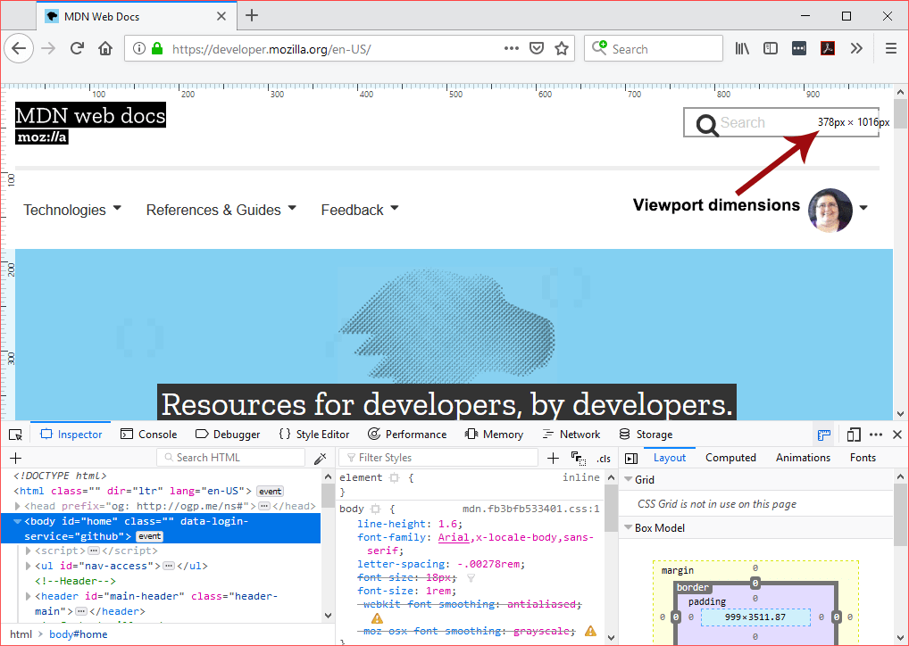
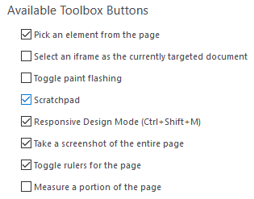
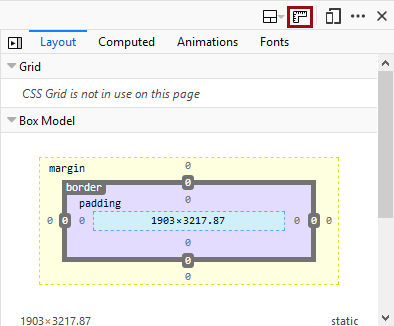

======
Rulers
======

You can overlay horizontal and vertical rulers on a web page:

The units are in pixels.

The dimensions of the viewport are displayed near the top-right corner of the viewport.

To be able to toggle rulers for a page, you first need to enable the button by going to the settings page for the Developer Tools and checking "Toggle rulers for the page" under Available Toolbox Buttons.

Once enabled, the "Toggle rulers for the page" button appears at the top right of the Toolbox, in the same place as the Settings/Options button.

Behavior to keep in mind when using rulers:

- The rulers command must be reapplied in **new tabs** and after **each page refresh.**
- The command isn't permanent.
