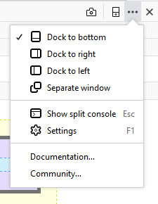
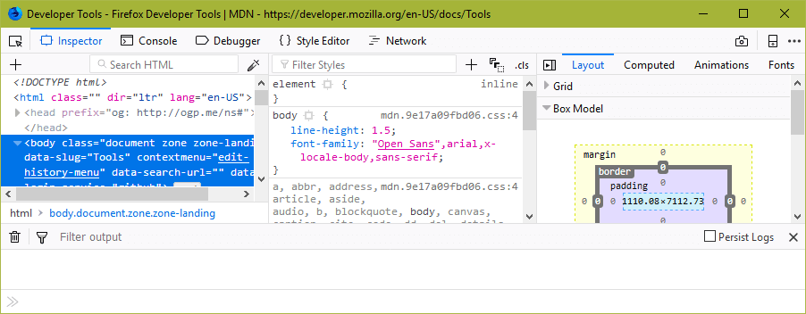
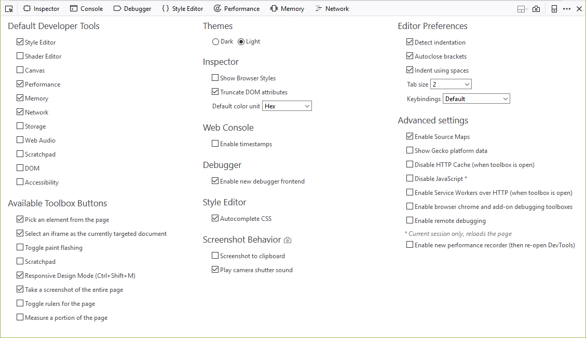

========
Settings
========

.. _tool-toolbox-settings:

Opening Settings
****************

Beginning with Firefox 62, the icon to open Developer Tools settings has been moved into a menu accessed by clicking/touching ... (the ellipsis) on the right of the tab.

The menu includes settings to control the location of the Developer Tools. You can choose between the default setting at the bottom of the windows, or move the tools to the left or right side of the screen. These settings are particularly useful if you have a widescreen monitor. You can also choose to open the tools in a separate window.

**Show split console** adds a section at the bottom of the tools showing the console. It makes visible the command line and one or two lines of the console output.

The rest of the settings are on the Developer Tools Settings Pane. To see the settings, open any of the Developer Tools, and then:

- click the "Settings" command in the menu:

  .. image:: devtools_menu.png
    :class: border

- or press :kbd:`F1` to toggle between the active tool and the Settings pane

The Settings pane looks something like this:

Categories
**********

Default Firefox Developer Tools
-------------------------------

This group of checkboxes determines which tools are enabled in the toolbox. New tools are often included in Firefox but not enabled by default.

Available Toolbox Buttons
-------------------------

This group of checkboxes determines which tools get :ref:`an icon in the Toolbox's toolbar <tools-toolbox-extra-tools>`.

As of Firefox 62, if the option to "Select an iframe as the currently targeted document" is checked, the icon will appear in the toolbar while the Settings tab is displayed, even if the current page doesn't include any iframes.

Note that in Firefox 52 we removed the checkbox to toggle the :ref:`"Select element" button <page_inspector_select_element_button>`. The "Select element" button is now always shown.

.. _settings-themes:

Themes
******

This enables you to choose one of two themes.

- There's a light theme, which is the default:

  .. image:: theme-light.png
    :alt: Light theme for DevTools
    :class: border

- A dark theme (the default on `Firefox Developer Edition <https://www.mozilla.org/en-US/firefox/developer/>`_):

  .. image:: theme-dark.png
    :alt: Dark theme for DevTools
    :class: border

.. _settings-common-preferences:

Common preferences
------------------

Settings that apply to more than one tool. There's just one of these:

*Enable persistent logs*
  A setting to control whether or not the Web Console and Network Monitor clear their output when you navigate to a new page.

.. note::

  If Common Preferences is not included in the Settings, Web Console logs can be persisted by using the 'about:config' url in browser address bar, searching for: 'devtools.webconsole.persistlog' then toggling this value to true

.. _settings-inspector:

Inspector
---------

*Show browser styles*
  A setting to control whether styles applied by the browser (`user-agent styles <https://developer.mozilla.org/en-US/docs/Web/CSS/Cascade>`_) should be displayed in the Inspector's :doc:`Rules view <../page_inspector/how_to/examine_and_edit_css/index>`. Note that this setting is independent of the "Browser styles" checkbox in the Inspector's :ref:`Computed view <page_inspector_how_to_examine_and_edit_css_examine_computed_css>`.

*Truncate DOM attributes*
  By default, the Inspector truncates DOM attributes that are more than 120 characters long. Uncheck this box to prevent this behavior. This setting works by toggling the about:config preference ``devtools.markup.collapseAttributes``. To change the threshold at which attributes are truncated, you can edit the about:config preference ``devtools.markup.collapseAttributeLength``.

*Default color unit*
  A setting to control how colors are represented in the inspector:

   - Hex
   - HSL(A)
   - RGB(A)
   - HWB
   - color name
   - As authored.

*Enable layout panel*
  Enable the experimental layout panel. This setting only exists in Firefox Nightly.

.. _settings-web-console:

Web Console
-----------

*Enable timestamps*
  Controls whether the Web Console displays timestamps. The Web Console defaults to hiding timestamps.

*Enable new console frontend*
  Switch to the experimental new console. This setting only exists in Firefox Nightly.

.. _settings-debugger:

Debugger
--------

*Enable Source Maps*
  Enable :doc:`source map support <../debugger/how_to/use_a_source_map/index>` in the debugger.

*Enable new debugger frontend*
  Enable the new debugger. This setting only exists in Firefox Nightly.

.. _settings-style-editor:

Style Editor
------------

*Show original sources*
  When a CSS preprocessor supporting source maps is used, this enables the Style Editor to display the original, preprocessor, sources rather than the generated CSS. :ref:`Learn more about Style Editor support for CSS source maps <style-editor-source-map-support>`. With this setting checked, the :ref:`Page Inspector Rules view will also provide links to the original sources <page-inspector-how-to-examine-and-edit-css-link-to-css-file>`.

*Autocomplete CSS*
  Enable the Style Editor to offer autocomplete suggestions.

Screenshot Behavior
-------------------

*Screenshot to clipboard*
  When you click the icon for the :doc:`Screenshot tool <../taking_screenshots/index>`, copy the screenshot image to the clipboard (the image will still be saved to your Downloads directory). New in Firefox 53.

*Play camera shutter sound*
  When you click the icon for the :doc:`Screenshot tool <../taking_screenshots/index>`, play a shutter sound. New in Firefox 53.

.. _settings-editor-preferences:

Editor Preferences
******************

Preferences for the `CodeMirror <https://codemirror.net/>`_ source editor, which is included in Firefox and used by several developer tools, including the :doc:`Style Editor <../style_editor/index>`.

*Detect indentation*
  Auto-indent new lines based on the current indentation.

*Autoclose brackets*
  Determines whether typing an opening character like ``[`` or ``{`` will cause the editor to insert the matching closing character ``]`` or ``}`` for you.

*Indent using spaces*
  When checked, indentation will be performed using spaces, when off, the editor will use tabs instead.

*Tab size*
  The frequency of tab stops in the editor. Select 2, 4, or 8.

*Keybindings*
 Choose the default CodeMirror keybindings or keybindings from one of several popular editors:

   - Vim
   - Emacs
   - Sublime Text

.. _settings_advanced_settings:

Advanced settings
*****************

*Show Gecko platform data*
  A setting to control whether or not profiles should include Gecko platform symbols.

*Disable HTTP Cache*
 Disable the browser HTTP cache to simulate first-load performance in all tabs that have the Toolbox open. This setting persists, meaning that if it is set, caching will be disabled whenever you reopen the devtools. Caching is re-enabled when the devtools are closed. Note that service workers are not affected by this option.

.. note::

  Note that this option was called "Disable Cache" in Firefox versions previous to 49, but it was renamed to make it clearer that this affects the HTTP cache, and not `Service Workers <https://developer.mozilla.org/en-US/docs/Web/API/Service_Worker_API>`_/the `Cache API <https://developer.mozilla.org/en-US/docs/Web/API/Cache>`_.

*Disable JavaScript*
  Reload the current tab with JavaScript disabled.

*Enable Service Workers over HTTP*
  Enable Service Worker registrations from insecure websites.

*Enable browser chrome and add-on debugging toolboxes*
  Enable you to use developer tools in the context of the browser itself, and not only web content.

*Enable remote debugging*
  Enable the developer tools debug remote Firefox instances.

*Enable worker debugging*
  Enable a panel within the debugger to debug workers.

  Note: This option got removed from the UI in Firefox 56, because this version ships with a :doc:`new Debugger UI <../debugger/index>`, but it can still be enabled for the old UI by setting the preference ``devtools.debugger.workers`` to ``true``.
