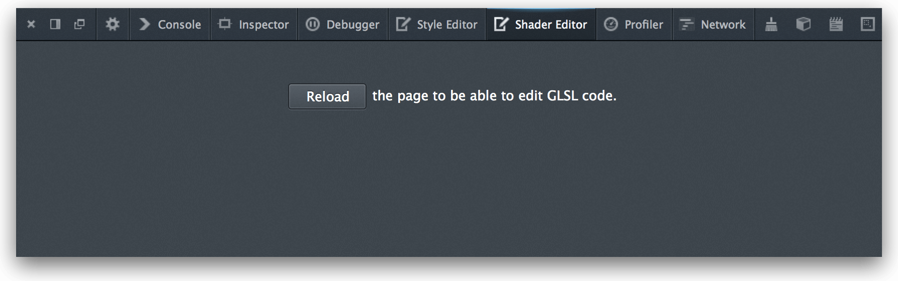
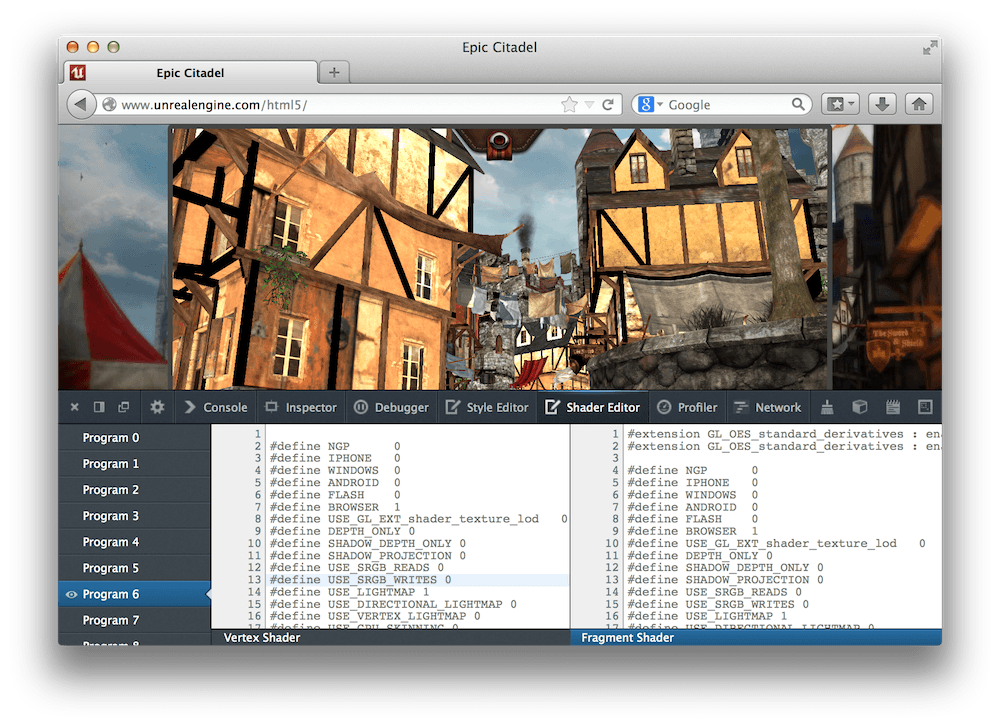
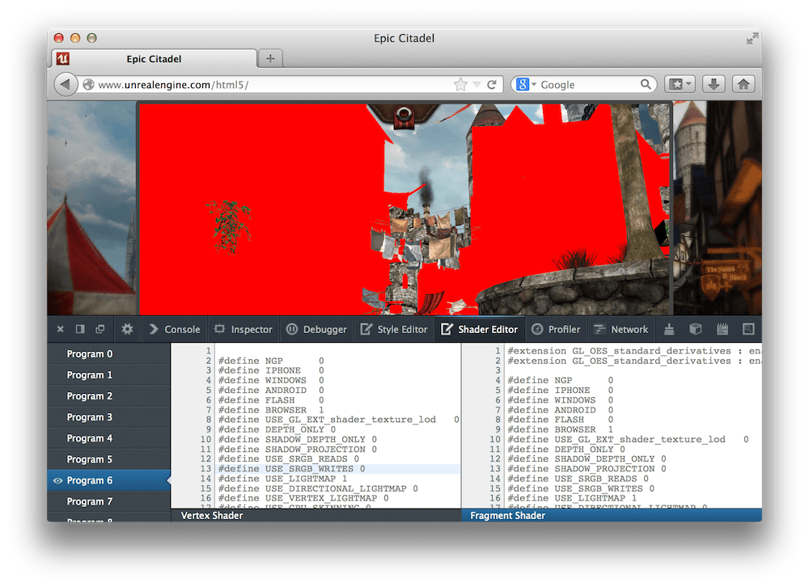
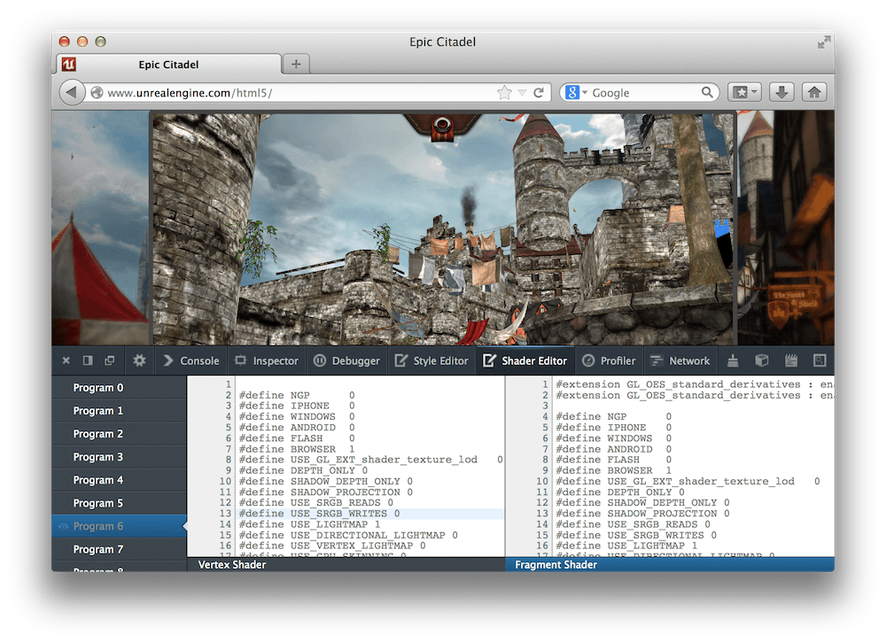
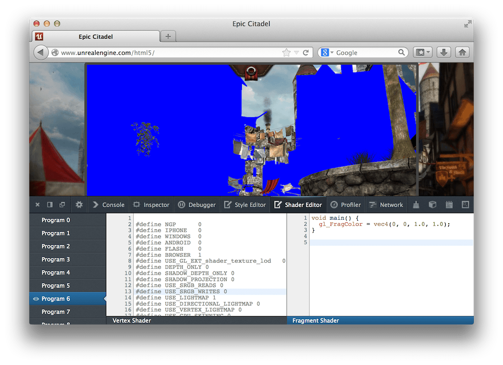
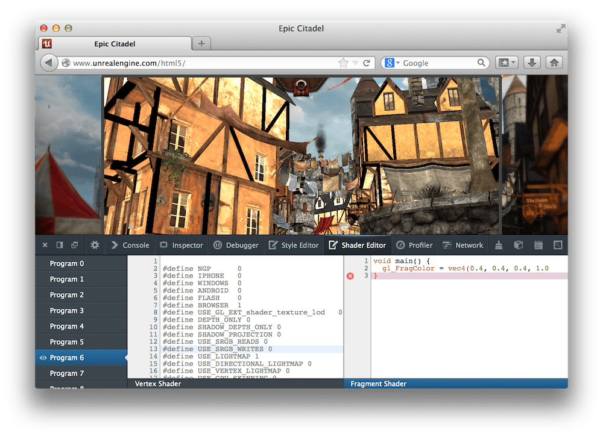
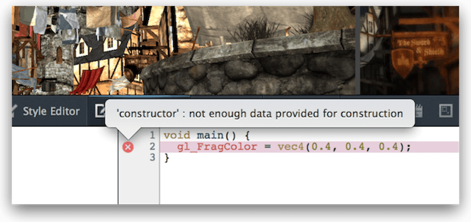

=============
Shader Editor
=============

.. warning::

  This tool has been deprecated and will soon be removed from Firefox. For details, see :doc:`Deprecated tools <../index>`.

The Shader Editor enables you to see and edit the vertex and fragment shaders used by `WebGL <https://developer.mozilla.org/en-US/docs/Web/API/WebGL_API>`_.

.. raw:: html

  <iframe width="560" height="315" src="https://www.youtube.com/embed/hnoKqFuJhu0" title="YouTube video player" frameborder="0" allow="accelerometer; autoplay; clipboard-write; encrypted-media; gyroscope; picture-in-picture" allowfullscreen></iframe>
   
   

WebGL is a `JavaScript <https://developer.mozilla.org/en-US/docs/Web/JavaScript>`_ API for rendering interactive 3D graphics and 2D graphics in the browser without using plugins. With WebGL you provide 2 programs called **shaders** which are called at the appropriate stages of the `OpenGL rendering pipeline <https://www.opengl.org/wiki/Rendering_Pipeline_Overview>`_: a `vertex shader <https://www.opengl.org/wiki/Vertex_Shader>`_, which computes the clip space coordinates of each vertex to be drawn, and a `fragment shader <https://www.opengl.org/wiki/Fragment_Shader>`_, which determines the color for each pixel to be drawn.

These shaders are written in **OpenGL Shading Language**, or `GLSL <https://www.opengl.org/documentation/glsl/>`_. In WebGL they can be included in a page in several ways: as text hardcoded in JavaScript strings, as separate files included using `<script> <https://developer.mozilla.org/en-US/docs/Web/HTML/Element/script>`_ tags, or retrieved from the server as plain text. JavaScript code running in the page then sends them for compilation using the WebGL APIs, and they're executed on the device's GPU when needed.

With the Shader Editor, you can examine and edit the source of the vertex and fragment shaders.

Opening the Shader Editor
*************************

The Shader Editor is disabled by default. To enable it, open the :doc:`Toolbox settings <../tools_toolbox/index>` and check "Shader Editor" in the "Default Firefox Developer Tools" item. You'll now see "Shader Editor" appear in the toolbar. Click it and the Shader Editor opens.

At first you'll just see a blank window with a button asking you to reload the page:

To get started, load a page which creates a WebGL context and loads a program into it. The screenshots below are from the `Unreal Engine <https://www.unrealengine.com/html5/>`_ demo.

You'll now see a window divided into three panes: a list of all the GLSL programs on the left, the vertex shader for the currently selected program in the middle, and the fragment shader for the currently selected program on the right:

Managing programs
*****************

The left hand pane lists all programs currently in use by a WebGL context. If you hover over an entry in the list, the geometry drawn by that program is highlighted in red:

If you click the eyeball icon just left of the program's entry, that program is disabled. This is useful for focusing on certain shaders or hiding overlapping geometry:

If you click the entry, its vertex and fragment shaders are shown in the other two panes, and you can edit them.

Editing shaders
***************

The middle and right hand panes show the vertex and fragment shaders for the currently selected program.

You can edit these programs and see the results the next time the WebGL context redraws (for example, in the next animation frame). For example, you can modify the colors:

The editor highlights syntax errors in your code:

If you hover over the cross shown next to a line containing an error, you'll see more details about the problem:

