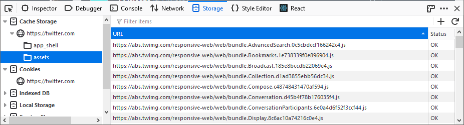

=============
Cache Storage
=============

Under the *Cache Storage* type within the :doc:`Storage Inspector <../index>` you can see the contents of any DOM caches created using the `Cache API <https://developer.mozilla.org/en-US/docs/Web/API/Cache>`_. If you select a cache, you'll see a list of the resources it contains. For each resource, you'll see:

- the URL for the resource.
- the status code for the request that was made to fetch it.

