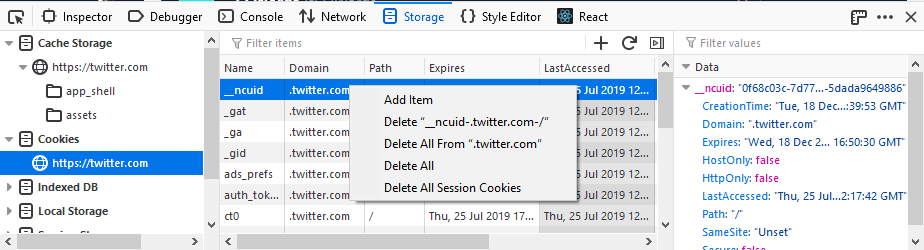

=======
Cookies
=======

When you select an origin inside the *Cookies* storage type from the storage tree, all the cookies present for that origin will be listed in a table. The cookies table has the following columns:

- *Name* — The name of the cookie.
- *Value* — The value of the cookie.
- *Domain* — The domain of the cookie.
- *Path* — The path property of the cookie.
- *Expires / Max-Age* — The time when the cookie will expire. If the cookie is a session cookie, the value of this column will be "Session"
- *Size* — The size of the cookie name plus value in bytes.
- *HttpOnly* — Is this cookie HTTP only?
- *Secure* — Is this cookie a secure cookie?
- *SameSite* — Is this cookie a same-site cookie? Same-site cookies allow servers to mitigate the risk of CSRF and information leakage attacks by asserting that a particular cookie should only be sent with requests initiated from the same registrable domain.
- *Last accessed* — Date and time when the cookie was last read.
- *Created* — Date and time when the cookie was created.
- *HostOnly* — Is this cookie a domain cookie? That is, the domain value matches exactly the domain of the current website.

.. note::

  Some of the columns are not shown by default — to change the column display, right-click on the existing table headings and use the resulting context menu to show/hide the columns.

You can edit cookies by double-clicking inside cells in the :ref:`Table Widget <storage-inspector-table-widget>` and editing the values they contain, and add new cookies by clicking the "Plus" (+) button and then editing the resulting new row to the value you want.

Context menu
------------

The context menu for each cookie includes the following commands:

- *Add item* - add a new cookie.
- *Delete <cookie name>.<domain>* - deletes the selected cookie
- *Delete All From <domain>* - deletes all cookies from the selected domain. This must be an exact match. For example, if you select "Delete All From test8.example.com" only cookies from that domain will be deleted. Cookies from "test13.example.com" will not be deleted.
- *Delete All* - deletes all cookies for the current host.
- *Delete All Session Cookies* - deletes all cookies for the current host that are scheduled to be deleted when the browser shuts down

