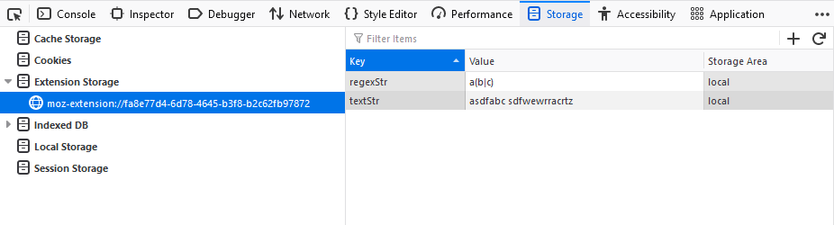

=================
Extension Storage
=================

This storage type is only shown when debugging extensions. When selecting an extension ID in the storage tree of the :doc:`Storage Inspector <../index>`, a table lists the details of all the extension storage present for the extension. This table contains the following columns:

- *Key* — The name of the stored item.
- *Value* — The value of the stored item.
- *Storage Area* — The name of the area where the item is stored.

