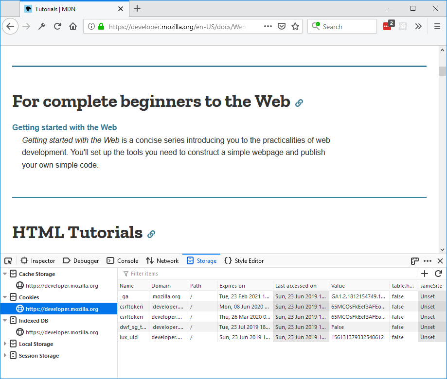
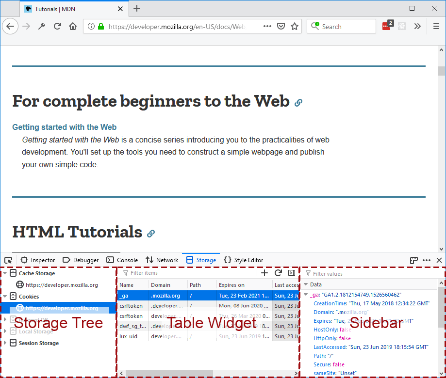
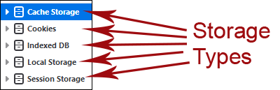
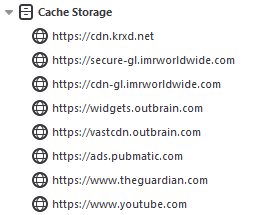
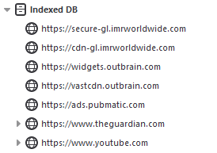
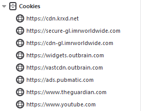
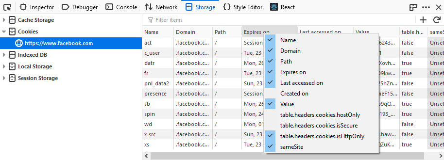
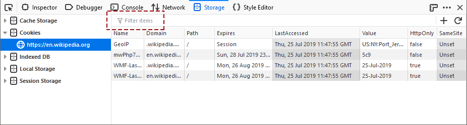

=================
Storage Inspector
=================

The Storage Inspector enables you to inspect various types of storage that a web page can use. Currently it can be used to inspect the following storage types:

- *Cache Storage* — any DOM caches created using the `Cache API <https://developer.mozilla.org/en-US/docs/Web/API/Cache>`_.

- *Cookies* — All the `cookies <https://developer.mozilla.org/en-US/docs/Web/API/Document/cookie>`_ created by the page or any iframes inside of the page. Cookies created as a part of response of network calls are also listed, but only for calls that happened while the tool is open.

- *IndexedDB* — All `IndexedDB <https://developer.mozilla.org/en-US/docs/Web/API/IndexedDB_API>`_ databases created by the page or any iframes inside the page, their Object Stores and the items stored in these Object Stores.

- *Local Storage* — All `local storage <https://developer.mozilla.org/en-US/docs/Web/API/Window/localStorage>`_ items created by the page or any iframes inside the page.

- *Session Storage* — All `session storage <https://developer.mozilla.org/en-US/docs/Web/API/Window/sessionStorage>`_ items created by the page or any iframes inside the page.

For the time being, the Storage Inspector only gives you a read-only view of storage. But we're working to let you edit storage contents in future releases.

Opening the Storage Inspector
*****************************

You can open the Storage Inspector by selecting the *Storage* panel in the Web Developer Tools, accessible from the Browser Tools submenu

The :doc:`Toolbox <../tools_toolbox/index>` will appear at the bottom of the browser window, with the Storage Inspector activated. It's just called "Storage" in the Developer Toolbox.

Storage Inspector User Interface
********************************

The Storage Inspector UI is split into three main components:

- :ref:`Storage tree <storage-inspector-storage-tree>`
- :ref:`Table Widget <storage-inspector-table-widget>`
- :ref:`Sidebar <storage-inspector-sidebar>`

.. _storage-inspector-storage-tree:

Storage tree
------------

The storage tree lists all the storage types that the Storage Inspector can inspect:

Under each type, objects are organized by origin. For cookies, the protocol does not differentiate the origin. For Indexed DB or local storage an origin is a combination of protocol + hostname. For example, "``http://mozilla.org``" and "``https://mozilla.org``" are two different origins so local storage items cannot be shared between them.

Under "Cache Storage", objects are organized by origin and then by the name of the cache:

IndexedDB objects are organized by origin, then by database name, then by object store name:

With the Cookies, Local Storage, and Session Storage types, there's only one level in the hierarchy, so stored items are listed directly under each origin:

You can click on each item in the tree to expand or collapse its children. The tree is live, so if a new origin gets added (by adding an iframe, for example), it will be added to each storage type automatically.

Clicking on a tree item will display detailed information about that item in the Table Widget on the right. For example, clicking on an origin which is a child of the Cookies storage type will show all the cookies belonging to that domain.

.. _storage-inspector-table-widget:

Table Widget
------------

The table widget displays a list of all the items corresponding to the selected tree item (be it an origin, or database) are listed. Depending on the storage type and tree item, the number of columns in the table might differ.

All the columns in a Table Widget are resizable. You can hide and show columns by context-clicking on the table header and selecting the columns you want to see:

Search
------

There's a search box at the top of the Table Widget:

This filters the table to show only items which match the search term. Items match the search term if any of their fields (including fields whose columns you have hidden) contain the search term.

You can use :kbd:`Ctrl` + :kbd:`F` (:kbd:`Cmd` + :kbd:`F` on a Mac) to focus the search box.

Add and refresh storage
-----------------------

You'll also have buttons available to add a new storage entry or refresh the view of the currently viewed storage type where applicable (you can't add new entries to IndexedDB or Cache):

.. _storage-inspector-sidebar:

Sidebar
-------

When you select any row in the Storage table widget, the sidebar is shown with details about that row. If a cookie is selected, it will list all the details about that cookie.

The sidebar can parse the value of the cookie or local storage item or an IndexedDB item and convert it into a meaningful object instead of just a string. For example:

- A stringified JSON like ``'{"foo": "bar"}'`` is shown as the origin JSON: ``{foo: "bar"}``.
- A string containing a key separated value, like ``"1~2~3~4"`` or ``"1=2=3=4"`` is shown like an array: ``[1, 2, 3, 4]``.
- A string containing key-value pairs, like ``"ID=1234:foo=bar"`` is shown as JSON: ``{ID:1234, foo: "bar"}``.

The shown values can also be filtered using the search box at the top of the sidebar.

Working with the Storage Inspector
**********************************

The following articles cover different aspects of using the Storage Inspector:

- :doc:`Cookies <../storage_inspector/cookies/index>`
- :doc:`Local Storage / Session Storage <../storage_inspector/local_storage_session_storage/index>`
- :doc:`Cache Storage <../storage_inspector/cache_storage/index>`
- :doc:`IndexedDB <../storage_inspector/indexeddb/index>`
- :doc:`Extension Storage <../storage_inspector/extension_storage/index>`
