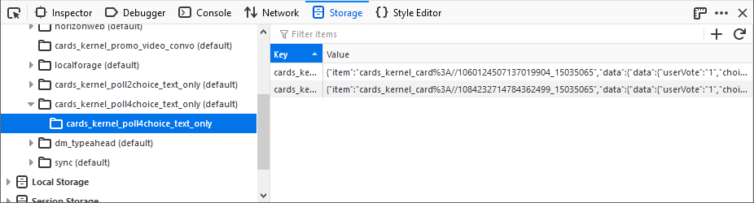
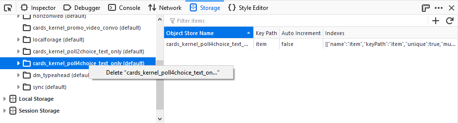
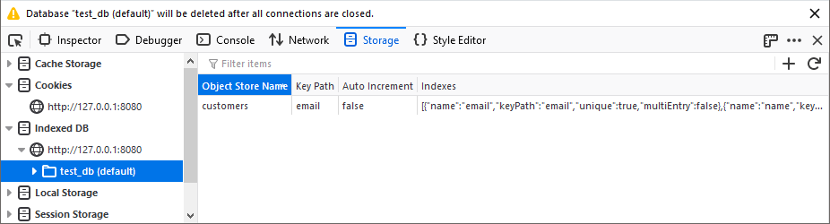
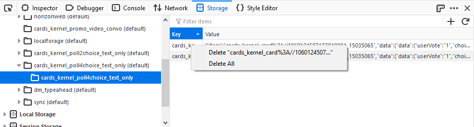

=========
IndexedDB
=========

When you select an origin inside the *Indexed DB* storage type in the storage tree of the :doc:`Storage Inspector <../index>`, a table lists the details of all the databases present for that origin.

.. note::

  The data shown in an IndexedDB database is a snapshot of the data as it was when you opened the Storage Inspector tool.

Databases have the following details:

- *Database Name* — The name of the database.
- *Storage* — The `storage type <https://developer.mozilla.org/en-US/docs/Web/API/IndexedDB_API/Browser_storage_limits_and_eviction_criteria#different_types_of_data_storage>`_ specified for the database.
- *Origin* — The origin of the database.
- *Version* — The database version.
- *Object Stores* — The number of object stores in the database.

When an IndexedDB database is selected in the storage tree, details about all the object stores are listed in the table. Any object store has the following details:

- *Object Store Name* — The name of the object store.
- *Key* — The `keyPath <https://developer.mozilla.org/en-US/docs/Web/API/IDBIndex/keyPath>`_ property of the object store.
- *Auto Increment* — Is automatic incrementation of the keys enabled?
- *Indexes* — Array of indexes present in the object store as shown below.

When an object store is selected in the storage tree, all the items in that object store are listed in the table. All items have a key and a value associated with them.

You can delete an IndexedDB database using the context menu in the storage tree:

If the database cannot be deleted (most commonly because there are still active connections to the database), a warning message will be displayed in the Storage Inspector:

You can use the context menu in the table widget to delete all items in an object store, or a particular item:

