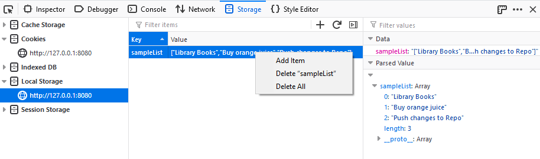

===============================
Local Storage / Session Storage
===============================

When an origin corresponding to local storage or session storage is selected within the :doc:`Storage Inspector <../index>`, the names and values of all the items corresponding to local storage or session storage will be listed in a table.

You can edit local and session storage items by double-clicking inside cells in the :ref:`Table Widget <storage-inspector-table-widget>` and editing the values they contain:

.. raw:: html

  <iframe width="560" height="315" src="https://www.youtube.com/embed/UKLgBBUi11c" title="YouTube video player" frameborder="0" allow="accelerometer; autoplay; clipboard-write; encrypted-media; gyroscope; picture-in-picture" allowfullscreen></iframe>
   
   

You can delete local storage and session storage entries using the context menu:

You can also delete local and session storage entries by selecting an item and pressing the :kbd:`Delete` or :kbd:`Backspace` key.

Finally, you can add new storage items by clicking the "Plus" (+) button and then editing the resulting new row to the value you want.
