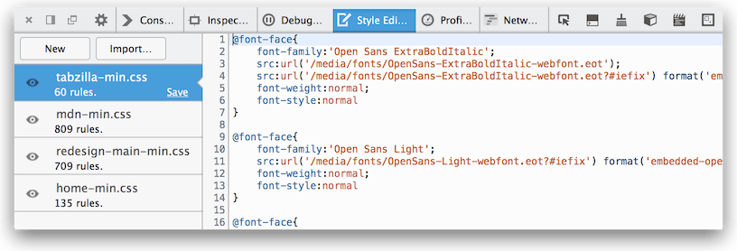
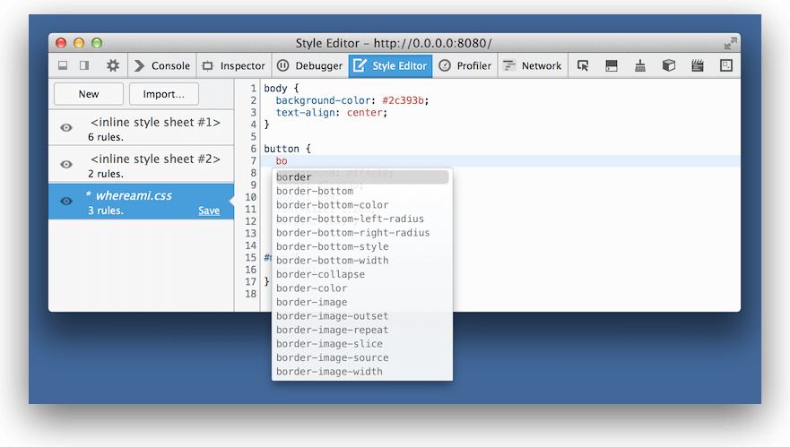

============
Style Editor
============

The Style Editor enables you to:

- view and edit all the stylesheets associated with a page
- create new stylesheets from scratch and apply them to the page
- import existing stylesheets and apply them to the page

.. raw:: html

  <iframe width="560" height="315" src="https://www.youtube.com/embed/7839qc55r7o" title="YouTube video player" frameborder="0" allow="accelerometer; autoplay; clipboard-write; encrypted-media; gyroscope; picture-in-picture" allowfullscreen></iframe>
   
   

To open the Style Editor select the *Style Editor* panel in the Web Developer Tools, accessible from the Browser Tools submenu

The Style Editor is divided into three main sections:

- :ref:`the style sheet pane on the left <style-editor-the-style-sheet-pane>`
- :ref:`the editor on the right <style-editor-the-editor-pane>`
- :ref:`the At-rules sidebar <style-editor-the-at-rules-sidebar>`

.. _style-editor-the-style-sheet-pane:

The style sheet pane
********************

The style sheet pane, on the left, lists all the style sheets being used by the current document. You can quickly toggle the use of a given sheet on and off by clicking the eyeball icon to the left of the sheet's name. You can save any changes you've made to the style sheet to your local computer by clicking the Save button in the bottom-right corner of each sheet's entry in the list.

From Firefox 40 onwards, the style sheet pane also includes a context menu that lets you open the selected style sheet in a new tab.

.. _style-editor-the-editor-pane:

The editor pane
***************

On the right is the editor pane. This is where the source for the selected style sheet is available for you to read and edit. Any changes you make are immediately applied to the page. This makes it easy to experiment with, revise, and test changes. Once you're satisfied with your changes, you can save a copy locally by clicking the Save button on the sheet's entry in the style sheet pane.

The editor provides line numbers and syntax highlighting to help make it easier to read your CSS. It also supports a number of :ref:`keyboard shortcuts <style-editor-keyboard-shortcuts>`.

The Style Editor automatically de-minimizes style sheets that it detects, without affecting the original. This makes it much easier to work on pages that have been optimized.

The Style Editor supports autocomplete. Just start typing, and it will offer you a list of suggestions.

You can switch autocomplete off in the :ref:`Style Editor settings <settings-style-editor>`.

.. _style-editor-the-at-rules-sidebar:

The At-rules sidebar
********************

The Style Editor displays a sidebar on the right-hand side whenever the current sheet contains any of the following At-rules:

- `@media <https://developer.mozilla.org/en-US/docs/Web/CSS/Media_Queries/Using_media_queries>`_
- `@supports <https://developer.mozilla.org/en-US/docs/Web/CSS/@supports>`_
- `@layer <https://developer.mozilla.org/en-US/docs/Web/CSS/@layer>`_
- `@container <https://developer.mozilla.org/en-US/docs/Web/CSS/Media_Queries/Using_media_queries>`_

The sidebar lists the rules and provides a link to the line of the sheet where the rule is defined. Click an item to jump to that rule in the sheet. For ``@media`` rules, the condition text of the rule is greyed-out if the media query doesn’t currently apply.

.. image:: style-editor-at-rules-sidebar-detail.png
  :class: center

The At-rules sidebar works especially well with :doc:`Responsive Design View <../responsive_design_mode/index>` for creating and debugging responsive layouts:

.. raw:: html

  <iframe width="560" height="315" src="https://www.youtube.com/embed/aVUXmvLSwoM" title="YouTube video player" frameborder="0" allow="accelerometer; autoplay; clipboard-write; encrypted-media; gyroscope; picture-in-picture" allowfullscreen></iframe>
   
   

From Firefox 46 onwards, if an ``@media`` rule contains a screen size in a condition, then it is made clickable: clicking it then resizes the screen to that size using the Responsive Design View.

Creating and importing style sheets
***********************************

You can create a new style sheet by clicking the New button in the toolbar. Then you can just start entering CSS into the new editor and watch as the new styles are applied in real time just like changes to the other sheets.

You can load a style sheet from disk and apply it to the page by clicking the Import button.

.. _style-editor-source-map-support:

Source map support
******************

.. raw:: html

  <iframe width="560" height="315" src="https://www.youtube.com/embed/zu2eZbYtEUQ" title="YouTube video player" frameborder="0" allow="accelerometer; autoplay; clipboard-write; encrypted-media; gyroscope; picture-in-picture" allowfullscreen></iframe>
   
   

Web developers often create CSS files using a preprocessor like `Sass <https://sass-lang.com/>`_, `Less <https://lesscss.org/>`_, or `Stylus <https://learnboost.github.io/stylus/>`_. These tools generate CSS files from a richer and more expressive syntax. If you do this, being able to see and edit the generated CSS is not so useful, because the code you maintain is the preprocessor syntax, not the generated CSS. So you'd need to edit the generated CSS, then manually work out how to reapply that to the original source.

Source maps enable the tools to map back from the generated CSS to the original syntax, so they can display, and allow you to edit, files in the original syntax. From Firefox 29 onwards, the Style Editor can understand CSS source maps.

This means that if you use, for example, Sass, then the Style Editor will show you, and allow you to edit, Sass files, rather than the CSS that is generated from them:

.. image:: style-editor-sourcemap.png
  :class: center

For this to work, you must:

- use a CSS preprocessor that understands the `Source Map Revision 3 proposal <https://docs.google.com/document/d/1U1RGAehQwRypUTovF1KRlpiOFze0b-_2gc6fAH0KY0k/edit>`_. Currently this means `Sass 3.3.0 <https://sass-lang.com/>`_ or above or the `1.5.0 version of Less <http://roots.io/using-less-source-maps/>`_. Other preprocessors are actively working on adding support, or considering it.
- actually instruct the preprocessor to generate a source map, for example by passing the ``--source-map`` argument to the Lass command-line tool, but in some preprocessors like Sass, source maps are generated by default and you don't need to do anything.

Viewing original sources
------------------------

Now, if you check "Show original sources" in the :ref:`Style Editor settings <settings-style-editor>`, the links next to CSS rules in the :ref:`Rules view <page_inspector_ui_tour_rules_view>` will link to the original sources in the Style Editor.

From Firefox 35 onwards original sources are displayed by default.

Editing original sources
------------------------

You can also edit the original sources in the Style Editor and see the results applied to the page immediately. To get this to work there are two extra steps.

First, set up your preprocessor so it watches the original source and automatically regenerates the CSS when the source changes. With Sass you can do this by passing the ``--watch`` option:

.. code-block::

  sass index.scss:index.css --watch

Next, save the original source in the Style Editor by clicking the "Save" button next to the file, and saving it over the original file.

Now when you make changes to the source file in the Style Editor the CSS is regenerated and you can see the changes right away.

.. _style-editor-keyboard-shortcuts:

Keyboard shortcuts
******************

 - :ref:`Source editor shortcuts <keyboard-shortcuts-style-editor>`
