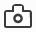

==================
Taking screenshots
==================

You can use the Developer Tools to take a screenshot of the entire page, or of a single element in the page.

.. _taking_screenshots_taking_a_screenshot_of_the_page:

Taking a screenshot of the page
*******************************

Use the screenshot icon: |image1| to take a full-page screenshot of the current page.

By default, the screenshot icon is not enabled. To enable it:

- visit the :doc:`Settings <../settings/index>` page
- find the section labeled "Available Toolbox Buttons"
- check the box labeled "Take a screenshot of the entire page".

You'll now see the icon in the toolbar:

.. raw:: html

  <iframe width="560" height="315" src="https://www.youtube.com/embed/KB5V9uJgcS4" title="YouTube video player" frameborder="0" allow="accelerometer; autoplay; clipboard-write; encrypted-media; gyroscope; picture-in-picture" allowfullscreen></iframe>
   
   

Click the icon to take a screenshot of the current page. The screenshot is saved to your browser's "Downloads" directory:

.. raw:: html

  <iframe width="560" height="315" src="https://www.youtube.com/embed/HKS6MofdXVE" title="YouTube video player" frameborder="0" allow="accelerometer; autoplay; clipboard-write; encrypted-media; gyroscope; picture-in-picture" allowfullscreen></iframe>
   
   

.. _taking-screenshots-of-an-element:

Taking a screenshot of an element
*********************************

To take a screenshot of a single element in the page, activate the context menu on that element in the :ref:`Inspector's HTML pane <page_inspector_ui_tour_html_pane>`, and select "Screenshot Node". The screenshot is saved to the browser's "Downloads" directory:

.. raw:: html

  <iframe width="560" height="315" src="https://www.youtube.com/embed/p2pjF_BrE1o" title="YouTube video player" frameborder="0" allow="accelerometer; autoplay; clipboard-write; encrypted-media; gyroscope; picture-in-picture" allowfullscreen></iframe>
   
   

Copying screenshots to the clipboard
************************************

From Firefox 53, you can also copy the screenshot to the clipboard. Just check the box in Settings labeled "Screenshot to clipboard":

.. raw:: html

  <iframe width="560" height="315" src="https://www.youtube.com/embed/AZedFGh6F78" title="YouTube video player" frameborder="0" allow="accelerometer; autoplay; clipboard-write; encrypted-media; gyroscope; picture-in-picture" allowfullscreen></iframe>
   
   

Now, whenever you take a screenshot, the screenshot is also copied to the clipboard.

Taking screenshots with the web console
***************************************

If you need to specify a different device-pixel-ratio, set a delay before taking the screenshot, or specify your own file name, starting in Firefox 62 you can use the ``:screenshot`` helper function in the :doc:`Web Console <../web_console/index>`.

Type ``:screenshot`` in the Web Console to create a screenshot of the current page. By default, the image file will be named ``Screen Shot yyy-mm-dd at hh.mm.ss.png``.

.. note::

  **Tip**: You could type ``:s`` and then hit :kbd:`Tab` to autocomplete ``:screenshot``.

The command has the following optional parameters:

.. list-table::
  :widths: 20 20 60
  :header-rows: 1

  * - Command
    - Type
    - Description

  * - ``--clipboard``
    - boolean
    - When present, this parameter will cause the screenshot to be copied to the clipboard. Prevents saving to a file unless you use the ``--file`` option to force file writing.

  * - ``--delay``
    - number
    - The number of seconds to delay before taking the screenshot; you can use an integer or floating point number. This is useful if you want to pop open a menu or invoke a hover state for the screenshot.

  * - ``--dpr``
    - number
    - The device pixel ratio to use when taking the screenshot. Values above 1 yield "zoomed-in" images, whereas values below 1 create "zoomed-out" images.

  * - ``--file``
    - boolean
    - When present, the screenshot will be saved to a file, even if other options (e.g. ``--clipboard``) are included.

  * - ``--filename``
    - string
    - The name to use in saving the file. The file should have a ".png" extension.

  * - ``--fullpage``
    - boolean
    - If included, the full webpage will be saved. With this parameter, even the parts of the webpage which are outside the current bounds of the window will be included in the screenshot. When used, "-fullpage" will be appended to the file name.

  * - ``--selector``
    - string
    - A CSS selector that selects a single element on the page. When supplied, only this element and its descendants will be included in the screenshot.

.. note::
  If you capture an image to a filename like ``test.png``, and then you capture to that same filename, the new image will overwrite the old image. So if you’re using the up-arrow history scroll to capture images in quick succession, be careful — you need to remember to change the filename for each new capture.

.. note::
  Thanks to Eric Meyer for his enthusiasm for our screenshot feature, and help! Small portions of this section have been borrowed from his `Firefox’s :screenshot command <https://meyerweb.com/eric/thoughts/2018/08/24/firefoxs-screenshot-command-2018/>`_ article.
