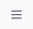
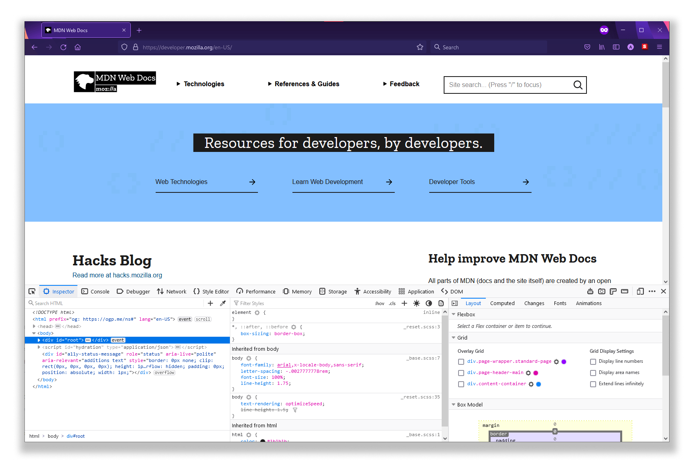
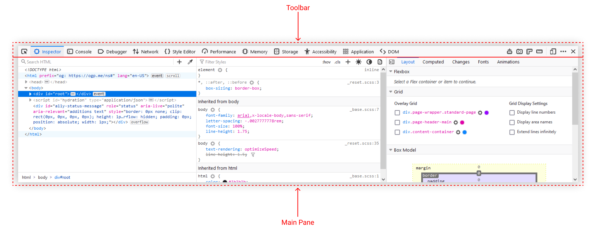
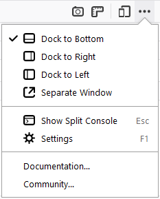
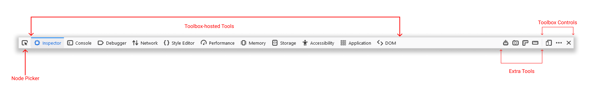

=======
Toolbox
=======

The Toolbox provides a single home for most of the developer tools that are built into Firefox.

There are three main ways to open the Toolbox:

- Right-click a mouse on any element in the page, and select **Inspect** from the popup menu.

- Open the Hamburger menu |image1| and select **More tools > Web Developer Tools** (Firefox 88 and earlier use the top-level menu **Web Developer** rather than **More tools**).

- Press :kbd:`Ctrl` + :kbd:`Shift` + :kbd:`I` on Windows and Linux, or :kbd:`Cmd` + :kbd:`Opt` + :kbd:`I` on OS X. See also :doc:`keyboard shortcuts <../keyboard_shortcuts/index>`.

By default, the window appears docked to the bottom side of the Firefox window, but you can detach it if you like. This is what it looks like when it's docked:

The window itself is split into two parts: a toolbar along the top, and a main pane underneath:

.. note::

  Since Firefox 62, you can drag and drop tabs in the main toolbar of the toolbox to reorder your tools as you wish (`Bug 1226272 <https://bugzilla.mozilla.org/show_bug.cgi?id=1226272>`_)

.. _tools-toolbox-docking-mode:

Docking mode
************

By default, the Toolbox appears docked to the bottom of the browser window, but you can also dock it to the right-hand side of the window, or make it a standalone window, using :ref:`buttons in toolbar <tools-toolbox-toolbox-controls>`.

.. _tools-toolbox-toolbar:

Toolbar
*******

The toolbar contains controls to activate a particular tool, to dock/float the window, and to close the window.

Node picker
***********

On the far left there's a button to activate the node picker. This lets you select a page element for inspection. See :doc:`Selecting elements <../page_inspector/how_to/select_an_element>`

Toolbox-hosted tools
********************

Then there is an array of labeled buttons which enables you to switch between the different tools hosted by the Toolbox. The array may include the following tools:

- :doc:`Page Inspector <../page_inspector/index>`
- :doc:`Web Console <../web_console/index>`
- :doc:`JavaScript Debugger <../debugger/index>`
- :doc:`Network Monitor <../network_monitor/index>`
- :doc:`Style Editor <../style_editor/index>`
- :doc:`Performance <../performance/index>`
- :doc:`Memory Tool <../memory/index>`
- :doc:`Storage Inspector <../storage_inspector/index>`
- :doc:`Accessibility Inspector <../accessibility_inspector/index>`
- :doc:`Application Tool <../application/index>`
- :doc:`DOM Property Viewer <../dom_property_viewer/index>`

Note that not all the hosted tools are always listed here: only the tools actually available in this context are shown (for example, not all tools support remote debugging yet, so if the debugging target is not the Firefox instance that launched the window, not all the hosted tools will be shown).

.. _tools-toolbox-extra-tools:

Extra tools
***********

Next there's an array of buttons that can be added or removed in the :ref:`settings <tool-toolbox-settings>`. None of these tools are enabled by default, but you can add them in the :doc:`developer tools settings <../settings/index>`

- :doc:`Select a frame as the currently targeted document <../working_with_iframes/index>` (this is only included by default from Firefox 41 onwards)
- :doc:`Highlight painted area <../paint_flashing_tool/index>`
- :ref:`Take a screenshot of the entire page <taking_screenshots_taking_a_screenshot_of_the_page>`: take a screenshot of the complete web page and saves it in your Downloads directory
- :doc:`Toggle rulers for the page <../rulers/index>`
- :doc:`Measure a portion of the page <../measure_a_portion_of_the_page/index>`: measure a part of the website by selecting areas within the page

.. _tools-toolbox-toolbox-controls:

Toolbox controls
****************

Finally there's a row of buttons to:

- close the window
- :doc:`Responsive Design Mode <../responsive_design_mode/index>`

There's also a meatball menu button that consists of following options:

- A group of options to toggle the toolbox to be docked bottom, right, left or even be a separate window by itself.

- access :doc:`developer tool settings <../settings/index>`

- :doc:`Toggle split console <../web_console/split_console/index>`

- two buttons leading to documentation and community

Settings
********

:doc:`See the separate page on the Developer Tools Settings <../settings/index>`

Main Pane
*********

The content of the main pane in the window is entirely controlled by, and specific to, the hosted tool currently selected.

:ref:`Toolbox shortcuts <keyboard-shortcuts-toolbox>` lists the shortcuts that work whenever the toolbox is open, no matter which tool is active. This same page also lists tool-specific keyboard shortcuts.
