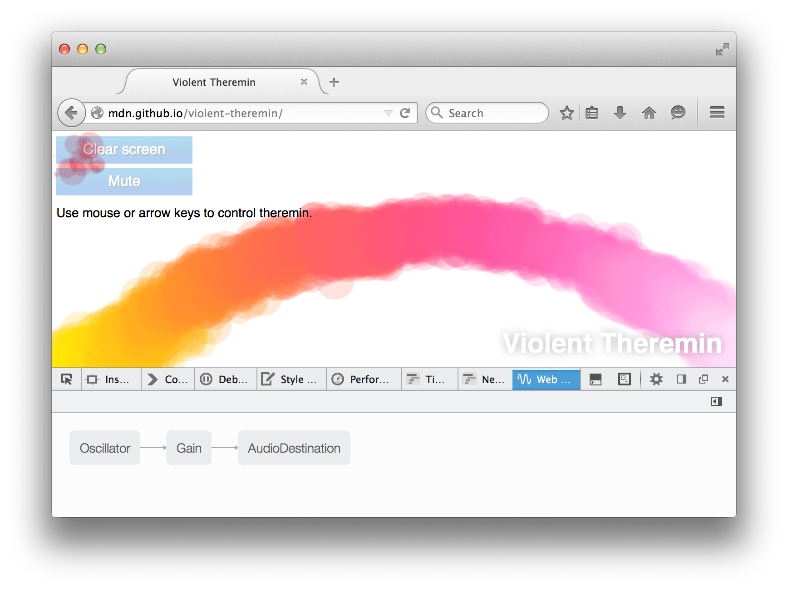
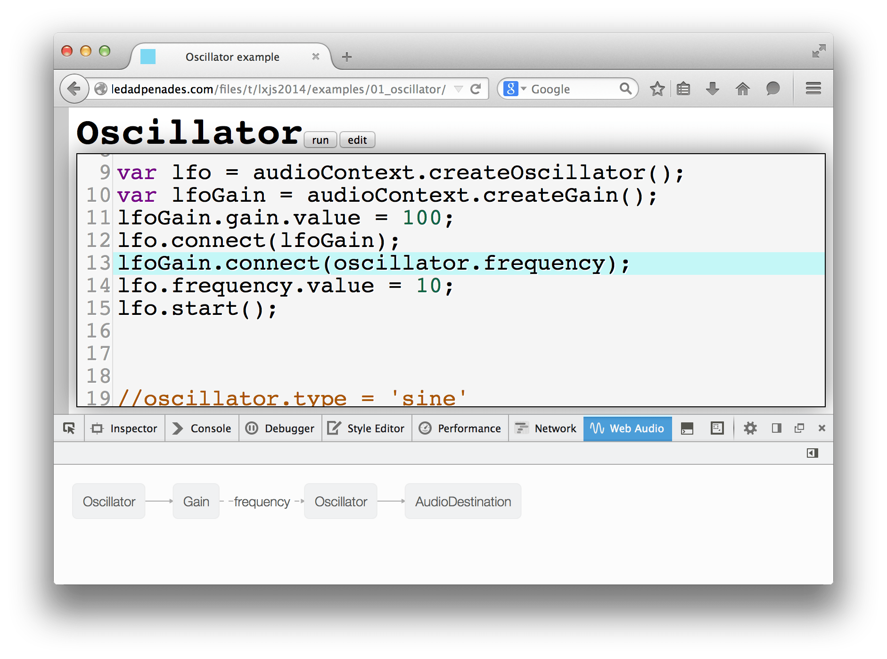
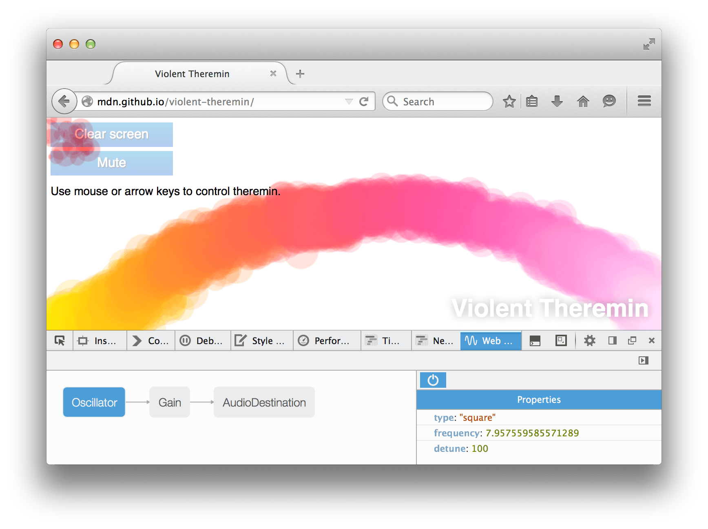
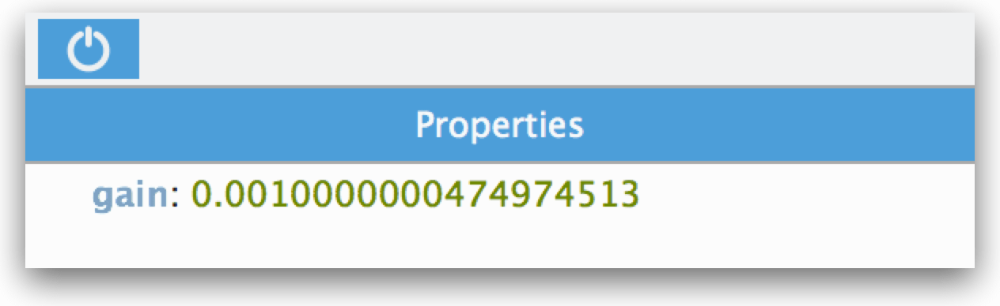
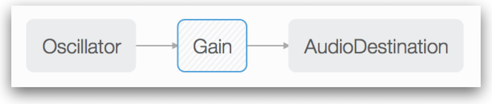

================
Web Audio Editor
================

.. note::

  Notice: This tool has been deprecated and will soon be removed from Firefox. For details, see :doc:`Deprecated tools <../deprecated_tools/index>`.

With the `Web Audio API <https://developer.mozilla.org/en-US/docs/Web/API/Web_Audio_API/Using_Web_Audio_API>`_, developers create an `audio context <https://developer.mozilla.org/en-US/docs/Web/API/AudioContext>`_ Within that context they then construct a number of `audio nodes <https://developer.mozilla.org/en-US/docs/Web/API/AudioNode>`_, including:

- nodes providing the `audio source <https://developer.mozilla.org/en-US/docs/Web/API/Web_Audio_API#defining_audio_sources>`_, such as an oscillator or a data buffer source
- nodes performing `transformations <https://developer.mozilla.org/en-US/docs/Web/API/Web_Audio_API#defining_audio_effects_filters>`_ such as delay and gain
- nodes representing the `destination of the audio stream <https://developer.mozilla.org/en-US/docs/Web/API/Web_Audio_API#defining_audio_destinations>`_, such as the speakers

Each node has zero or more `AudioParam <https://developer.mozilla.org/en-US/docs/Web/API/AudioParam>`_ properties that configure its operation. For example, the `GainNode <https://developer.mozilla.org/en-US/docs/Web/API/GainNode>`_ has a single ``gain`` property, while the `OscillatorNode <https://developer.mozilla.org/en-US/docs/Web/API/OscillatorNode>`_ has ``frequency`` and ``detune`` properties.

The developer connects the nodes in a graph, and the complete graph defines the behavior of the audio stream.

The Web Audio Editor examines an audio context constructed in the page and provides a visualization of its graph. This gives you a high-level view of its operation, and enables you to ensure that all the nodes are connected in the way you expect. You can then examine and edit the ``AudioParam`` properties for each node in the graph. Some non-``AudioParam`` properties, like an ``OscillatorNode``'s ``type`` property, are displayed, and you can edit these as well.

This tool is still experimental. If you find bugs, we'd love it if you `filed them in Bugzilla <https://bugzilla.mozilla.org/enter_bug.cgi?product=Firefox&component=Developer%20Tools%3A%20Web%20Audio%20Editor>`_. If you have feedback or suggestions for new features, `dev-developer-tools <https://lists.mozilla.org/listinfo/dev-developer-tools>`_ or `Twitter <https://twitter.com/firefoxdevtools>`_ are great places to register them.

Opening the Web Audio Editor
****************************

The Web Audio Editor is not enabled by default in Firefox 32. To enable it, open the :ref:`Developer Tool Settings <tool-toolbox-settings>` and check "Web Audio". Now there should be an extra tab in the :ref:`Toolbox toolbar <tools-toolbox-toolbar>` labeled "Web Audio". Click the tab and load a page that constructs an audio context. Two good demos are:

- the `Voice-change-O-Matic <https://github.com/mdn/voice-change-o-matic>`_, which can apply various effects to the microphone input and also provides a visualisation of the result
- the `Violent Theremin <https://mdn.github.io/webaudio-examples/violent-theremin/>`_, which changes the pitch and volume of a sine wave as you move the mouse pointer

Visualizing the graph
*********************

The Web Audio Editor will now display the graph for the loaded audio context. Here's the graph for the Violent Theremin demo:

You can see that it uses three nodes: an `OscillatorNode <https://developer.mozilla.org/en-US/docs/Web/API/OscillatorNode>`_ as the source, a `GainNode <https://developer.mozilla.org/en-US/docs/Web/API/GainNode>`_ to control the volume, and an `GainNode <https://developer.mozilla.org/en-US/docs/Web/API/GainNode>`_ as the destination.

Connections to AudioParams
--------------------------

Displaying connections to AudioParams is new in Firefox 34.

Connections between nodes are displayed as solid lines. If, instead, you've connected a node to an AudioParam in another node, then the connection is shown as a dashed line between the nodes, and is labeled with the name of the ``AudioParam``:

Inspecting and modifying AudioNodes
***********************************

If you click on a node, it's highlighted and you get a node inspector on the right hand side. This list the values of that node's ``AudioParam`` properties. For example, here's what the OscillatorNode looks like:

With the Violent Theremin demo, the frequency parameter is modified as the user moves the mouse left and right, and you can see this reflected in the node inspector. However, the value isn't updated in real time: you have to click the node again to see the updated value.

If you click on a value in the node inspector you can modify it: press :kbd:`Enter` or :kbd:`Tab` and the new value takes effect immediately.

Bypassing nodes
***************

New in Firefox 38.

In the pane that shows you the node's details, there's an on/off button:

Click it, and the graph will be modified to bypass this node, so it will no longer have any effect. Nodes that are bypassed are shown with a hatched background:

