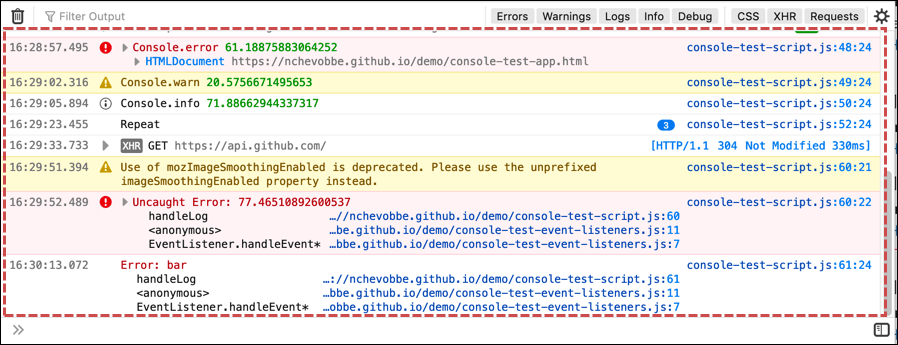
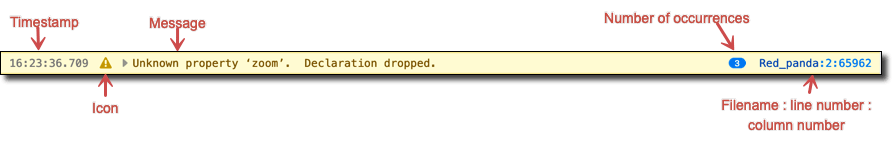
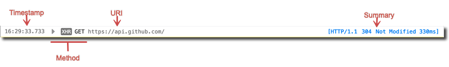
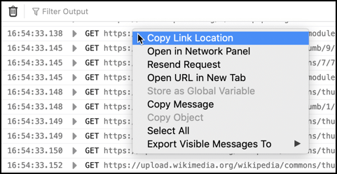
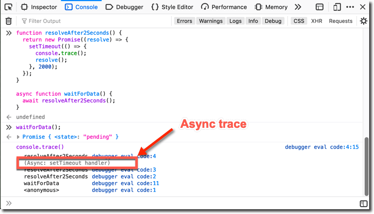
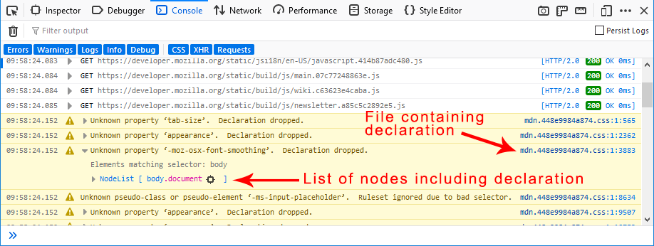
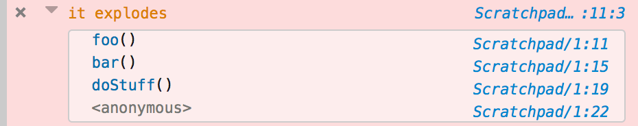
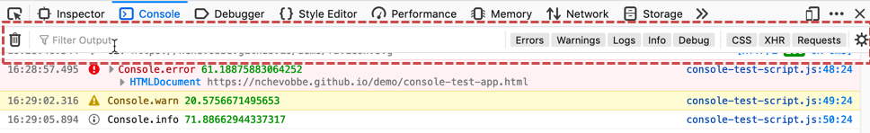
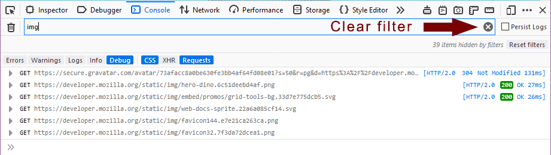

================
Console messages
================

Most of the Web Console is occupied by the message display pane:

Each message is displayed as a separate row:

.. list-table::
  :widths: 25 75
  :header-rows: 0

  * - **Time**
    - The time the message was recorded. This is not shown by default: you can opt to see timestamps by selecting **Show Timestamps** in the console settings menu (gear icon in the console toolbar).

  * - **Icon**
    - Not all console messages contain icons. The following icons may be used:

      - |image1| Informational message
      - |image2| Warning
      - |image3| Error
      - |image4| Blocked; for network messages

      In addition, a disclosure triangle indicates that further information is available; clicking it displays or collapses that information.

  * - **Message**
    - The message itself.

  * - **Number of occurrences**
    - If a line that generates a warning or error is executed more than once, it is only logged once and this counter appears to indicate how many times it was encountered.

  * - **Filename and line number**
    - For JavaScript, CSS and console API messages, the message can be traced to a specific line of code. The console then provides a link to the filename and line number that generated the message.

By default, the console is cleared each time you navigate to a new page or reload the current page. To override this behavior, enable **Persist Logs** in the console settings menu (gear icon).

The context menu options listed below are available on all message categories. Additional context menu options are described in the subsection for the message category they apply to.

- **Copy Message** copies the selected message to the clipboard.
- **Select All** selects all messages available in the message display pane.
- **Export Visible Messages To**

  - **Clipboard** copies all messages available in the display pane to the clipboard.
  - **File** opens a file dialog box so you can save an export of all messages available in the display pane.

Message categories
******************

.. _web_console_console_messages:

Network
-------

.. note::
  Network log messages are not shown by default. Use the :ref:`filtering <web_console_ui_tour_filtering_by_category>` feature to show them.

Network requests are logged with a line that looks like this:

.. list-table::
  :widths: 25 75
  :header-rows: 0

  * - **Time**
    - The time the message was recorded.

  * - **Method**
    - The specific HTTP request method.

      If the request was made as an `XMLHttpRequest <https://developer.mozilla.org/en-US/docs/Web/API/XMLHttpRequest>`_, there's an additional "XHR" tag indicating this.

      If more information is available, a disclosure triangle lets you display it, in an embedded panel that is identical to the :doc:`Network Monitor request details <../../network_monitor/request_details/index>`.

  * - **URI**
    - The target URI.

  * - **Summary**
    - The HTTP version, response code, and time taken to complete. Clicking the response code takes you to the reference page for that code.

.. raw:: html

  <iframe width="560" height="315" src="https://www.youtube.com/embed/cFlcWzJ9j4I" title="YouTube video player" frameborder="0" allow="accelerometer; autoplay; clipboard-write; encrypted-media; gyroscope; picture-in-picture" allowfullscreen></iframe>
   
   

The context menu for network messages includes a few extra items in addition the globally-available ones:

Copy link location
  Acts as you would expect, copying the URL into the clipboard
Open in Network Panel
  Switches context to the Network tab, selects the request and shows you the details
Resend Request
  Sends the network request again.
Open URL in New Tab
  Opens the URL in a new browser tab. If the resource is an image, the image will be opened in a new tab. If the resource is a stylesheet, you will see the CSS rules, etc.

JS
--

JavaScript errors contain a "Learn more" linkthat takes you to the `JavaScript error reference <https://developer.mozilla.org/en-US/docs/Web/JavaScript/Reference/Errors>`_ containing additional advice for fixing issues.

Source maps
~~~~~~~~~~~

The Web Console understands `source maps <https://blog.teamtreehouse.com/introduction-source-maps>`_. This means that if your JavaScript sources are compressed, you can supply a source map for them. Then any messages or errors your source generates will show up in the Web Console with a link back to the original source, not the compressed version.

Async stack frames
~~~~~~~~~~~~~~~~~~

Stack traces show stack frames for `async functions <https://developer.mozilla.org/en-US/docs/Web/JavaScript/Reference/Statements/async_function>`_ separately from those for synchronous functions. When you run code containing an async function, its traces (`console.trace <https://developer.mozilla.org/en-US/docs/Web/API/console/trace>`_ or `thrown error <https://developer.mozilla.org/en-US/docs/Web/JavaScript/Reference/Global_Objects/Error>`_) are shown with an *Async:* prefix.

CSS
---

.. note::
  CSS warnings and reflow messages are not shown by default, for performance reasons (see `bug 1452143 <https://bugzilla.mozilla.org/show_bug.cgi?id=1452143>`_. Use the :ref:`filtering <web_console_ui_tour_filtering_by_category>` feature to show them.

Some CSS messages contain a disclosure triangle at the left of the message. Click it to view more information about the error, as well as which DOM nodes are affected by the error.

Security
--------

The security messages shown in the Web Console help developers find potential or actual vulnerabilities in their sites. Additionally, many of these messages help educate developers because they end with a “Learn More” link that takes you to a page with background information and advice for mitigating the issue.

The complete list of security messages is as follows:

.. list-table::
  :widths: 50 50
  :header-rows: 1

  * - Messages
    - Details

  * - Blocked loading mixed active content
    - The page contained mixed active content: that is, the main page was served over HTTPS, but asked the browser to load "active content", such as scripts, over HTTP. The browser blocked this active content. See `Mixed Content <https://developer.mozilla.org/en-US/docs/Web/Security/Mixed_content>`_ for more details.

  * - Blocked loading mixed display content
    - The page contained mixed display content: that is, the main page was served over HTTPS, but asked the browser to load "display content", such as images, over HTTP. The browser blocked this display content. See `Mixed Content <https://developer.mozilla.org/en-US/docs/Web/Security/Mixed_content>`_ for more details.

  * - Loading mixed (insecure) active content on a secure page
    - The page contained mixed active content: that is, the main page was served over HTTPS, but asked the browser to load "active content", such as scripts, over HTTP. The browser loaded this active content. See `Mixed Content <https://developer.mozilla.org/en-US/docs/Web/Security/Mixed_content>`_ for more details.

  * - Loading mixed (insecure) display content on a secure page
    - The page contained mixed display content: that is, the main page was served over HTTPS, but asked the browser to load "display content", such as images, over HTTP. The browser loaded this display content. `Mixed Content <https://developer.mozilla.org/en-US/docs/Web/Security/Mixed_content>`_ for more details.

  * - This site specified both an X-Content-Security-Policy/Report-Only header and a Content-Security-Policy/Report-Only header. The X-Content-Security-Policy/Report-Only header(s) will be ignored.
    - See `Content Security Policy <https://developer.mozilla.org/en-US/docs/Web/HTTP/CSP>`_ for more details.

  * - The X-Content-Security-Policy and X-Content-Security-Report-Only headers will be deprecated in the future. Please use the Content-Security-Policy and Content-Security-Report-Only headers with CSP spec compliant syntax instead.
    - See `Content Security Policy <https://developer.mozilla.org/en-US/docs/Web/HTTP/CSP>`_ for more details.

  * - Password fields present on an insecure (http://) page. This is a security risk that allows user login credentials to be stolen.
    - Pages containing login forms must be served over HTTPS, not HTTP.

  * - Password fields present in a form with an insecure (http://) form action. This is a security risk that allows user login credentials to be stolen.
    - Forms containing password fields must submit them over HTTPS, not HTTP.

  * - Password fields present on an insecure (http://) iframe. This is a security risk that allows user login credentials to be stolen.
    - iframes containing login forms must be served over HTTPS, not HTTP.

  * - The site specified an invalid Strict-Transport-Security header.
    - See `HTTP Strict Transport Security <https://developer.mozilla.org/en-US/docs/Web/HTTP/Headers/Strict-Transport-Security>`_ for more details.

  * - This site makes use of a SHA-1 Certificate; it's recommended you use certificates with signature algorithms that use hash functions stronger than SHA-1.

    - The site uses a certificate whose signature uses the SHA-1 hash algorithm.

      SHA-1 is still widely used in certificates, but it is starting to show its age. Web sites and Certification Authorities are encouraged to switch to stronger hash algorithms in future. See the `Weak Signature Algorithm <https://developer.mozilla.org/en-US/docs/Web/Security/Weak_Signature_Algorithm>`_ article for more details.

      Note that the SHA-1 certificate may not be your site's own certificate, but may be the certificate belonging to a Certification Authority that was used to sign your site's certificate.

`Bug 863874 <https://bugzilla.mozilla.org/show_bug.cgi?id=863874>`_ is the meta-bug for logging relevant security messages to the Web Console. If you have more ideas for useful features like the ones discussed here, or are interested in contributing, check out the metabug and its dependencies.

Logging
-------

.. note::
  Messages logged from `Shared Workers <https://developer.mozilla.org/en-US/docs/Web/API/SharedWorker>`_, `Service Workers <https://developer.mozilla.org/en-US/docs/Web/API/Service_Worker_API>`_, add-ons, and **Chrome Workers** are not shown by default. Use the :ref:`filtering <web_console_ui_tour_filtering_by_category>` feature to show them.

The Logging category includes messages logged using the `Console API <https://developer.mozilla.org/en-US/docs/Web/API/console>`_.

The Web console supports the following `Console API <https://developer.mozilla.org/en-US/docs/Web/API/console>`_ messages:

- `assert() <https://developer.mozilla.org/en-US/docs/Web/API/console/assert>`_
- `clear() <https://developer.mozilla.org/en-US/docs/Web/API/console/clear>`_
- `count() <https://developer.mozilla.org/en-US/docs/Web/API/console/count>`_
- `dir() <https://developer.mozilla.org/en-US/docs/Web/API/console/dir>`_
- `dirxml() <https://developer.mozilla.org/en-US/docs/Web/API/console/dirxml>`_
- `error() <https://developer.mozilla.org/en-US/docs/Web/API/console/error>`_
- ``exception()``
- `group() <https://developer.mozilla.org/en-US/docs/Web/API/console/group>`_
- `groupEnd() <https://developer.mozilla.org/en-US/docs/Web/API/console/groupEnd>`_
- ``info()``
- `log() <https://developer.mozilla.org/en-US/docs/Web/API/console/log>`_
- `table() <https://developer.mozilla.org/en-US/docs/Web/API/console/table>`_
- `time() <https://developer.mozilla.org/en-US/docs/Web/API/console/time>`_
- `timeEnd() <https://developer.mozilla.org/en-US/docs/Web/API/console/timeEnd>`_
- `trace() <https://developer.mozilla.org/en-US/docs/Web/API/console/trace>`_
- `warn() <https://developer.mozilla.org/en-US/docs/Web/API/console/warn>`_

The console prints a stack trace for all error messages, like this:

.. code-block:: javascript

  function foo() {
    console.error("it explodes");
  }

  function bar() {
    foo();
  }

  function doStuff() {
   bar();
  }

  doStuff();

.. _web_console_server:

Server
------

.. note::

  Server-side log messages was introduced in Firefox 43, but removed in Firefox 56. You can install the `Chrome Logger extension <https://addons.mozilla.org/en-US/firefox/addon/chromelogger/>`_ to (re)-enable the feature.

With the `Chrome Logger extension <https://addons.mozilla.org/en-US/firefox/addon/chromelogger/>`_, Web Console can display messages sent from the server. This enables you to use the Web Console to debug server-side code.

It uses the `Chrome Logger <https://craig.is/writing/chrome-logger>`_ protocol. Briefly, the way it works is:

- Your server-side code — Python, PHP, Node.js, etc. — includes a library that provides a console API.
- Your server-side code uses this API to log messages.
- The server-side library creates JSON objects from the messages and encodes them for transmission.
- The messages are transmitted to the client as a response header named ``X-ChromeLogger-Data``.
- The Web Console decodes these headers and displays them.

To find a suitable library for your server code, see the `Chrome Logger documentation <https://craig.is/writing/chrome-logger>`_.

.. _web_console_console_messages_interpreter_io:

Interpreter input/output
------------------------

Commands sent to the browser using the :doc:`Web Console's JavaScript interpreter <../the_command_line_interpreter/index>`, and the corresponding responses, are logged in the console messages.

For responses that contain objects or variables, the following context menu options are available:

Reveal in Inspector
  Shows the selected DOM node in the Inspector pane.
Store as Global Variable
  Creates a global variable (with a name like ``temp0``, ``temp1``, etc.) whose value is the selected object. The name of the variable appears as an input to the interpreter, and its value appears as a response.
Copy Object
  Copies the selected object to the clipboard.

Filtering and searching
***********************

.. _web_console_ui_tour_filtering_by_category:

Filtering by category
---------------------

You can use the toolbar along the top to constrain the results displayed.

To see only messages of particular categories, click the button labeled with that category (**Errors**, **CSS**, and so on).

For Errors and Warnings, when you turn off display of the category, a number appears next to the button text to indicate how many messages of that type are available. For example, "Warnings (25)".

Network requests with response codes in the 400-499 (client error) or 500-599 (server error) ranges are considered errors. Their display is controlled by the **Errors** button, not the **Requests** button.

.. _web_console_ui_tour_filtering_by_text:

Filtering by text
-----------------

To see only messages that contain a specific string, type in the text box labeled "Filter output". For example, if you entered the string img into the text box, you would have a list something like this:

A small "x" icon appears at the right end of the text box when you have entered a string on which to filter the output. Click the "x" icon to clear the filter and show the entire list again.

You can negate a text search by prefixing it with the ``-`` character. For example, ``-img`` shows only items that *do not* contain the string ``img``.

.. _web_console_ui_tour_filtering_by_regular_expressions:

Filtering with Regular Expressions
----------------------------------

You can also use a valid regular expression to filter the console output. For example, the following video shows the results when filtering on two simple regular expressions: ``/(cool|rad)/`` and ``/(cool)/``.

.. raw:: html

  <iframe width="560" height="315" src="https://www.youtube.com/embed/E6bGOe2fvW0" title="YouTube video player" frameborder="0" allow="accelerometer; autoplay; clipboard-write; encrypted-media; gyroscope; picture-in-picture" allowfullscreen></iframe>
   
   

You can negate a regular expression search by prefixing it with the ``-`` character. For example, ``-/(cool|rad)/`` shows only items that *do not* match the expression ``/(cool|rad)/``.

Clearing the log
----------------

Finally, you can use the trashcan icon on the left to clear the contents of the console. When you clear the console, the console cache is also cleared. This prevents errors that have already been logged from reappearing when you reopen the console.
