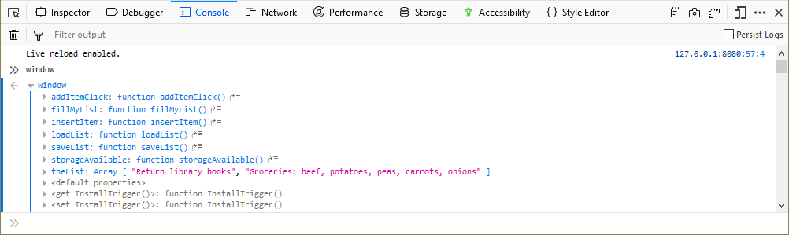
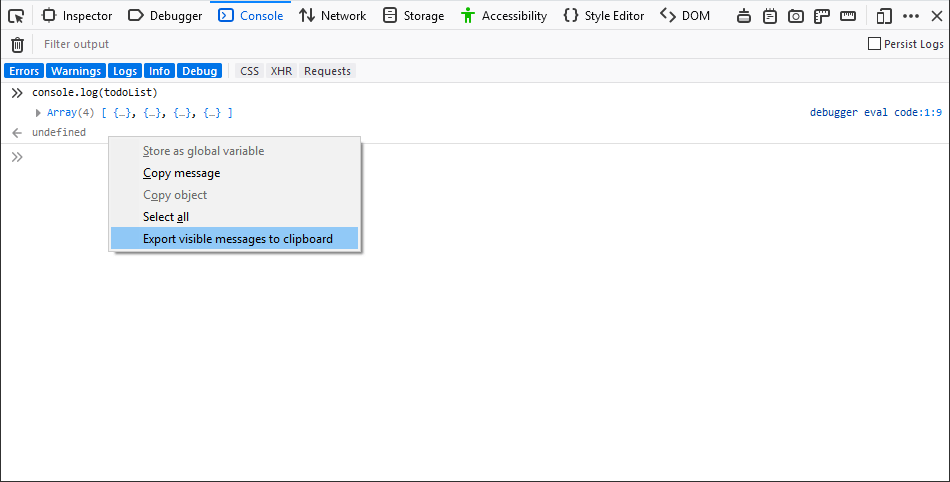
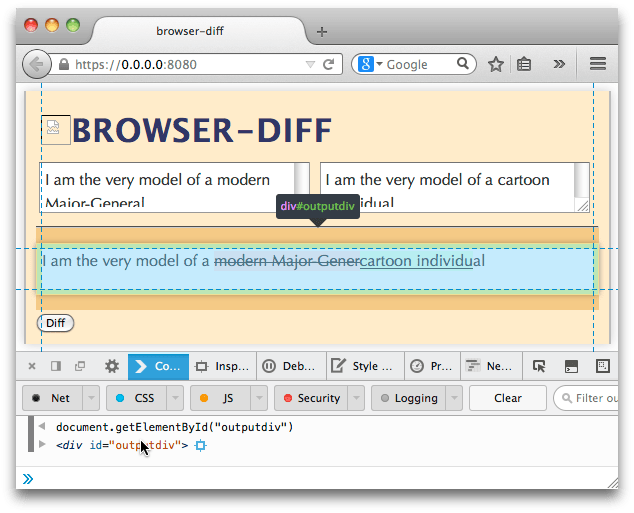

===========
Rich output
===========

When the Web console prints objects, it includes a richer set of information than just the object's name. In particular, it:

- :ref:`provides extra information for certain types <web_console_rich_output_type_specific>`
- :ref:`enables detailed examination of the object's properties <web_console_rich_output_examining_object_properties>`
- :ref:`provides richer information for DOM elements, and enables you to select them in the Inspector <web_console_rich_output_highlighting_and_inspecting_dom_nodes>`

.. _web_console_rich_output_type_specific:

Type-specific rich output
*************************

The Web Console provides rich output for many object types, including the following:

.. list-table::
  :widths: 20 80
  :header-rows: 0

  * - ``Object``
    - .. image:: web-console-object.png

  * - ``Date``
    - .. image:: web-console-date.png

  * - ``Promise``
    - .. image:: web-console-promise.png

  * - ``RegExp``
    - .. image:: web-console-regexp.png

  * - ``Window``
    - .. image:: web-console-window.png

  * - ``Document``
    - .. image:: web-console-document.png

  * - ``Element``
    - .. image:: web-console-element.png

  * - ``Event``
    - .. image:: webconsole-events.png

.. _web_console_rich_output_examining_object_properties:

Examining object properties
***************************

When an object is logged to the console it has a right-pointing triangle next to it, indicating that it can be expanded. Click on the triangle, and the object will be expanded to show its contents:

Starting with Firefox 67 (available now in Firefox Developer) you can use the arrow keys on your keyboard to navigate through objects displayed in the console. The right-arrow key opens the details of an object and the left-arrow key closes open objects.

.. _web_console_rich_output_examining_request_details:

Examining request details
*************************

Similar to examining object details, you can see the details about a network request directly in the console. Click on the arrow next to the request and a details panel will open that is equivalent to the Headers panel in the Network Monitor tool.

.. raw:: html

  <iframe width="560" height="315" src="https://www.youtube.com/embed/Cj3Pjq6jk9s" title="YouTube video player" frameborder="0" allow="accelerometer; autoplay; clipboard-write; encrypted-media; gyroscope; picture-in-picture" allowfullscreen></iframe>
   
   

Export output to the clipboard
******************************

Once you have output in the console window, you can save it to the clipboard by right-clicking on the output and selecting **Export visible messages to clipboard**:

This will copy all of the output to the clipboard. Then you can paste it into a document. The output will look something like this:

.. code-block::

  console.log(todoList)
  Array(4) [ {…}, {…}, {…}, {…} ]
  debugger eval code:1:9
  undefined

If you expand objects, such as arrays, you get slightly different content. For example, by expanding the array in the above list, I get the following:

.. code-block::

  console.log(todoList)
  (4) […]

  0: Object { status: "Done", description: "Morning Pages", dateCreated: 1552404478137 }

  1: Object { status: "In Progress", description: "Refactor styles", dateCreated: 1552404493169 }

  2: Object { status: "To Do", description: "Create feedback form", dateCreated: 1552404512630 }

  3: Object { status: "To Do", description: "Normalize table", dateCreated: 1552404533790 }

  length: 4

  <prototype>: Array []
  debugger eval code:1:9
  undefined

.. _web_console_rich_output_highlighting_and_inspecting_dom_nodes:

Highlighting and inspecting DOM nodes
*************************************

If you hover the mouse over any DOM element in the console output, it's highlighted on the page:

In the screenshot above you'll also see a blue "target" icon next to the node in the console output: click it to switch to the :doc:`Inspector <../../page_inspector/index>` with that node selected.
