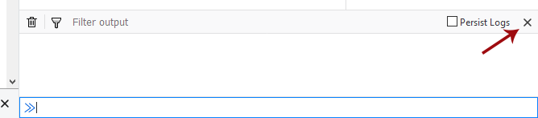
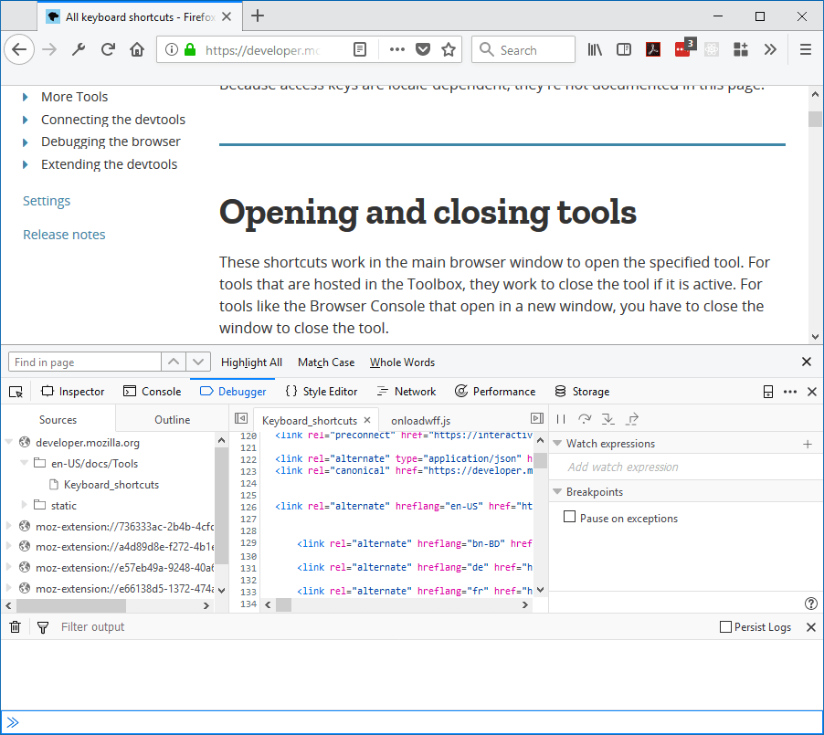
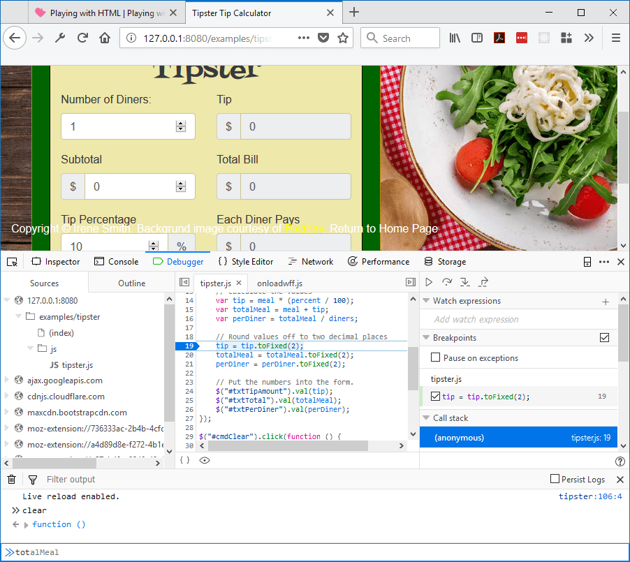

=============
Split console
=============

You can use the console alongside other tools. While you're in another tool in the Toolbox, just press :kbd:`Esc` or select the "Show split console" command in the :ref:`Toolbar <tools-toolbox-toolbar>` menu. The toolbox will now appear split, with the original tool above and the web console underneath.

You can close the split console by pressing :kbd:`Esc` again, or by selecting the "Hide split console" menu command.

.. raw:: html

  <iframe width="560" height="315" src="https://www.youtube.com/embed/G2hyxhPHyXo" title="YouTube video player" frameborder="0" allow="accelerometer; autoplay; clipboard-write; encrypted-media; gyroscope; picture-in-picture" allowfullscreen></iframe>
   
   

As usual, ``$0`` works as a shorthand for the element currently selected in the Inspector:

When you use the split console with the debugger, the console's scope is the currently executing stack frame. So if you hit a breakpoint in a function, the scope will be the function's scope. You'll get autocomplete for objects defined in the function, and can easily modify them on the fly:

