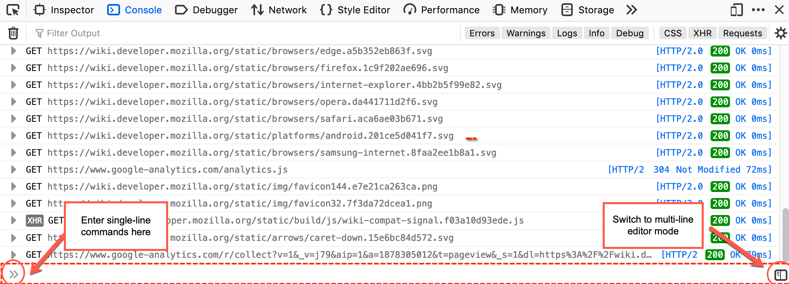
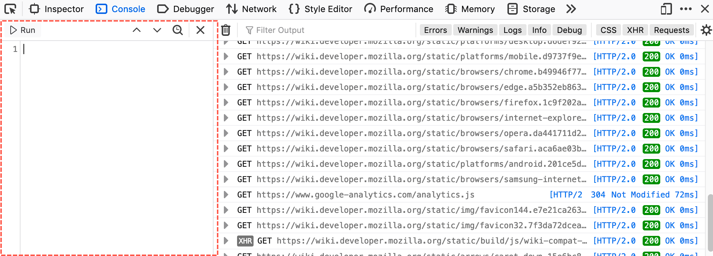
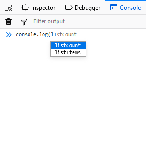
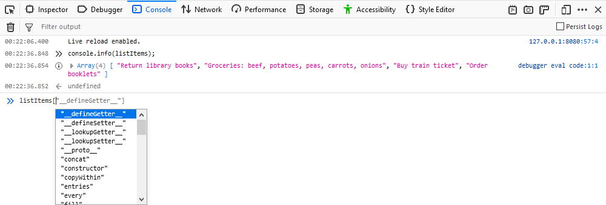
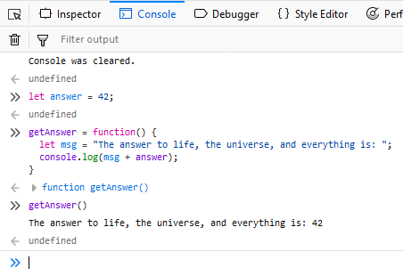
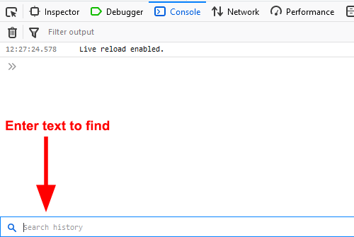
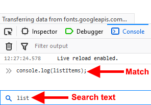

================================
The JavaScript input interpreter
================================

You can interpret JavaScript expressions in real time using the interpreter provided by the Web Console. It has two modes: single-line entry and multi-line entry.

Single-line mode
****************

For single-line entry, you can type JavaScript expressions in the field at the bottom of the console log, at the **>>** prompt.

To enter expressions in single-line mode, type at the prompt and press :kbd:`Enter`. To enter multi-line expressions, press :kbd:`Shift` + :kbd:`Enter` after typing each line, then :kbd:`Enter` to run all the entered lines.

The expression you type is echoed under the input prompt, followed by the result.

If your input does not appear to be complete when you press :kbd:`Enter`, then the Console treats this as :kbd:`Shift` + :kbd:`Enter` , enabling you to finish your input.

For example, if you type:

.. code-block:: JavaScript

  function foo() {

and then :kbd:`Enter`, the Console does not immediately execute the input, but behaves as if you had pressed :kbd:`Shift` + :kbd:`Enter` , so you can finish entering the function definition.

.. _command_line_interpreter_multi_line_mode:

Multi-line mode
***************

For multi-line entry, click the "split panel" icon at the right hand side of the single-line entry field, or press :kbd:`Ctrl` + :kbd:`B` (Windows/Linux) or :kbd:`Cmd` + :kbd:`B` (macOS). The multi-line editing pane opens on the left side the of Web Console.

You can enter multiple lines of JavaScript by default in this mode, pressing :kbd:`Enter` after each one. To execute the snippet that is currently in the editing pane, click the **Run** button or press :kbd:`Ctrl` + :kbd:`Enter` (or :kbd:`Cmd` + :kbd:`Return` on MacOS). The snippet is echoed under the input prompt (in the right-side pane), followed by the result.

Starting in Firefox 76, if the code snippet is more than five lines long, only the first five lines are echoed in the console, preceded by a disclosure triangle (or "twistie"), and followed by an ellipsis (…). Click anywhere in the area containing the echoed code to show the whole snippet; click again in that area to collapse it.

You can open files when in multi-line mode, and save the current contents of the editing pane to a file.

- To open a file, press :kbd:`Ctrl` + :kbd:`O` (:kbd:`Cmd` + :kbd:`O` on MacOS). A file dialog box opens so you can select the file to open.
- To save the contents of the editing pane, press :kbd:`Ctrl` + :kbd:`S` (:kbd:`Cmd` + :kbd:`S` on MacOS). A file dialog box opens so you can specify the location to save to.

To switch back to single-line mode, click the **X** icon at the top of the multi-line editing pane, or press :kbd:`Ctrl` + :kbd:`B` (Windows/Linux) or :kbd:`Cmd` + :kbd:`B` (MacOS).

Accessing variables
*******************

You can access variables defined in the page, both built-in variables like ``window`` and variables added by JavaScript libraries like *jQuery*:

.. _command_line_interpreter_autocomplete:

Autocomplete
************

The editor has autocomplete: enter the first few letters and a popup appears with possible completions:

Press :kbd:`Enter`, :kbd:`Tab`, or the right arrow key to accept the suggestion, use the up/down arrows to move to a different suggestion, or just keep typing if you don't like any of the suggestions.

Console autocomplete suggestions are case-insensitive.

The console suggests completions from the scope of the currently executing stack frame. This means that if you've hit a breakpoint in a function you get autocomplete for objects local to the function.

You get autocomplete suggestions for array elements, as well:

You can enable or disable autocompletion via the Settings ("gear") menu in the Web Console toolbar. The menuitem **Enable Autocompletion** has a checkmark next to it when the feature is enabled, which is missing when it is disabled. Select the menuitem to change the state.

Instant evaluation
******************

.. note::
  This feature is available in Firefox Nightly, in versions labeled 74 and later.

When the "instant evaluation" feature is enabled, the interpreter displays results of expressions as you're typing them in single-line mode. Note that the result might be an error message. Expressions that have side effects are not evaluated.

You can enable or disable instant evaluation via the Settings ("gear") menu in the Web Console toolbar. The menuitem **Instant Evaluation** has a checkmark next to it when the feature is enabled, which is missing when it is disabled. Select the menuitem to change the state.

Execution context
*****************

Code that you have executed becomes part of the execution context, regardless of what editing mode you were in when you executed it. For example, if you type a function definition in the multi-line editor, and click **Run**, you can switch to single-line mode and still use your function.

Syntax highlighting
*******************

The text you enter has syntax highlighting as soon as you have typed enough for the highlighter to parse it and infer the meanings of the "words".

The output is highlighted as well where appropriate.

.. note::
  Syntax highlighting is not visible in your browser if Accessibility features have been enabled.

.. _command_line_interpreter_execution_history:

Execution history
*****************

The interpreter remembers expressions you've typed. To move back and forward through your history:

- In single-line mode, use the up and down arrows.
- In multi-line mode, use the **⋀** and **⋁** icons in the editing panel's toolbar.

The expression history is persisted across sessions. To clear the history, use the ``clearHistory()`` :ref:`helper function <command_line_interpreter_helper_commands>`.

You can initiate a reverse search through the expression history, much like you can in bash on Linux and Mac or PowerShell on Windows. On Windows and Linux press :kbd:`F9`. On Mac press :kbd:`Ctrl` + :kbd:`R` (**note:** not :kbd:`Cmd` + :kbd:`R`!) to initiate the reverse search.

Enter the text you want to search for in the input box at the bottom of the Console. Start typing part of the expression you are looking for and the first match is displayed in the console. Repeatedly typing :kbd:`F9` on Windows and Linux ( :kbd:`Ctrl` + :kbd:`R` on Mac) cycles backwards through the matches.

Once you have initiated the reverse search, you can use :kbd:`Shift` + :kbd:`F9` on Windows or Linux ( :kbd:`Ctrl` + :kbd:`S` on Mac) to search forward in the list of matches. You can also use the **⋀** and **⋁** icons in the expression search bar.

When you find the expression you want, press :kbd:`Enter` (:kbd:`Return`) to execute the statement.

Working with iframes
********************

:doc:`Working with iframes <../../working_with_iframes/index>` explains how to direct all debugging tools to target a particular iframe, including the command line interpreter.

.. _command_line_interpreter_helper_commands:

Helper commands
***************

The JavaScript command line provided by the Web Console offers a few built-in helper functions that make certain tasks easier. For more information see :doc:`Web Console Helpers <../helpers/index>`.
