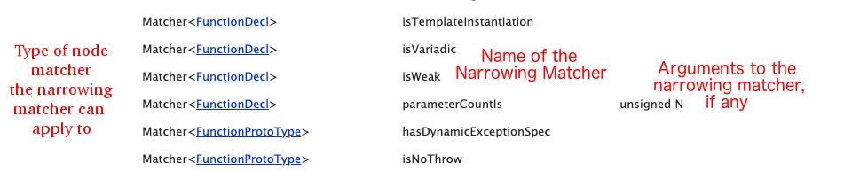

.. _writing_matchers:

Writing Matchers
================

Types of Matchers
-----------------

Documentation
~~~~~~~~~~~~~

Here is the documentation: `https://clang.llvm.org/docs/LibASTMatchersReference.html <https://clang.llvm.org/docs/LibASTMatchersReference.html>`_

It is not obvious, but it is important to note, **cicking on the name of a matcher expands help about that matcher.** Example:

Node Matchers
~~~~~~~~~~~~~

Node matchers can be thought of as 'Nouns'. They specify a **type** of node you want to match, that is, a particular *thing*. A function, a binary operation, a variable, a type.

A full list of `node matchers are listed in the documentation <https://clang.llvm.org/docs/LibASTMatchersReference.html#node-matchers>`_. Some common ones are ``functionDecl()``, ``binaryOperator()``, and ``stmt()``.

Narrowing Matchers
~~~~~~~~~~~~~~~~~~

Narrowing matchers can be thought of as 'Adjectives'. They narrow, or describe, a node, and therefore must be applied to a Node Matcher.  For instance a node matcher may be a ``functionDecl``, and the narrowing matcher applied to it may be ``parameterCountIs``.

The `table in the documentation <https://clang.llvm.org/docs/LibASTMatchersReference.html#narrowing-matchers>`_ lists all the narrowing matchers, which they apply to and how to use them.  Here is how to read the table:

And some examples:

::

  m functionDecl(parameterCountIs(1))
  m functionDecl(anyOf(isDefinition(), isVariadic()))

As you can see **only one Narrowing Matcher is allowed** and it goes inside the parens of the Node Matcher. In the first example, the matcher is ``parameterCountIs``, in the second it is ``anyOf``.

In the second, we use the singular ``anyOf`` matcher to match any of multiple other Narrowing Matchers: ``isDefinition`` or ``isVariadic``. The other two common combining narrowing matchers are ``allOf()`` and ``unless()``.

If you *need* to specify a narrowing matcher (because it's a requirement argument to some other matcher), you can use the ``anything()`` narrowing matcher to have a no-op narrowing matcher.

Traversal Matchers
~~~~~~~~~~~~~~~~~~

Traversal Matchers *also* can be thought of as adjectives - at least most of them.  They also describe a specific node, but the difference from a narrowing matcher is that the scope of the description is broader than the individual node.  A narrowing matcher says something about the node in isolation - e.g. the number of arguments it has - a traversal matcher says something about the node's contents or place in the program.  

Again, the `the documentation <https://clang.llvm.org/docs/LibASTMatchersReference.html#traversal-matchers>`_ is the best place to explore and understand these, but here is a simple example for the traversal matcher ``hasArraySize()``:

::

  Given:
    class MyClass { };
    MyClass *p1 = new MyClass[10];
    
  
  cxxNewExpr()
    matches the expression 'new MyClass[10]'.
  
  cxxNewExpr(hasArraySize(integerLiteral(equals(9))))
    does not match anything
    
  cxxNewExpr(hasArraySize(integerLiteral(equals(10))))
    matches the expression 'new MyClass[10]'.

Example of Iterative Matcher Development
----------------------------------------

When developing matchers, it will be much easier if you do the following:

1. Write out the code you want to match. Write it out in as many different ways as you can. For example: in the same place in the code, use a variable, a constant and a function that returns a value. Put the code you want to match inside of a function, inside of a conditional, inside of a function call, and inside of an inline function definition.
2. Write out the code you *don't* want to match, but looks like code you do. Write out benign function calls, benign assignments, etc.
3. Iterate on your matcher and treat it as _code_ you're writing. Indent it, copy it somewhere in case your browser crashes, even stick it in a tiny temporary version-controlled file.

As an example of the above, below is a sample iterative development process of a more complicated matcher.

 **Goal**: Match function calls where one of the parameters is an assignment expression with an integer literal, but the function parameter has a default value in the function definition.

::

  int add1(int a, int b) { return a + b; }
  int add2(int c, int d = 8) { return c + d; }
  
  int main() {
   int x, y, z;
  
   add1(x, y);     // <- No match, no assignment
   add1(3 + 4, y); // <- No match, no assignment
   add1(z = x, y); // <- No match, assignment, but not an integer literal
   add1(z = 2, y); // <- No match, assignment, integer literal, but function parameter lacks default value
   add2(3, z = 2); // <- Match
  }

Here is the iterative development process:

::

  //-------------------------------------
  // Step 1: Find all the function calls
  m callExpr()
  // Matches all calls, as expected.
  
  //-------------------------------------
  // Step 2: Start refining based on the arguments to the call
  m callExpr(forEachArgumentWithParam()))
  // Error: forEachArgumentWithParam expects two parameters
  
  //-------------------------------------
  // Step 3: Figure out the syntax to matching all the calls with this new operator
  m callExpr(
  	forEachArgumentWithParam(
  		anything(),
  		anything()
  	)
  )
  // Matches all calls, as expected
  
  //-------------------------------------
  // Step 4: Find the calls with a binary operator of any kind
  m callExpr(
    forEachArgumentWithParam(
       binaryOperator(), 
       anything()
     )
  )
  // Does not match the first call, but matches the others
  
  //-------------------------------------
  // Step 5:
  m callExpr(
    forEachArgumentWithParam(
       binaryOperator(isAssignmentOperator()), 
       anything()
     )
  )
  // Now matches the final three calls
  
  //-------------------------------------
  // Step 6: Starting to refine matching the right-hand of the assignment
  m callExpr(
    forEachArgumentWithParam(
       binaryOperator(
       	allOf(
       	  isAssignmentOperator(), 
       	  hasRHS()
   	    )), 
       anything()
     )
  )
  // Error, hasRHS expects a parameter
  
  //-------------------------------------
  // Step 7:
  m callExpr(
    forEachArgumentWithParam(
       binaryOperator(
       	allOf(
       	  isAssignmentOperator(), 
       	  hasRHS(anything())
   		  )), 
       anything()
     )
  )
  // Okay, back to matching the final three calls
  
  //-------------------------------------
  // Step 8: Refine to just integer literals
  m callExpr(
    forEachArgumentWithParam(
       binaryOperator(
       	allOf(
       	  isAssignmentOperator(), 
       	  hasRHS(integerLiteral())
   		  )), 
       anything()
     )
  )
  // Now we match the final two calls
  
  //-------------------------------------
  // Step 9: Apply a restriction to the parameter definition
  m callExpr(
    forEachArgumentWithParam(
       binaryOperator(
       	allOf(
       	  isAssignmentOperator(), 
       	  hasRHS(integerLiteral())
   		  )), 
       hasDefaultArgument()
     )
  )
  // Now we match the final call
