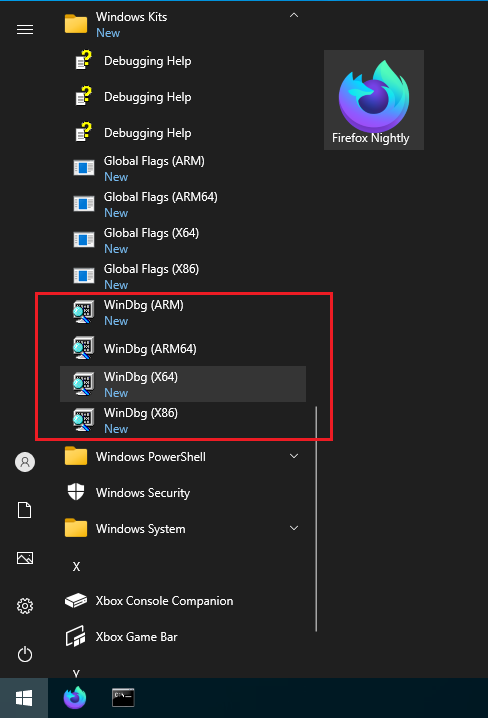

Capturing a minidump
====================

*Minidumps* are files created by various Windows tools which record the
complete state of a program as it's running, or as it was at the moment
of a crash. Small minidumps are created by the Breakpad :ref:`crash
reporting <Crash Reporter>` tool, but sometimes that's not
sufficient to diagnose a problem. For example, if the application is
hanging (not responding to input, but hasn't crashed) then Breakpad is
not triggered, and it can be difficult to determine where the problem
lies. Sometimes a more complete form of minidump is needed to see
additional details about a crash, in which case manual capture of a
minidump is desired.

This page describes how to capture these minidumps on Windows, to permit
better debugging.

Privacy and minidumps
---------------------

.. warning::

   **Warning!** Unlike the minidumps submitted by Breakpad, these
   minidumps contain the **complete** contents of program memory. They
   are therefore much more likely to contain private information, if
   there is any in the browser. For this reason, you may prefer to
   generate minidumps against a `clean
   profile <http://support.mozilla.com/en-US/kb/Managing%20profiles>`__
   where possible.

Capturing a minidump: application crash
---------------------------------------

To capture a full minidump for an application crash, you can use a tool called
**Debugging Tools for Windows**, which is provided by Microsoft for free.

Install Debugging Tools for Windows
~~~~~~~~~~~~~~~~~~~~~~~~~~~~~~~~~~~

Please follow `these instructions
<https://docs.microsoft.com/en-us/windows-hardware/drivers/debugger/>`__.
You can install the Debugging Tools for Windows alone, but you cannot
download it alone.  To install it, download Windows Software Development Kit
(SDK) first, start the installer, and then select only **Debugging Tools for
Windows** in the list of features to install.

.. image:: img/sdk-installer.png

The latest installer installs the tools for all CPU architectures (X86,
X64, ARM, and ARM64).  You need to choose a tool of the architecture
matching Firefox you want to capture a minidump from.  For example, if
you want to capture a minidump from 32-bit Firefox on 64-bit Windows,
use the X86 version of tools, not X64 tools.

The default install path of SDK for 64-bit Windows is
``%ProgramFiles(x86)%\Windows Kits\10``.  The debugging tools can be found in
the folder named **Debuggers** under your install path of SDK.

The Debugging Tools for Windows contains both graphical and command line
debugging tools that can be used to capture a minidump.  If you prefer
a graphical tool, please follow `Capture a minidump in a graphical way
<#capture-a-minidump-in-a-graphical-way>`__.  If you prefer a command
line tool, please follow `Capture a minidump from the command line
<#capture-a-minidump-from-the-command-line>`__.

Capture a minidump in a graphical way
~~~~~~~~~~~~~~~~~~~~~~~~~~~~~~~~~~~~~
#. Launch the graphical debugger named WinDbg from the Start Menu.  WinDbg
   icons are registered under "Windows Kits" as below.

   |WinDbg in Start Menu|

#. Connect Firefox to the debugger. 

   a. If Firefox is not already running, open the **"File"** menu on WinDbg
      and choose **"Open Executable..."**.  In the file chooser window that
      appears, open the firefox.exe executable.  If you're not sure about where
      it is, please see `How to find the location of firefox.exe
      <#how-to-find-the-location-of-firefox-exe>`__.

   b. If Firefox is already running and you know which process you want to
      capture a minidump from, open the **"File"** menu on WinDbg and choose
      **"Attach to a Process..."**.  In the "Attach to Process" dialog that
      appears, select the process.  To identify a process, please see
      `Identify a process to attach a debugger to
      <#identify-a-process-to-attach-a-debugger-to>`__.

#. You should now see a "Command" text window with debug output at the
   top and an input box at the bottom. From the menu, select
   ``Debug → Go``, and Firefox should start. If the debugger spits out
   some text right away and Firefox doesn't come up, select
   ``Debug → Go`` again.

#. When the program is about to crash, WinDbg will spit out more data,
   and the prompt at the bottom will change from saying "``*BUSY*``" to
   having a number in it. At this point, you should type
   "``.dump /ma c:\temp\firefoxcrash.dmp``" -- without the quotes, but
   don't forget the dot at the beginning. Once it completes, which can
   take a fair while, you will have a very large file at
   ``c:\temp\firefoxcrash.dmp`` that can be used to help debug your
   problem.  File size will depend on this size of Firefox running in
   your environment, which could several GB.

#. Ask in the relevant bug or thread how best to share this very large
   file!

Capture a minidump from the command line
~~~~~~~~~~~~~~~~~~~~~~~~~~~~~~~~~~~~~~~~

If Firefox is not already running, open the Command Prompt and run the following
command.  This command launches all Firefox processes under a debugger.  This
technique is useful when you have a startup crash or when you're not sure about
which process will crash.

To find out where firefox.exe is, please see `How to find the location
of firefox.exe <#how-to-find-the-location-of-firefox-exe>`__.

.. code::

   <path to debugger>\cdb.exe -g -G -o <path to firefox>\firefox.exe

For example, if both the debugging tools and Firefox are installed in the
default folder and you want to capture a minidump of 64-bit Firefox,
the command will be like this.  Please note that you need to add double
quotes when a path contains one or more whitespaces.

.. code::

   "C:\Program Files (x86)\Windows Kits\10\Debuggers\x64\cdb.exe" -g -G -o "C:\Program Files\Mozilla Firefox\firefox.exe"

If a Firefox process you want to capture a minidump from is already running,
attach the debugger to it with the following command.  To identify a process,
please see `Identify a process to attach a debugger to
<#identify-a-process-to-attach-a-debugger-to>`__.

.. code::

   <path to debugger>\cdb.exe -g -G -p <PID>

When the process crashes, the debugger tool captures it and waits for your
command.  At this point, you should type ``.dump /ma c:\temp\firefoxcrash.dmp``
-- don't forget the dot at the beginning.  Once it completes, which can take
a fair while, you will have a very large file at ``c:\temp\firefoxcrash.dmp``
that can be used to help debug your problem.  File size will depend on this
size of Firefox running in your environment, which could several GB.

After a minidump is generated, type ``q`` and press Enter to quit the debugger.

Capturing a minidump: application hang
--------------------------------------

On Windows Vista and Windows 7, you can follow `these
instructions <http://support.microsoft.com/kb/931673>`__ to capture a
dump file and locate it after it's been saved.

Identify a process to attach a debugger to
------------------------------------------

When you're running Firefox, even if you have only a single tab, you may have
noticed a bunch of firefox.exe instances in Task Manager.  This means Firefox
consists of multiple processes.  Since an application crash happens per process
and a minidump is generated per process, you need to identify which process will
crash before starting a debugger.

Identify a process type
~~~~~~~~~~~~~~~~~~~~~~~

Each instance of firefox.exe has a type.  To identify a process to attach
a debugger to, you need to know its process type first.

When a crash happens, if all Firefox windows are suddenly gone and Mozilla
Crash Reporter window is opend, a process that crashed is the main process.

.. image:: img/crashreporter.png

When a crash happens, if you see the following page, a process that crashed
is a tab (content) process.

There are more process types, but there isn't an easy way to detect a crash in
a process of those types because the symptom varies.  If you cannot be sure
about the type of a crashing process, terminate Firefox and launch a new
instance of Firefox under a debugger in the way described above.

If a GPU process crashes, you may see a window is not rendered correctly as
below.  Since the main process relaunches a GPU process, this symptom will be
transient and the window will be rendered correctly again.

If a GMP (= Gecko Media Plugin) process crashes, you will see an information
bar will be displayed below the address bar.

If an RDD (= Remote Data Decoder) process crashes, Firefox may stop playing
a video as below, but not limited to this symptom.

.. image:: img/crash-rdd.png

Identify a process ID (PID)
~~~~~~~~~~~~~~~~~~~~~~~~~~~

Once you understand what type of process crashes, the next step is to get a
process ID (PID), which is a value to specify in the debugger command we
discussed above.  We present two ways to get a PID here.

The first way is to use Firefox itself.  Open a new tab and go to the
**about:processes** page.  This page shows the list of all processes and their
PIDs.  In the example below, the PID of the main process is  **6308** and the
PID of the tab process hosting a page of mozilla.org is **6748**.

The second way is to use `Process Explorer
<https://docs.microsoft.com/en-us/sysinternals/downloads/process-explorer>`__,
which is provided by Microsoft for free.  You may need this technique to attach
a debugger to a hung process or when you cannot open a new tab in the existing
Firefox for some reason.

Process Explorer is basically an advanced version of Task Manager.  Since it
displays processes in a hierarchical tree view, you can easily locate the main
process, which is the parent of all child processes.  In the example below, the
PID of the main process is **6308** and all processes, including
plugin-container.exe, under the main process is child processes.

Another helpful feature of Process Explorer is that when you hover the mouse
cursor on a process, it displays a tooltip window showing the process's command
line string.  For a child process of firefox.exe, the command line's last
keyword shows the process type, so you can tell which process is which process
type.  In the example below, the tooltip window displays a command line string
of a GPU process.

How to find the location of firefox.exe
---------------------------------------

If you're not sure about the location of the executable file (firefox.exe) of
Firefox you run, you can find it in the **about:support** page.  In the
"Application Basics" section, the path to firefox.exe is displayed in the row
of "Application Binary".

