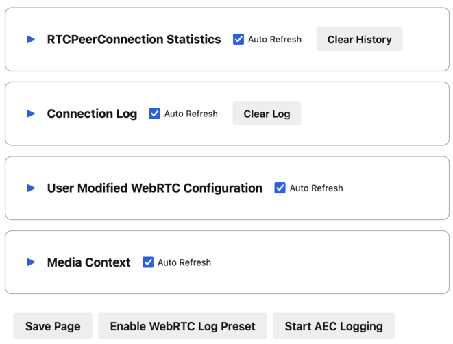
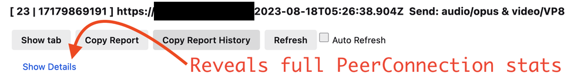
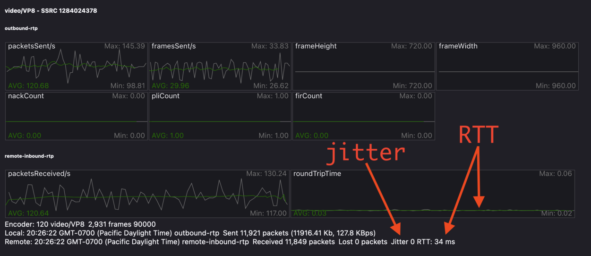
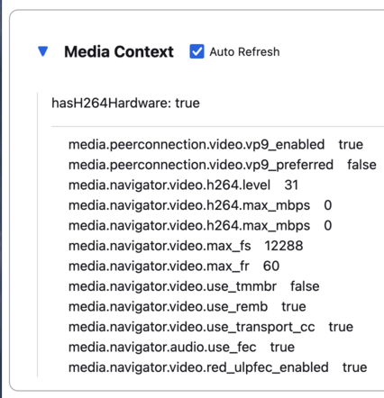

Debugging WebRTC Calls
======================

.. _reporting_webrtc_call_issues:

Reporting WebRTC Call Issues
----------------------------

The best way to report an issue is through Bugzilla using this
`link <https://bugzilla.mozilla.org/enter_bug.cgi?product=Core&component=WebRTC>`__.
Describe the issue you've run into, include a URL, along with the
details of the call setup. See the :ref:`adding-call-setup-information`
section for helpful templates. Here are some common examples of descriptive
WebRTC bug summaries:

* caller is experiencing frozen video, screen capture, or desktop capture
* caller does not hear audio
* caller's voice sounds distorted or robotic
* video resolution is lower than expected
* caller's video appears rotated
* there is significant delay between a caller's video and audio
* camera, microphone, or screens are not appearing in the Firefox device access
  permission prompts, etc.
* caller's video is garbled, partially missing, or the colors are incorrect
* caller can not share external display, but can share integrated display

.. note::
  Not all web conferencing software makes extensive use of WebRTC.

For simple issues, the first place to look is to check the
`web developer console </devtools-user/web_console>`__ for error messages
related to media format issues. If you see messages here related to WebRTC,
getUserMedia, or getDisplayMedia, please add this information to your bug.

.. _adding-call-setup-information:

Adding Call Setup Information
~~~~~~~~~~~~~~~~~~~~~~~~~~~~~

The following template can help one provide all the call details needed to
diagnose many common issues.

.. code:: md

   * Does this problem occur in Firefox for Desktop or Android?

   * Is this problem reproducible in Firefox Nightly?

   * Has this worked previously?

   * Have you tried using `about:profiles` to reproduce the problem in a
     clean profile?

   * How many participants were in the call?

   * In which web conferencing or web calling services does the problem occur?

   * Does the problem present itself immediately upon starting the call?

   * If not how long does it take to occur?

   * If this is a problem with audio or video capture, what camera or microphone
     are you using? (adding about:support text may be helpful)

   * If this is problem with screen capture, which screen was being captured,
     and are there other screens attached to the same machine?

   * Would you be willing to help us find a regression range?

If the issue is of specification compliance the template provided below may be
more useful. If one is unsure if this is a compliance issue, one can refer to
the :ref:`standards-documentation` section for links.

.. code:: md

  * What unexpected behavior is being observed? What are the steps to reproduce
    this issue?

  * What is the expected behavior?

  * Where is this behavior specified?

  * Is this problem reproducible in Nightly?

  * Have you tried using `about:profiles` to reproduce the problem in a clean
    profile?

  * Has this worked previously?

  * If so, would you be willing to help us find a regression range?

.. _share_your_aboutsupport_text:

Adding about:support Text
~~~~~~~~~~~~~~~~~~~~~~~~~~~~~~

In your Bugzilla report, please include support information about the
current device on which you are experiencing an issue.

#. Open a tab and visit about:support
#. Click 'Copy Text to Clipboard'
#. Paste this text in your Bugzilla bug comment and post.

.. note::

  To open :code:`about:*` links in Firefox one must do the following:
  #. Right-click the link and select `Open Link in New Tab`
  #. Select the new tab
  #. Click inside the address bar which should contain the about URL
  #. Press Enter

.. _share_your_aboutwebrtc_contents:

Adding about:webrtc RTCPeerConnection Stats
~~~~~~~~~~~~~~~~~~~~~~~~~~~~~~~~~~~~~~~~~~~

#. Open about:webrtc.
#. Expand the RTCPeerConnection section.
#. Locate and expand the subsection RTCPeerConnection that one wishes to copy
   stats from.
#. Press the :code:`Copy Stats Report`
#. In the Bugzilla bug, press the :code:`Attach New File` button.
#. Click inside the large text box labeled :code:`File`, and paste the copied
   stats report.
#. Add a descriptive label to the the :code:`Description:`, e.g.
   "PeerConnection statistics sample taken during period of frame loss".
#. In the drop down box, next to the :code:`select from list` radio option,
   select "JSON source (application/json)".
#. If needed, add a descriptive comment to the :code:`comment` field.
#. Press the :code:`Submit` button.

.. note::
   Hovering the mouse over some headings will reveal a clipboard icon. Clicking
   this icon will copy the contents under that section to the clipboard as a
   JSON document. This can be useful if one wants to submit a portion of the
   available stats. Of particular note are the :code:`RTP Stats` heading whose
   button will copy the latests RTP stats, and the :code:`SDP` section whose
   button will copy the SDP offer; answer; and roles.

Adding Your about:webrtc Contents
~~~~~~~~~~~~~~~~~~~~~~~~~~~~~~~~~

For issues with call quality, please share web conferencing related
performance information by providing your about:webrtc information. Note
this information should be collected while the call in question is still
active.

#. While your call is still ongoing, open an additional tab and visit
   about:webrtc.
#. Click "Clear History" to clear the stats from other recent calls
   which are no longer ongoing.
#. At the bottom of the page click 'Save Page', and save this file.
#. Add this file as an attachment to your bug.

This data contains statistics about your call, the signalling that was
used to setup your call, and information about the network transports.

.. _diagnosing_call_quality_issues:

Diagnosing Call Quality Issues
------------------------------

.. _about_webrtc_overview:

about:webrtc Overview
~~~~~~~~~~~~~~~~~~~~~

about:webrtc is an in-browser resource for debugging WebRTC calls. The
primary audience for about:webrtc is browser developers but it can also be
of use to anyone that needs to troubleshoot a WebRTC call. When there is no
call data to display, about:webrtc will appear as follows:

   about:webrtc before any calls have been made

Note that there are several sections. During a call each section will contain
information pertinent to different aspects of the WebRTC browser implementation.

RTCPeerConnection Statistics
^^^^^^^^^^^^^^^^^^^^^^^^^^^^

This section presents information useful for diagnosing active calls. It
contains RTCPeerConnection creation parameters, connection information,
negotiation details, RTP stream statistics, bandwidth statistics, and
output frame statistics.

Connection Log
^^^^^^^^^^^^^^

When one needs to diagnose issues with the underlying transports, logs
can be found under Connection Log.

User Modified WebRTC Configuration
^^^^^^^^^^^^^^^^^^^^^^^^^^^^^^^^^^
This section will display any user modified preferences which effect the
performance or behavior of browser components which can impact WebRTC calls.
When hovering over a preference path displayed in this section a clipboard
icon will appear. Clicking that icon will copy the path to the clipboard. It
can then be pasted into `about:config <about:config>`__, to change or reset the
value to its default.

.. warning::
   Unexpected values in this section may be caused by installed extensions. It
   is best to test issues in a clean profile when possible using
   `about:profiles <about:profiles>`__.

Media Context
^^^^^^^^^^^^^

Information that is gathered to determine Codec availability and capability is
recorded under Media Context.

Bottom Control Bar
^^^^^^^^^^^^^^^^^^

At the bottom of about:webrtc is a row of buttons which allow the user to
perform miscellaneous actions.

The `Save Page` button expands all the sections and presents a dialog to save
the contents of the page. This will produce an HTML file suitable for attaching
to bug reports.

In the event of a WebRTC issue, the :code:`Enable WebRTC Log Preset` button is a very
quick way to start logging. Pressing that button will open a new tab with
`about:logging <about:logging>`__ with the :code:`webrtc` preset selected. This
preset contains all :ref:`standard-logging-modules`. Logging
will begin immediately. If one needs to change other log settings on that page
one can customize them, and then press :code:`Start Logging`. This may be
necessary if one wishes to log to the profiler.

If experiencing echo cancellation issues, one may be asked to submit echo
cancellation logs. These logs are gathered by pressing the
:code:`Start AEC Logging` button. One should press the button to activate
the logging while actively experiencing an echo cancellation failure.

.. note::

  Producing echo cancellation logs is incompatible with the content sandbox.
  The user will be prompted with further instructions if the sandbox is active
  and the :code:`Start AEC Logging` button is pressed.

.. _audiovideo_delay:

Audio/Video Delay
^^^^^^^^^^^^^^^^^

Delayed media is commonly caused by long physical paths between
endpoints, though anything that slows down inter-hop delivery of packets
can be at fault. Note that this is different than the bandwidth of the
network path, and a high latency will not be fixed by reducing the video
resolution or audio sample rate. Round trip time, or RTT, is the time it
takes for a packet to get from the sender to the receiver and then for a
packet to get from the receiver back to the sender. If the path is
symmetric between the two endpoints one can assume that the one way
delay is half the delay of the round trip.

The second common cause of A/V delay is jitter, the magnitude of
variability in packet inter-arrival times. In order to smoothly play out
of the incoming stream a receiver experiencing jitter will have to
buffer (delay) incoming packets.

**Using** `about:webrtc <about:webrtc>`__ **to Diagnose Delay**

The key metrics in `about:webrtc <about:webrtc>`__ are RTT (round-trip-time) and
jitter. They can be found in the RTP stats section of the
PeerConnection. The PeerConnection informational blocks start out in a
minimized state, and one will need to expand a block to find the RTP
stats section:

   How to reveal the full statistics of a PeerConnection in about:webrtc

Once expanded one can locate the RTP Stats section and find the key
diagnostic stats:

   Location in about:webrtc of jitter and RTT stats

In this image we can see that there are 0 milliseconds of jitter, and 32
milliseconds of round trip delay. This call should not be experiencing any
noticeable delay. See the `Delay Calculation <#delay-calculation>`__
appendix section below for some more detail.

If the perceived delay is larger than the estimated delay that could
indicate a problem within Firefox that requires debugging. Under these
circumstances it would be helpful to grab a JSON copy of the current
stats by pressing the "Copy Report" button, pasting those stats into
your Bugzilla bug report.

.. figure:: img/about_webrtc_copy_report.png
   :alt: Location in about:webrtc of Copy Report button
   :width: 800px

   Location in about:webrtc of Copy Report button

.. _performance-profiling-and-logging:

Performance Profiling and Logging
---------------------------------

.. _capturing-a-firefox-performance-profile:

Capturing a Firefox Performance Profile
~~~~~~~~~~~~~~~~~~~~~~~~~~~~~~~~~~~~~~~

For basic performance issues, a performance profile can help engineers
diagnose issues with video formats, performance, and rendering.

#. Visit https://profiler.firefox.com/ and enable the Profiler toolbar
   button.
#. Click the toolbar button down arrow and select 'Media' in the
   Settings drop down.
#. Open a tab and visit the page with the affected media content.
#. Click the Profiler toolbar main button to start recording.
#. Play media until the issue you are seeing manifests.
#. Click the Profiler toolbar button again to stop recording.
#. When a new Profile tab opens, click the upload profile button on the
   upper right.
#. Copy the resulting profile URL and post this to your Bugzilla report.

Additionally, detailed logging can be collected within performance
profiles to help aid in debugging complicated issues. To enable the
collection of a profile with low level debugging -

#. Visit https://profiler.firefox.com/ and enable the Profiler toolbar
   button.
#. In a new tab, visit about:webrtc. Click the 'Enable WebRTC Log
   Preset' button, which will open a tab for about:logging with
   pre-populated information.
#. In about:logging, click the "Start Logging" button. (You are now
   recording a profile, the profiler toolbar toggle button should be
   selected automatically.)
#. Open a new tab for testing and view the media you are having an issue
   with. (After reproducing, DO NOT close this test tab yet.)
#. Switch to the about:logging tab, click 'Stop logging', and then close
   the test tab.
#. Wait approximately 10 - 20 seconds for a new tab to automatically
   open containing the generated performance profile.
#. Within the upper-right side of the profiler tab click the 'upload
   local profile' button to initiate profile upload. Once the upload is
   complete, a drop down text field will open displaying the URL of the
   profile. Select this text and copy it.
#. Share the URL of the profile for analysis with the engineer you are
   working with.

Alternatively one can set the following environment variable:

.. code:: sh

   MOZ_LOG="jsep:5,sdp:5,signaling:5,mtransport:5,RTCRtpReceiver:5,RTCRtpSender:5,RTCDMTFSender:5,VideoFrameConverter:5,WebrtcTCPSocket:5,CamerasChild:5,CamerasParent:5,VideoEngine:5,ShmemPool:5,TabShare:5,MediaChild:5,MediaParent:5,MediaManager:5,MediaTrackGraph:5,cubeb:5,MediaStream:5,MediaStreamTrack:5,DriftCompensator:5,ForwardInputTrack:5,MediaRecorder:5,MediaEncoder:5,TrackEncoder:5,VP8TrackEncoder:5,Muxer:5,GetUserMedia:5,MediaPipeline:5,PeerConnectionImpl:5,WebAudioAPI:5,webrtc_trace:5,RTCRtpTransceiver:5,ForwardedInputTrack:5,HTMLMediaElement:5,HTMLMediaElementEvents:5"

Note that webrtc_trace will not be active until "Enable WebRTC Log
Preset" is pressed.

.. _standard-logging-modules:

Standard Logging Modules
~~~~~~~~~~~~~~~~~~~~~~~~

.. list-table:: Standard Logging Modules
   :header-rows: 1

   * - Module
     - Component
     - Function
     - Notes
   * - jsep
     - signalling
     - JSEP state machine
     -
   * - sdp
     - signalling
     - SDP parsing
     -
   * - mtransport
     - networking
     - Network transports
     -
   * - RTCRtpReceiver
     - JS API
     - JS API related to receiving media and media control packets
     -
   * - RTCRtpSender
     - JS API
     - JS API related to sending media and media control packets
     -
   * - RTCDMTFSender
     - JS API
     - JS API related to sending DTMF messages
     -
   * - VideoFrameConverter
     -
     -
     -
   * - WebrtcTCPSocket
     - networking
     -
     -
   * - CamerasChild
     - media capture
     - Content process end of IPC channel for receiving frames from media
       capture devices
     -
   * - CamerasParent
     - media capture
     - Parent process end of IPC channel for sending frames from media capture devices
     -
   * - VideoEngine
     - media capture
     - Orchestrates capture of frames from media capture devices in the parent process
     -
   * - ShmemPool
     - media capture
     - Object pool of shared memory frame buffers for transferring media capture frames from parent to child process
     -
   * - TabShare
     - media capture
     - Captures tab content for sharing
     -
   * - MediaChild
     - media
     -
     -
   * - MediaParent
     - media
     -
     -
   * - MediaManager
     - media
     -
     -
   * - MediaTrackGraph
     - media
     -
     -
   * - cubeb
     - media
     -
     -
   * - MediaStream
     - media
     -
     -
   * - MediaStreamTrack
     - media
     -
     -
   * - DriftCompensator
     - media
     -
     -
   * - ForwardInputTrack
     - media
     -
     -
   * - MediaRecorder
     - media
     -
     -
   * - MediaEncoder
     - media
     -
     -
   * - TrackEncoder
     - media
     -
     -
   * - VP8TrackEncoder
     - media
     -
     -
   * - Muxer
     - media
     -
     -
   * - MediaPipeline
     - network
     - Glue code between transport, media, and libwebrtc components
     -
   * - PeerConnectionImpl
     - JS API
     - implements the RTCPeerConnection object
     -
   * - WebAudioAPI
     -
     -
     -
   * - webrtc_trace
     - webrtc
     - libwebrtc logging
     - Prior to Firefox v123 it must be enabled from
       `about:webrtc <about:webrtc>`__ at runtime, or it must be set in the
       :code:`MOZ_LOG` environment variable at launch.
   * - RTCRtpTransceiver
     - JS API
     - implements the RTCRtpTransceiver object
     -
   * - HTMLMediaElement
     -
     -
     -
   * - ForwardedInputTrack
     -
     -
     -
   * - HTMLMediaElementEvents
     -
     -
     -

.. _non-standard-loggin-modules:

Non-standard Logging Modules
~~~~~~~~~~~~~~~~~~~~~~~~~~~~

.. list-table:: Standard Logging Modules
   :header-rows: 1

   * - Module
     - Component
     - Function
     - Notes
   * - RTPLogger
     - network
     - Logs RTP and RTCP packet fragments
     - See `Debugging Encrypted Packets <#debugging-encrypted-packets>`__

.. _examining-call-performance-issues:

Examining Call Performance Issues
---------------------------------

.. _enabling-call-stats-history:

Enabling Call Stats History
~~~~~~~~~~~~~~~~~~~~~~~~~~~

Call stats history is enabled by default in Nightly. To enable in
release builds open `about:config <about:config>`__, and change
"media.aboutwebrtc.hist.enabled" to true. This will keep a history
window of stats for a number of recent calls, allowing for inspection
in `about:webrtc <about:webrtc>`__ after a call has completed.

.. _dumping-call-stats:

Dumping Call Stats
~~~~~~~~~~~~~~~~~~

One can dump a JSON blob of call stats for an active call, or a recent
call if call stats history is enabled. There are two buttons in
`about:webrtc <about:webrtc>`__ to do this, "Copy Report" and "Copy Report
History". The former will create a copy of the most recent stats for the
PeerConnection. The later will copy all the history of stats reports
that `about:webrtc <about:webrtc>`__ has accumulated for that PeerConnection, this
can be up to several minutes of stats.

.. _debugging-encrypted-packets:

Debugging Encrypted Packets
~~~~~~~~~~~~~~~~~~~~~~~~~~~

.. warning::
   There is a `blog
   post <https://blog.mozilla.org/webrtc/debugging-encrypted-rtp-is-more-fun-than-it-used-to-be/>`__
   covering dumping unencrypted partial RTP and RTCP packets in the logs.
   While the information presented in that post is still relevant,
   the command to extract the packet data in the blog is out of date. A
   working method is presented below;

Using the gecko logging system, unencrypted, mangled, partial, RTP-packets can
be written out. This may be a good avenue of investigation for packet loss and
recovery, simulcast, and feedback. Because the entirety of the packet is not
guaranteed to be logged, this is less suitable for debugging issues with
encoded media. These logged packets can be converted to PCAP files, which can
then be explored in `Wireshark <https://www.wireshark.org/>`__. The logs
produced by this module can be quite large, making it easy to identify by file
size which child process log files contain packet dumps.

To start RTP logging, one must enable the :code:`RtpLogger` log module. The :code:`sync`
option should also be used, as it prevents undesirable interleaving of log
messages. Here are the minimal log settings needed:

.. code:: sh

   MOZ_LOG='sync,RtpLogger:5'

In order to interpret the packet contents, one needs to refer to the SDP.
Wireshark is unaware of the negotiated details, so it can not directly decode
the media, nor can it decode the header extensions. The SDP can also be logged,
and so the following is a more useful set of log settings:

.. code:: sh

   MOZ_LOG='sync,RtpLogger:5,jsep:5'

.. note::

   On macOS it is simple to install Wireshark and text2pcap with Homebrew:

   .. code:: sh

      # Use only one of the following:
      # ==============================

      # To install the Wireshark GUI application and the command line utilities:
      brew install --cask wireshark

      # To install only the command line utilities:
      brew install wireshark

One can use :code:`tee` to capture log output
from a copy of Firefox launched from the command line, e.g. through
:code:`mach`. Alternatively, one can set a log file through the environment
variable :code:`MOZ_LOG_FILE` or through about:logging.

.. warning::

   If log files are not being created by child processes, this is likely due
   to sandboxing of content processes. To work around this one must either
   select a location within the sandbox, disable the content sandbox, or launch
   Firefox from the command line, e.g. from a Firefox dev environment:

   .. code::

      MOZ_LOG=sync,RtpLogger:5,jsep:5 MOZ_LOG_FILE= ./mach run 2>&1 | tee your.log

To produce a PCAP file one needs to filter the logs to include only the
RtpLogger log lines, reduce them down to the expected ingestion format for
text2pcap, and finally to invoke text2pcap.

.. code:: sh

   cat your.log  | rg 'RtpLogger.*RTC?P_PACKET|>>\s(?P<packet>.+$)' --only-matching  --replace '$packet' | text2pcap -D -n -l 1 -i 17 -u 1234,1235 -t '%H:%M:%S.' - your.output.pcap

.. note::

   If :code:`rg`, a.k.a ripgrep, is not already available, one can install it via one of the following methods:

   .. code:: sh

      # Install through cargo on macOS, Linux, or Windows
      cargo install ripgrep

      # Install via Homebrew on macOS
      brew install ripgrep

      # ripgrep packages may be available through the package manager for your
      # Linux distro

The resulting PCAP file can be explored with Wireshark. Currently, one must refer to the SDP in order to interpret the RTP packets.

.. code:: sh

   # On most Linux distros
   wireshark -d 'udp.port==1234,rtp' your.output.pcap

   # On macOS when installed via Homebrew
   open /Applications/Wireshark.app --args -d 'udp.port==1234,rtp' your.output.pcap

.. _examining-codec_availability-and-capabilities:

Examining Codec Availability and Capabilities
---------------------------------------------

When codec negotiation doesn't happen as expected there are several helpful
locations where one can find information. The SDP offer and answer contain the
list of codecs that were in the initial offer, and the subset of those codecs
that were selected in the answer.

The easiest way to get this information on  a live call is through
about:webrtc. Each RTCPeerConnection has its own subsection, that when
expanded contains an SDP section. There are buttons to display the offer
and the answer. Depending on which party was the offerer and which was
the answerer one may have a local offer and a remote answer, or a remote offer
and a local answer.

Firefox chooses which codecs to offer based on availability. Some codecs,
like Opus or VP8, are always available. Some codecs are available in software
and some codecs on some platforms are available in hardware. H264 support is
provided by a third-party, and is automatically downloaded the first time its
use is requested. This is a process which can take a variable amount of time
depending on network circumstances.

.. note::
   A list of media codecs with playback support are available in the Media
   section of `about:support#media <about:support#media>`__ . Not all media
   codecs present and available to Firefox for playback are supported in WebRTC
   calls.

To check the current factors, including preferences, that are being used to
calculate availability beyond codec presence, one can check the `Media Context`
section of about:webrtc.

.. _running-webrtc-tests:

For an in-depth reference covering the codecs available through WebRTC please
see the MDN Page: `Codecs Used by WebRTC <https://developer.mozilla.org/en-US/docs/Web/Media/Formats/WebRTC_codecs>`__.

Running WebRTC Tests
--------------------

There are a variety of tests providing coverage over WebRTC related code. The
Web Platform Suite provides conformance tests for browsers. The
:code:`gtest` suite is composed of unit tests. Crashtests are a type of
regression test which are written to induce crashes. There are fuzzing tests
which exercise APIs in ways that the authors did not foresee. All of the WebRTC
tests can be run locally with :code:`mach` or in CI on `Try`. There is a
detailed overview of all available test types including those not exercised by
WebRTC code `here </testing/automated-testing/index.html#functional-testing>`__.

.. note::
   Running :code:`./mach <verb> --help` is an indispensable tool for discovering
   options that can streamline your testing process.

.. note::
   A test suite on `Try` maybe an aggregate of multiple logical test suites.
   For example, the `mochitest-media` suite on try includes both the WebRTC and
   playback mochitests.

.. warning::
   WebRTC calls make use of a number of internal timers. Amongst the
   behaviors these timers control are transport selection, bandwidth estimation,
   packet loss determination, media adaptation, lip sync, connection timeout,
   and more. There are `Try` targets which are too slow to reliably run a
   number of the tests. Before running a specific test on `Try` for the first
   time, it may be best to check the relevant test suite manifest. This can be
   done easily with Searchfox.org by searching for and viewing a test file. If
   that test has been disabled on one or more platforms the details will appear
   as shown below:

   .. figure:: img/searchfox_test_disabled_warning.png
      :alt: Searchfox.org warning that the displayed test file has been disabled on Android

.. _test-atlas:

Test Atlas
----------

.. list-table:: WebRTC Test Locations
   :widths: 10 10 20 10 10
   :header-rows: 1

   * - Component
     - Test type
     - Test file location
     - Try suite
     - Treeherder Abbreviations
   * - WebRTC
     - Mochitest
     - dom/media/webrtc/mochitests
     - mochitest-media
     - :code:`mda`, :code:`M(mda)`
   * -
     - Web Platform Test
     - testing/web-platform/tests/webrtc
     - wpt
     - :code:`wpt`, :code:`W(wpt)`
   * -
     - Crashtest
     - dom/media/webrtc/tests/crashtests
     - crash
     - :code:`R(C)`
   * - WebRTC Signalling
     - GTest
     - media/webrtc/signaling/gtest
     - gtest
     - :code:`gtest`
   * - WebRTC (gUM / gDDM)
     - Browser Chrome Test (mochitest)
     - browser/base/content/test/webrtc
     - browser-chrome
     - :code:`bc`, :code:`M(bc)`
   * - WebRTC Transport
     - CPPUnit
     - dom/media/webrtc/transport/test
     - cppunit
     -
   * -
     - fuzztest
     - dom/media/webrtc/transport/fuzztest
     - fuzzing
     -
   * - SDP parser
     - Fuzzing
     - dom/media/webrtc/tests/fuzztests
     - fuzzing
     -

.. _webrtc-web-platform-tests:

Web Platform Tests
~~~~~~~~~~~~~~~~~~

The WPT suite comprises conformance tests for various W3C specs such as: CSS,
JS APIs, and HTML. WebRTC is a JS API and as such its tests are of the `testharness.js <https://web-platform-tests.org/writing-tests/testharness.html>`__ type.
There is detailed :code:`WPT` documentation available `here </web-platform/index.html#web-platform-tests>`__
Web Platform Tests can be run locally from

.. code:: bash

   # Run the entire WebRTC WPT test suite
   ./mach wpt testing/web-platform/tests/webrtc

   # Run a single test, e.g. RTCPeerConnection-createAnswer.html
   ./mach wpt testing/web-platform/tests/webrtc/RTCPeerConnection-createAnswer.html

   # Run all of the PeerConnection tests, i.e. RTCPeerConnection-*.html
   # NOTE that the `mach` verb in use is `test` not `wpt`
   ./mach test testing/web-platform/tests/webrtc/RTCPeerConnection

.. warning::
   Running the :code:`WPT` tests locally can be very disruptive to one's working
   desktop environment, as windows will frequently appear and grab focus. Using
   :code:`mach`'s :code:`--headless` flag will prevent this, and can be a great
   way to run them if one's problem can be evaluated from command line output.

These tests are synced from the main `Web Platform Test
repository <https://github.com/web-platform-tests/wpt>`__, and likewise
our changes are synced from our `in-tree
copy <https://searchfox.org/mozilla-central/search?q=&path=testing%2Fweb-platform%2Ftests%2Fwebrtc&case=false&regexp=false>`__
back to that repository.

.. warning::
   Running the WebRTC mochitests in `Try` is done using the entire Web Platform Test suite, :code:`wpt`.
   As such, this can be slow.

.. code:: bash

   ./mach try fuzzy --query 'wpt'

One can `run those same tests in
Chromium <https://chromium.googlesource.com/chromium/src/+/refs/heads/main/docs/testing/web_platform_tests_wptrunner.md>`__,
Safari, or Servo if one needs to compare behavior between browsers. This can be
done directly through :code:`mach`, see `running tests in other browsers </web-platform/index.html#running-tests-in-other-browsers>`__
for more details.

.. _mochitests:

Mochitests
~~~~~~~~~~

The WebRTC mochitests are integration tests, regression tests, and sanity
tests. The needs of these tests did not align with specification conformance
testing in the WPT, Web Platform Test, suite. Before writing a new mochitest,
one should consider if a test would be better expressed as a WPT, which all browsers
can test against.

Locally running the WebRTC mochitests should be done in a Firefox dev
environment using :code:`mach` as follows:

.. code:: bash

   # Run the whole suite
   ./mach mochitest dom/media/webrtc/tests/mochitests

   # Run a single test, e.g. test_peerConnection_basicAudioVideo.html
   ./mach mochitest dom/media/webrtc/tests/mochitests/test_peerConnection_basicAudioVideo.html
   # Or
   ./mach mochitest test_peerConnection_basicAudioVideo.html

   # Run all of the PeerConnection tests, i.e. test_peerConnection_*.html
   ./mach mochitest test_peerConnection

On :code:`try`, WebRTC mochitests are part of the larger media test suite.
This suite can be easily selected with the following fuzzy query:

.. code:: bash

   # Run the media mochitest suite on all regular platforms
   ./mach try fuzzy --query 'mochitest-media'

   # Run the media mochitest suite only on Linux which will resolve far faster
   ./mach try fuzzy --query 'linux mochitest-media'

.. _gtests:

GTests
~~~~~~

The gtests are all compiled into a single library target: :code:`xul-test`.
This makes running gtests from :code:`mach` slightly different than the other
test types.

.. code:: bash

   # Run a single test by using Prefix.TestName, e.g. JsepSessionTest.FullCall
   # https://searchfox.org/mozilla-central/rev/4d6a5b97428760d15bfcad13f8fc81439370a7ec/media/webrtc/signaling/gtest/jsep_session_unittest.cpp#1551
   ./mach gtest 'JsepSessionTest.FullCall'

   # Run all the tests in a single Prefix, e.g. JsepSessionTest
   ./mach gtest 'JsepSessiontTest.*'

   # Run all tests which have a Prefix.TestName containing the substring 'Jsep'
   # See the table of selectors below
   ./mach gtest '*Jsep*'

   # Run all the gtests for Firefox
   ./mach gtest

Here is a list of helpful substring selectors for executing specific WebRTC gtests:

.. list-table:: WebRTC GTest Selectors
   :header-rows: 1

   * - Selector
     - Description
     - Files
   * - :code:`*Jsep*`
     - JSEP (signalling) tests
     - `jsep_session_unittest.cpp <https://searchfox.org/mozilla-central/source/media/webrtc/signaling/gtest/jsep_session_unittest.cpp>`__
       `jsep_trak_unittest.cpp <https://searchfox.org/mozilla-central/source/media/webrtc/signaling/gtest/jsep_track_unittest.cpp>`__
   * - :code:`*Sdp*`
     - SDP parsing tests
     - `sdp_unittests.cpp <https://searchfox.org/mozilla-central/source/media/webrtc/signaling/gtest/sdp_unittests.cpp>`__
   * - :code:`*MediaPipeline*`
     - MediaPipline and MediaPipeline filter tests for RTP media handling
     - `mediapipeline_unittest.cpp <https://searchfox.org/mozilla-central/source/media/webrtc/signaling/gtest/mediapipeline_unittest.cpp>`__
   * - :code:`*AudioConduit*`
     - AudioConduit tests for libwebrtc glue for RTP audio media
     - `audioconduit_unittests.cpp <https://searchfox.org/mozilla-central/source/media/webrtc/signaling/gtest/audioconduit_unittests.cpp>`__
   * - :code:`*VideoConduit*`
     - VideoConduit tests for libwebrtc glue for RTP video media
     - `videoconduit_unittests.cpp <https://searchfox.org/mozilla-central/source/media/webrtc/signaling/gtest/videoconduit_unittests.cpp>`__

For more general information about gtests see the documentation `here </gtest/index.html>`__.

Fuzz Testing
~~~~~~~~~~~~

It is not common to need to run fuzz testing as it is run on a semi-continuous
fashion in CI. It is more likely that one will need to respond to a bug filed
by a fuzzing bot. If one is interested in fuzzing one should consult the
excellent documentation available `here </tools/fuzzing/index.html>`__.

.. _code-atlas:

Code Atlas
----------

There are a number of components that work together to create a successful
WebRTC call. When debugging a call it can be difficult to see the larger puzzle
for all the pieces. A listing of the WebRTC related source code directories is
provided below to help one navigate.

.. list-table:: WebRTC Code Atlas
   :header-rows: 1

   * - Directory
     - Component
     - Description
     - Notes
   * - `dom/media/webrtc <https://searchfox.org/mozilla-central/source/dom/media/webrtc>`__
     - WebRTC
     - This is the primary directory for Firefox WebRTC code
     -
   * - `dom/media/webrtc/common <https://searchfox.org/mozilla-central/source/dom/media/webrtc/common>`__
     - WebRTC
     - This contains WebRTC related utility code
     -
   * - `dom/media/webrtc/jsapi <https://searchfox.org/mozilla-central/source/dom/media/webrtc/jsapi>`__
     - JS API
     - This contains the C++ implementations of the JavaScript WebRTC interfaces
     -
   * - `dom/media/webrtc/jsep <https://searchfox.org/mozilla-central/source/dom/media/webrtc/jsep>`__
     - Signalling
     - This is the JSEP state engine implementation
     -
   * - `media/webrtc/libwebrtcglue <https://searchfox.org/mozilla-central/source/dom/media/webrtc/libwebrtcglue>`__
     - WebRTC (various)
     - This is the glue code between libwebrtc and Firefox
     -
   * - `dom/media/webrtc/sdp <https://searchfox.org/mozilla-central/source/dom/media/webrtc/sdp>`__
     - Signalling
     - This contains the SDP parsing interface
     -
   * - `dom/media/webrtc/tests <https://searchfox.org/mozilla-central/source/dom/media/webrtc/tests>`__
     - Tests
     - This contains `some` of the WebRTC related tests
     -
   * - `dom/media/webrtc/third_party_build <https://searchfox.org/mozilla-central/source/dom/media/webrtc/third_party_build>`__
     - Build
     - The scripting and configuration for vendoring new versions of libwebrtc are here
     - This is unlikely to be of concern for debugging
   * - `dom/media/webrtc/transport <https://searchfox.org/mozilla-central/source/dom/media/webrtc/transport>`__
     - Network
     - This contains the ICE implementation, the MDNS implementation, and transport code
     -
   * - `dom/media/webrtc/transportbridge <https://searchfox.org/mozilla-central/source/dom/media/webrtc/transportbridge>`__
     - WebRTC
     - This contains the MediaPipeline and MediaPipeline filter code which is glue between transport and the libwebrtc RTP stack
     -
   * - `third_party/libsrtp <https://searchfox.org/mozilla-central/source/third_party/libsrtp>`__
     - Network
     - This is the SRTP implementation used by Firefox
     -
   * - `third_party/libwebrtc <https://searchfox.org/mozilla-central/source/third_party/libwebrtc>`__
     - WebRTC (various)
     - libwebrtc handles many aspects of WebRTC calls above the transport layer and below the presentation layer
     -
   * - `third_party/rust/webrtc-sdp <https://searchfox.org/mozilla-central/source/third_party/rust/webrtc-sdp>`__
     - Signalling
     - webrtc-sdp is a Rust implementation of a WebRTC-only SDP parser
     -
   * - `third_party/sipcc <https://searchfox.org/mozilla-central/source/third_party/sipcc>`__
     - Signalling
     - sipcc is a C implementation of a general SDP parser
     - this carries many local modifications
   * - `dom/media <https://searchfox.org/mozilla-central/source/dom/media>`__
     - Media Capture
     - GetUserMedia and related classes are here
     - There are many other unrelated media source files here
   * - `dom/webidl <https://searchfox.org/mozilla-central/source/dom/webidl>`__
     - WebIDL (JS API)
     - This contains the WebIDL definitions for the WebRTC JS API amongst many other WebIDL definitions
     -  :code:`RTC*.webidl`

.. _standards-documentation:

Standards Documentation
-----------------------

When debugging API behavior it may be necessary to consult the specifications
for WebRTC. The ECMAScript API is defined in several W3C standards,
`webrtc-pc <https://www.w3.org/TR/webrtc/>`__, and
`webrtc-stats <https://www.w3.org/TR/webrtc-stats/>`__. The number of IETF
standards that are incorporated into WebRTC are too numerous to list here. One
can find these standards in the
`Normative References <https://www.w3.org/TR/webrtc/#normative-references>`__
section of the :code:`webrtc-pc` spec.

.. _delay-calculation:

Appendix: Delay Calculation
---------------------------

For all intents and purposes jitter and RTT are
additive in nature. If there was 25ms of jitter reported and a RTT of
272ms, one could estimate the expected delay from transmission at the
send side to play out on receive side to be

::

   25ms + (272ms / 2) = 161ms
