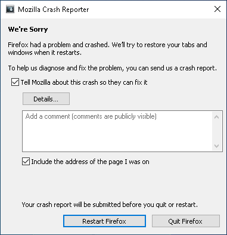
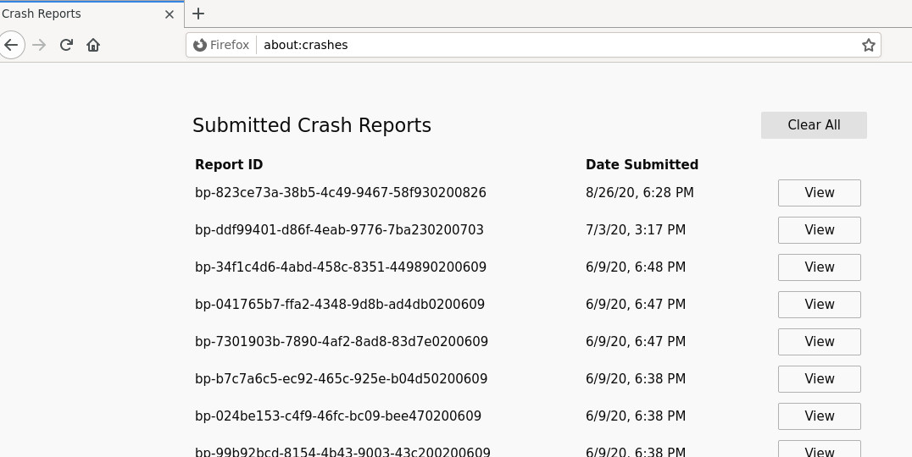

How to get a stacktrace for a bug report
========================================

If you file a bug report in Bugzilla about a crash you should include a
stacktrace (call stack) in your report. A stacktrace will tell Mozilla
developers what crashed and provide a starting point for investigating
its cause. This article describes how to use the Mozilla Crash Reporter
(Breakpad) to get a crash ID, which our engineers can use to get a
stacktrace, and alternative ways to get a stacktrace if you can't get a
crash ID.

Requirements
------------

You need a binary build of Firefox from
`Mozilla.org <https://www.mozilla.org/firefox/>`__. SeaMonkey and
Thunderbird also support crash reporting.

Mozilla's crash report server currently only has debug information for
Mozilla builds and thus the crash reporter cannot work if you use a
build from a Linux distribution or if you compile from source code. In
these cases you will need to use one of the :ref:`alternative
methods <Alternative ways to get a stacktrace>` listed below.

.. note::

   **Note:** When filing a crash report, it is important to know whether
   the crash occurs with `Firefox safe
   mode <http://support.mozilla.com/kb/Safe+Mode>`__. This helps
   engineers determine whether a particular
   `extension <http://support.mozilla.com/kb/Troubleshooting+extensions+and+themes>`__
   or
   `plugin <http://support.mozilla.com/kb/Troubleshooting+plugins>`__
   is the cause of the crash.

How to get a crash ID with the Mozilla Crash Reporter
-----------------------------------------------------

1 - Crash and submit a report to the system.

The Mozilla Crash Reporter window should automatically come up after Firefox crashes.
If you have any additional information about the crash, such as additional detail on
what you were doing at the time that may have triggered the crash, please enter it
into the comments box. Be sure that you **check the "Tell Mozilla about this crash"**
checkbox and click the restart button. The crash reporter should now submit the
crash report and Firefox should open again.

.. note::

   The "Details" button gives additional data about the incident,
   however this is not useful in a bug report.

2 - Tell us the ID of the report you submitted.

To access all of your submitted reports type "about:crashes" into the Firefox address bar
and press enter. Firefox should open a list of IDs for your submitted crash reports.
Copy two or three of the IDs for the appropriate crashes and paste them into your
Bugzilla report. Please check the listed times to avoid copying the ID of an unrelated
crash report.

.. note::

   You can prefix a "bp-" to the beginning of an ID to make Bugzilla turn it
   into a link: bp-a70759c6-1295-4160-aa30-bc4772090918

How to get the crash ID if Firefox crashes on startup
~~~~~~~~~~~~~~~~~~~~~~~~~~~~~~~~~~~~~~~~~~~~~~~~~~~~~

If Firefox crashes on startup you can still access your submitted crash
reports. Crash reports are accessible from all Firefox profiles, so if a
`new
profile <https://support.mozilla.org/kb/profile-manager-create-remove-switch-firefox-profiles>`__
does not crash you can use it to access them through "about:crashes" as above.

Accessing crash report IDs outside of Firefox
^^^^^^^^^^^^^^^^^^^^^^^^^^^^^^^^^^^^^^^^^^^^^

If you cannot load Firefox at all you can find the crash report files at
this location depending on your operating system:

* Windows : ``%APPDATA%\Mozilla\Firefox\Crash Reports\submitted\``
* macOS : ``~/Library/Application Support/Firefox/Crash Reports/submitted/``
* Linux : ``~/.mozilla/firefox/Crash Reports/submitted/``

Each file in this folder contains one submitted crash report ID. You can
check the modified or creation time for each file to discern which crash
reports are relevant to your bug report.

.. _Alternative ways to get a stacktrace:

Alternative ways to get a stacktrace
------------------------------------

If the Mozilla crash reporter doesn't come up or isn't available you
will need to obtain a stacktrace manually:

Windows
~~~~~~~

See the article :ref:`Create a stacktrace with Windbg <How to get a stacktrace with WinDbg>` for information
on how to do this.

For a full process dump, see :ref:`How to get a process dump with Windows
Task Manager`.

macOS
~~~~~

Run /Applications/Utilities/Console.app.  Expand "~/Library/Logs" and
"CrashReporter", then look for logs for "firefox-bin".

Linux
~~~~~

Note that for most distros, the package you need to get symbols for will
be something like "xulrunner", not "firefox".

Crash reports files on your computer
------------------------------------

When Breakpad initially catches a crash it first writes crash report
files (e.g. .dump and .extra files) into the 'pending' subdirectory of
its 'Crash Reports' directory.

If Breakpad successfully sends the crash report to the reporting server
then, by default, the files added to the 'pending' subdirectory for the
crash are removed, and a .txt file is placed in the 'submitted'
directory containing the crash ID created by the reporting server.

If you want Breakpad to leave the .dump and .extra files on your
computer so that you can examine them locally, then set the
MOZ_CRASHREPORTER_NO_DELETE_DUMP environment variable to 1.

-  Ubuntu:  `Instructions from the Ubuntu
   Team <https://wiki.ubuntu.com/MozillaTeam/Bugs#Obtain%20a%20backtrace%20from%20an%20apport%20crash%20report%20(using%20gdb)>`__
-  openSUSE:  `General instructions from
   openSUSE <https://en.opensuse.org/openSUSE:Bugreport_application_crashed>`__
-  Fedora: `Capturing Stack
   Traces <https://fedoraproject.org/wiki/StackTraces>`__
-  Gentoo: `Debugging using
   GDB <https://wiki.gentoo.org/wiki/Debugging_with_GDB>`__
