Visual Studio Code
==================

.. toctree::
   :maxdepth: 1
   :glob:

General Knowledge
-----------------

`VSCode <https://code.visualstudio.com/>`__ is a multi-platform open-source programming editor developed by Microsoft and volunteers.
It has support for many programming languages using extensions.
This is the recommended editor for Firefox development.

For more general information on the VSCode project see the `repository <https://github.com/Microsoft/vscode/>`__.

Recommended extensions
----------------------

VS Code provides number of extensions for JavaScript, Rust, etc. By default,
Firefox source tree comes with its own set of recommendations of Visual Studio
Code extensions. They will be offered when you first open the project.

If you need to refer to them later, the extensions are listed in
`.vscode/extensions.json <https://searchfox.org/mozilla-central/source/.vscode/extensions.json>`__.

For Rust development, the `rust-analyzer <https://marketplace.visualstudio.com/items?itemName=matklad.rust-analyzer>`__ extension is recommended.
`See the manual <https://rust-analyzer.github.io/manual.html>`__ for more information.

Getting setup
-------------

Close `VS Code` if it is already open, then build the configuration for `VS Code`
by simply running from the terminal:

.. code::

   ./mach ide vscode

This will automatically set some of the recommended preferences for the workspace,
and if you are set up for a full build, it will enable clangd and rust integrations.

If successful, `VS Code` will open at the end. You do not need to run this command
every time to open `VS Code`, you may open it in the normal way.

If you are running full builds, the command above will set up the `Clangd`
integration so that subsequent invocations of ``./mach build`` run and update the
integration.

.. note::

   If `VS Code` is already open with a previous configuration generated, please make sure to
   restart `VS Code` otherwise the new configuration will not be used, and the `compile_commands.json`
   needed by `clangd` server will not be refreshed. This is a known `bug <https://github.com/clangd/vscode-clangd/issues/42>`__
   in `clangd-vscode` extension

Ignore Files in Mercurial Repositories
~~~~~~~~~~~~~~~~~~~~~~~~~~~~~~~~~~~~~~

.. note::

   This is automatically done when running ``./mach ide vscode`` but may be
   changed manually.

When using Mercurial in mozilla-central, VS Code will treat your build directories as ordinary directories by default, causing some undesirable behavior including long indexing times, Go to Definition will open files in the build directory instead of the source tree, and Search Files by Name will find duplicate files from the source tree and the build directory (note: when using Git, VS Code will not do this since it reads ``.gitignore``). You can follow these directions to have VS Code largely ignore your build directories:

#. Go to Preferences -> Settings
#. Search "exclude" in the Settings
#. (optional) Select "Workspace" below the search bar to only change this setting for the mozilla-central repository
#. Under "Files: Exclude", click "Add Pattern", type ``obj-*`` (assuming your build directory names start with the default text, ``obj-``), and click "OK"
#. Repeat the step above for the "Files: Watcher Exclude" setting
#. Reload VS Code: the easiest way to do this is to quit and reopen it.

Despite excluding the build directories above, Go to Definition will still correctly open files that only appear in the build directory such as generated source code.

Recommended Preferences
~~~~~~~~~~~~~~~~~~~~~~~

.. note::

   These are automatically set when running ``./mach ide vscode`` but may be
   changed manually. These are set only for particular file types.

* ``"editor.formatOnSave": true``
    * This will turn on automatically fixing formatting issues when you save a file.
* ``"editor.defaultFormatter": "esbenp.prettier-vscode"``
   * This sets the default formatter to prettier using the recommended prettier
     extension.

``*.jsm`` and ``*.sjs`` file extensions should also be associated with JavaScript:

.. code::

   "files.associations": {
      "*.jsm": "javascript",
      "*.sjs": "javascript",
   },

C/C++ Features and Support
--------------------------

For C++ support we offer an out of the box configuration based on
`clangd <https://clangd.llvm.org>`__.

Leveraging the `clang` toolchain compiler we now have support in the IDE for the following features:

**1.** Syntax highlighting

**2.** IntelliSense with comprehensive code completion and suggestion

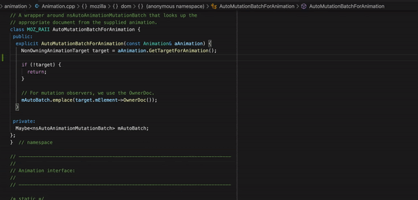

**3.** Go-to definition and Go-to declaration

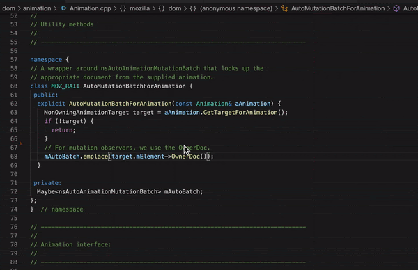

**4.** Find all references

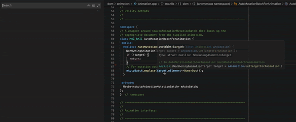

**5.** Open type hierarchy

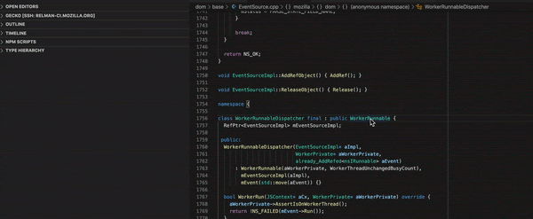

**6.** Rename symbol, all usages of the symbol will be renamed, including declaration, definition and references

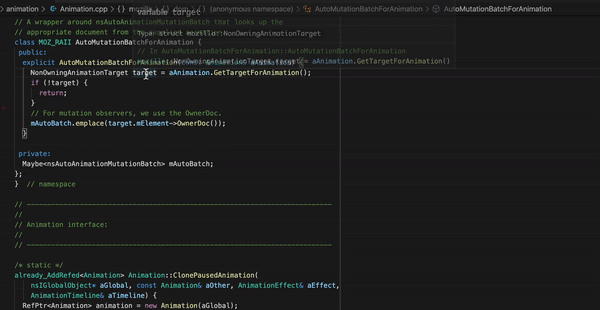

**7.** Code formatting, based on `clang-format` that respects our coding standard using the `.clang-format` and `.clang-format-ignore` files. Format can be performed on an entire file or on a code selection

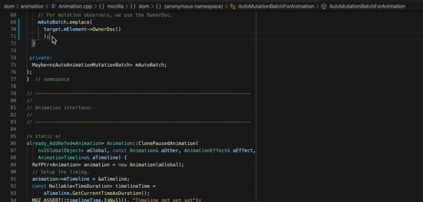

**8.** Inline parsing errors with limited auto-fix hints

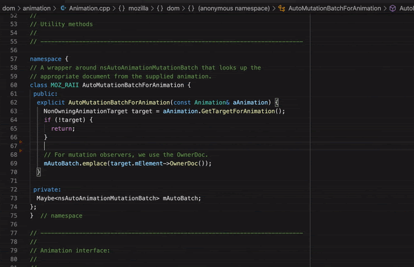

**9.** Basic static-code analysis using `clang-tidy` and our list of enabled checkers. (This is still in progress not all checkers are supported by `clangd`)

Clangd-specific Commands
------------------------

Clangd supports some commands that are specific to C/C++:

.. code::

    "clangd.switchheadersource"

This command navigates from the currently open header file to its corresponding source file (if there is one), or vice versa.

This command can be invoked from the command menu (activated via ``F1``), or using its keybinding of ``Alt+o`` (``Alt+cmd+o`` on Mac). The keybinding can also be customized in ``Keyboard Shortcuts``.

Remote Development over SSH
---------------------------

VS Code provides an `extension <https://marketplace.visualstudio.com/items?itemName=ms-vscode-remote.remote-ssh>`__ that lets you use any remote machine with a SSH server as your development environment. No matter if it's Linux based, macOS or Windows, as long as the target machine offers a SSH connection, it can be used for development.

No source code needs to be on your local machine to use VS Code remotely since the extension runs commands and other extensions directly on the remote machine.

In order to setup a connection please follow these steps:

**1.** Open VS Code and select from the left side panel ``Remote Explorer``

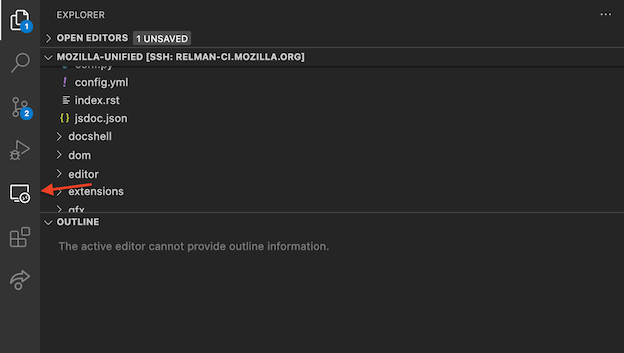

**2.** From the ``Remote Explorer`` panel select ``SSH Targets`` and click on ``Add`` and enter the connection details

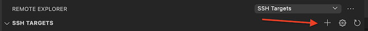

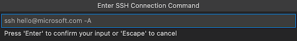

**3.** Click on the connection that you just configured at the previous step

**4.** Finally you should be connected to the desired remote SSH server

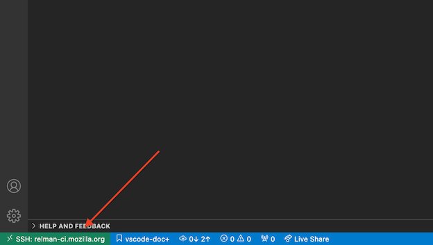

Please note that during the first connection VS Code will install itself remotely and also install all of the needed dependencies.

Filing Bugs
-----------

Bugs should be filed in the `Firefox Build System` product under `Developer Environment Integration`, preferably blocking `Bug 1662709 <https://bugzilla.mozilla.org/show_bug.cgi?id=1662709>`__.
