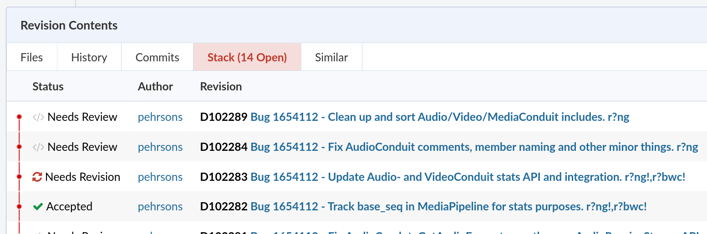

Working with stack of patches Quick Reference
=============================================

Working on Firefox, we strongly recommend working with stack of patches.
Patches should be small and could be landed in the order used to push them.
This also helps to breakdown the work for different reviewers.

As it can be complex for newcomers, this documentation explains the
various commands.

In Phabricator, the stack can be seen in the `Revision Contents` section.
The top of the stack (most recent change) is first in the list.

This is also sometimes called "stack of revisions", "stack of commits" or "series of commits".

**Example:**

For the overall quick reference guide, see the :ref:`Firefox Contributors Quick Reference <Firefox Contributors' Quick Reference>`

Visualize the stack
-------------------

.. code-block:: shell

    # Mercurial
    $ hg wip

    # Git
    $ git log

Merge two patches
-----------------

It can happen that, instead of updating a patch, a new revision is
created on Phabricator. For this, merge the patches locally:

.. code-block:: shell

    # Mercurial
    # Mark the patch to be merged with "roll" (key: "r")
    # or "fold" (key: "f")
    $ hg histedit

    # Git
    # Replace "pick" by "squash" or "fixup"
    $ git rebase -i

Then, push to Phabricator and abandon the old change.

Submitting the first patch on the stack
---------------------------------------

There are times when you are working on multiple patches and
just want to submit the first one. For this, you can use:

.. code-block:: shell

    $ moz-phab submit .

Reorder the stack
-----------------

Sometimes, we want to change the order the patches in the stack.
Fortunately, VCS support this easily.

.. code-block:: shell

    # Mercurial
    # Just change the order of the patches. The tool should highlight
    # potential risks of conflicts.
    # Note that ctrl+c works well if used.
    $ hg histedit

    # Git
    # In the editor, just move the patches to the line below/above to
    # reorder commits.
    # Remove everything if you want to cancel the operation.
    $ git rebase -i

Make a change on a patch at the beginning of the stack
------------------------------------------------------

In some cases, the reviewer is asking for a change at the bottom of the stack (ie not at the top).
So, a simple `hg/git commit --amend` would not work.

In such case, the following approach can be used:

.. code-block:: shell

    # Mercurial
    # hg will try to guess in which an unambiguous prior commit
    $ hg absorb

    # if this doesn't work, create a temporary commit
    # and merge it using "fold" or "roll"
    $ hg histedit

    # Git
    $ git commit --fixup <hash of the commit>

Removing patches in the stack
-----------------------------

To remove a patch in the stack:

.. code-block:: shell

    # Mercurial
    # select "drop" (letter "d")
    $ hg histedit

    # Git
    # Replace "pick" by "drop"
    # Or simply remove the line for this commit
    $ git rebase -i

Rebasing the stack
------------------

As the codebase moves fast, it can be necessary to pull changes from
mozilla-central before landing the changes.

.. code-block:: shell

    # Mercurial
    # First, see where your patches are in the stack
    $ hg wip
    # Then, rebase it:
    # If you are a beginner, don't hesitate to add "--dry-run"
    $ hg pull
    $ hg rebase -b . -d central

    # Git
    $ git remote update
    $ git rebase mozilla/central

Reorganizing the stack in Phabricator
-------------------------------------

.. code-block:: shell

    $ moz-phab reorg [start_rev] [end_rev]

allows you to reorganize the stack in Phabricator.

If you've changed the local stack by adding, removing or moving the commits around, you need to change the parent/child relation of the revisions in Phabricator.

.. code-block:: shell

    $ moz-phab reorg

command will compare the stack, display what will be changed and ask for permission before taking any action.

.. note::

    Note that reviewbot will not restart the analysis.
