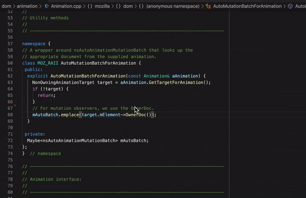
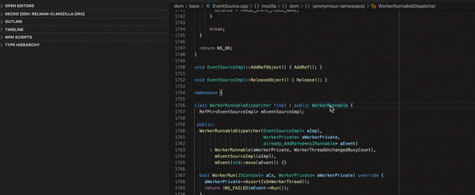
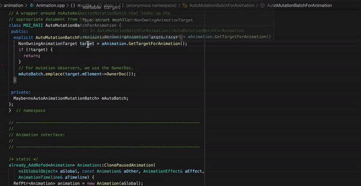
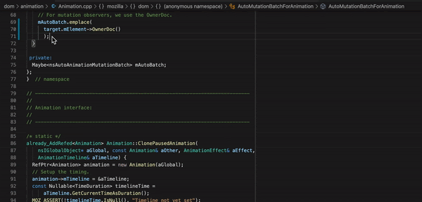
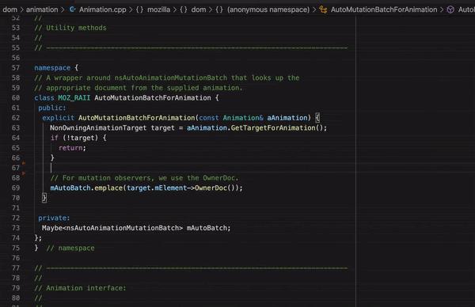

Visual Studio Code
==================

General Knowledge
~~~~~~~~~~~~~~~~~

`VSCode <https://code.visualstudio.com/>`__ is a multi-platform open-source programming editor developed by Microsoft and volunteers.
It has support for many programming languages using extensions.

For more general information on the VSCode project see `repo <https://github.com/Microsoft/vscode/>`__.

C/C++ Features and Support
~~~~~~~~~~~~~~~~~~~~~~~~~~

For C++ support we offer an out of the box configuration based on
`clangd <https://clangd.llvm.org>`__.

Leveraging the `clang` toolchain compiler we now have support in the IDE for the following features:

**1.** Syntax highlighting

**2.** IntelliSense with comprehensive code completion and suggestion

.. image:: img/auto_completion.gif

**3.** Go-to definition and Go-to declaration

**4.** Find all references

.. image:: img/find_references.gif

**5.** Open type hierarchy

**6.** Rename symbol, all usages of the symbol will be renamed, including declaration, definition and references

**7.** Code formatting, based on `clang-format` that respects our coding standard using the `.clang-format` and `.clang-format-ignore` files. Format can be performed on an entire file or on a code selection

**8.** Inline parsing errors with limited auto-fix hints

**9.** Basic static-code analysis using `clang-tidy` and our list of enabled checkers. (This is still in progress not all checkers are supported by `clangd`)

Clangd-specific Commands
~~~~~~~~~~~~~~~~~~~~~~~~

Clangd supports some commands that are specific to C/C++:

.. code::

    "clangd.switchheadersource"

This command navigates from the currently open header file to its corresponding source file (if there is one), or vice versa.

This command can be invoked from the command menu (activated via ``F1``), or using its keybinding of ``Alt+o`` (``Alt+cmd+o`` on Mac). The keybinding can also be customized in ``Keyboard Shortcuts``.

Generating Configuration
~~~~~~~~~~~~~~~~~~~~~~~~

In order to build the configuration for `VS Code` simply run from
the terminal:

.. code::

   ./mach ide vscode

If `VS Code` is already open with a previous configuration generated, please make sure to
restart `VS Code` otherwise the new configuration will not be used, and the `compile_commands.json`
needed by `clangd` server will not be refreshed. This is a known `bug <https://github.com/clangd/vscode-clangd/issues/42>`__
in `clangd-vscode` extension

Useful preferences
~~~~~~~~~~~~~~~~~~

When setting the preference

.. code::

  "editor.formatOnSave": true

you might find that this isn't working on large source code files, but triggering formatting manually works. This is due to the default timeout for formatOnSave, which is quite short (750ms). You might want to increase this timeout, e.g.

.. code::

   "editor.formatOnSaveTimeout": 5000

Recommended extensions
~~~~~~~~~~~~~~~~~~~~~~

VS Code provides number of extensions for JavaScript, Rust, etc.
By default, Firefox source tree comes with its own set of recommendations of Visual Studio Code extensions. They are listed in `.vscode/extensions.json <https://searchfox.org/mozilla-central/source/.vscode/extensions.json>`__.

For Rust development, the `rust-analyzer <https://marketplace.visualstudio.com/items?itemName=matklad.rust-analyzer>`__ extension is recommended.
`See the manual <https://rust-analyzer.github.io/manual.html>`__ for more information.

Filing Bugs
~~~~~~~~~~~

Bugs should be filed in the `Firefox Build System` product under `Developer Environment Integration`, preferably blocking `Bug 1662709 <https://bugzilla.mozilla.org/show_bug.cgi?id=1662709>`__.
