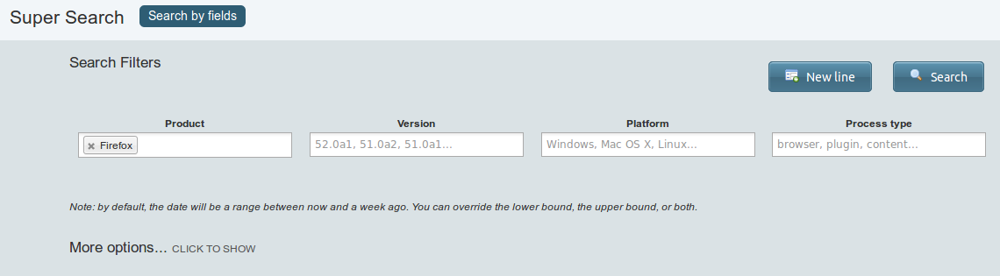
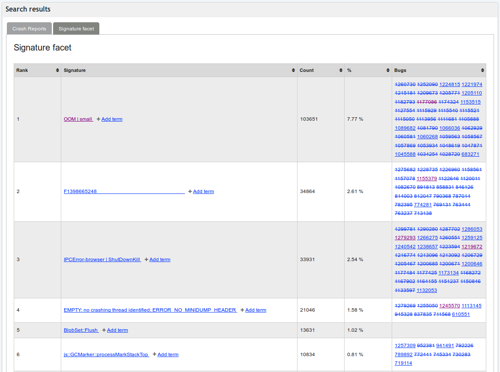
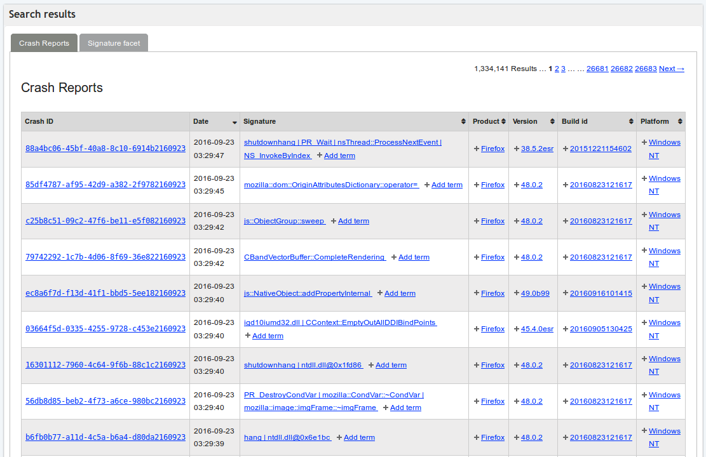
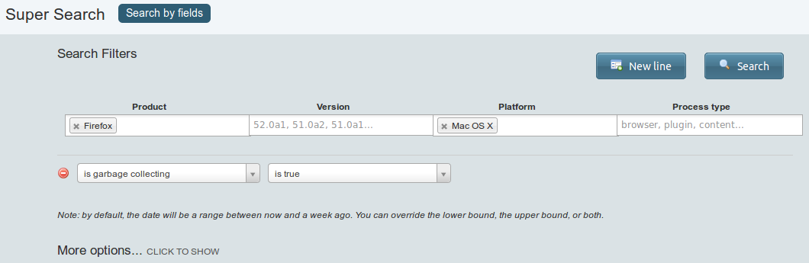
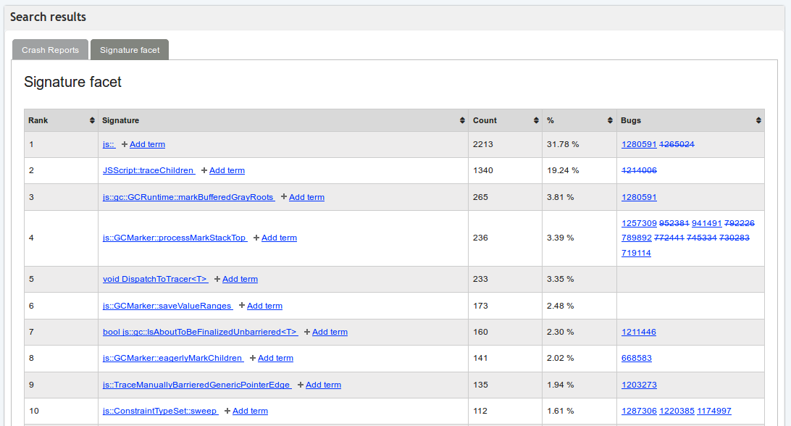
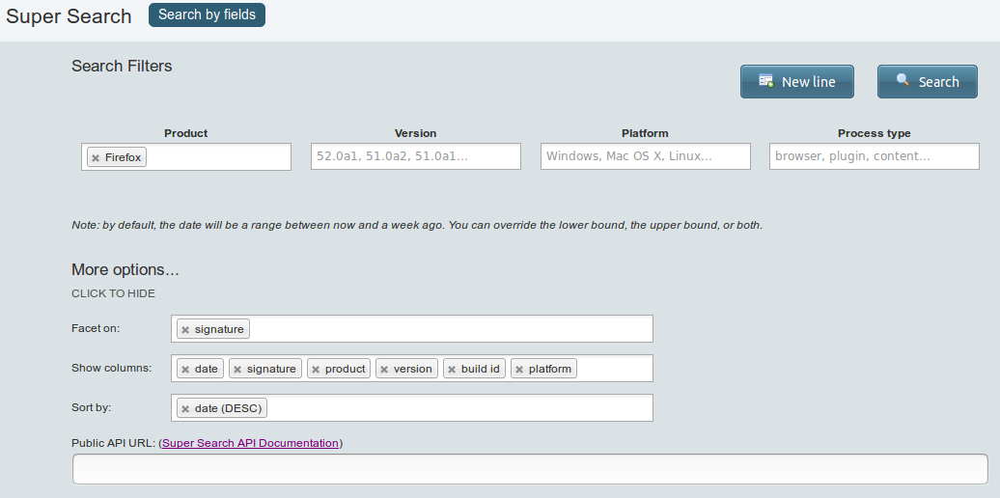
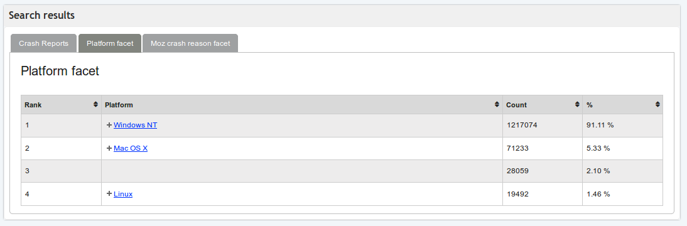
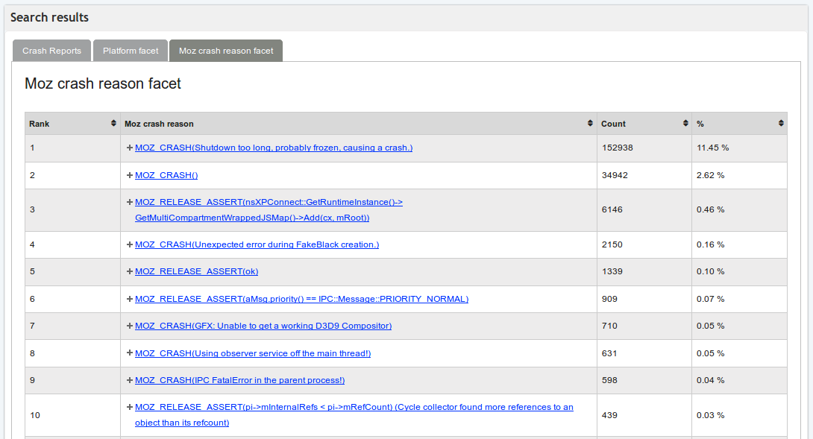
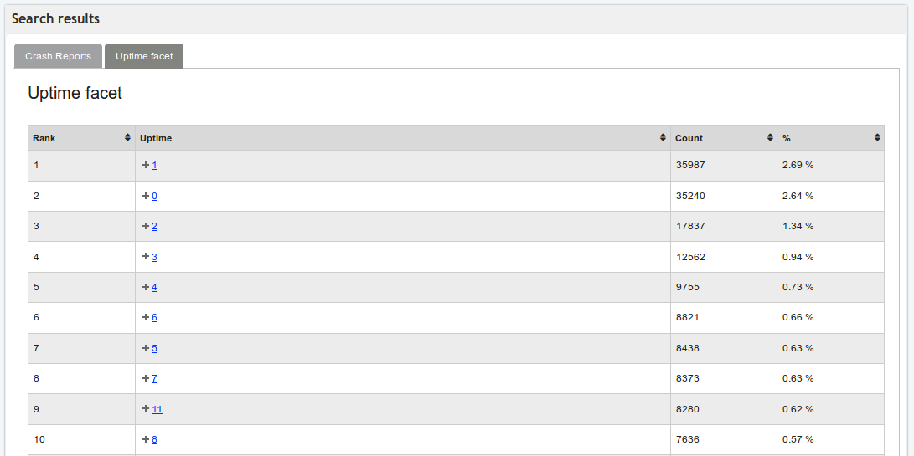

A guide to searching crash reports
==================================

.. note::

   Please read the :ref:`documentation about individual crash
   reports <Understanding crash reports>` before reading
   this page.

The Mozilla `crash-stats <https://crash-stats.mozilla.org/>`__ site
provides facilities for investigating large numbers of Firefox `crash
reports <Understanding crash reports>`__. This guide to
searching through crash reports may help you locate the crash reports
that will help you find and fix the Firefox bug you're working on.

Specifically, crash-stats offers two basic functions:

Searching
   You can search the crash reports database by over 100 criteria: crash
   signature, date, platform, product, version, etc.
Grouping
   You can cluster the results of each search into groups using the same
   criteria.

To achieve full power and flexibility requires a good understanding of
both of these functions. Search is easy to understand, but the grouping
capabilities are easy to overlook.

Searching
---------

The search form
~~~~~~~~~~~~~~~

You can get to the `search
page <https://crash-stats.mozilla.org/search/?product=Firefox&_dont_run=1>`__
by clicking on the "Super Search" link near the toolbar at the top right
of any page in crash-stats. This brings up a search form like the one in
the following screenshot.

|Search in crash-stats|

Fields are provided for four common search criteria: product, version,
platform, and process type. The product field is pre-populated with
"Firefox" because that is a common case. As the fine print says, the
default date range is the past week.

The default search: Signature facet
~~~~~~~~~~~~~~~~~~~~~~~~~~~~~~~~~~~

If you click on the "Search" button, you will get
`results <https://crash-stats.mozilla.org/search/?product=Firefox&_sort=-date&_facets=signature&_columns=date&_columns=signature&_columns=product&_columns=version&_columns=build_id&_columns=platform#facet-signature>`__
like the ones in the following screenshot.

|Results of a default search in crash-stats|

By default, the "Signature facet" tab is selected. ("Facet" is a term
that means "group".) In these results, the found crash reports are
grouped according to crash signature and ranked by group size. The
columns show each group's rank, signature, size (both a count and a
proportion of matching crash reports), and finally a list of bugs that
have been marked as relating to this signature.

The numbers are large because this search matched all Firefox crash
reports from the past seven days. The first group has over 100,000 crash
reports, which accounts for 7.77% of all matching crashes. This
indicates there are over 1.3 million crash reports matching this search.

You can reorder the groups in various ways by clicking on the column
headers. The links within the results do the following things.

-  The first link in each "Signature" column cell links to a signature
   report, which contains additional details about crash reports with
   that signature.
-  The "Add term" link in each "Signature" column cell lets you perform
   a narrower subsequent search among crash reports with that signature.
-  The links in each "Bugs" column cell link to bug reports in Bugzilla.

The default search: Crash reports
~~~~~~~~~~~~~~~~~~~~~~~~~~~~~~~~~

If you switch to the "Crash Reports" tab you will see
`results <https://crash-stats.mozilla.org/search/?product=Firefox&_sort=-date&_facets=signature&_columns=date&_columns=signature&_columns=product&_columns=version&_columns=build_id&_columns=platform#crash-reports>`__
like the ones in the following screenshot.

|Results of a default search in crash-stats (crash reports tab)|

This is a list of all the individual crash reports that match the search
criteria. If the number of matches is large -- in this case it exceeds
1.3 million, just as we saw in the "Signature facet" tab -- the results
will be spread across multiple pages, which you can visit by clicking
the links at the top right of the tab.

The links within the results do the following things.

-  The link in each "Crash ID" column cell links to an individual crash
   report.
-  The links in each "Signature" column cell have the same effect that
   they did in the "Signature facet" tab.
-  The links in the remaining column cells also let you perform a
   narrower subsequent search with that link's value added to the search
   criteria.

A narrower search
~~~~~~~~~~~~~~~~~

You can add criteria to perform a narrower search. For example, to
perform a search for all Mac crash reports that occurred while
JavaScript garbage collection was running, do the following.

-  Add "Mac OS X" to the "Platform" field.
-  Select "New line", and then choose a field ("is garbage collecting")
   and an operator ("is true"). The operators available for each field
   depends on its type.

With these criteria added the search form looks like the following
screenshot.

|crash-stats Super Search form with additional criteria|

After clicking on "Search" we get
`results <https://crash-stats.mozilla.org/search/?is_garbage_collecting=__true__&product=Firefox&platform=Mac%20OS%20X&_sort=-date&_facets=signature&_columns=date&_columns=signature&_columns=product&_columns=version&_columns=build_id&_columns=platform>`__
like those in the following screenshot.

|Results of a narrower search in crash-stats|

The number of crash reports matching this search is in the thousands,
i.e. much smaller than the previous search.

Proto signature
~~~~~~~~~~~~~~~

The "proto signature" field is just the raw unprocessed crash stack
concatenated together.

You can do things like:

-  Search for crashes where the signature is Foo, and the proto
   signature contains Bar. This is helpful if you have a fairly generic
   signature and you want to see how many of them are a particular case
   of it that you've come across. Or instead of a signature Foo, a moz
   crash reason or something else.
-  Use it as a facet. This lets you skim the full signatures of crashes
   at a glance, bucketed together a bit. Note that because the proto
   signature includes the entire signature, things aren't grouped all
   that well.

Grouping
--------

In the previous section we saw one example of grouping, in the
"Signature facet" tab that is shown by default. But there are many other
interesting ways to group searches.

Facets in the search form
~~~~~~~~~~~~~~~~~~~~~~~~~

To do a search with non-signature grouping first click on the "More
options..." text, which reveals the additional fields shown in the
following screenshot.

|crash-stats Super Search form with different facets|

(The "Show columns" and "Sort by" fields are straightforward. They apply
to the "Crash reports" tab of any search results, and are not related to
grouping.)

The "Facet on" field is the one that controls grouping. By default, it
contains the value "signature", which explains why we saw a "Signature
facet" tab in the earlier search results. But we can change the values
in this field and get different facet tabs in the search results.

Grouping by platform
~~~~~~~~~~~~~~~~~~~~

For example, if we start with a default search for all Firefox crashes
in the past week, but then replace the "signature" facet with "platform"
and "moz crash reason", we get search results with two facet tabs. The
first of these is a "Platform facet" tab, with
`results <https://crash-stats.mozilla.org/search/?product=Firefox&_sort=-date&_facets=platform&_facets=moz_crash_reason&_columns=date&_columns=signature&_columns=product&_columns=version&_columns=build_id&_columns=platform#facet-platform>`__
like those shown in the following screenshot.

|Results of a faceted search in crash-stats|

This has the same columns as the "Signature facet" tab we saw earlier,
except for the "Bugs" column, because that is a special column that only
applies to the signature facet. This tab shows the distribution of crash
reports across the various platforms. Crash reports always include a
platform field (though it may be empty if something has gone wrong) and
so the percentages add up to 100.

Grouping by "moz crash reason"
~~~~~~~~~~~~~~~~~~~~~~~~~~~~~~

The second facet tab is a "Moz crash reason facet" tab, with
`results <https://crash-stats.mozilla.org/search/?product=Firefox&_sort=-date&_facets=platform&_facets=moz_crash_reason&_columns=date&_columns=signature&_columns=product&_columns=version&_columns=build_id&_columns=platform#facet-moz_crash_reason>`__
like those shown in the following screenshot.

|Results of a faceted search in crash-stats (moz crash reason tab)|

This immediately shows which ``MOZ_CRASH`` calls are being hit
frequently by users. Only a subset of crash reports have the "moz crash
reason" field -- those that crashed due to hitting a ``MOZ_CRASH`` call
-- so all crashes that lack that field are omitted from this tab. For
that reason, the percentages do not add up to 100.

An example of less useful grouping
~~~~~~~~~~~~~~~~~~~~~~~~~~~~~~~~~~

The usefulness of grouping varies from field to field. In particular,
fields that can have many possible values (such as numeric fields) often
don't group well. For example, if we do a default search grouped by
uptime we get
`results <https://crash-stats.mozilla.org/search/?product=Firefox&_sort=-date&_facets=uptime&_columns=date&_columns=signature&_columns=product&_columns=version&_columns=build_id&_columns=platform#facet-uptime>`__
like those in the following screenshot.

|Results of a faceted search in crash-stats (uptime)|

In this example the top 10 groups account for less than 12% of all
crashes, and there is an extremely long tail. These results would be
improved by using numeric ranges instead of individual values, but
unfortunately that isn't supported.

Advanced Usage
--------------

The combination of searching and grouping is powerful. Searches find
crash reports that match particular criteria, and grouping organizes
those crash reports into interesting groups.

When a search is performed, the page's URL is updated to include the
search parameters. This means that the results of any search can be
easily shared by copying and pasting the page's URL.

To become an expert at searching and grouping requires understanding the
full range of the 100+ fields available for searching and grouping. One
way to learn about them is to read lots of individual crash reports;
note that all fields shown in the Details tab of an individual crash
report have a tool-tip that indicates its key for search. Alternatively,
you can browse the `complete
list <https://crash-stats.mozilla.org/documentation/supersearch/api/#section-filters>`__.

There is also an API through which searches can be performed
programmatically. See the `API
documentation <https://crash-stats.mozilla.org/documentation/supersearch/>`__
for full details; note that it uses the term "aggregation" for
grouping/faceting.

