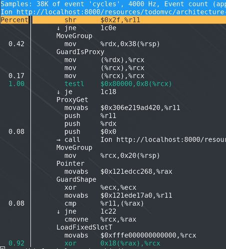
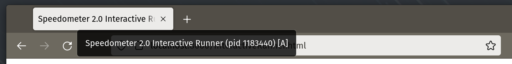

# JIT Profiling with perf

perf is a performance profiling tool available on Linux that is capable of measuring performance events such as cycles, instructions executed, cache misses, etc and providing assembly and source code annotation.
It is possible to collect performance profiles of the SpiderMonkey JIT using perf on Linux and also annotate the generated assembly with the IR opcodes that were used during compilation as shown below.



## Build setup

To enable JIT profiling with perf jitdump, you must build Firefox or the JS shell with the following flag:

```
ac_add_options --enable-perf
```

## Environment Variables

Environment variables that must be defined for perf JIT profiling:

`PERF_SPEW_DIR`: Location of jitdump output files.  Making this directory a tmpfs filesystem could help reduce overhead.\
`IONPERF`: Valid options include: `func`, `src`, `ir`, `ir-ops`.

`IONPERF=func` will disable all annotation and only function names will be available. It is the fastest option.\
`IONPERF=ir` will enable IR annotation.\
`IONPERF=ir-ops` will enable IR annotation with operand support.  **Requires --enable-jitspew** and adds additional overhead to "ir".\
`IONPERF=src` will enable source code annotation **only if** perf can read the source file locally.  Only really works well in the JS shell.

## Profiling the JS shell

Profiling the JS shell requires the following commands but is very straight forward.

Begin by removing any pre-existing jitdump files:

`rm -rf output` or `rm -f jitted-*.so jit.data perf.data jit-*.dump jitdump-*.txt`

Next define environment variables:
```
export IONPERF=ir
export PERF_SPEW_DIR=output
```

Run your test case with perf attached:
```
perf record -g -k 1 /home/denis/src/mozilla-central/obj-js/dist/bin/js test.js
```

Inject the jitdump files into your perf.data file:
```
perf inject -j -i perf.data -o jit.data
```

View the profile:
```
perf report --no-children --call-graph=graph,0 -i jit.data
```

All of the above commands can be put into a single shell script.

## Profiling the Browser

Profiling the browser is less straight forward than the shell, but the only main difference is that perf must attach to the content process while it is running.

Begin by removing any pre-existing jitdump files:

`rm -rf output` or `rm -f jitted-*.so jit.data perf.data jit-*.dump jitdump-*.txt`

Next define environment variables:
```
export IONPERF=ir
export PERF_SPEW_DIR=output
export MOZ_DISABLE_CONTENT_SANDBOX=1
```

Run the Firefox browser
```
~/mozilla-central/obj-opt64/dist/bin/firefox -no-remote -profile ~/mozilla-central/obj-opt64/tmp/profile-default &
```

Navigate to the test case, but do not start it yet.  Then hover over the tab to get the content process PID.



Attach perf to begin profiling:
```
perf record -g -k 1 -p <pid>
```

Close the browser when finished benchmarking.

Inject the jitdump files into your perf.data file:
```
perf inject -j -i perf.data -o jit.data
```

View the profile (--call-graph=graph,0 shows all call stacks instead of the default threshold of >= 0.5%):
```
perf report --no-children --call-graph=graph,0 -i jit.data
```

## Additional Information

Some Linux distributions offer a "libc6-prof" package that includes frame pointers.  This can help resolve symbols and call stacks that involve libc calls.

On Ubuntu, you can install this with:
```
sudo apt-get install libc6-prof
```

libc6-prof can be used with `LD_LIBRARY_PATH=/lib/libc6-prof/x86_64-linux-gnu`

It may also be useful to have access to kernel addresses during profiling. These can be exposed with:
```
sudo sh -c "echo 0 > /proc/sys/kernel/kptr_restrict"
```

The max stack depth is 127 by default. This is often too few. It can be increased with:
```
sudo sh -c "echo 4000 > /proc/sys/kernel/perf_event_max_stack"
```
