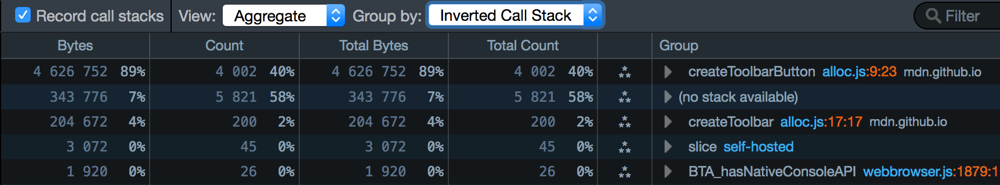

# Aggregate view

Before Firefox 48, this was the default view of a heap snapshot. After
Firefox 48, the default view is the [Tree map
view](tree_map_view.md), and you can switch to the
Aggregate view using the dropdown labeled \"View:\":

The Aggregate view looks something like this:

It presents a breakdown of the heap\'s contents, as a table. There are
three main ways to group the data:

-   Type
-   Call Stack
-   Inverted Call Stack

You can switch between them using the dropdown menu labeled \"Group
by:\" located at the top of the panel:

There\'s also a box labeled \"Filter\" at the top-right of the pane. You
can use this to filter the contents of the snapshot that are displayed,
so you can quickly see, for example, how many objects of a specific
class were allocated.

## Type

This is the default view, which looks something like this:

It groups the things on the heap into types, including:

-   **JavaScript objects:** such as `Function` or `Array`
-   **DOM elements:** such as `HTMLSpanElement` or `Window`
-   **Strings:** listed as `"strings"`
-   **JavaScript sources:** listed as \"`JSScript"`
-   **Internal objects:** such as \"`js::Shape`\". These are prefixed
    with `"js::"`.

Each type gets a row in the table, and rows are ordered by the amount of
memory occupied by objects of that type. For example, in the screenshot
above you can see that JavaScript `Object`s account for most memory,
followed by strings.

-   The \"Total Count\" column shows you the number of objects of each
    category that are currently allocated.
-   The \"Total Bytes\" column shows you the number of bytes occupied by
    objects in each category, and that number as a percentage of the
    whole heap size for that tab.

The screenshots in this section are taken from a snapshot of the
[monster example page](monster_example.md).

For example, in the screenshot above, you can see that:

-   there are four `Array` objects
-   that account for 15% of the total heap.

Next to the type\'s name, there\'s an icon that contains three stars
arranged in a triangle:

Click this to see every instance of that type. For example, the entry
for `Array` tells us that there are four `Array` objects in the
snapshot. If we click the star-triangle, we\'ll see all four `Array`
instances:

For each instance, you can see the [retained size and shallow
size](dominators.html#shallow_and_retained_size) of
that instance. In this case, you can see that the first three arrays
have a fairly large shallow size (5% of the total heap usage) and a much
larger retained size (26% of the total).

On the right-hand side is a pane that just says \"Select an item to view
its retaining paths\". If you select an item, you\'ll see the [Retaining
paths
panel](/dominators_view.html#retaining_paths_panel)
for that item:

<iframe width="595" height="325" src="https://www.youtube.com/embed/uLjzrvx_VCg" title="YouTube video player" frameborder="0" allow="accelerometer; autoplay; clipboard-write; encrypted-media; gyroscope; picture-in-picture"></iframe>

## Call Stack

The Call Stack shows you exactly where in your code you are making heap
allocations.

Because tracing allocations has a runtime cost, it must be explicitly
enabled by checking \"Record call stacks\" *before* you allocate the
memory in the snapshot.

You\'ll then see a list of all the functions that allocated objects,
ordered by the size of the allocations they made:

\
The structure of this view is very much like the structure of the [Call
Tree](call_tree.md), only it shows
allocations rather than processor samples. So, for example, the first
entry says that:

-   4,832,592 bytes, comprising 93% of the total heap usage, were
    allocated in a function at line 35 of \"alloc.js\", **or in
    functions called by that function**

We can use the disclosure triangle to drill down the call tree, to find
the exact place your code made those allocations.

It\'s easier to explain this with reference to a simple example. For
this we\'ll use the [DOM allocation
example](DOM_allocation_example.md). This page
runs a script that creates a large number of DOM nodes (200
`HTMLDivElement` objects and 4000 `HTMLSpanElement` objects).

Let\'s get an allocation trace:

1.  open the Memory tool
2.  check \"Record call stacks\"
3.  load
    <https://mdn.github.io/performance-scenarios/dom-allocs/alloc.html>
4.  take a snapshot
5.  select \"View/Aggregate\"
6.  select \"Group by/Call Stack\"

<iframe width="595" height="325" src="https://www.youtube.com/embed/DyLulu9eoKY" title="YouTube video player" frameborder="0" allow="accelerometer; autoplay; clipboard-write; encrypted-media; gyroscope; picture-in-picture"></iframe>

You should see something like this:

This is telling us that 93% of the total heap snapshot was allocated in
functions called from \"alloc.js\", line 35 (our initial
`createToolbars()` call).

We can use the disclosure arrow to expand the tree to find out exactly
where we\'re allocating memory:

This is where the \"Bytes\" and \"Count\" columns are useful: they show
allocation size and number of allocations at that exact point.

So in the example above, we can see that we made 4002 allocations,
accounting for 89% of the total heap, in `createToolbarButton()`, at
[alloc.js line 9, position
23](https://github.com/mdn/performance-scenarios/blob/gh-pages/dom-allocs/scripts/alloc.js#L9):
that is, the exact point where we create the span
elements.

The file name and line number is a link: if we click it, we go directly
to that line in the debugger:

<iframe width="595" height="325" src="https://www.youtube.com/embed/zlnJcr1IFyY" title="YouTube video player" frameborder="0" allow="accelerometer; autoplay; clipboard-write; encrypted-media; gyroscope; picture-in-picture"></iframe>

## Inverted Call Stack

The Call Stack view is top-down: it shows allocations that happen at
that point **or points deeper in the call tree**. So it\'s good for
getting an overview of where your program is memory-hungry. However,
this view means you have to drill a long way down to find the exact
place where the allocations are happening.

The \"Inverted Call Stack\" view helps with that. It gives you the
bottom-up view of the program showing the exact places where allocations
are happening, ranked by the size of allocation at each place. The
disclosure arrow then walks you back up the call tree towards the top
level.

Let\'s see what the example looks like when we select \"Inverted Call
Stack\":

Now at the top we can immediately see the `createToolbarButton()` call
accounting for 89% of the heap usage in our page.

## no stack available 

In the example above you\'ll note that 7% of the heap is marked \"(no
stack available)\". This is because not all heap usage results from your
JavaScript.

For example:

-   any scripts the page loads occupy heap space
-   sometimes an object is allocated when there is no JavaScript on the
    stack. For example, DOM Event objects are allocated
    before the JavaScript is run and event handlers are called.

Many real-world pages will have a much higher \"(no stack available)\"
share than 7%.
