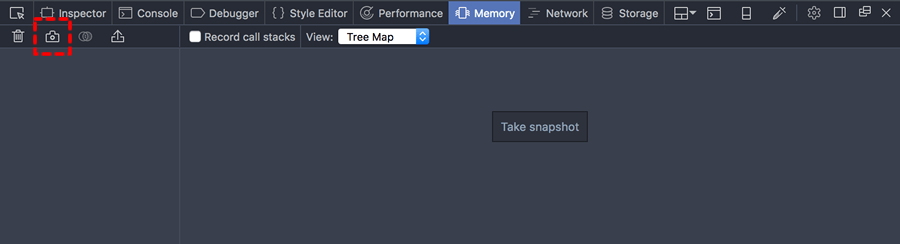
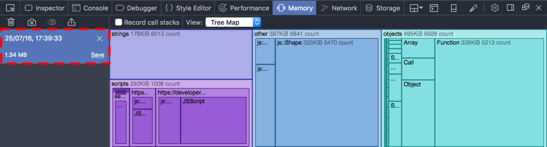
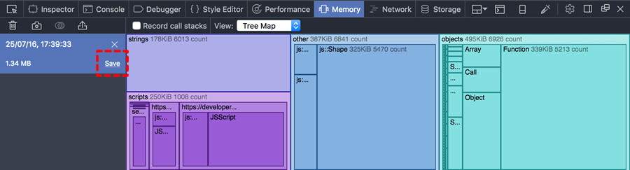

# Basic operations

## Opening the Memory tool

Before Firefox 50, the Memory tool is not enabled by default. To enable
it, open the developer tool settings, and check the "Memory" box under
"Default Firefox Developer Tools":

<iframe width="595" height="325" src="https://www.youtube.com/embed/qi-0CoCOXw" title="YouTube video player" frameborder="0" allow="accelerometer; autoplay; clipboard-write; encrypted-media; gyroscope; picture-in-picture"></iframe>

From Firefox 50 onwards, the Memory tool is enabled by default.

## Taking a heap snapshot 

To take a snapshot of the heap, click the "Take snapshot" button, or
the camera icon on the left:

The snapshot will occupy the large pane on the right-hand side. On the
left, you'll see an entry for the new snapshot, including its
timestamp, size, and controls to save or clear this snapshot:

## Clearing a snapshot

To remove a snapshot, click the "X" icon:

## Saving and loading snapshots

If you close the Memory tool, all unsaved snapshots will be discarded.
To save a snapshot click "Save":

You'll be prompted for a name and location, and the file will be saved
with an `.fxsnapshot` extension.

To load a snapshot from an existing `.fxsnapshot` file, click the import
button, which looks like a rectangle with an arrow rising from it
(before Firefox 49, this button was labeled with the text
"Import\...\"):

You'll be prompted to find a snapshot file on disk.

## Comparing snapshots

Starting in Firefox 45, you can diff two heap snapshots. The diff shows
you where memory was allocated or freed between the two snapshots.

To create a diff, click the button that looks like a Venn diagram next
to the camera icon (before Firefox 47, this looked like a \"+/-\" icon):

You'll be prompted to select the snapshot to use as a baseline, then
the snapshot to compare. The tool then shows you the differences between
the two snapshots:

<iframe width="595" height="325" src="https://www.youtube.com/embed/3Ow-mdK6b2M" title="YouTube video player" frameborder="0" allow="accelerometer; autoplay; clipboard-write; encrypted-media; gyroscope; picture-in-picture"></iframe>

::: {.note}
When you're looking at a comparison, you can't use the Dominators view
or the Tree Map view.
:::

## Recording call stacks

The Memory tool can tell you exactly where in your code you are
allocating memory. However, recording this information has a run-time
cost, so you must ask the tool to record memory calls *before* the
memory is allocated, if you want to see memory call sites in the
snapshot. To do this, check "Record call stacks" (before Firefox 49
this was labeled "Record allocation stacks"):

