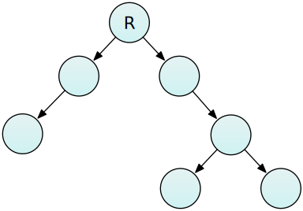
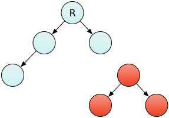
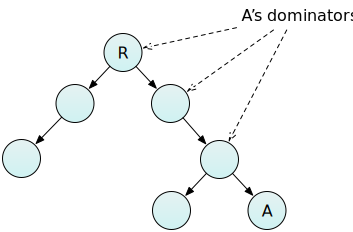
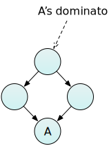

# Dominators 

This article provides an introduction to the concepts of *Reachability*,
*Shallow* versus *Retained* size, and *Dominators*, as they apply in
garbage-collected languages like JavaScript.

These concepts matter in memory analysis, because often an object may
itself be small, but may hold references to other much larger objects,
and by doing this will prevent the garbage collector from freeing that
extra memory.

You can see the dominators in a page using the [Dominators
view](dominators_view.md) in the Memory tool.

With a garbage-collected language, like JavaScript, the programmer
doesn\'t generally have to worry about deallocating memory. They can
just create and use objects, and when the objects are no longer needed,
the runtime takes care of cleaning up, and frees the memory the objects
occupied.

## Reachability

In modern JavaScript implementations, the runtime decides whether an
object is no longer needed based on *reachability*. In this system the
heap is represented as one or more graphs. Each node in the graph
represents an object, and each connection between nodes (edge)
represents a reference from one object to another. The graph starts at a
root node, indicated in these diagrams with \"R\".

During garbage collection, the runtime traverses the graph, starting at
the root, and marks every object it finds. Any objects it doesn\'t find
are unreachable, and can be deallocated.

So when an object becomes unreachable (for example, because it is only
referenced by a single local variable which goes out of scope) then any
objects it references also become unreachable, as long as no other
objects reference them:

Conversely, this means that objects are kept alive as long as some other
reachable object is holding a reference to them.

## Shallow and retained size

This gives rise to a distinction between two ways to look at the size of
an object:

-   *shallow size*: the size of the object itself
-   *retained size*: the size of the object itself, plus the size of
    other objects that are kept alive by this object

Often, objects will have a small shallow size but a much larger retained
size, through the references they contain to other objects. Retained
size is an important concept in analyzing memory usage, because it
answers the question \"if this object ceases to exist, what\'s the total
amount of memory freed?\".

## Dominators

A related concept is that of the *dominator*. Node B is said to dominate
node A if every path from the root to A passes through B:

If any of node A\'s dominators are freed, then node A itself becomes
eligible for garbage collection.

[If node B dominates node A, but does not dominate any of A\'s other
dominators, then B is the *immediate dominator* of
A:]

[One slight subtlety here is that if an object A is referenced by two
other objects B and C, then neither object is its
dominator], because you could remove either B or C from
the graph, and A would still be retained by its other referrer. Instead,
the immediate dominator of A would be its first common ancestor:\

## See also

[Dominators in graph
theory](https://en.wikipedia.org/wiki/Dominator_%28graph_theory%29).

[Tracing garbage
collection](https://en.wikipedia.org/wiki/Tracing_garbage_collection).
