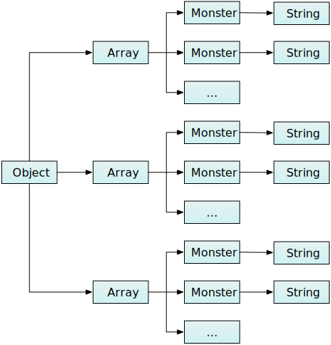

# Monster example slug

This article describes a very simple web page that we'll use to
illustrate some features of the Memory tool.

You can try the site at
<https://mdn.github.io/performance-scenarios/js-allocs/alloc.html>.
Heres the code:

``` {.brush: .js}
var MONSTER_COUNT = 5000;
var MIN_NAME_LENGTH = 2;
var MAX_NAME_LENGTH = 48;

function Monster() {

  function randomInt(min, max) {
      return Math.floor(Math.random() * (max - min + 1)) + min;
    }

  function randomName() {
    var chars = "abcdefghijklmnopqrstuvwxyz";
    var nameLength = randomInt(MIN_NAME_LENGTH, MAX_NAME_LENGTH);
    var name = "";
    for (var j = 0; j &lt; nameLength; j++) {
      name += chars[randomInt(0, chars.length-1)];
    }
    return name;
  }

  this.name = randomName();
  this.eyeCount = randomInt(0, 25);
  this.tentacleCount = randomInt(0, 250);
}

function makeMonsters() {
  var monsters = {
    "friendly": [],
    "fierce": [],
    "undecided": []
  };

  for (var i = 0; i &lt; MONSTER_COUNT; i++) {
    monsters.friendly.push(new Monster());
  }

  for (var i = 0; i &lt; MONSTER_COUNT; i++) {
    monsters.fierce.push(new Monster());
  }

  for (var i = 0; i &lt; MONSTER_COUNT; i++) {
    monsters.undecided.push(new Monster());
  }

  console.log(monsters);
}

var makeMonstersButton = document.getElementById("make-monsters");
makeMonstersButton.addEventListener("click", makeMonsters);
```

The page contains a button: when you push the button, the code creates
some monsters. Specifically:

-   the code creates an object with three properties, each an array:
    -   one for fierce monsters
    -   one for friendly monsters
    -   one for monsters who haven't decided yet.
-   for each array, the code creates and appends 5000
    randomly-initialized monsters. Each monster has:
    -   a string, for the monster's name
    -   a number representing the number of eyes it has
    -   a number representing the number of tentacles it has.

So the structure of the memory allocated on the JavaScript heap is an
object containing three arrays, each containing 5000 objects (monsters),
each object containing a string and two integers:

[]
