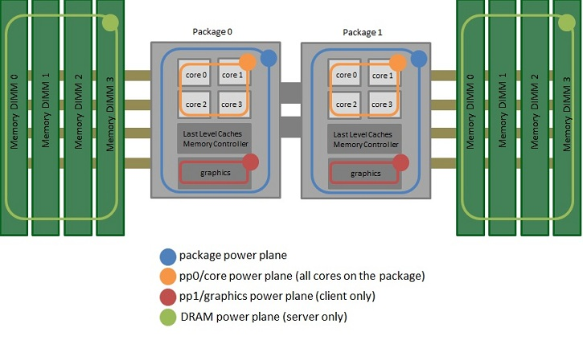

# Power profiling

This article covers important background information about power
profiling, with an emphasis on Intel processors used in desktop and
laptop machines. It serves as a starting point for anybody doing power
profiling for the first time.

## Basic physics concepts

In physics, *[power](https://en.wikipedia.org/wiki/Power_%28physics%29)*
is the rate of doing
*[work](https://en.wikipedia.org/wiki/Work_%28physics%29 "Work (physics)")*.
It is equivalent to an amount of
*[energy](https://en.wikipedia.org/wiki/Energy_%28physics%29 "Energy (physics)"){.mw-redirect}*
consumed per unit time. In SI units, energy is measured in Joules, and
power is measured in Watts, which is equivalent to Joules per second.

Although power is an instantaneous concept, in practice measurements of
it are determined in a non-instantaneous fashion, i.e. by dividing an
energy amount by a non-infinitesimal time period. Strictly speaking,
such a computation gives the *average power* but this is often referred
to as just the *power* when context makes it clear.

In the context of computing, a fully-charged mobile device battery (as
found in a laptop or smartphone) holds a certain amount of energy, and
the speed at which that stored energy is depleted depends on the power
consumption of the mobile device. That in turn depends on the software
running on the device. Web browsers are popular applications and can be
power-intensive, and therefore can significantly affect battery life. As
a result, it is worth optimizing (i.e. reducing) the power consumption
caused by Firefox and Firefox OS.

## Intel processor basics

### Processor layout

The following diagram (from the [Intel Power Governor
documentation)](https://software.intel.com/en-us/articles/intel-power-governor)
shows how machines using recent Intel processors are constructed.

The important points are as follows.

-   The processor has one or more *packages*. These are part of the
    actual processor that you buy from Intel. Client processors (e.g.
    Core i3/i5/i7) have one package. Server processors (e.g. Xeon)
    typically have two or more packages.
-   Each package contains multiple *cores*.
-   Each core typically has
    [hyper-threading](https://en.wikipedia.org/wiki/Hyper-threading),
    which means it contains two logical *CPUs*.
-   The part of the package outside the cores is called the [*uncore* or
    *system agent*](https://en.wikipedia.org/wiki/Uncore)*.* It includes
    various components including the L3 cache, memory controller, and,
    for processors that have one, the integrated GPU.
-   RAM is separate from the processor.

### C-states

Intel processors have aggressive power-saving features. The first is the
ability to switch frequently (thousands of times per second) between
active and idle states, and there are actually several different kinds
of idle states. These different states are called
*[C-states](https://en.wikipedia.org/wiki/Advanced_Configuration_and_Power_Interface#Processor_states).*
C0 is the active/busy state, where instructions are being executed. The
other states have higher numbers and reflect increasing deeper idle
states. The deeper an idle state is, the less power it uses, but the
longer it takes to wake up from.

Note: the [ACPI
standard](https://en.wikipedia.org/wiki/Advanced_Configuration_and_Power_Interface)
specifies four states, C0, C1, C2 and C3. Intel maps these to
processor-specific states such as C0, C1, C2, C6 and C7. and many tools
report C-states using the latter names. The exact relationship is
confusing, and chapter 13 of the [Intel optimization
manual](http://www.intel.com/content/www/us/en/architecture-and-technology/64-ia-32-architectures-optimization-manual.html)
has more details. The important thing is that C0 is always the active
state, and for the idle states a higher number always means less power
consumption.

The other thing to note about C-states is that they apply both to cores
and the entire package --- i.e. if all cores are idle then the entire
package can also become idle, which reduces power consumption even
further.

The fraction of time that a package or core spends in an idle C-state is
called the *C-state residency*. This is a misleading term --- the active
state, C0, is also a C-state --- but one that is nonetheless common.

Intel processors have model-specific registers (MSRs) containing
measurements of how much time is spent in different C-states, and tools
such as [powermetrics](powermetrics.md)
(Mac), powertop and
[turbostat](turbostat.md) (Linux) can
expose this information.

A *wakeup* occurs when a core or package transitions from an idle state
to the active state. This happens when the OS schedules a process to run
due to some kind of event. Common causes of wakeups include scheduled
timers going off and blocked I/O system calls receiving data.
Maintaining C-state residency is crucial to keep power consumption low,
and so reducing wakeup frequency is one of the best ways to reduce power
consumption.

One consequence of the existence of C-states is that observations made
during power profiling --- even more than with other kinds of profiling
--- can disturb what is being observed. For example, the Gecko Profiler
takes samples at 1000Hz using a timer. Each of these samples can trigger
a wakeup, which consumes power and obscures Firefox's natural wakeup
patterns. For this reason, integrating power measurements into the Gecko
Profiler is unlikely to be useful, and other power profiling tools
typically use much lower sampling rates (e.g. 1Hz.)

### P-states

Intel processors also support multiple *P-states*. P0 is the state where
the processor is operating at maximum frequency and voltage, and
higher-numbered P-states operate at a lower frequency and voltage to
reduce power consumption. Processors can have dozens of P-states, but
the transitions are controlled by the hardware and OS and so P-states
are of less interest to application developers than C-states.

## Power and power-related measurements

There are several kinds of power and power-related measurements. Some
are global (whole-system) and some are per-process. The following
sections list them from best to worst.

### Power measurements

The best measurements are measured in joules and/or watts, and are taken
by measuring the actual hardware in some fashion. These are global
(whole-system) measurements that are affected by running programs but
also by other things such as (for laptops) how bright the monitor
backlight is.

-   Devices such as ammeters give the best results, but these can be
    expensive and difficult to set up.
-   A cruder technique that works with mobile machines and devices is to
    run a program for a long time and simply time how long it takes for
    the battery to drain. The long measurement times required are a
    disadvantage, though.

### Power estimates

The next best measurements come from recent (Sandy Bridge and later)
Intel processors that implement the *RAPL* (Running Average Power Limit)
interface that provides MSRs containing energy consumption estimates for
up to four *power planes* or *domains* of a machine, as seen in the
diagram above.

-   PKG: The entire package.
    -   PP0: The cores.
    -   PP1: An uncore device, usually the GPU (not available on all
        processor models.)
-   DRAM: main memory (not available on all processor models.)

The following relationship holds: PP0 + PP1 \<= PKG. DRAM is independent
of the other three domains.

These values are computed using a power model that uses
processor-internal counts as inputs, and they have been
[verified](http://www.computer.org/csdl/proceedings/ispass/2013/5776/00/06557170.pdf)
as being fairly accurate. They are also updated frequently, at
approximately 1,000 Hz, though the variability in their update latency
means that they are probably only accurate at lower frequencies, e.g. up
to 20 Hz or so. See section 14.9 of Volume 3 of the [Intel Software
Developer's
Manual](http://www.intel.com/content/www/us/en/processors/architectures-software-developer-manuals.html)
for more details about RAPL.

Tools that can take RAPL readings include the following.

-   `tools/power/rapl`: all planes; Linux and Mac.
-   [Intel Power
    Gadget](intel_power_gadget.md): PKG and
    PP0 planes; Windows, Mac and Linux.
-   [powermetrics](powermetrics.md): PKG
    plane; Mac.
-   [perf](perf.md): all planes; Linux.
-   [turbostat](turbostat.md): PKG, PP0 and
    PP1 planes; Linux.

Of these,
[tools/power/rapl](tools_power_rapl.md) is
generally the easiest and best to use because it reads all power planes,
it's a command line utility, and it doesn't measure anything else.

### Proxy measurements

The next best measurements are proxy measurements, i.e. measurements of
things that affect power consumption such as CPU activity, GPU activity,
wakeup frequency, C-state residency, disk activity, and network
activity. Some of these are measured on a global basis, and some can be
measured on a per-process basis. Some can also be measured via
instrumentation within Firefox itself.

The correlation between each proxy measure and power consumption is hard
to know and can vary greatly. When used carefully, however, they can
still be useful. This is because they can often be measured in a more
fine-grained fashion than power measurements and estimates, which is
vital for gaining insight into how a program can reduce power
consumption.

Most profiling tools provide at least some proxy measurements.

### Hybrid proxy measurements

These are combinations of proxy measurements. The combinations are
semi-arbitrary, they amplify the unreliability of proxy measurements,
and unlike non-hybrid proxy measurements, they don't have a clear
physical meaning. Avoid them.

The most notable example of a hybrid proxy measurement is the ["Energy
Impact" used by OS X's Activity
[Monitor](activity_monitor_and_top.md#What-does-Energy-Impact-measure).

## Ways to user power-related measurements

### Low-context measurements

Most power-related measurements are global or per-process. Such
low-context measurements are typically good for understand *if* power
consumption is good or bad, but in the latter case they often don't
provide much insight into why the problem is occurring, which part of
the code is at fault, or how it can be fixed. Nonetheless, they can
still help improve understanding of a problem by using *differential
profiling*.

-   Compare browsers to see if Firefox is doing better or worse than
    another browser on a particular workload.
-   Compare different versions of Firefox to see if Firefox has improved
    or worsened over time on a particular workload. This can identify
    specific changes that caused regressions, for example.
-   Compare different configurations of Firefox to see if a particular
    feature is affecting things.
-   Compare different workloads. This can be particularly useful if the
    workloads only vary slightly. For example, it can be useful to
    gradually remove elements from a web page and see how the
    power-related measurements change. Even just switching a tab from
    the foreground to the background can make a difference.

### High-context measurements

A few power-related measurements can be obtained in a high-context
fashion, e.g. with stack traces that clearly pinpoint specific parts of
the code as being responsible.

-   Standard performance profiling tools that measure CPU usage or
    proxies of CPU usage (such as instruction counts) typically provide
    high-context measurements. This is useful because high CPU usage
    typically causes high power consumption.
-   Some tools can provide high-context wakeup measurements:
    [dtrace](dtrace.md) (on Mac) and
    [perf](perf.md) (on Linux.)
-   Source-level instrumentation, such as [TimerFirings
    logging](timerfirings_logging.md), can
    identify which timers are firing frequently.

## Power profiling how-to

This section aims to put together all the above information and provide
a set of strategies for finding, diagnosing and fixing cases of high
power consumption.

-   First of all, all measurements are best done on a quiet machine that
    is running little other than the program of interest. Global
    measurements in particular can be completely skewed and unreliable
    if this is not the case.
-   Find or confirm a test case where Firefox's power consumption is
    high. "High" can most easily be gauged by comparing against other
    browsers. Use power measurements or estimates (e.g. via
    [tools/power/rapl](tools_power_rapl.md),
    or `mach power` on Mac, or [Intel Power
    Gadget](intel_power_gadget.md) on
    Windows) for the comparisons. Avoid lower-quality measurements,
    especially Activity Monitor's "Energy Impact".
-   Try using differential profiling to narrow down the cause.
    -   Try turning hardware acceleration on or off; e10s on or off;
        Flash on or off.
    -   Try putting the relevant tab in the foreground vs. in the
        background.
    -   If the problem manifests on a particular website, try saving a
        local copy of the site and then manually removing HTML elements
        to see if a particular page feature is causing the problem
-   Many power problems are caused by either high CPU usage or high
    wakeup frequency. Use one of the low-context tools to determine if
    this is the case (e.g. on Mac use
    [powermetrics](powermetrics.md).) If
    so, follow that up by using a tool that gives high-context
    measurements, which hopefully will identify the cause of the
    problem.
    -   For high CPU usage, many profilers can be used: Firefox's dev
        tools profiler, the Gecko Profiler, or generic performance
        profilers.
    -   For high wakeup counts, use
        [dtrace](dtrace.md) or
        [perf](perf.md) or [TimerFirings logging](timerfirings_logging.md).
-   On Mac workloads that use graphics, Activity Monitor's "Energy"
    tab can tell you if the high-performance GPU is being used, which
    uses more power than the integrated GPU.
-   If neither CPU usage nor wakeup frequency identifies the problem,
    more ingenuity may be needed. Looking at other measurements (C-state
    residency, GPU usage, etc.) may be helpful.
-   Animations are sometimes the cause of high power consumption. The
    [animation
    inspector](/devtools-user/page_inspector/how_to/work_with_animations/index.rst#animation-inspector)
    in the Firefox Devtools can identify them. Alternatively, [here is
    an
    explanation](https://bugzilla.mozilla.org/show_bug.cgi?id=1190721#c10)
    of how one developer diagnosed two animation-related problems the
    hard way (which required genuine platform expertise).
-   The approximate cause of power problems often isn't that hard to
    find. Fixing them is often the hard part. Good luck.
-   If you do fix a problem by improving a proxy measurement, you should
    verify that it also improves a power measurement or estimate. That
    way you know the fix had a genuine effect.

## Further reading

Chapter 13 of the [Intel optimization
manual](http://www.intel.com/content/www/us/en/architecture-and-technology/64-ia-32-architectures-optimization-manual.html)
has many details about optimizing for power consumption. Section 13.5
("Tuning Software for Intelligent Power Consumption") in particular is
worth reading.
