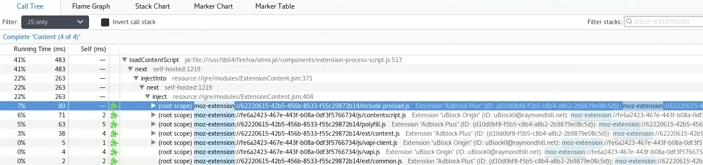

# Reporting a Performance Problem

This article will guide you in reporting a performance problem using the
built-in Gecko Profiler tool.

## Enabling the Profiler toolbar button

These steps only work in Firefox 75+.

1.  Visit [https://profiler.firefox.com/](https://profiler.firefox.com/)
2.  Click on *Enable Profiler Menu Button*
3.  The profiler toolbar button will show up in the top right of the URL
    bar as a small stopwatch icon.

4.  You can right-click on the button and remove it from the toolbar
    when you're done with it.

## Using the Profiler

When enabled, the profiler toolbar button is not recording by default.
Recording can be done by clicking on the toolbar icon to open its panel.
Make sure to choose an appropriate setting for the recording (if you're
not sure, choose Firefox Platform), and then choosing **Start
Recording**. The toolbar icon turns blue when it is recording.

The profiler uses a fixed size buffer to store sample data. When it runs
out of space in its buffer, it discards old entries so you may want to
increase the buffer size if you find you are unable to capture the
profile quickly enough after you notice a performance problem. If you
choose Custom Settings (and then clicking Edit Settings) for the
profiler, you can adjust the size of the buffer (presently defaults to
90 MB) and the time interval between data collection (presently defaults
to 1 ms). Note that increasing the buffer size uses more memory and can
make capturing a profile take longer.

Using the keyboard shortcuts is often more convenient than using the
mouse to interact with the UI:

* Ctrl+Shift+1 - Start/Stop the profiler
* Ctrl+Shift+2 - Take a profile and launch the viewer to view it

## Capturing and sharing a profile

1.  While the profiler is recording, reproduce the performance problem.
    If possible let the problem manifest itself for 5-10 seconds.
2.  Press **Ctrl+Shift+2** or click on the profiler toolbar icon in the
    top right and select **Capture**. Try to do this within a few
    seconds from reproducing the performance problem as only the last
    few seconds are recorded. If the timeline has a large red block
    it's a good sign. 
3.  The data will open in a new tab. Wait until the \"Symbolicating call
    stacks\" notification disappears before sharing the profile.
4.  There will be a button in the top right labeled **Publish** which
    will allow you to upload this profile and once completed will write
    out a link. Before uploading, the publish button asks you what data
    you'd like to publish to our servers.
5.  Note that while it's possible to strip profiles of potentially
    privacy sensitive information, the less information a profile
    contains, *the harder it is to analyze and turn into actionable
    data.*
6.  Once uploaded, copy permalink URL to your clipboard by right
    clicking and [add the profile URL to a bug](https://bugzilla.mozilla.org/enter_bug.cgi?product=Core&component=Performance)
    for your performance problem and/or send it to the appropriate
    person. Try to give some context about what you were doing when the
    performance problem arose such as the URL you were viewing and what
    actions were you doing (ex. scrolling on gmail.com). 

## Viewing addon performance in GeckoView

Sometimes an addon or more are slowing down Firefox. These addons might
be using the extension API in ways that were not meant to. You can see
which of these addons are causing problems by adding the
**moz-extension** filter.

Make sure you are selecting the process that is using up the CPU since
all of the processes are shown. You might have a content process using
up the CPU and not the main one.

Make sure you are doing whatever it is that slows down Firefox while
recording the profile. For example you might have one addon that slows down page load
and another one that slows down tab switch.

Your first reflex once you find what addon is slowing down the profile
might be to disable it and search for alternatives. Before you do this,
please share the performance profile with the addon authors through a
bug report. Gecko profiler allows you to share a link with the profile.
