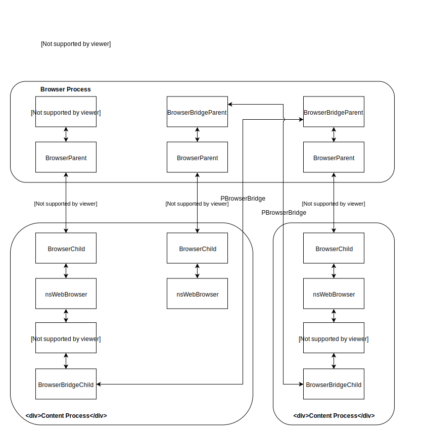

Fission
=======

Fission is a cross-functional project for revamping and strengthening the architecture of the Firefox browser.

The work is tracked under this bug (https://bugzilla.mozilla.org/show_bug.cgi?id=fission). See this Wiki page for more details (https://wiki.mozilla.org/Project_Fission).

We don't have an all-encompassing design document at this time. This may change in the future.

IPC Diagram
-----------

