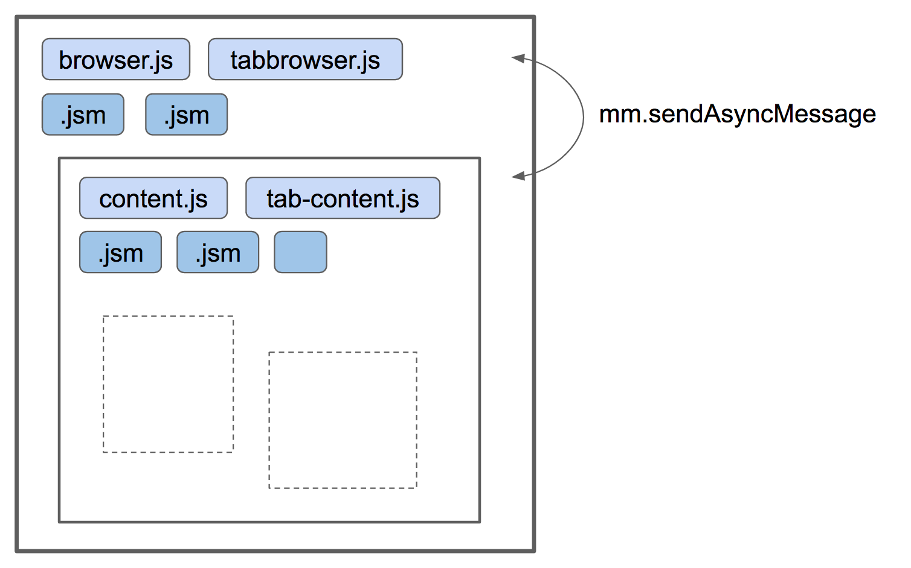
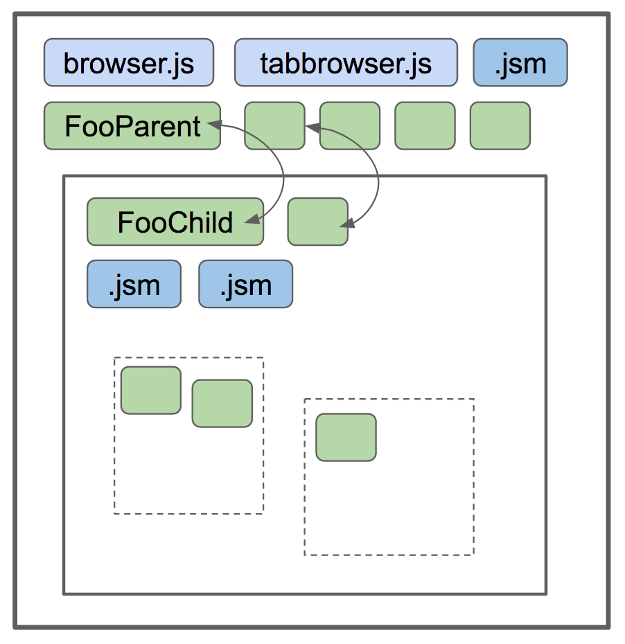

JSActors
========

In the Fission world, the preferred method of communication between between things-that-may-live-in-a-different-process are JSActors.

At the time of this writing, Fission offers the following JSActors:

- `JSProcessActor`, to communicate between a child process and its parent;
- `JSWindowActor`, to communicate between a frame and its parent.

JSProcessActor
---------------

What are JSProcessActors?
~~~~~~~~~~~~~~~~~~~~~~~~~

A JSProcess pair (see below) is the preferred method of communication between a child process and its parent process.

In the Fission world, JSProcessActors are the replacement for e10s-era *process scripts*.

The life of a JSProcessActor pair
~~~~~~~~~~~~~~~~~~~~~~~~~~~~~~~~~

JSProcessActors always exist by pair:

- one instance of `JSProcessActorChild`, which lives in the child process – for instance, `MyActorChild`;
- one instance of `JSProcessActorParent`, which lives in the parent process – for instance, `MyActorParent`.

The pair is instantiated lazily, upon the first call to `getActor("MyActor")` (see below). Note that if a
parent process has several children, the parent process will typically host several instances of `MyActorParent`
whereas the children will each host a single instance of `MyActorChild`.

JSProcessActor primitives allow sending and receiving messages *within the pair*. As of this writing,
JSProcessActor does not offer primitives for broadcasting, enumerating, etc.

The pair dies when the child process dies.

About actor names
``````````````````

Note that the names
`MyActorChild` and `MyActorParent` are meaningful – suffixes `Child` and `Parent` are how `getActor(...)` finds
the correct classes to load within the JS code.


JSWindowActor
---------------

What are JSWindowActors?
~~~~~~~~~~~~~~~~~~~~~~~~~

A JSWindowActor pair (see below) is the preferred method of communication between a frame and its parent, regardless of whether the frame
and parent live in the same process or in distinct processes.

In the Fission world, JSWindowActors are the replacement for *framescripts*. Framescripts were how we structured code to be aware of the parent (UI) and child (content) separation, including establishing the communication channel between the two (via the Frame Message Manager).

However, the framescripts had no way to establish further process separation downwards (that is, for out-of-process iframes). JSWindowActors will be the replacement.

How are they structured?
~~~~~~~~~~~~~~~~~~~~~~~~~~

A review of the pre-Fission Message Manager mechanism
`````````````````````````````````````````````````````

.. note::
   There are actually several types of Message Managers: Frame Message Managers, Window Message Managers, Group Message Managers and Process Message Managers. For the purposes of this documentation, it's simplest to refer to all of these mechanisms altogether as the "Message Manager mechanism". Most of the examples in this document will be operating on the assumption that the Message Manager is a Frame Message Manager, which is the most commonly used one.

Currently, in the post `Electrolysis Project`_ Firefox codebase, we have code living in the parent process (UI) that is in plain JS (.js files) or in JS modules (.jsm files). In the child process (hosting the content), we use framescripts (.js) and also JS modules. The framescripts are instantiated once per top-level frame (or, in simpler terms, once per tab). This code has access to all of the DOM from the web content, including all iframes within it.

The two processes communicate via the Frame Message Manager (mm) using the ``sendAsyncMessage`` / ``receiveMessage`` API, and any code in the parent can communicate with any code in the child (and vice versa), by just listening to the messages of interest.

The Frame Message Manager communication mechanism follows a publish / subscribe pattern similar to how Events work in Firefox:

1. Something exposes a mechanism for subscribing to notifications (``addMessageListener`` for the Frame Message Manager, ``addEventListener`` for Events).
2. The subscriber is responsible for unsubscribing when there's no longer interest in the notifications (``removeMessageListener`` for the Frame Message Manager, ``removeEventListener`` for Events).
3. Any number of subscribers can be attached at any one time.



How JSWindowActors differ from the Frame Message Manager
``````````````````````````````````````````````````````````

For Fission, the JSWindowActors replacing framescripts will be structured in pairs. A pair of JSWindowActors will be instantiated lazily: one in the parent and one in the child process, and a direct channel of communication between the two will be established. The JSWindowActor in the parent must extend the global ``JSWindowActorParent`` class, and the JSWindowActor in the child must extend the global ``JSWindowActorChild`` class.

The JSWindowActor mechanism is similar to how `IPC Actors`_ work in the native layer of Firefox:

#. Every Actor has one counterpart in another process that they can communicate directly with.
#. Every Actor inherits a common communications API from a parent class.
#. Every Actor has a name that ends in either ``Parent`` or ``Child``.
#. There is no built-in mechanism for subscribing to messages. When one JSWindowActor sends a message, the counterpart JSWindowActor on the other side will receive it without needing to explicitly listen for it.

Other notable differences between JSWindowActor's and Message Manager / framescripts:

#. Each JSWindowActor pair is associated with a particular frame. For example, given the following DOM hierarchy::

     <browser src="https://www.example.com">
       <iframe src="https://www.a.com" />
       <iframe src="https://www.b.com" />

   A ``JSWindowActorParent`` / ``JSWindowActorChild`` pair instantiated for either of the ``iframe``'s would only be sending messages to and from that ``iframe``.

#. There's only one pair per actor type, per frame.

   For example, suppose we have a ``ContextMenu`` actor. The parent process can have up to N instances of the ``ContextMenuParent`` actor, where N is the number of frames that are currently loaded. For any individual frame though, there's only ever one `ContextMenuChild` associated with that frame.

#. We can no longer assume full, synchronous access to the frame tree, even in content processes.

   This is a natural consequence of splitting frames to run out-of-process.

#. ``JSWindowActorChild``'s live as long as the ``WindowGlobalChild`` they're associated with.

  If in the previously mentioned DOM hierarchy, one of the ``<iframe>``'s unload, any associated JSWindowActor pairs will be torn down.

.. hint::
   JSWindowActors are "managed" by the WindowGlobal IPC Actors, and are implemented as JS classes (subclasses of ``JSWindowActorParent`` and ``JSWindowActorChild``) instantiated when requested for any particular window. Like the Frame Message Manager, they are ultimately using IPC Actors to communicate under the hood.



.. note::
    Like the Message Manager, JSWindowActors are implemented for both in-process and out-of-process frame communication. This means that porting to JSWindowActors can be done immediately without waiting for out-of-process iframes to be enabled.


Communication with actors
-------------------------

Sending messages
~~~~~~~~~~~~~~~~

The ``JSActor`` base class exposes two methods for sending messages. Both methods are asynchronous.
There **is no way to send messages synchronously** with ``JSActor``.


``sendAsyncMessage``
````````````````````

    sendAsyncMessage("SomeMessage", value[, transferables]);

The ``value`` is anything that can be serialized using the structured clone algorithm. Additionally, a ``nsIPrincipal`` can be sent without having to manually serialize and deserialize it.

The ``transferables`` argument is an optional array of `Transferable`_ objects. Note that transferable objects like ``ArrayBuffers`` are not transferable across process and their contents will just be copied into the serialized data. However, ``transferables`` are still useful for objects like ``MessageChannel`` ports, as these can be transferred across process boundaries.

.. note::
    Cross Process Object Wrappers (CPOWs) cannot be sent over JSWindowActors.


``sendQuery``
`````````````

    Promise<any> sendQuery("SomeMessage", value);


``sendQuery`` improves upon ``sendAsyncMessage`` by returning a ``Promise``. The receiver of the message must then return a ``Promise`` that can eventually resolve into a value - at which time the ``sendQuery`` ``Promise`` resolves with that value.

The ``sendQuery`` method arguments follow the same conventions as ``sendAsyncMessage``, with the second argument being a structured clone.

Receiving messages
~~~~~~~~~~~~~~~~~~

``receiveMessage``
``````````````````

To receive messages, you need to implement

    receiveMessage(value)

The method receives a single argument, which is the de-serialized arguments that were sent via either ``sendAsyncMessage`` or ``sendQuery``.

.. note::
    If `receiveMessage` is responding to a `sendQuery`, it MUST return a ``Promise`` for that message.

.. hint::
    Using ``sendQuery``, and the ``receiveMessage`` is able to return a value right away? Try using ``Promise.resolve(value);`` to return ``value``, or you could also make your ``receiveMessage`` method an async function, presuming none of the other messages it handles need to get a non-Promise return value.

Other methods that can be overridden
~~~~~~~~~~~~~~~~~~~~~~~~~~~~~~~~~~~~

``constructor()``

If there's something you need to do as soon as the ``JSActor`` is instantiated, the ``constructor`` function is a great place to do that.

.. note::
    At this point the infrastructure for sending messages is not ready yet and objects such as ``manager`` or ``browsingContext`` are not available.

``observe(subject, topic, data)``
`````````````````````````````````

If you register your Actor to listen for ``nsIObserver`` notifications, implement an ``observe`` method with the above signature to handle the notification.

``handleEvent(event)``
``````````````````````

If you register your Actor to listen for content events, implement a ``handleEvent`` method with the above signature to handle the event.

.. note::
    Only JSWindowActors can register to listen for content events.

``actorCreated``
````````````````

This method is called immediately *after* a child actor is created and initialized. Unlike the actor's constructor, it is possible to do things like access the actor's content window and send messages from this callback.

``didDestroy``
``````````````

This is another point to clean-up an Actor before it is destroyed, but at this point, no communication is possible with the other side.

.. note::
    This method cannot be async.

.. note::
    As a `JSProcessActorChild` is destroyed when its process dies, a `JSProcessActorChild` will never receive this call.

Other things exposed on a JSWindowActorParent
~~~~~~~~~~~~~~~~~~~~~~~~~~~~~~~~~~~~~~~~~~~~~

``CanonicalBrowsingContext``
````````````````````````````

Getter: ``this.browsingcontext``.

``WindowGlobalParent``
``````````````````````

TODO

Other things exposed on a JSWindowActorChild
~~~~~~~~~~~~~~~~~~~~~~~~~~~~~~~~~~~~~~~~~~~~

``BrowsingContext``
```````````````````

TODO

``WindowGlobalChild``
`````````````````````

TODO


Helpful getters
```````````````

A number of helpful getters exist on a ``JSWindowActorChild``, including:

``this.document``
^^^^^^^^^^^^^^^^^

The currently loaded document in the frame associated with this ``JSWindowActorChild``.

``this.contentWindow``
^^^^^^^^^^^^^^^^^^^^^^

The outer window for the frame associated with this ``JSWindowActorChild``.

``this.docShell``
^^^^^^^^^^^^^^^^^

The ``nsIDocShell`` for the frame associated with this ``JSWindowActorChild``.

See `JSWindowActor.webidl`_ for more detail on exactly what is exposed on both ``JSWindowActorParent`` and ``JSWindowActorChild`` implementations.

How to port from message manager and framescripts to JSWindowActors
-------------------------------------------------------------------

.. _fission.message-manager-actors:

Message Manager Actors
~~~~~~~~~~~~~~~~~~~~~~

While the JSWindowActor mechanism was being designed and developed, large sections of our framescripts were converted to an "actor style" pattern to make eventual porting to JSWindowActors easier. These Actors use the Message Manager under the hood, but made it much easier to shrink our framescripts, and also allowed us to gain significant memory savings by having the actors be lazily instantiated.

You can find the list of Message Manager Actors (or "Legacy Actors") in :searchfox:`BrowserGlue.sys.mjs <browser/components/BrowserGlue.sys.mjs>` and :searchfox:`ActorManagerParent.sys.mjs <toolkit/modules/ActorManagerParent.sys.mjs>`, in the ``LEGACY_ACTORS`` lists.

.. note::
  The split in Message Manager Actors defined between ``BrowserGlue`` and ``ActorManagerParent`` is mainly to keep Firefox Desktop specific Actors separate from Actors that can (in theory) be instantiated for non-Desktop browsers (like Fennec and GeckoView-based browsers). Firefox Desktop-specific Actors should be registered in ``BrowserGlue``. Shared "toolkit" Actors should go into ``ActorManagerParent``.

"Porting" these Actors often means doing what is necessary in order to move their registration entries from ``LEGACY_ACTORS`` to the ``JSWINDOWACTORS`` list.

Figuring out the lifetime of a new Actor pair
~~~~~~~~~~~~~~~~~~~~~~~~~~~~~~~~~~~~~~~~~~~~~

In the old model, framescript were loaded and executed as soon as possible by the top-level frame. In the JSWindowActor model, the Actors are much lazier, and only instantiate when:

1. They're instantiated explicitly by calling ``getActor`` on a ``WindowGlobal``, and passing in the name of the Actor.
2. A message is sent to them.
3. A pre-defined ``nsIObserver`` observer notification fires with the subject of the notification corresponding to an inner or outer window.
4. A pre-defined content Event fires.

Making the Actors lazy like this saves on processing time to get a frame ready to load web pages, as well as the overhead of loading the Actor into memory.

When porting a framescript to JSWindowActors, often the first question to ask is: what's the entrypoint? At what point should the Actors instantiate and become active?

For example, when porting the content area context menu for Firefox, it was noted that the ``contextmenu`` event firing in content was a natural event to wait for to instantiate the Actor pair. Once the ``ContextMenuChild`` instantiated, the ``handleEvent`` method was used to inspect the event and prepare a message to be sent to the ``ContextMenuParent``. This example can be found by looking at the patch for the `Context Menu Fission Port`_.

.. _fission.registering-a-new-jswindowactor:

Using ContentDOMReference instead of CPOWs
~~~~~~~~~~~~~~~~~~~~~~~~~~~~~~~~~~~~~~~~~~

Despite being outlawed as a way of synchronously accessing the properties of objects in other processes, CPOWs ended up being useful as a way of passing handles for DOM elements between processes.

CPOW messages, however, cannot be sent over the JSWindowActor communications pipe, so this handy mechanism will no longer work.

Instead, a new module called :searchfox:`ContentDOMReference.sys.mjs <toolkit/modules/ContentDOMReference.sys.mjs>` has been created which supplies the same capability. See that file for documentation.

How to start porting parent-process browser code to use JSWindowActors
~~~~~~~~~~~~~~~~~~~~~~~~~~~~~~~~~~~~~~~~~~~~~~~~~~~~~~~~~~~~~~~~~~~~~~~

The :ref:`fission.message-manager-actors` work made it much easier to migrate away from framescripts towards something that is similar to ``JSWindowActors``. It did not, however, substantially change how the parent process interacted with those framescripts.

So when porting code to work with ``JSWindowActors``, we find that this is often where the time goes - refactoring the parent process browser code to accommodate the new ``JSWindowActor`` model.

Usually, the first thing to do is to find a reasonable name for your actor pair, and get them registered (see :ref:`fission.registering-a-new-jswindowactor`), even if the actors implementations themselves are nothing but unmodified subclasses of ``JSWindowActorParent`` and ``JSWindowActorChild``.

Next, it's often helpful to find and note all of the places where ``sendAsyncMessage`` is being used to send messages through the old message manager interface for the component you're porting, and where any messages listeners are defined.

Let's look at a hypothetical example. Suppose we're porting part of the Page Info dialog, which scans each frame for useful information to display in the dialog. Given a chunk of code like this:

.. code-block:: javascript

    // This is some hypothetical Page Info dialog code.

    let mm = browser.messageManager;
    mm.sendAsyncMessage("PageInfo:getInfoFromAllFrames", { someArgument: 123 });

    // ... and then later on

    mm.addMessageListener("PageInfo:info", async function onmessage(message) {
      // ...
    });

If a ``PageInfo`` pair of ``JSWindowActor``'s is registered, it might be tempting to simply replace the first part with:

.. code-block:: javascript

    let actor = browser.browsingContext.currentWindowGlobal.getActor("PageInfo");
    actor.sendAsyncMessage("PageInfo:getInfoFromAllFrames", { someArgument: 123 });

However, if any of the frames on the page are running in their own process, they're not going to receive that ``PageInfo:getInfoFromAllFrames`` message. Instead, in this case, we should walk the ``BrowsingContext`` tree, and instantiate a ``PageInfo`` actor for each global, and send one message each to get information for each frame. Perhaps something like this:

.. code-block:: javascript

    let contextsToVisit = [browser.browsingContext];
    while (contextsToVisit.length) {
      let currentContext = contextsToVisit.pop();
      let global = currentContext.currentWindowGlobal;

      if (!global) {
        continue;
      }

      let actor = global.getActor("PageInfo");
      actor.sendAsyncMessage("PageInfo:getInfoForFrame", { someArgument: 123 });

      contextsToVisit.push(...currentContext.children);
    }

The original ``"PageInfo:info"`` message listener will need to be updated, too. Any responses from the ``PageInfoChild`` actor will end up being passed to the ``receiveMessage`` method of the ``PageInfoParent`` actor. It will be necessary to pass that information along to the interested party (in this case, the dialog code which is showing the table of interesting Page Info).

It might be necessary to refactor or rearchitect the original senders and consumers of message manager messages in order to accommodate the ``JSWindowActor`` model. Sometimes it's also helpful to have a singleton management object that manages all ``JSWindowActorParent`` instances and does something with their results.

Where to store state
~~~~~~~~~~~~~~~~~~~~

It's not a good idea to store any state within a ``JSWindowActorChild`` that you want to last beyond the lifetime of its ``BrowsingContext``. An out-of-process ``<iframe>`` can be closed at any time, and if it's the only one for a particular content process, that content process will soon be shut down, and any state you may have stored there will go away.

Your best bet for storing state is in the parent process.

.. hint::
    If each individual frame needs state, consider using a ``WeakMap`` in the parent process, mapping ``CanonicalBrowsingContext``'s with that state. That way, if the associates frames ever go away, you don't have to do any cleaning up yourself.

If you have state that you want multiple ``JSWindowActorParent``'s to have access to, consider having a "manager" of those ``JSWindowActorParent``'s inside of the same .jsm file to hold that state.

Registering a new actor
-----------------------

``ChromeUtils`` exposes an API for registering actors, but both ``BrowserGlue`` and ``ActorManagerParent`` are the main entry points where the registration occurs. If you want to register an actor,
you should add it either to ``JSPROCESSACTORS`` or ``JSWINDOWACTORS`` in either of those two files.

In the ``JS*ACTORS`` objects, each key is the name of the actor pair (example: ``ContextMenu``), and the associated value is an ``Object`` of registration parameters.

The full list of registration parameters can be found:

- for JSProcessActor in file `JSProcessActor.webidl`_ as ``WindowActorOptions``, ``ProcessActorSidedOptions`` and ``ProcessActorChildOptions``.
- for JSWindowActor in file `JSWindowActor.webidl`_ as ``WindowActorOptions``, ``WindowActorSidedOptions`` and ``WindowActorChildOptions``.

Here's an example ``JSWindowActor`` registration pulled from ``BrowserGlue.sys.mjs``:

.. code-block:: javascript

   Plugin: {
      kind: "JSWindowActor",
      parent: {
        esModuleURI: "resource:///actors/PluginParent.sys.mjs",
      },
      child: {
        esModuleURI: "resource:///actors/PluginChild.sys.mjs",
        events: {
          PluginCrashed: { capture: true },
        },

        observers: ["decoder-doctor-notification"],
      },

      allFrames: true,
    },

This example is for the JSWindowActor implementation of crash reporting for GMP.

Let's examine parent registration:

.. code-block:: javascript

      parent: {
        esModuleURI: "resource:///actors/PluginParent.sys.mjs",
      },

Here, we're declaring that class ``PluginParent`` (here, a subclass of ``JSWindowActorParent``) is defined and exported from module ``PluginParent.sys.mjs``. That's all we have to say for the parent (main process) side of things.

.. note::
    It's not sufficient to just add a new .jsm file to the actors subdirectories. You also need to update the ``moz.build`` files in the same directory to get the ``resource://`` linkages set up correctly.

Let's look at the second chunk:

.. code-block:: javascript

      child: {
        esModuleURI: "resource:///actors/PluginChild.sys.mjs",
        events: {
          PluginCrashed: { capture: true },
        },

        observers: ["decoder-doctor-notification"],
      },

      allFrames: true,
    },

We're similarly declaring where the ``PluginChild`` subclassing ``JSWindowActorChild`` can be found.

Next, we declare the content events which, when fired in a window, will cause the ``JSWindowActorChild`` to instantiate if it doesn't already exist, and then have ``handleEvent`` called on the ``PluginChild`` instance. For each event name, an Object of event listener options can be passed. You can use the same event listener options as accepted by ``addEventListener``. If an event listener has no useful effect when the actor hasn't been created yet, ``createActor: false`` may also be specified to avoid creating the actor when not needed.

.. note::
  Content events make sense for ``JSWindowActorChild`` (which *have* a content) but are ignored for ``JSProcessActorChild`` (which don't).

Next, we declare that ``PluginChild`` should observe the ``decoder-doctor-notification`` ``nsIObserver`` notification. When that observer notification fires, the ``PluginChild`` actor will be instantiated for the ``BrowsingContext`` corresponding to the inner or outer window that is the subject argument of the observer notification, and the ``observe`` method on that ``PluginChild`` implementation will be called. If you need this functionality to work with other subjects, please file a bug.

.. note::
  Unlike ``JSWindowActorChild`` subclasses, observer topics specified for ``JSProcessActorChild`` subclasses will cause those child actor instances to be created and invoke their ``observe`` method no matter what the subject argument of the observer is.

Finally, we say that the ``PluginChild`` actor should apply to ``allFrames``. This means that the ``PluginChild`` is allowed to be loaded in any subframe. If ``allFrames`` is set to false (the default), the actor will only ever load in the top-level frame.

Design considerations when adding a new actor
~~~~~~~~~~~~~~~~~~~~~~~~~~~~~~~~~~~~~~~~~~~~~

A few things worth bearing in mind when adding your own actor registration:

- Any ``child`` or ``parent`` side you register **must** have a ``moduleURI`` property.
- You do not need to have both ``child`` and ``parent`` modules, and should avoid having actor sides that do nothing but send messages. The process without a defined module will still get an actor, and you can send messages from that side, but cannot receive them via ``receiveMessage``. Note that you **can** also use ``sendQuery`` from this side, enabling you to handle a response from the other process despite not having a ``receiveMessage`` method.
- If you are writing a JSWindowActor, consider whether you really need ``allFrames`` - it'll save memory and CPU time if we don't need to instantiate the actor for subframes.
- When copying/moving "Legacy" :ref:`fission.message-manager-actors`, remove their ``messages`` properties. They are no longer necessary.


Minimal Example Actors
-----------------------

Get a JSWindowActor
~~~~~~~~~~~~~~~~~~~~

**Define an Actor**

.. code-block:: javascript

  // resource://testing-common/TestWindowParent.jsm
  var EXPORTED_SYMBOLS = ["TestWindowParent"];
  class TestParent extends JSWindowActorParent {
    ...
  }

.. code-block:: javascript

  // resource://testing-common/TestWindowChild.jsm
  var EXPORTED_SYMBOLS = ["TestWindowChild"];
  class TestChild extends JSWindowActorChild {
    ...
  }


**Get a JS window actor for a specific window**

.. code-block:: javascript

  // get parent side actor
  let parentActor = this.browser.browsingContext.currentWindowGlobal.getActor("TestWindow");

  // get child side actor
  let childActor = content.windowGlobalChild.getActor("TestWindow");

Get a JSProcessActor
~~~~~~~~~~~~~~~~~~~~

**Define an Actor**

.. code-block:: javascript

  // resource://testing-common/TestProcessParent.jsm
  var EXPORTED_SYMBOLS = ["TestProcessParent"];
  class TestParent extends JSProcessActorParent {
    ...
  }

.. code-block:: javascript

  // resource://testing-common/TestProcessChild.jsm
  var EXPORTED_SYMBOLS = ["TestProcessChild"];
  class TestChild extends JSProcessActorChild {
    ...
  }


**Get a JS process actor for a specific process**

.. code-block:: javascript

  // get parent side actor
  let parentActor = this.browser
    .browsingContext
    .currentWindowGlobal
    .domProcess
    .getActor("TestProcess");

  // get child side actor
  let childActor = ChromeUtils.domProcessChild
    .getActor("TestProcess");

And more
===========


.. _Electrolysis Project: https://wiki.mozilla.org/Electrolysis
.. _IPC Actors: https://developer.mozilla.org/en-US/docs/Mozilla/IPDL/Tutorial
.. _Context Menu Fission Port: https://hg.mozilla.org/mozilla-central/rev/adc60720b7b8
.. _JSProcessActor.webidl: https://searchfox.org/mozilla-central/source/dom/chrome-webidl/JSProcessActor.webidl
.. _JSWindowActor.webidl: https://searchfox.org/mozilla-central/source/dom/chrome-webidl/JSWindowActor.webidl
.. _BrowserElementParent.jsm: https://searchfox.org/mozilla-central/rev/ec806131cb7bcd1c26c254d25cd5ab8a61b2aeb6/toolkit/actors/BrowserElementParent.jsm
.. _Transferable: https://developer.mozilla.org/en-US/docs/Web/API/Web_Workers_API/Transferable_objects
