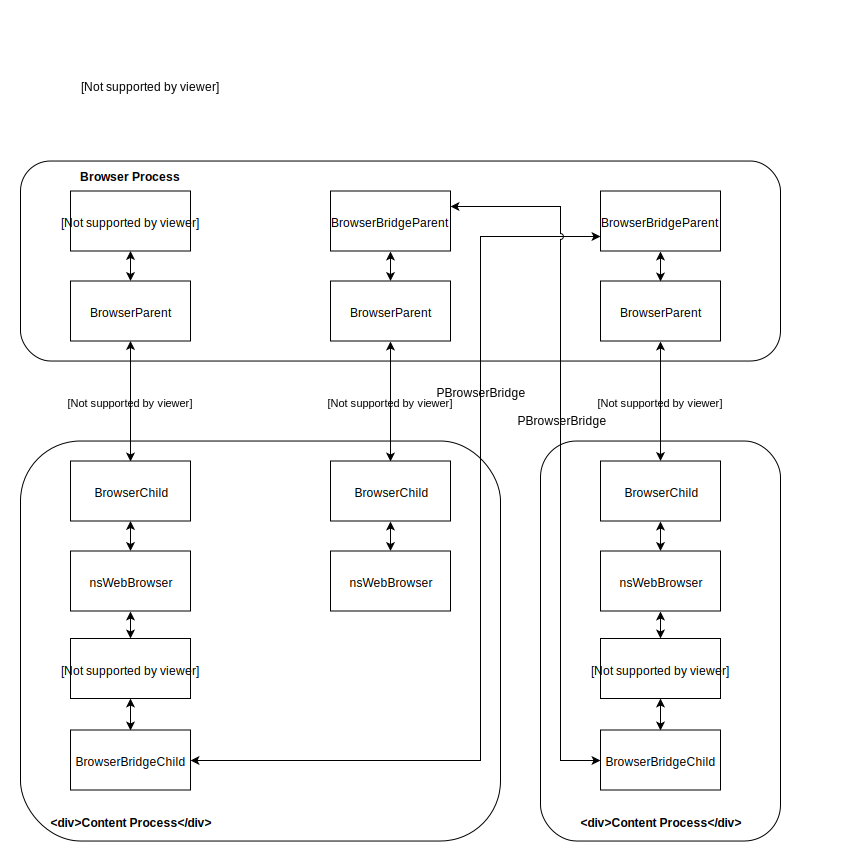

==================
Main Thread Actors
==================

Actors on the main thread between the parent and content processes are
generally managed by ``PContent``, the primary actor for a content process.

TODO

Fission Actor Diagram
=====================

