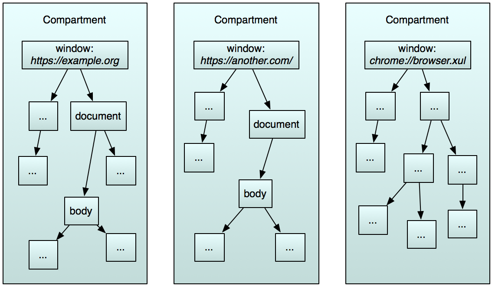
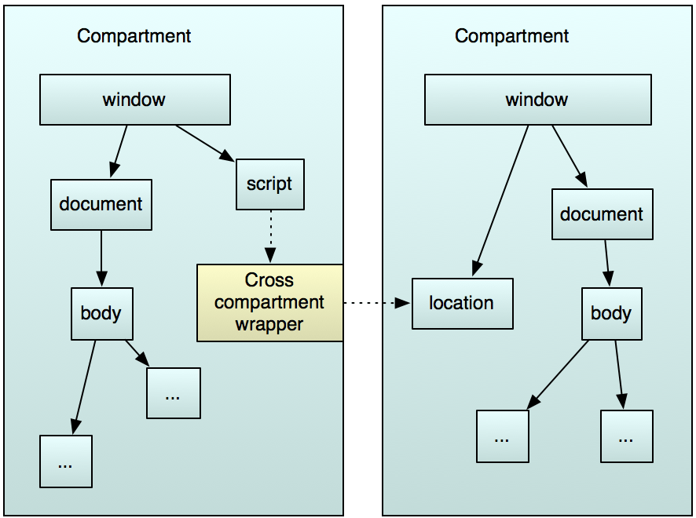
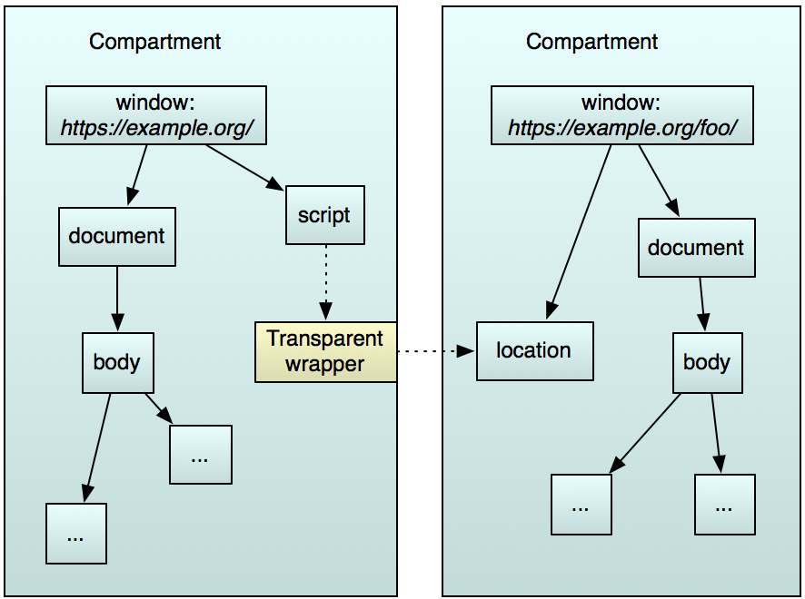
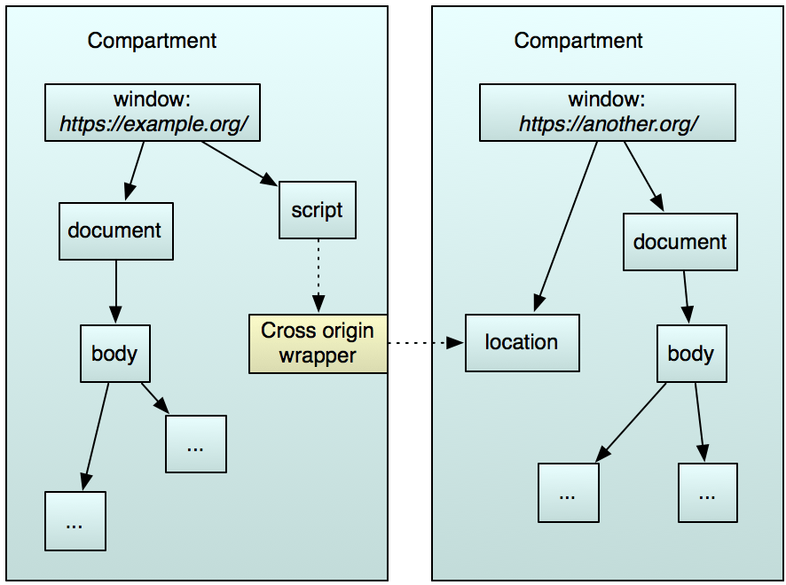
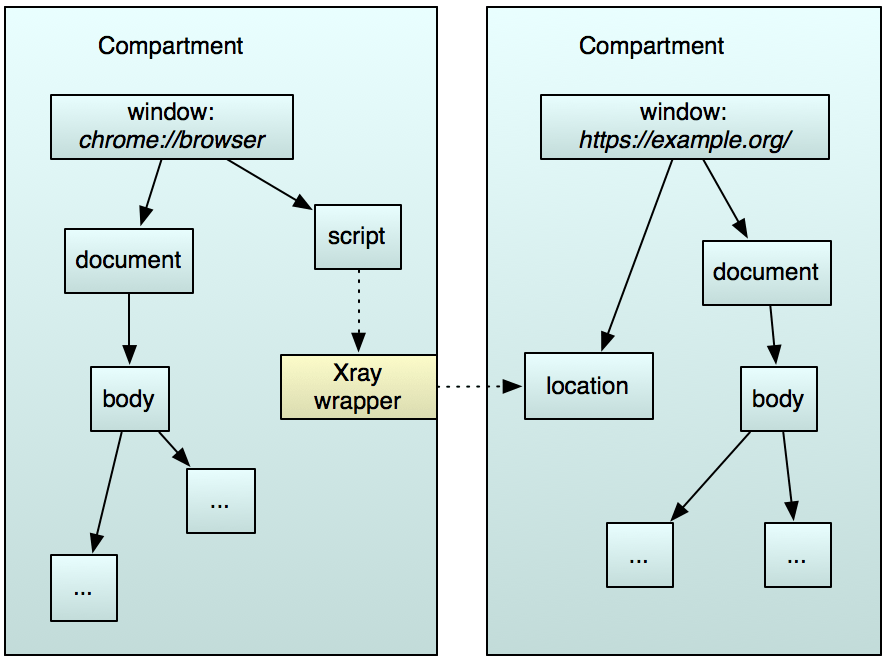
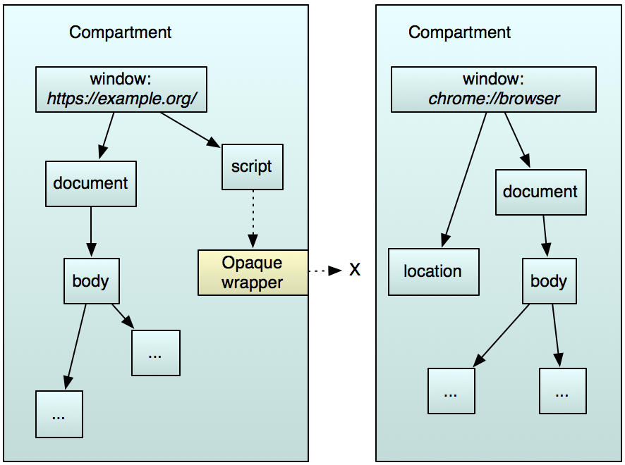
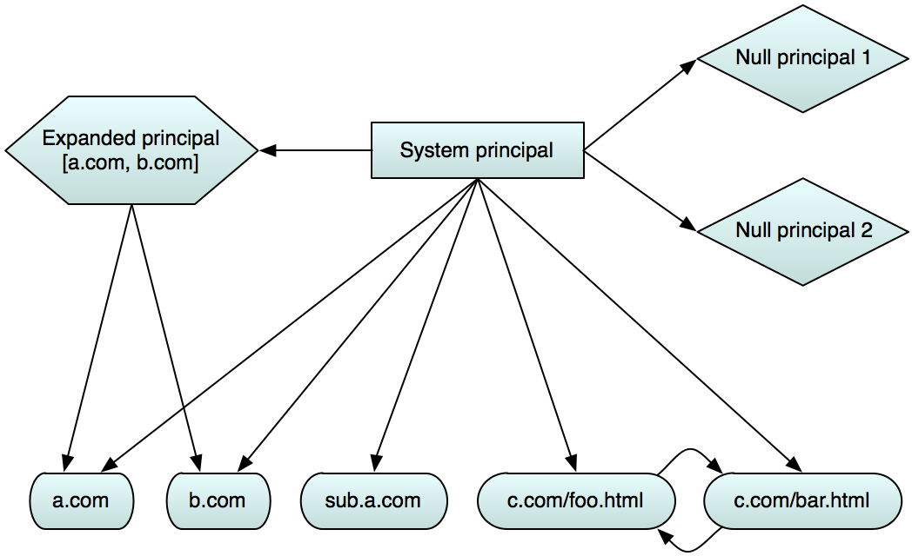
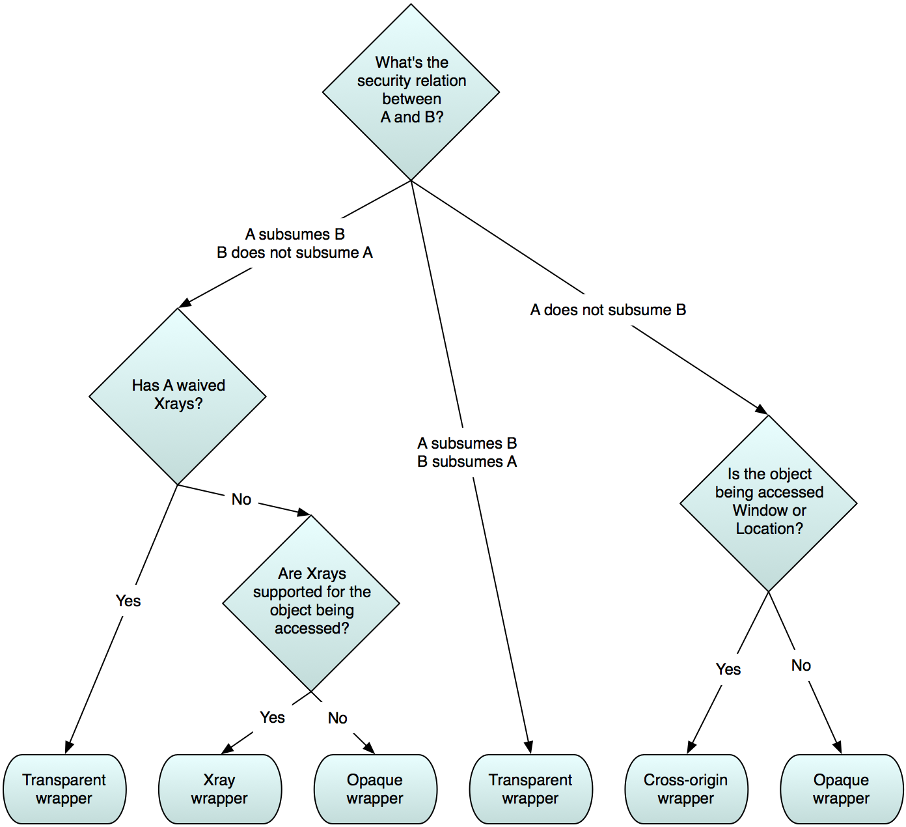

Script Security
===============

.. container:: summary

   This page provides an overview of the script security architecture in
   Gecko.

Like any web browser, Gecko can load JavaScript from untrusted and
potentially hostile web pages and run it on the user's computer. The
security model for web content is based on the `same-origin policy
<https://developer.mozilla.org/en-US/docs/Web/Security/Same-origin_policy>`__,
in which code
gets full access to objects from its origin but highly restricted access
to objects from a different origin. The rules for determining whether an
object is same-origin with another, and what access is allowed
cross-origin, are now mostly standardized across browsers.

Gecko has an additional problem, though: while its core is written in
C++, the front-end code is written in JavaScript. This JavaScript code,
which is commonly referred to as c\ *hrome code*, runs with system
privileges. If the code is compromised, the attacker can take over the
user's computer. Legacy SDK extensions also run with chrome privileges.

Having the browser front end in JavaScript has benefits: it can be much
quicker to develop in JavaScript than in C++, and contributors do not
need to learn C++. However, JavaScript is a highly dynamic, malleable
language, and without help it's difficult to write system-privileged
code that interacts safely with untrusted web content. From the point of
view of chrome code, the script security model in Gecko is intended to
provide that help to make writing secure, system-privileged JavaScript a
realistic expectation.

.. _Security_policy:

Security policy
---------------

Gecko implements the following security policy:

-  **Objects that are same-origin** are able to access each other
   freely. For example, the objects associated with a document served
   from *https://example.org/* can access each other, and they can also
   access objects served from *https://example.org/foo*.
-  **Objects that are cross-origin** get highly restricted access to
   each other, according to the same-origin policy.
   For example, code served from *https://example.org/* trying to access
   objects from *https://somewhere-else.org/* will have restricted
   access.
-  **Objects in a privileged scope** are allowed complete access to
   objects in a less privileged scope, but by default they see a
   `restricted view <#privileged-to-unprivileged-code>`__
   of such objects, designed to prevent them from being tricked by the
   untrusted code. An example of this scope is chrome-privileged
   JavaScript accessing web content.
-  **Objects in a less privileged scope** don't get any access to
   objects in a more privileged scope, unless the more privileged scope
   `explicitly clones those objects <#unprivileged-to-privileged-code>`__.
   An example of this scope is web content accessing objects in a
   chrome-privileged scope.

.. _Compartments:

Compartments
------------

Compartments are the foundation for Gecko's script security
architecture. A compartment is a specific, separate area of memory. In
Gecko, there's a separate compartment for every global object. This
means that each global object and the objects associated with it live in
their own region of memory.

Normal content windows are globals, of course, but so are chrome
windows, sandboxes, workers, the ``ContentFrameMessageManager`` in a frame
script, and so on.

Gecko guarantees that JavaScript code running in a given compartment is
only allowed to access objects in the same compartment. When code from
compartment A tries to access an object in compartment B, Gecko gives it
a *cross-compartment wrapper*. This is a proxy in compartment A for the
real object, which lives in compartment B.

Inside the same compartment, all objects share a global and are
therefore same-origin with each other. Therefore there's no need for any
security checks, there are no wrappers, and there is no performance
overhead for the common case of objects in a single window interacting
with each other.

Whenever cross-compartment access happens, the wrappers enable us to
implement the appropriate security policy. Because the wrapper we choose
is specific to the relationship between the two compartments, the
security policy it implements can be static: when the caller uses the
wrapper, there's no need to check who is making the call or where it is
going.

.. _Cross-compartment_access:

Cross-compartment access
------------------------

.. _Same-origin:

Same-origin
~~~~~~~~~~~

As we've already seen, the most common scenario for same-origin access
is when objects belonging to the same window object interact. This all
takes place within the same compartment, with no need for security
checks or wrappers.

When objects share an origin but not a global - for example two web
pages from the same protocol, port, and domain - they belong to two
different compartments, and the caller gets a *transparent wrapper* to
the target object.

Transparent wrappers allow access to all the target's properties:
functionally, it's as if the target is in the caller's compartment.

.. _Cross-origin:

Cross-origin
~~~~~~~~~~~~

If the two compartments are cross-origin, the caller gets a
*cross-origin wrapper*.

This denies access to all the object's properties, except for a few
properties of Window and Location objects, as defined by
the `same-origin
policy <https://developer.mozilla.org/en-US/docs/Web/Security/Same-origin_policy#cross-origin_script_api_access>`__.

.. _Privileged_to_unprivileged_code:

Privileged to unprivileged code
~~~~~~~~~~~~~~~~~~~~~~~~~~~~~~~

The most obvious example of this kind of security relation is between
system-privileged chrome code and untrusted web content, but there are
other examples in Gecko. The Add-on SDK runs content scripts in
sandboxes, which are initialized with an `expanded
principal <#expanded-principal>`__,
giving them elevated privileges with respect to the web content they
operate on, but reduced privileges with respect to chrome.

If the caller has a higher privilege than the target object, the caller
gets an *Xray wrapper* for the object.

Xrays are designed to prevent untrusted code from confusing trusted code
by redefining objects in unexpected ways. For example, privileged code
using an Xray to a DOM object sees only the original version of the DOM
object. Any expando properties are not visible, and if any native DOM properties have been
redefined, they are not visible in the Xray.

The privileged code is able to waive Xrays if it wants unfiltered access to the untrusted object.

See `Xray vision <xray_vision.html>`__ for much more information on Xrays.

.. _Unprivileged_to_privileged_code:

Unprivileged to privileged code
~~~~~~~~~~~~~~~~~~~~~~~~~~~~~~~

If the caller has lower privileges than the target object, then the
caller gets an *opaque wrapper.*

An opaque wrapper denies all access to the target object.

However, the privileged target is able to copy objects and functions
into the less privileged scope using the ``exportFunction()`` and
``cloneInto()`` functions, and the less privileged scope is then able
to use them.

.. _Security_checks:

Security checks
---------------

To determine the security relation between two compartments, Gecko uses
two concepts: *security principals* and the act of *subsuming*. To
establish the security relationship between two compartments A and B,
Gecko asks:

*Does the security principal for compartment A subsume the security
principal for compartment B, and vice versa?*

.. _Subsumes:

Subsumes
~~~~~~~~

+-----------------------------------+-----------------------------------+
| *A subsumes B*                    | A has all of the privileges of B, |
|                                   | and possibly more, and therefore  |
|                                   | A is allowed to see and do        |
|                                   | anything that B can see and do.   |
+-----------------------------------+-----------------------------------+
| *A Subsumes B &&* *B Subsumes A*  | A and B are same-origin.          |
+-----------------------------------+-----------------------------------+
| *A Subsumes B && B !Subsumes A*   | A is more privileged than B.      |
|                                   |                                   |
|                                   | A gets access to all of B, by     |
|                                   | default with Xray vision, which   |
|                                   | it may choose to waive.           |
|                                   |                                   |
|                                   | B gets no access to A, although A |
|                                   | may choose to export objects to   |
|                                   | B.                                |
+-----------------------------------+-----------------------------------+
| *A !Subsumes B && B !Subsumes A*  | A and B are cross-origin.         |
+-----------------------------------+-----------------------------------+

.. _Security_principals:

Security principals
~~~~~~~~~~~~~~~~~~~

There are four types of security principal: the system principal,
content principals, expanded principals, and the null principal.

.. _System_principal:

System principal
^^^^^^^^^^^^^^^^

The system principal passes all security checks. It subsumes itself and
all other principals. Chrome code, by definition, runs with the system
principal, as do frame scripts.

.. _Content_principal:

Content principal
^^^^^^^^^^^^^^^^^

A content principal is associated with some web content and is defined
by the origin
of the content. For example, a normal DOM window has a content principal
defined by the window's origin. A content principal subsumes only other
content principals with the same origin. It is subsumed by the system
principal, any expanded principals that include its origin, and any
other content principals with the same origin.

.. _Expanded_principal:

Expanded principal
^^^^^^^^^^^^^^^^^^

An expanded principal is specified as an array of origins:

.. code:: JavaScript

   ["http://mozilla.org", "http://moz.org"]

The expanded principal subsumes every content principal it contains. The
content principals do not subsume the expanded principal, even if the
expanded principal only contains a single content principal.

Thus ``["http://moz.org"]`` subsumes ``"http://moz.org"`` but not vice
versa. The expanded principal gets full access to the content principals
it contains, with Xray vision by default, and the content principals get
no access to the expanded principal.

This also enables the script security model to treat compartments that
have expanded principals more like part of the browser than like web
content. This means, for example, that it can run when JavaScript is
disabled for web content.

Expanded principals are useful when you want to give code extra
privileges, including cross-origin access, but don't want to give the
code full system privileges. For example, expanded principals are used
in the Add-on SDK to give content scripts cross-domain privileges for a predefined set of
domains,
and to protect content scripts from access by untrusted web content,
without having to give content scripts system privileges.

.. _Null_principal:

Null principal
^^^^^^^^^^^^^^

The null principal fails almost all security checks. It has no
privileges and can't be accessed by anything but itself and chrome. It
subsumes no other principals, even other null principals. (This is what
is used when HTML5 and other specs say "origin is a globally unique
identifier".)

.. _Principal_relationships:

Principal relationships
~~~~~~~~~~~~~~~~~~~~~~~

The diagram below summarizes the relationships between the different
principals. The arrow connecting principals A and B means "A subsumes
B". (A is the start of the arrow, and B is the end.)

.. _Computing_a_wrapper:

Computing a wrapper
-------------------

The following diagram shows the factors that determine the kind of
wrapper that compartment A would get when trying to access an object in
compartment B.

