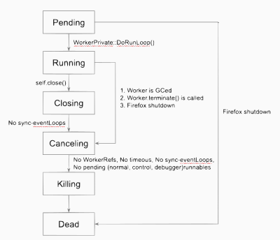

# Worker’s Life-Cycle and WorkerRefs

Worker, as a thread programming model, is introduced to the Web world to use the computing power efficiently in the Web world. Just like the regular thread programming, Worker can be created and deleted anytime when needed.

Since Worker can be deleted anytime, when developing APIs on the Workers should be careful when handling the shutdown behavior. Otherwise, memory problems, UAF, memory leaking, or shutdown hang, would not be a surprise. In addition, debugging these issues on Workers sometimes is not easy. The crash stack might not provide very useful information. The bug sometimes needs a special sequence to reproduce since it could be a thread interleaving problem. To avoid getting into these troubles, keeping the Worker’s life cycle and how to play with WorkerRefs in mind would be very helpful.

## Worker Life-Cycle

The worker’s life cycle is maintained by a status machine in the WorkerPrivate class. A Worker could be in following status

- Pending
- Running
- Closing
- Canceling
- Killing
- Dead

Following we briefly describe what is done for each status.

### Pending:

This is the initial status of a Worker.

Worker’s initialization is done in this status in the parent(main or the parent worker) and worker thread.

Worker’s initialization starts from its parent thread, which includes

1. Get WorkerLoadInfo from parent window/worker
2. Create a WorkerPrivate for the Worker
3. Register the Worker in the RuntimeService object
4. Initialize a thread(worker thread) for Worker, and dispatch a WorkerThreadPrimaryRunnable on the worker thread
5. Connect debugger
6. Dispatch CompileScriptRunnable to the worker thread

Before the Worker thread starts running runnables, a Worker could have already been exposed to its parent window/worker. So the parent window/worker can send messages to the worker through the postMessage() method. If the Worker is not in the “Running” status yet, these runnables would be kept in WorkerPrivate::mPreStartRunnables.

When WorkerThreadPrimaryRunnable starts executing on the worker thread, it continues the initialization on the worker thread, which includes

1. Build the connection between WorkerPrivate and the worker thread. Then moving the WorkerPrivate::mPreStartRunnables to the worker thread’s event queue.
2. Initialize the PerformanceStorage for the Worker.
3. Start the Cycle-Collector for the Worker.
4. Initialize the JS context for the Worker.
5. Call WorkerPrivate::DoRunLoop() to consume the Runnables in the worker thread’s event queue.

### Running:

This is the status which the Worker starts to execute runnables on the worker thread.

Once the Worker gets into “Running”,

1. Enable the memory reporter
2. Start the GC timer.

“Running” is the status where we play with the Worker. At this time point, we can

1. Create WorkerRefs to get the Worker shutdown notifications and run shutdown cleanup jobs through the registered callback.
2. Create sync-eventLoop to make the worker thread to wait for another thread's execution.
3. Dispatching events to WorkerGlobalScope to trigger event callbacks defined in the script.

We will talk about WorkerRef, Sync-EventLoop in detail later.

### Closing:

This is a special status for DedicatedWorker and SharedWorker when DedicateWorkerGlobalScope.close()/SharedWorkerGlobalScope.close() is called.

When Worker enters into the “Closing” status,

1. Cancel all Timeouts/TimeIntervals of the Worker.
2. Do not allow BroadcastChannel.postMessage() on the WorkerGlobalScope.

Worker will keep in the “Closing” status until all sync-eventLoops of the Worker are closed.

### Canceling:

When Worker gets into the “Canceling” status, it starts the Worker shutdown steps.

1. Set the WorkerGlobalScope(nsIGlobalObject) as dying.

This means the event will not be dispatched to the WorkerGlobalScope and the callbacks of the pending dispatched event will not be executed.

2. Cancel all Timeouts/TimeIntervals of the Worker.
3. Notify WorkerRef holders and children Workers.

So the WorkerRef holders and children Workers will start the shutdown jobs

4. Abort the script immediately.

Once all sync-eventLoops are closed,

1. Disconnect the EventTarget/WebTaskScheduler of the WorkerGlobalScope

### Killing:

This is the status that starts to destroy the Worker

1. Shutdown the GC Timer
2. Disable the memory reporter
3. Switch the status to “Dead”
4. Cancel and release the remaining WorkerControlRunnables
5. Exit the WorkerPrivate::DoRunLoop()

### Dead:

The Worker quits the main event loop, it continues the shutdown process

1. Release the remaining WorkerDebuggerRunnables

2. Unroot the WorkerGlobalScope and WorkerDebugGlobalScope

   1. Trigger GC to release GlobalScopes

3. Shutdown the Cycle-Collector for Worker

4. Dispatch TopLevelWorkerFinishRunnable/WorkerFinishRunnable to the parent thread

   1. Disable/Disconnect the WorkerDebugger
   2. Unregister the Worker in the RuntimeService object
   3. Release WorkerPrivate::mSelf and WorkerPrivate::mParentEventTargetRef

The WorkerPrivate is supposed to be released after its self-reference is nullified.

5. Dispatch FinishedRunnable to the main thread to release the worker thread.

### How to shutdown a Worker

Normally, there are four situations making a Worker get into shutdown.

1. Worker is GC/CCed.

   1. Navigating to another page.
   2. Worker is idle for a while. (Notice that idle is not a status of Worker, it is a condition in “Running” status)

2. self.close() is called in the worker's script.

3. Worker.terminate() is called in its parent’s script.

4. Firefox shutdown.

### Worker Status Flowchart

This flowchart shows how the status of a Worker is changing.

When the WorkerThreadPrimaryRunnable calls WorkerPrivate::DoRunLoop on the worker thread, the status changes from “Pending” to “Running.” If Firefox shutdown happens before entering into “Running,” the status directly changes from “Pending” to “Dead.”

When a Worker is in “Running,” status changing must be caused by requesting a Worker shutdown. The status switches to “Closing,” for the special case that worker’s script calls self.close(). Otherwise, the status switches to “Canceling.” And a “Closing” Worker will switch to “Canceling” when all sync-eventLoops are completed.

A “Canceling” Worker switches its status to “Killing” when following requirements are fulfilled.

1. No WorkerRefs, no children Workers, no Timeouts, and no sync-eventLoops
2. No pending runnable for the worker thread main event queue, control runnables and debugger runnables

The status switches from “Killing” to “Dead” automatically.

## WorkerRefs

Since a Worker’s shutdown can happen at any time, knowing when the shutdown starts is important for development, especially for releasing the resources and completing the operation in the Worker shutdown phase. Therefore, WorkerRefs is introduced to get the notification of the Worker’s shutdown. When a Worker enters the “Canceling” status, it notifies the corresponding WorkerRefs to execute the registered callback on the worker thread. The WorkerRefs holder completes its shutdown steps synchronously or asynchronously in the registered callback and then releases the WorkerRef.

According to the following requirements, four types of WorkerRefs are introduced.

- Should the WorkerRef block the Worker's shutdown
- Should the WorkerRef block cycle-collection on the Worker
- Should the WorkerRef need to be held on other threads.

### WeakWorkerRef

WeakWorkerRef, as its name, is a “Weak” reference since WeakWorkerRef releases the internal reference to the Worker immediately after WeakWorkerRef’s registered callback execution completes. Therefore, WeakWorkerRef does not block the Worker’s shutdown. In addition, holding a WeakWorkerRef would not block GC/CC the Worker. This means a Worker will be considered to be cycle-collected even if there are WeakWorkerRefs to the Worker.

WeakWorkerRef is ref-counted, but not thread-safe.

WeakWorkerRef is designed for just getting the Worker’s shutdown notification and completing shutdown steps synchronously.

### StrongWorkerRef

Unlike WeakWorkerRef, StrongWorkerRef does not release its internal reference to the Worker after the callback execution. StrongWorkerRef’s internal reference is released when the StrongWorkerRef gets destroyed. That means StrongWorkerRef allows its holder to determine when to release the Worker by nulling the StrongWorkerRef. This also makes StrongWorkerRef's holder block the Worker's shutdown.

When using the StrongWorkerRef, resource cleanup might involve multiple threads and asynchronous behavior. StrongWorkerRef release timing becomes crucial not to cause memory problems, such as UAF or leaking. StrongWorkerRef must be released. Otherwise, a shutdown hang would not be a surprise.

StrongWorkerRef also blocks the GC/CC a Worker. Once there is a StrongWorkerRef to the Worker, GC/CC will not collect the Worker.

StrongWorkerRef is ref-counted, but not thread-safe.

### ThreadSafeWorkerRef

ThreadSafeWorkerRef is an extension of StrongWorkerRef. The difference is ThreadSafeWorkerRef holder can be on another thread. Since it is an extension of StrongWorkerRef, it gives the same characters as StrongWorkerRef. Which means its holder blocks the Worker’s shutdown, and It also blocks GC/CC a Worker.

Playing with ThreadSafeWorkerRef, just like StrongWorkerRef, ThreadSafeWorkerRef release timing is important for memory problems. Except the release timing, it should be noticed the callback execution on the worker thread, not on the holder’s owning thread.

ThreadSafeWorkerRef is ref-counted and thread-safe.

### IPCWorkerRef

IPCWorkerRef is a special WorkerRef for IPC actors which binds its life-cycle with Worker’s shutdown notification. (In our current codebase, Cache API and Client API uses IPCWorkerRef)

Because some IPC shutdown needs to be in a special sequence during the Worker's shutdown. However, to make these IPC shutdown needs to ensure the Worker is kept alive, so IPCWorkerRef blocks the Worker's shutdown. But IPC shutdown no need to block GC/CC a Worker.

IPCWorkerRef is ref-counted, but not thread-safe.

Following is a table for the comparison between WorkerRefs

|                           |               |                 |                     |               |
| ------------------------- | :-----------: | :-------------: | :-----------------: | :-----------: |
|                           | WeakWorkerRef | StrongWorkerRef | ThreadSafeWorkerRef |  IPCWorkerRef |
| Holder thread             | Worker thread |  Worker thread  |      Any thread     | Worker thread |
| Callback execution thread | Worker thread |  Worker thread  |    Worker thread    | Worker thread |
| Block Worker’s shutdown   |       No      |       Yes       |         Yes         |      Yes      |
| Block GC a Worker         |       No      |       Yes       |         Yes         |       No      |

### WorkerRef Callback

WorkerRef Callback can be registered when creating a WorkerRef. The Callback takes the responsibility for releasing the resources related to WorkerRef’s holder. For example, resolving/rejecting the promises created by the WorkerRef’s holder. The cleanup behavior might be synchronous or asynchronous depending on how complicated the functionality involved. For example, Cache APIs might need to wait until the operation finishes on the IO thread and release the main-thread-only objects on the main thread.

To avoid memory problems, there are some things need to keep in mind for WorkerRef callback

- Don’t release WorkerRef before finishing cleanup steps. (UAF)
- Don’t forget to release resources related. (Memory leaking)
- Don’t forget to release WorkerRef(StrongWorkerRef/ThreadWorkerRef/IPCWorkerRef) (Shutdown hang)
