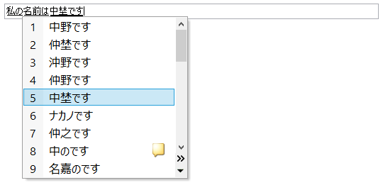

==================
IME handling guide
==================

This document explains how Gecko handles IME.

Introduction
============

IME is an abbreviation of Input Method Editor. This is a technical term from
Windows but these days, this is used on other platforms as well.

IME is a helper application of a user's text input. It handles native key
events before or after focused application (depending on the platform) and
creates a composition string (a.k.a. preedit string), suggests a list of what
the user attempts to input, commits composition string as a selected item off
the list and commits composition string without any conversion. IME is used by
Chinese, Japanese, Korean and Taiwan users for inputting Chinese characters
because the number of them is beyond thousands and cannot be input from the
keyboard directly. However, especially on mobile devices nowadays, IME is also
used for inputting Latin languages like autocomplete. Additionally, IME may be
used for handwriting systems or speech input systems on some platforms.

If IME is available on focused elements, we call that state "enabled". If IME
is not fully available(i.e., user cannot enable IME), we call this state
"disabled".

If IME is enabled but users use direct input mode (e.g., for inputting Latin
characters), we call it "IME is closed". Otherwise, we call it "IME is open".
(FYI: "open" is also called "active" or "turned on". "closed" is also called
"inactive" or "turned off")

So, this document is useful when you're try to fix a bug for text input in
Gecko.

Composition string and clauses
==============================

Typical Japanese IME can input two or more words into a composition string.
When a user converts from Hiragana characters to Chinese characters the
composition string, Japanese IME separates the composition string into multiple
clauses. For example, if a user types "watasinonamaehanakanodesu", it's
converted to Hiragana characters, "わたしのなまえはなかのです", automatically (In
the following screenshots, the composition string has a wavy underline and the
only one clause is called "raw input clause").

         character mode of MS-IME (Japanese)

         character (MS-IME, Japanese)

When a user presses ``Convert`` key, Japanese IME separates the composition
string as "わたしの" (my), "なまえは" (name is) and "なかのです" (Nakano). Then,
converts each clause with Chinese characters: "私の", "名前は" and "中野です" (In
the following screenshot each clause is underlined and not connected
adjacently. These clauses are called "converted clause").

If one or more clauses were not converted as expected, the user can choose one
of the clauses with Arrow keys and look for the expected result form the list
in the drop down menu (In the following screenshot, the clause with the thicker
underline is called "selected clause").

         selected clause

Basically, composition string and each clause style is rendered by Gecko. And
the drop down menu is created by IME.

Each clause is represented with selection in the editor. From chrome script,
you can check it with ``nsISelectionController``. In native code, you can
access it with either ``nsISelectionController`` or ``mozilla::SelectionType``
(the latter is recommended because of type safer). And editor sets these IME
selections from ``mozilla::TextRangeType`` which are sent by
``mozilla::WidgetCompositionEvent`` as ``mozilla::TextRangeArray``. The
following table explains the mapping between them.

.. table:: Selection types of each clause of composition string or caret

   +------------------------------------------------------------+---------------------------------------+-------------------------+-------------------------+
   |                                                            |`nsISelectionController`_              |`mozilla::SelectionType`_|`mozilla::TextRangeType`_|
   +============================================================+=======================================+=========================+=========================+
   |Caret                                                       |``SELECTION_NORMAL``                   |``eNormal``              |``eCaret``               |
   +------------------------------------------------------------+---------------------------------------+-------------------------+-------------------------+
   |Raw text typed by the user                                  |``SELECTION_IME_RAW_INPUT``            |``eIMERawClause``        |``eRawClause``           |
   +------------------------------------------------------------+---------------------------------------+-------------------------+-------------------------+
   |Selected clause of raw text typed by the user               |``SELECTION_IME_SELECTEDRAWTEXT``      |``eIMESelectedRawClause``|``eSelectedRawClause``   |
   +------------------------------------------------------------+---------------------------------------+-------------------------+-------------------------+
   |Converted clause by IME                                     |``SELECTION_IME_CONVERTEDTEXT``        |``eIMEConvertedClause``  |``eConvertedClause``     |
   +------------------------------------------------------------+---------------------------------------+-------------------------+-------------------------+
   |Selected clause by the user or IME and also converted by IME|``SELECTION_IME_SELECTEDCONVERTEDTEXT``|``eIMESelectedClause``   |``eSelectedClause``      |
   +------------------------------------------------------------+---------------------------------------+-------------------------+-------------------------+

Note that typically, "Selected clause of raw text typed by the user" isn't used
because when composition string is already separated to multiple clauses, that
means that the composition string has already been converted by IME at least
once.

.. _nsISelectionController: https://searchfox.org/mozilla-central/source/dom/base/nsISelectionController.idl
.. _mozilla::SelectionType: https://searchfox.org/mozilla-central/source/dom/base/nsISelectionController.idl
.. _mozilla::TextRangeType: https://searchfox.org/mozilla-central/source/widget/TextRange.h

Modules handling IME composition
================================

widget
------

Each widget handles native IME events and dispatches ``WidgetCompositionEvent``
with ``mozilla::widget::TextEventDispatcher`` to represent the behavior of IME
in the focused editor.

This is the only module that depends on the users platform. See also
`Native IME handlers`_ section for the detail of each platform's
implementation.

.. note::

   Android widget still does not use ``TextEventDispatcher`` to dispatch
   ``WidgetCompositionEvents``, see
   `bug 1137567 <https://bugzilla.mozilla.org/show_bug.cgi?id=1137567>`__.

mozilla::widget::TextEventDispatcher
------------------------------------

This class is used by native IME handler(s) on each platform. This capsules the
logic to dispatch ``WidgetCompositionEvent`` and ``WidgetKeyboardEvent`` for
making the behavior on each platform exactly same. For example, if
``WidgetKeyboardEvent`` should be dispatched when there is a composition is
managed by this class in XP level. First of use, native IME handlers get the
rights to use ``TextEventDispatcher`` with a call of
``BeginNativeInputTransaction()``. Then, ``StartComposition()``,
``SetPendingComposition()``, ``FlushPendingComposition()``,
``CommitComposition()``, etc. are available if
``BeginNativeInputTransaction()`` return true. These methods automatically
manage composition state and dispatch ``WidgetCompositionEvent`` properly.

This is also used by ``mozilla::TextInputProcessor`` which can emulates (or
implements) IME with chrome script. So, native IME handlers using this class
means that the dispatching part is also tested by automated tests.

mozilla::WidgetCompositionEvent
-------------------------------

Internally, ``WidgetCompositionEvent`` represents native IME behavior. Its
message is one of following values:

eCompositionStart
^^^^^^^^^^^^^^^^^

This is dispatched at starting a composition. This represents a DOM
``compositionstart`` event. The mData value is a selected string at dispatching
the DOM event and it's automatically set by ``TextComposition``.

eCompositionUpdate
^^^^^^^^^^^^^^^^^^

This is dispatched by ``TextComposition`` when an ``eCompositionChange`` will
change the composition string. This represents a DOM ``compositionupdate``
event.

eCompositionEnd
^^^^^^^^^^^^^^^

This is dispatched by ``TextComposition`` when an ``eCompositionCommitAsIs`` or
``eCompositionCommit`` event is dispatched. This represents a DOM
``compositionend`` event.

eCompositionChange
^^^^^^^^^^^^^^^^^^

This is used internally only. This is dispatched at modifying a composition
string, committing a composition, changing caret position and/or changing
ranges of clauses. This represents a DOM text event which is not in any
standards. ``mRanges`` should not be empty only with this message.

eCompositionCommitAsIs
^^^^^^^^^^^^^^^^^^^^^^

This is used internally only. This is dispatched when a composition is
committed with the string. The ``mData`` value should be always be an empty
string. This causes a DOM text event without clause information and a DOM
``compositionend`` event.

eCompositionCommit
^^^^^^^^^^^^^^^^^^

This is used internally only. This is dispatched when a composition is
committed with specific string. The ``mData`` value is the commit string. This
causes a DOM text event without clause information and a DOM ``compositionend``
event.

.. table:: Table of event messages

   +--------------------------+-------------------------------------------+-------------------------------+-----------------------+----------------------+
   |                          |meaning of mData                           |who sets ``mData``?            |``mRanges``            |representing DOM event|
   +==========================+===========================================+===============================+=======================+======================+
   |``eCompositionStart``     |selected string before starting composition|``TextComposition``            |``nullptr``            |``compositionstart``  |
   +--------------------------+-------------------------------------------+-------------------------------+-----------------------+----------------------+
   |``eCompositionUpdate``    |new composition string                     |``TextComposition``            |``nullptr``            |``compositionupdate`` |
   +--------------------------+-------------------------------------------+-------------------------------+-----------------------+----------------------+
   |``eCompositionEnd``       |commit string                              |``TextComposition``            |``nullptr``            |``compositionend``    |
   +--------------------------+-------------------------------------------+-------------------------------+-----------------------+----------------------+
   |``eCompositionChange``    |new composition string                     |widget (or ``TextComposition``)|must not be ``nullptr``|``text``              |
   +--------------------------+-------------------------------------------+-------------------------------+-----------------------+----------------------+
   |``eCompositionCommitAsIs``|N/A (must be empty)                        |nobody                         |``nullptr``            |None                  |
   +--------------------------+-------------------------------------------+-------------------------------+-----------------------+----------------------+
   |``eCompositionCommit``    |commit string                              |widget (or ``TextComposition``)|``nullptr``            |None                  |
   +--------------------------+-------------------------------------------+-------------------------------+-----------------------+----------------------+

PresShell
---------

``PresShell`` receives the widget events and decides an event target from
focused document and element. Then, it sends the events and the event target to
``IMEStateManager``.

mozilla::IMEStateManager
------------------------

``IMEStateManager`` looks for a ``TextComposition`` instance whose native IME
context is same as the widget' which dispatches the widget event. If there is
no proper ``TextComposition`` instance, it creates the instance. And it sends
the event to the ``TextComposition`` instance.

Note that all instances of ``TextComposition`` are managed by
``IMEStateManager``. When an instance is created, it's registered to the list.
When composition completely ends, it's unregistered from the list (and released
automatically).

mozilla::TextComposition
------------------------

``TextComposition`` manages a composition and dispatches DOM
``compositionupdate`` events.

When this receives an ``eCompositionChange``, ``eCompositionCommit`` or
``eCompositionCommitAsIs`` event, it dispatches the event to the stored node
which was the event target of ``eCompositionStart`` event. Therefore, this
class guarantees that all composition events for a composition are fired on
same element.

When this receives ``eCompositionChange`` or ``eCompositionCommit``, this
checks if new composition string (or committing string) is different from the
last data stored by the ``TextComposition``. If the composition event is
changing the composition string, the ``TextComposition`` instance dispatches
``WidgetCompositionEvent`` with ``eCompositionUpdate`` into the DOM tree
directly and modifies the last data. The ``eCompositionUpdate`` event will
cause a DOM ``compositionupdate`` event.

When this receives ``eCompositionCommitAsIs`` or ``eCompositionCommit``, this
dispatches an ``eCompositionEnd`` event which will cause a DOM
``compositionend`` event after dispatching ``eCompositionUpdate`` event and/or
``eCompositionChange`` event if necessary.

One of the other important jobs of this is, when a focused editor handles a
dispatched ``eCompositionChange`` event, this modifies the stored composition
string and its clause information. The editor refers the stored information for
creating or modifying a text node representing a composition string.

And before dispatching ``eComposition*`` events, this class removes ASCII
control characters from dispatching composition event's data in the default
settings. Although, this can be disabled with
``"dom.compositionevent.allow_control_characters"`` pref.

Finally, this class guarantees that requesting to commit or cancel current
composition to IME is perefored synchronously. See
`Forcibly committing composition`_ section for the detail.

editor/libeditor
----------------

`mozilla::EditorEventListener <https://searchfox.org/mozilla-central/source/editor/libeditor/EditorEventListener.cpp>`__
listens for trusted DOM ``compositionstart``, ``text`` and ``compositionend``
events and notifies
`mozilla::EditorBase <https://searchfox.org/mozilla-central/source/editor/libeditor/EditorBase.cpp>`__
and
`mozilla::TextEditor <https://searchfox.org/mozilla-central/source/editor/libeditor/TextEditor.cpp>`__
of the events.

When ``EditorBase`` receives an ``eCompositionStart``
(DOM ``"compositionstart"``) event, it looks for a proper ``TextComposition``
instance and stores it.

When ``TextEditor`` receives an ``eCompositionChange`` (DOM ``"text"``) event,
it creates or modifies a text node which includes the composition string and
`mozilla::CompositionTransaction <https://searchfox.org/mozilla-central/source/editor/libeditor/CompositionTransaction.cpp>`__
(it was called ``IMETextTxn``) sets IME selections for representing the clauses
of the composition string.

When ``EditorBase`` receives an ``eCompositionEnd`` (DOM ``"compositionend"``)
event, it releases the stored ``TextComposition`` instance.

nsTextFrame
-----------
``nsTextFrame`` paints IME selections.

mozilla::IMEContentObserver
---------------------------

``IMEContentObserver`` observes various changes of a focused editor. When a
corresponding element of a ``TextEditor`` or ``HTMLEditor`` instance gets
focus, an instance is created by ``IMEStateManager``, then, starts to observe
and notifies ``widget`` of IME getting focus. When the editor loses focus, it
notifies ``widget`` of IME losing focus and stops observing everything.
Finally, it's destroyed by ``IMEStateManager``.

This class observes selection changes (caret position changes), text changes of
a focused editor and layout changes (by reflow or scroll) of everything in the
document. It depends on the result of ``nsIWidget::GetIMEUpdatePreference()``
what is observed.

When this notifies ``widget`` of something, it needs to be safe to run
script because notifying something may cause dispatching one or more DOM events
and/or new reflow. Therefore, ``IMEContentObserver`` only stores which
notification should be sent to ``widget``. Then,
``mozilla::IMEContentObserver::IMENotificationSender`` tries to send the
pending notifications when it might become safe to do that. Currently, it's
tried:

* after a native event is dispatched from ``PresShell::HandleEventInternal()``
* when new focused editor receives DOM ``focus`` event
* when next refresh driver tick

.. note::

   The 3rd timing may not be safe actually, but it causes a lot of oranges of
   automated tests.

See also `Notifications to IME`_ section for the detail of sending
notifications.

Currently, ``WidgetQueryContentEvent`` is handled via ``IMEContentObserver``
because if it has a cache of selection, it can set reply of
``eQuerySelectedText`` event only with the cache. That is much faster than
using ``ContentEventHandler``.

e10s support
============

Even when a remote process has focus, native IME handler in chrome process does
its job. So, there is process boundary between native IME handler and focused
editor. Unfortunately, it's not allowed to use synchronous communication from
chrome process to a remote process. This means that chrome process (and also
native IME and our native IME handler) cannot query the focused editor contents
directly. For fixing this issue, we have ``ContentCache`` classes around
process boundary.

mozilla::ContentCache
---------------------
This is a base class of ``ContentCacheInChild`` and ``ContentCacheInParent``
and IPC-aware. This has common members of them including all cache data:

``mText``
    Whole text in focused editor. This may be too big but IME may request all
    text in the editor.

    If we can separate editor contents per paragraph, moving selection between
    paragraphs generates pseudo focus move, we can reduce this size and runtime
    cost of ``ContentEventHandler``. However, we've not had a plan to do that
    yet. Note that Microsoft Word uses this hack.

``mCompositionStart``
    Offset of composition string in ``mText``. When there is no composition,
    this is ``UINT32_MAX``.

``mSelection::mAnchor``, ``mSelection::mFocus``
    Offset of selection anchor and focus in ``mText``.

``mSelection::mWritingMode``
    Writing mode at selection start.

``mSelection::mAnchorCharRect``, ``mSelection::mFocusCharRect``
    Next character rectangle of ``mSelection::mAnchor`` and
    ``mSelection::mFocus``. If corresponding offset is end of the editor
    contents, its rectangle should be a caret rectangle.

    These rectangles shouldn't be empty rect.

``mSelection::mRect``
    Unified character rectangle in selection range. When the selection is
    collapsed, this should be caret rect.

``mFirstRect``
    First character rect of ``mText``. When ``mText`` is empty string, this
    should be caret rect.

``mCaret::mOffset``
    Always same as selection start offset even when selection isn't collapsed.

``mCaret::mRect``
    Caret rect at ``mCaret::mOffset``. If caret isn't actually exists, it's
    computed with a character rect at the offset.

``mTextRectArray::mStart``
    If there is composition, ``mStart`` is same as ``mCompositionStart``.
    Otherwise, ``UINT32_MAX``.

``mTextRectArray::mRects``
    Each character rectangle of composition string.

``mEditorRect``
    The rect of editor element.

mozilla::ContentCacheInChild
----------------------------

This exists only in remote processes. This is created as a member of
`PuppetWidget <https://searchfox.org/mozilla-central/source/widget/PuppetWidget.cpp>`__.
When ``PuppetWidget`` receives notifications to IME from ``IMEContentObserver``
in the remote process, it makes this class modify its cached content. Then,
this class do that with ``WidgetQueryContentEvents``. Finally, ``PuppetWidget``
sends the notification and ``ContentCacheInParent`` instance as
``ContentCache`` to its parent process.

mozilla::ContentCacheInParent
-----------------------------

This exists as a member of ``TabParent``. When ``TabParent`` receives
notification from corresponding remote process, it assigns
``ContentCacheInParent`` new ``ContentCache`` and post the notification to
``ContentCacheInParent``. If all sent ``WidgetCompositionEvents`` and
``WidgetSelectionEvents`` are already handled in the remote process,
``ContentCacheInParent`` sending the notifications to widget.

And also this handles ``WidgetQueryContentEvents`` with its cache. Supported
event messages of them are:

* ``eQuerySelectedText`` (only with ``SelectionType::eNormal``)
* ``eQueryTextContent``
* ``eQueryTextRect``
* ``eQueryCaretRect``
* ``eQueryEditorRect``

Additionally, this does not support query content events with XP line breakers
but this must not be any problem since native IME handlers query contents with
native line breakers.

``ContentCacheInParent`` also manages sent ``WidgetCompositionEvents`` and
``WidgetSelectionEvents``. After these events are handled in the remote
process, ``TabParent`` receives it with a call of
``RecvOnEventNeedingAckHandled()``. Then, it calls
``ContentCacheInParent::OnEventNeedingAckHandled()``. Finally,
``ContentCacheInParent`` flushes pending notifications.

How do mozilla::TextComposition and mozilla::IMEStateManager work in e10s mode?
-------------------------------------------------------------------------------
In remote process, they work as non-e10s mode. On the other hand, they work
specially in parent process.

When ``IMEStateManager`` in parent process receives ``eCompositionStart``, it
creates ``TextComposition`` instance normally. However, if the event target has
remote contents, ``TextComposition::DispatchCompositionEvent()`` directly sends
the event to the remote process instead of dispatching the event into the
target DOM tree in the process.

That means that even in a parent process, anybody can retrieve
``TextComposition`` instance, but it just does nothing in parent process.

``IMEStateManager`` works more complicated because ``IMEStateManager`` in each
process need to negotiate about owner ship of managing input context.

When a remote process gets focus, temporarily, ``IMEStateManager`` in parent
process disables IME in the widget. After that, ``IMEStateManager`` in the
remote process will set proper input context for the focused editor. At this
time, ``IMEStateManager`` in the parent process does nothing. Therefore,
``IMEContentObserver`` is never created while a remote process has focus.

When a remote process loses focus, ``IMEStateManager`` in parent process
notifies ``IMEStateManager`` in the remote process of
"Stop IME state management". When ``IMEStateManager::StopIMEStateManagement()``
is called in the remote process by this, the ``IMEStateManager`` forgets all
focus information (i.e., that indicates nobody has focus).

When ``IMEStateManager`` in parent process is notified of pseudo focus move
from or to menubar while a remote process has focus, it notifies the remote
process of "Menu keyboard listener installed". Then, ``TabChild`` calls
``IMEStateManager::OnInstalledMenuKeyboardListener()`` in the remote process.

Style of each clause
--------------------

The style of each IME selection is managed by
`LookAndFeel <https://searchfox.org/mozilla-central/source/widget/LookAndFeel.h>`__
class per platform. Therefore, it can be overridden by prefs.

Background color, foreground color (text color) and underline color can be
specified with following prefs. The values must be string of "#rrggbb" format.

* ``ui.IMERawInputBackground``
* ``ui.IMERawInputForeground``
* ``ui.IMERawInputUnderline``
* ``ui.IMESelectedRawTextBackground``
* ``ui.IMESelectedRawTextForeground``
* ``ui.IMESelectedRawTextUnderline``
* ``ui.IMEConvertedTextBackground``
* ``ui.IMEConvertedTextForeground``
* ``ui.IMEConvertedTextUnderline``
* ``ui.IMESelectedConvertedTextBackground``
* ``ui.IMESelectedConvertedTextForeground``
* ``ui.IMESelectedConvertedTextUnderline``

Underline style can be specified with the following prefs. The values are
integer,  0: none, 1: dotted, 2: dashed, 3: solid, 4: double, 5: wavy (The
values same as ``mozilla::StyleTextDecorationStyle`` defined in
`nsStyleConsts.h <https://searchfox.org/mozilla-central/source/layout/style/nsStyleConsts.h>`__).

* ``ui.IMERawInputUnderlineStyle``
* ``ui.IMESelectedRawTextUnderlineStyle``
* ``ui.IMEConvertedTextUnderlineStyle``
* ``ui.IMESelectedConvertedTextUnderlineStyle``

Underline width can be specified with ``"ui.IMEUnderlineRelativeSize"`` pref.
This affects all types of clauses. The value should be 100 or 200. 100 means
normal width, 200 means double width.

On some platforms, IME may support its own style for each clause. Currently,
this feature is supported in TSF mode of Windows and on Linux. The style
information is stored in ``TextRangeStyle`` which is defined in
`TextRange.h <https://searchfox.org/mozilla-central/source/widget/TextRange.h>`__.
It's a member of ``TextRange``. ``TextRange`` is stored in ``mRanges`` of
``WidgetCompositionEvent`` only when its message is ``eCompositionChange``.

Lifetime of composition string
==============================

When native IME notifies Gecko of starting a composition, a widget dispatches
``WidgetCompositionEvent`` with ``eCompositionStart`` which will cause a DOM
``compositionstart`` event.

When native IME notifies Gecko of a composition string change, a caret position
change and/or a change of length of clauses, a widget dispatches
``WidgetCompositionEvent`` with ``eCompositionChange`` event. It will cause a
DOM ``compositionupdate`` event when composition string is changing. That is
dispatched by ``TextComposition`` automatically. After that when the widget and
``PresShell`` of the focused editor have not been destroyed yet, the
``eCompositionChange`` will cause a DOM text event which is not in any web
standards.

When native IME notifies Gecko of the ending of a composition, a widget
dispatches ``WidgetCompositionEvent`` with ``eCompositionCommitAsIs`` or
``eCompositionCommit``. If the committing string is different from the last set
of data (i.e., if the event message is ``eCompositionCommit``),
``TextComposition`` dispatches a DOM ``compositionupdate`` event. After that,
when the widget and ``PresShell`` of the focused editor have not been destroyed
yet, an ``eCompositionChange`` event dispatched by ``TextComposition``, that
causes a DOM text event. Finally, if the widget and PresShell of the focused
editor has not been destroyed yet too, ``TextComposition`` dispatches an
``eCompositionEnd`` event which will cause a DOM compositionend event.

Limitation of handling composition
==================================

Currently, ``EditorBase`` touches undo stack at receiving every
``WidgetCompositionEvent``. Therefore, ``EditorBase`` requests to commit
composition when the following cases occur:

* The editor loses focus
* The caret is moved by mouse or Javascript
* Value of the editor is changed by Javascript
* Node of the editor is removed from DOM tree
* Somethings object is modified in an HTML editor, e.g., resizing an image
* Composition string is moved to a different position which is specified by
  native IME (e.g., only a part of composition is committed)

In the future, we should fix this limitation. If we make ``EditorBase`` not
touch undo stack until composition is committed, some of the cases must be
fixed.

Notifications to IME
====================

XP part of Gecko uses ``nsIWidget::NotifyIME()`` for notifying ``widget`` of
something useful to handle IME. Note that some of them are notified only when
``nsIWidget::GetIMEUpdatePreference()`` returns flags which request the
notifications.

``NOTIFY_IME_OF_TEXT_CHANGE``, ``NOTIFY_IME_OF_SELECTION_CHANGE``,
``NOTIFY_IME_OF_POSITION_CHANGE`` and
``NOTIFY_IME_OF_COMPOSITION_EVENT_HANDLED`` are always sent by following order:

1. ``NOTIFY_IME_OF_TEXT_CHANGE``
2. ``NOTIFY_IME_OF_SELECTION_CHANGE``
3. ``NOTIFY_IME_OF_POSITION_CHANGE``
4. ``NOTIFY_IME_OF_COMPOSITION_EVENT_HANDLED``

If sending one of above notifications causes higher priority notification, the
sender should abort to send remaining notifications and restart from high
priority notification again.

Additionally, all notifications except ``NOTIFY_IME_OF_BLUR`` should be sent
only when it's safe to run script since the notification may cause querying
content and/or dispatching composition events.

NOTIFY_IME_OF_FOCUS
-------------------

When an editable editor gets focus and ``IMEContentObserver`` starts to observe
it, this is sent to widget. This must be called after the previous
``IMEContentObserver`` notified widget of ``NOTIFY_IME_OF_BLUR``.

Note that even if there are pending notifications, they are canceled when
``NOTIFY_IME_OF_FOCUS`` is sent since querying content with following
notifications immediately after getting focus does not make sense. The result
is always same as the result of querying contents at receiving this
notification.

NOTIFY_IME_OF_BLUR
------------------

When an ``IMEContentObserver`` instance ends observing the focused editor, this
is sent to ``widget`` synchronously because assumed that this notification
causes neither query content events nor composition events.

If ``widget`` wants notifications even while all windows are inactive,
``IMEContentObserver`` doesn't end observing the focused editor. I.e., in this
case, ``NOTIFY_IME_OF_FOCUS`` and ``NOTIFY_IME_OF_BLUR`` are not sent to
``widget`` when a window which has a composition is being activated or
inactivated.

When ``widget`` wants notifications during inactive, ``widget`` includes
``NOTIFY_DURING_DEACTIVE`` to the result of
``nsIWidget::GetIMEUpdatePreference()``.

If this notification is tried to sent before sending ``NOTIFY_IME_OF_FOCUS``,
all pending notifications and ``NOTIFY_IME_OF_BLUR`` itself are canceled.

NOTIFY_IME_OF_TEXT_CHANGE
-------------------------

When text of focused editor is changed, this is sent to ``widget`` with a range
of the change. But this is sent only when result of
``nsIWidget::GetIMEUpdatePreference()`` includes ``NOTIFY_TEXT_CHANGE``.

If two or more text changes occurred after previous
``NOTIFY_IME_OF_TEXT_CHANGE`` or ``NOTIFY_IME_OF_FOCUS``, the ranges of all
changes are merged. E.g., if first change is from ``1`` to ``5`` and second
change is from ``5`` to ``10``, the notified range is from ``1`` to ``10``.

If all merged text changes were caused by composition,
``IMENotification::mTextChangeData::mCausedOnlyByComposition`` is set to true.
This is useful if native IME handler wants to ignore all text changes which are
expected by native IME.

If at least one text change of the merged text changes was caused by current
composition,
``IMENotification::mTextChangeData::mIncludingChangesDuringComposition`` is set
to true. This is useful if native IME handler wants to ignore delayed text
change notifications.

If at least one text change of the merged text changes was caused when there
was no composition,
``IMENotification::mTextChangeData::mIncludingChangesWithoutComposition`` is
set to true.

NOTIFY_IME_OF_SELECTION_CHANGE
------------------------------

When selection (or caret position) is changed in focused editor, widget is
notified of this.

If the last selection change was occurred by a composition event event
handling, ``IMENotification::mSelectionChangeData::mCausedByComposition`` is
set to true. This is useful if native IME handler wants to ignore the last
selection change which is expected by native IME.

If the last selection change was occurred by an ``eSetSelection`` event,
``IMENotification::mSelectionChangeData::mCausedBySelectionEvent`` is set to
true. This is useful if native IME handler wants to ignore the last selection
change which was requested by native IME.

If the last selection is occurred during a composition,
``IMENotification::mSelectionChangeData::mOccurredDuringComposition`` is set to
true. This is useful if native IME handler wants to ignore the last selection
change which occurred by web application's ``compositionstart`` or
``compositionupdate`` event handler before inserting composition string.

NOTIFY_IME_OF_POSITION_CHANGE
-----------------------------

When reflow or scroll occurs in the document, this is sent to widget, but this
is sent only when result of ``nsIWidget::GetIMEUpdatePreference()`` includes
``NOTIFY_POSITION_CHANGE``.

This might be useful to update a candidate window position or something.

NOTIFY_IME_OF_COMPOSITION_EVENT_HANDLED
---------------------------------------

After ``TextComposition`` handles ``eCompositionStart``,
``eCompositionChange``, ``eComposiitionCommit`` or ``eCompositionCommitAsIs``,
this notification is sent to widget. This might be useful to update a candidate
window position or something.

NOTIFY_IME_OF_MOUSE_BUTTON_EVENT
--------------------------------

When a ``mousedown`` event or a ``mouseup`` event is fired on a character in a
focused editor, this is sent to widget. But this is sent only when result of
``nsIWidget::GetIMEUpdatePreference()`` includes
``NOTIFY_MOUSE_BUTTON_EVENT_ON_CHAR``. This is sent with various information.
See ``IMENotification::mMouseButtonEventData`` in
`IMEData.h <https://searchfox.org/mozilla-central/source/widget/IMEData.h>`__
for the detail.

If native IME supports mouse button event handling, ``widget`` should notify
IME of mouse button events with this. If IME consumes an event, ``widget``
should return ``NS_SUCCESS_EVENT_CONSUMED`` from ``nsIWidget::NotifyIME()``.
Then, ``EditorBase`` doesn't handle the mouse event.

Note that if a ``mousedown`` event or a ``mouseup`` event is consumed by a web
application (before a focused editor handles it), this notification is not sent
to ``widget``. This means that web applications can handle mouse button events
before IME.

Requests to IME
===============

XP part of Gecko can request IME to commit or cancel composition. This must be
requested via ``IMEStateManager::NotifyIME()``. Then, ``IMEStateManager`` looks
for a proper ``TextComposition`` instance. If it's found,
``TextComposition::RequestToCommit()`` for calling ``nsIWidget::NotifyIME()``
and handles some extra jobs.

widget should call the proper native API if it's available. Even if commit or
canceling composition does not occur synchronously, widget doesn't need to
emulate it since ``TextComposition`` will emulate it automatically. In other
words, widget should only request to commit or cancel composition to IME.

REQUEST_TO_COMMIT_COMPOSITION
-----------------------------

A request to commit current composition to IME. See also following
"`Forcibly committing composition`_" section for additional information.

REQUEST_TO_CANCEL_COMPOSITION
-----------------------------

A request to cancel current composition to IME. In other words, a request to
commit current composition with an empty string.

Forcibly committing composition
===============================

When ``TextComposition::RequestToCommit()`` calls ``nsIWidget::NotifyIME()``,
it guarantees synchronous commit or canceling composition.

In order to put it into practice, we need to handle the following four
scenarios:

The composition is committed with non-empty string synchronously
----------------------------------------------------------------

This is the most usual case. In this case, ``TextComposition`` handles
``WidgetCompositionEvent`` instances during a request normally. However, in a
remote process in e10s mode, this case never occurs since requests to native
IME is handled asynchronously.

The composition is not committed synchronously but later
--------------------------------------------------------

This is the only case in a remote process in e10s mode or occurs on Linux even
in non-e10s mode if the native IME is iBus. The callers of
``NotifyIME(REQUEST_TO_COMMIT_COMPOSITION)`` may expect that composition string
is committed immediately for their next job. For such a case,
``TextComposition::RequestToCommit()`` synthesizes DOM composition events and a
DOM text event for emulating to commit composition synchronously. Additionally,
``TextComposition`` ignores committing events which are dispatched by widget
when the widget receives native IME events.

In this case, using the last composition string as commit string.

However, if the last composition string is only an ideographic space (fullwidth
space), the composition string may be a placeholder of some old Chinese IME on
Windows.

         ideographic space into composition string for placeholder

In this case, although, we should not commit the placeholder character because
it's not a character which the user wanted to input but we commit it as is. The
reason is, inputting an ideographic space causes a composition. Therefore, we
cannot distinguish if committing composition is unexpected. If the user uses
such old Chinese IME, ``"intl.ime.remove_placeholder_character_at_commit"``
pref may be useful but we don't support them anymore in default settings
(except if somebody will find a good way to fix this issue).

The composition is committed synchronously but with empty string
----------------------------------------------------------------

This case may occur on Linux or with some IME on other platforms. If a web
application implements autocomplete, committing with different strings
especially an empty string it might cause confusion.

In this case, TextComposition overwrites the commit string of
``eCompositionChange`` event dispatched by widget. However, if the last
composition string is only an ideographic space, it shouldn't be committed. See
the previous case.

Note that this case doesn't work as expected when composition is in a remote
process in e10s mode.

The composition is not committed
--------------------------------

On Linux, there is no API to request commit or canceling composition forcibly.
Instead, Gecko uses ``gtk_im_context_reset()`` API for this purpose because
most IME cancel composition with it. But there are some IMEs which do nothing
when Gecko calls it.

If this occurs, Gecko should restart composition with a DOM
``compositionstart`` event , a DOM ``compositionupdate`` event and a DOM
``text`` event at caret position.

.. note::

   This issue hasn't been supported yet.

IME state management
====================

IME is a text input system. It means that except when a user wants to input
some text, IME shouldn't be available. For example, pressing the space key to
attempt scrolling a page may be consumed and prevented by IME. Additionally,
password editors need to request special behavior with IME.

For solving this issue, Gecko sets the proper IME state at DOM focus change.

First, when a DOM node gets focus, nsFocusManager notifies ``IMEStateManager``
of the new focused node (calls ``IMEStateManager::OnChangeFocus()``).
``IMEStateManager`` asks desired IME state by calling
``nsIContent::GetDesiredIMEState()`` of the node. If the node owns
``TextEditor`` instance, it asks for the desired IME state from the editor and
returns the result.

Next, ``IMEStateManager`` initializes ``InputContext`` (defined in
`IMEData.h <https://searchfox.org/mozilla-central/source/widget/IMEData.h>`__)
with the desired IME state and node information. Then, it calls
``nsIWidget::SetInputContext()`` with the ``InputContext``.

Finally, widget stores the InputContext and enables or disables IME if the
platform has such an API.

InputContext
------------

InputContext is a struct. Its ``mIMEState``, ``mHTMLInputType``,
``mHTMLInputInputMode`` and ``mActionHint`` are set at
``nsIWidget::SetInputContext()`` called.

mIMEState
^^^^^^^^^
IME state has two abilities. One is enabled state:

ENABLED
"""""""

This means IME is fully available. E.g., when an editable element such as
``<input type="text">``, ``<textarea>`` or ``<foo contenteditable>`` has focus.

DISABLED
""""""""

This means IME is not available. E.g., when a non-editable element has focus or
no element has focus, the desired IME state is ``DISABLED``.

PASSWORD
""""""""

This means IME state should be the same as the state when a native password
field has focus. This state is set only when
``<input type="password"> (ime-mode: auto;)``,
``<input type="text" style="ime-mode: disabled;">`` or
``<textarea style="ime-mode: disabled;">``.

The other is IME open state:

DONT_CHANGE_OPEN_STATE
""""""""""""""""""""""

The open state of IME shouldn't be changed. I.e., Gecko should keep the last
IME open state.

OPEN
""""
Open IME. This is specified only when ime-mode of the new focused element is
``active``.

CLOSE
"""""
Close IME. This is specified only when ime-mode of the new focused element is
``inactive``.

.. note::

   E.g., on Linux, applications cannot manage IME open state. On such
   platforms, this is ignored.

.. note::

   IME open state should be changed only when ``nsIWidget::SetInputContext()``
   is called at DOM focus change because changing IME open state while an
   editor has focus makes users confused. The reason why
   ``nsIWidget::SetInputContext()`` is called is stored in
   ``InputContextAction::mCause``.

How does Gecko disable IME in IMM mode on Windows
"""""""""""""""""""""""""""""""""""""""""""""""""

Every window on Windows is associated an ``IMContext``. When Gecko disables
IME,
`mozilla::widget::IMEHandler <https://searchfox.org/mozilla-central/source/widget/windows/WinIMEHandler.cpp>`__::SetInputContext()
disassociates the context from the window.

How does Gecko disable IME in TSF mode on Windows
"""""""""""""""""""""""""""""""""""""""""""""""""

`mozilla::widget::TSFTextStore <https://searchfox.org/mozilla-central/source/widget/windows/TSFTextStore.cpp>`__
sets focus to a dummy context which disables the keyboard.

How does Gecko disable IME on Mac
"""""""""""""""""""""""""""""""""

`mozilla::widget::TextInputHandler <https://searchfox.org/mozilla-central/source/widget/cocoa/TextInputHandler.mm>`__::HandleKeyDownEvent()
doesn't call focused view's interpretKeyEvents. This prevents native key events
to be passed to IME.

How does Gecko disable IME on GTK
"""""""""""""""""""""""""""""""""

`mozilla::widget::IMContextWrapper <https://searchfox.org/mozilla-central/source/widget/gtk/IMContextWrapper.cpp>`__
sets focus to a dummy context which doesn't have IME composition.

How does Gecko disable IME on Android
"""""""""""""""""""""""""""""""""""""

?

mHTMLInputType
^^^^^^^^^^^^^^

The value is a string representing the focused editor.

``"text"``, ``"password"``, ``"number"``, etc.
    When an ``<input>`` element gets focus, the value is the type of the input
    element.

``"textarea"``
    When a ``<textarea>`` element gets focus, the value is ``"textarea"``.

``""``
    When an HTML editor (an element whose ``contenteditable`` attribute is
    ``true`` or document whose ``designMode`` is ``"on"``) gets focus, the
    value is empty. And also, when the other elements get focus.

mHTMLInputMode
^^^^^^^^^^^^^^

The value is ``inputmode`` attribute value of the focused editor.

mActionHint
^^^^^^^^^^^

The value is ``enterkeyhint`` attribute value of the focused editor when
``"dom.forms.enterkeyhint"`` pref is true. This is useful for deciding the
caption for the submit button in virtual keyboard. E.g., the value could be
``"Go"``, ``"Next"`` or ``"Search"``.

Native IME handlers
===================

Following classes handles IME on each platform:

Windows
-------

`mozilla::widget::IMEHandler`__
^^^^^^^^^^^^^^^^^^^^^^^^^^^^^^^

This class manages input method context of each window and makes ``IMMHandler``
or ``TSFTextStore`` work with active IME and focused editor. This class has
only static members, i.e., never created its instance.

__ https://searchfox.org/mozilla-central/source/widget/windows/WinIMEHandler.cpp

`mozilla::widget::IMMHandler`__
^^^^^^^^^^^^^^^^^^^^^^^^^^^^^^^

This class is used when TSF mode is disabled by pref (``"intl.tsf.enabled"``
since 108, formerly named ``"intl.tsf.enable"``) or active IME is for IMM
(i.e., not TIP for TSF).

This class handles ``WM_IME_*`` messages and uses ``Imm*()`` API. This is a
singleton class since Gecko supports only on IM context in a process.
Typically, a process creates windows with default IM context. Therefore, this
design is enough (ideally, an instance should be created per IM context,
though). The singleton instance is created when it becomes necessary.

__ https://searchfox.org/mozilla-central/source/widget/windows/IMMHandler.cpp

`mozilla::widget::TSFTextStore`__
^^^^^^^^^^^^^^^^^^^^^^^^^^^^^^^^^

This class handles IME events in TSF mode and when TIP (IME implemented with
TSF) is active. This instances are created when an editable element gets focus
and released when it loses focus.

``TSFTextStore`` implements some COM interfaces which is necessary to work with
TIP. And similarly, there is a singleton class, ``TSFStaticSink``, to observe
active TIP changes.

TSF is the most complicated IME API on all platforms, therefore, design of this
class is also very complicated.

FIrst, TSF/TIP requests to lock the editor content for querying or modifying
the content or selection. However, web standards don't have such mechanism.
Therefore, when it's requested, ``TSFTextStore`` caches current content and
selection with ``WidgetQueryContentEvent``. Then, it uses the cache to reply to
query requests, and modifies the cache as they requested. At this time,
``TSFTextStore`` saves the requests of modification into the queue called
``PendingAction``. Finally, after unlocking the contents, it flushes the
pending actions with dispatches ``WidgetCompositionEvent``s via
``TextEventDispatcher``.

Then, ``IMEContentObserver`` will notify some changes caused by the dispatched
``WidgetCompositionEvents`` (they are notified synchronously in chrome or
non-e10s mode, but asynchronously from a remote process in e10s mode). At this
time, ``TSFTextStore`` may receive notifications which indicates web
application changes the content differently from cache in ``TSFTextStore``.
However, ``TSFTextStore`` ignores such fact temporarily until the composition
is finished completely. The reason is that, notifying unexpected text or
selection changes to TSF and/or TIP during composition may behave them odd.

When a composition is committed and it receives
``NOTIFY_IME_OF_COMPOSITION_EVENT_HANDLED``, ``TSFTextStore`` clears the cache
of contents and notifying TSF of merged text changes and the last selection
change if they are not caused by composition. By this step, TSF and TIP may
sync its internal cache with actual contents.

Note that if new composition is started before
``NOTIFY_IME_OF_COMPOSITION_EVENT_HANDLED`` notification, ``TSFTextStore``
handles the a composition with cached contents which may be different from
actual contents. So, e.g., reconversion around caret may not work as unexpected
in such case, but we don't have a good solution for this issue.

On the other hand, ``TSFTextStore`` cannot cache character rectangles since if
there are a lot of characters, caching the rectangles require a lot of CPU cost
(to compute each rect) and memory. Therefore, ``TSFTextStore`` will use
insertion point relative query for them
`bug 1286157 <https://bugzilla.mozilla.org/show_bug.cgi?id=1286157>`__. Then,
it can retrieve expected character's rect even if the cache of ``TSFTextStore``
is different from the actual contents because TIP typically needs caret
position's character rect (for a popup to indicate current input mode or next
word suggestion list) or first character rect of the target clause of current
composition (for a candidate list window of conversion).

__ https://searchfox.org/mozilla-central/source/widget/windows/TSFTextStore.cpp

Mac
---

Both IME and key events are handled in
`TextInputHandler.mm <https://searchfox.org/mozilla-central/source/widget/cocoa/TextInputHandler.mm>`__.

``mozilla::widget::TextInputHandlerBase`` is the most base class.
``mozilla::widget::IMEInputHandler`` inherits ``TextInputHandlerBase`` and
handles IME related events. ``mozilla::widget::TextInputHandler`` inherits
``TextInputHandlerBase`` and implements ``NSTextInput`` protocol of Cocoa. Its
instance is created per
`nsChildView <https://searchfox.org/mozilla-central/source/widget/cocoa/nsChildView.mm>`__
instance.

GTK
---

`mozilla::widget::IMContextWrapper <https://searchfox.org/mozilla-central/source/widget/gtk/IMContextWrapper.cpp>`__
handles IME. The instance is created per top level window.

Android
-------

`org.mozilla.geckoview.GeckoEditable <https://searchfox.org/mozilla-central/source/mobile/android/geckoview/src/main/java/org/mozilla/geckoview/GeckoEditable.java>`__ handles native IME events and `mozilla::widget::GeckoEditableSupport <https://searchfox.org/mozilla-central/source/widget/android/GeckoEditableSupport.cpp>`__
dispatches ``Widget*Event``.
