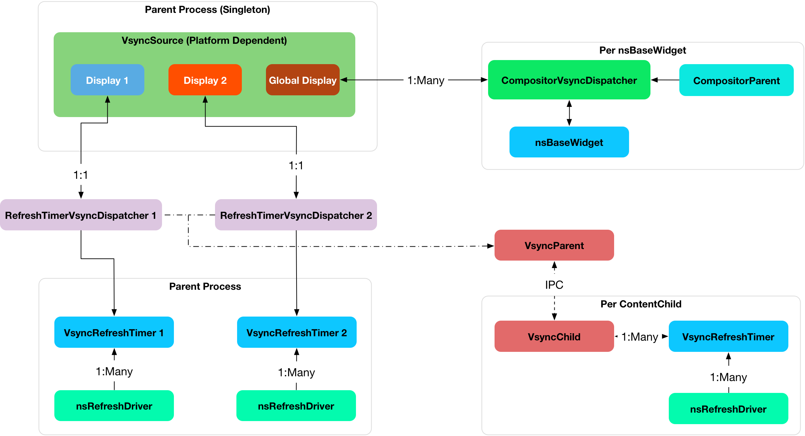

Silk Architecture Overview
=================

#Architecture
Our current architecture is to align three components to hardware vsync timers:

1. Compositor
2. RefreshDriver / Painting
3. Input Events

The flow of our rendering engine is as follows:

1. Hardware Vsync event occurs on an OS specific *Hardware Vsync Thread* on a per monitor basis.
2. The *Hardware Vsync Thread* attached to the monitor notifies the **CompositorVsyncDispatchers** and **RefreshTimerVsyncDispatcher**.
3. For every Firefox window on the specific monitor, notify a **CompositorVsyncDispatcher**. The **CompositorVsyncDispatcher** is specific to one window.
4. The **CompositorVsyncDispatcher** notifies the **Compositor** that a vsync has occured.
5. The **RefreshTimerVsyncDispatcher** notifies the Chrome **RefreshTimer** that a vsync has occured.
6. The **RefreshTimerVsyncDispatcher** sends IPC messages to all content processes to tick their respective active **RefreshTimer**.
7. The **Compositor** dispatches input events on the *Compositor Thread*, then composites. Input events are only dispatched on the *Compositor Thread* on b2g.
8. The **RefreshDriver** paints on the *Main Thread*.

The implementation is broken into the following sections and will reference this figure. Note that **Objects** are bold fonts while *Threads* are italicized.

#Hardware Vsync
Hardware vsync events from (1), occur on a specific **Display** Object.
The **Display** object is responsible for enabling / disabling vsync on a per connected display basis.
For example, if two monitors are connected, two **Display** objects will be created, each listening to vsync events for their respective displays.
We require one **Display** object per monitor as each monitor may have different vsync rates.
As a fallback solution, we have one global **Display** object that can synchronize across all connected displays.
The global **Display** is useful if a window is positioned halfway between the two monitors.
Each platform will have to implement a specific **Display** object to hook and listen to vsync events.
As of this writing, both Firefox OS and OS X create their own hardware specific *Hardware Vsync Thread* that executes after a vsync has occured.
OS X creates one *Hardware Vsync Thread* per **CVDisplayLinkRef**.
We do not currently support multiple displays, so we use one global **CVDisplayLinkRef** that works across all active displays.
On Windows, we have to create a new platform *thread* that waits for DwmFlush(), which works across all active displays.
Once the thread wakes up from DwmFlush(), the actual vsync timestamp is retrieved from DwmGetCompositionTimingInfo(), which is the timestamp that is actually passed into the compositor and refresh driver.

When a vsync occurs on a **Display**, the *Hardware Vsync Thread* callback fetches all **CompositorVsyncDispatchers** associated with the **Display**.
Each **CompositorVsyncDispatcher** is notified that a vsync has occured with the vsync's timestamp.
It is the responsibility of the **CompositorVsyncDispatcher** to notify the **Compositor** that is awaiting vsync notifications.
The **Display** will then notify the associated **RefreshTimerVsyncDispatcher**, which should notify all active **RefreshDrivers** to tick.

All **Display** objects are encapsulated in a **VsyncSource** object.
The **VsyncSource** object lives in **gfxPlatform** and is instantiated only on the parent process when **gfxPlatform** is created.
The **VsyncSource** is destroyed when **gfxPlatform** is destroyed.
There is only one **VsyncSource** object throughout the entire lifetime of Firefox.
Each platform is expected to implement their own **VsyncSource** to manage vsync events.
On Firefox OS, this is through the **HwcComposer2D**.
On OS X, this is through **CVDisplayLinkRef**.
On Windows, it should be through **DwmGetCompositionTimingInfo**.

#Compositor
When the **CompositorVsyncDispatcher** is notified of the vsync event, the **CompositorVsyncObserver** associated with the **CompositorVsyncDispatcher** begins execution.
Since the **CompositorVsyncDispatcher** executes on the *Hardware Vsync Thread* and the **Compositor** composites on the *CompositorThread*, the **CompositorVsyncObserver** posts a task to the *CompositorThread*.
The **CompositorParent** then composites.
The model where the **CompositorVsyncDispatcher** notifies components on the *Hardware Vsync Thread*, and the component schedules the task on the appropriate thread is used everywhere.

The **CompositorVsyncObserver** listens to vsync events as needed and stops listening to vsync when composites are no longer scheduled or required.
Every **CompositorParent** is associated and tied to one **CompositorVsyncObserver**, which is associated with the **CompositorVsyncDispatcher**.
Each **CompositorParent** is associated with one widget and is created when a new platform window or **nsBaseWidget** is created.
The **CompositorParent**, **CompositorVsyncDispatcher**, **CompositorVsyncObserver**, and **nsBaseWidget** all have the same lifetimes, which are created and destroyed together.

###CompositorVsyncDispatcher
The **CompositorVsyncDispatcher** executes on the *Hardware Vsync Thread*.
It contains references to the **nsBaseWidget** it is associated with and has a lifetime equal to the **nsBaseWidget**.
The **CompositorVsyncDispatcher** is responsible for notifying the **CompositorParent** that a vsync event has occured.
There can be multiple **CompositorVsyncDispatchers** per **Display**, one **CompositorVsyncDispatcher** per window.
The only responsibility of the **CompositorVsyncDispatcher** is to notify components when a vsync event has occured, and to stop listening to vsync when no components require vsync events.
We require one **CompositorVsyncDispatcher** per window so that we can handle multiple **Displays**.

###Multiple Displays
The **VsyncSource** has an API to switch a **CompositorVsyncDispatcher** from one **Display** to another **Display**.
For example, when one window either goes into full screen mode or moves from one connected monitor to another.
When one window moves to another monitor, we expect a platform specific notification to occur.
The detection of when a window enters full screen mode or moves is not covered by Silk itself, but the framework is built to support this use case.
The expected flow is that the OS notification occurs on **nsIWidget**, which retrieves the associated **CompositorVsyncDispatcher**.
The **CompositorVsyncDispatcher** then notifies the **VsyncSource** to switch to the correct **Display** the **CompositorVsyncDispatcher** is connected to.
Because the notification works through the **nsIWidget**, the actual switching of the **CompositorVsyncDispatcher** to the correct **Display** should occur on the *Main Thread*.
The current implementation of Silk does not handle this case and needs to be built out.

###CompositorVsyncObserver
The **CompositorVsyncObserver** handles the vsync notifications and interactions with the **CompositorVsyncDispatcher**.
When the **Compositor** requires a scheduled composite, it notifies the **CompositorVsyncObserver** that it needs to listen to vsync.
The **CompositorVsyncObserver** then observes / unobserves vsync as needed from the **CompositorVsyncDispatcher** to enable composites.

###GeckoTouchDispatcher
The **GeckoTouchDispatcher** is a singleton that resamples touch events to smooth out jank while tracking a user's finger.
Because input and composite are linked together, the **CompositorVsyncObserver** has a reference to the **GeckoTouchDispatcher** and vice versa.

###Input Events
One large goal of Silk is to align touch events with vsync events.
On Firefox OS, touchscreens often have different touch scan rates than the display refreshes.
A Flame device has a touch refresh rate of 75 HZ, while a Nexus 4 has a touch refresh rate of 100 HZ, while the device's display refresh rate is 60HZ.
When a vsync event occurs, we resample touch events, and then dispatch the resampled touch event to APZ.
Touch events on Firefox OS occur on a *Touch Input Thread* whereas they are processed by APZ on the *APZ Controller Thread*.
We use [Google Android's touch resampling](http://www.masonchang.com/blog/2014/8/25/androids-touch-resampling-algorithm) algorithm to resample touch events.

Currently, we have a strict ordering between Composites and touch events.
When a touch event occurs on the *Touch Input Thread*, we store the touch event in a queue.
When a vsync event occurs, the **CompositorVsyncDispatcher** notifies the **Compositor** of a vsync event, which notifies the **GeckoTouchDispatcher**.
The **GeckoTouchDispatcher** processes the touch event first on the *APZ Controller Thread*, which is the same as the *Compositor Thread* on b2g, then the **Compositor** finishes compositing.
We require this strict ordering because if a vsync notification is dispatched to both the **Compositor** and **GeckoTouchDispatcher** at the same time, a race condition occurs between processing the touch event and therefore position versus compositing.
In practice, this creates very janky scrolling.
As of this writing, we have not analyzed input events on desktop platforms.

One slight quirk is that input events can start a composite, for example during a scroll and after the **Compositor** is no longer listening to vsync events.
In these cases, we notify the **Compositor** to observe vsync so that it dispatches touch events.
If touch events were not dispatched, and since the **Compositor** is not listening to vsync events, the touch events would never be dispatched.
The **GeckoTouchDispatcher** handles this case by always forcing the **Compositor** to listen to vsync events while touch events are occurring.

###Widget, Compositor, CompositorVsyncDispatcher, GeckoTouchDispatcher Shutdown Procedure
When the [nsBaseWidget shuts down](http://hg.mozilla.org/mozilla-central/file/0df249a0e4d3/widget/nsBaseWidget.cpp#l182) - It calls nsBaseWidget::DestroyCompositor on the *Gecko Main Thread*.
During nsBaseWidget::DestroyCompositor, it first destroys the CompositorChild.
CompositorChild sends a sync IPC call to CompositorParent::RecvStop, which calls [CompositorParent::Destroy](http://hg.mozilla.org/mozilla-central/file/ab0490972e1e/gfx/layers/ipc/CompositorParent.cpp#l509).
During this time, the *main thread* is blocked on the parent process.
CompositorParent::RecvStop runs on the *Compositor thread* and cleans up some resources, including setting the **CompositorVsyncObserver** to nullptr.
CompositorParent::RecvStop also explicitly keeps the CompositorParent alive and posts another task to run CompositorParent::DeferredDestroy on the Compositor loop so that all ipdl code can finish executing.
The **CompositorVsyncObserver** also unobserves from vsync and cancels any pending composite tasks.
Once CompositorParent::RecvStop finishes, the *main thread* in the parent process continues shutting down the nsBaseWidget.

At the same time, the *Compositor thread* is executing tasks until CompositorParent::DeferredDestroy runs, which flushes the compositor message loop.
Now we have two tasks as both the nsBaseWidget releases a reference to the Compositor on the *main thread* during destruction and the CompositorParent::DeferredDestroy releases a reference to the CompositorParent on the *Compositor Thread*.
Finally, the CompositorParent itself is destroyed on the *main thread* once both references are gone due to explicit [main thread destruction](http://hg.mozilla.org/mozilla-central/file/50b95032152c/gfx/layers/ipc/CompositorParent.h#l148).

With the **CompositorVsyncObserver**, any accesses to the widget after nsBaseWidget::DestroyCompositor executes are invalid.
Any accesses to the compositor between the time the nsBaseWidget::DestroyCompositor runs and the CompositorVsyncObserver's destructor runs aren't safe yet a hardware vsync event could occur between these times.
Since any tasks posted on the Compositor loop after CompositorParent::DeferredDestroy is posted are invalid, we make sure that no vsync tasks can be posted once CompositorParent::RecvStop executes and DeferredDestroy is posted on the Compositor thread.
When the sync call to CompositorParent::RecvStop executes, we explicitly set the CompositorVsyncObserver to null to prevent vsync notifications from occurring.
If vsync notifications were allowed to occur, since the **CompositorVsyncObserver**'s vsync notification executes on the *hardware vsync thread*, it would post a task to the Compositor loop and may execute after CompositorParent::DeferredDestroy.
Thus, we explicitly shut down vsync events in the **CompositorVsyncDispatcher** and **CompositorVsyncObserver** during nsBaseWidget::Shutdown to prevent any vsync tasks from executing after CompositorParent::DeferredDestroy.

The **CompositorVsyncDispatcher** may be destroyed on either the *main thread* or *Compositor Thread*, since both the nsBaseWidget and **CompositorVsyncObserver** race to destroy on different threads.
nsBaseWidget is destroyed on the *main thread* and releases a reference to the **CompositorVsyncDispatcher** during destruction.
The **CompositorVsyncObserver** has a race to be destroyed either during CompositorParent shutdown or from the **GeckoTouchDispatcher** which is destroyed on the main thread with [ClearOnShutdown](http://hg.mozilla.org/mozilla-central/file/21567e9a6e40/xpcom/base/ClearOnShutdown.h#l15).
Whichever object, the CompositorParent or the **GeckoTouchDispatcher** is destroyed last will hold the last reference to the **CompositorVsyncDispatcher**, which destroys the object.

#Refresh Driver
The Refresh Driver is ticked from a [single active timer](http://hg.mozilla.org/mozilla-central/file/ab0490972e1e/layout/base/nsRefreshDriver.cpp#l11).
The assumption is that there are multiple **RefreshDrivers** connected to a single **RefreshTimer**.
There are two **RefreshTimers**: an active and an inactive **RefreshTimer**.
Each Tab has its own **RefreshDriver**, which connects to one of the global **RefreshTimers**.
The **RefreshTimers** execute on the *Main Thread* and tick their connected **RefreshDrivers**.
We do not want to break this model of multiple **RefreshDrivers** per a set of two global **RefreshTimers**.
Each **RefreshDriver** switches between the active and inactive **RefreshTimer**.

Instead, we create a new **RefreshTimer**, the **VsyncRefreshTimer** which ticks based on vsync messages.
We replace the current active timer with a **VsyncRefreshTimer**.
All tabs will then tick based on this new active timer.
Since the **RefreshTimer** has a lifetime of the process, we only need to create a single **RefreshTimerVsyncDispatcher** per **Display** when Firefox starts.
Even if we do not have any content processes, the Chrome process will still need a **VsyncRefreshTimer**, thus we can associate the **RefreshTimerVsyncDispatcher** with each **Display**.

When Firefox starts, we initially create a new **VsyncRefreshTimer** in the Chrome process.
The **VsyncRefreshTimer** will listen to vsync notifications from **RefreshTimerVsyncDispatcher** on the global **Display**.
When nsRefreshDriver::Shutdown executes, it will delete the **VsyncRefreshTimer**.
This creates a problem as all the **RefreshTimers** are currently manually memory managed whereas **VsyncObservers** are ref counted.
To work around this problem, we create a new **RefreshDriverVsyncObserver** as an inner class to **VsyncRefreshTimer**, which actually receives vsync notifications. It then ticks the **RefreshDrivers** inside **VsyncRefreshTimer**.

With Content processes, the start up process is more complicated.
We send vsync IPC messages via the use of the PBackground thread on the parent process, which allows us to send messages from the Parent process' without waiting on the *main thread*.
This sends messages from the Parent::*PBackground Thread* to the Child::*Main Thread*.
The *main thread* receiving IPC messages on the content process is acceptable because **RefreshDrivers** must execute on the *main thread*.
However, there is some amount of time required to setup the IPC connection upon process creation and during this time, the **RefreshDrivers** must tick to set up the process.
To get around this, we initially use software **RefreshTimers** that already exist during content process startup and swap in the **VsyncRefreshTimer** once the IPC connection is created.

During nsRefreshDriver::ChooseTimer, we create an async PBackground IPC open request to create a **VsyncParent** and **VsyncChild**.
At the same time, we create a software **RefreshTimer** and tick the **RefreshDrivers** as normal.
Once the PBackground callback is executed and an IPC connection exists, we swap all **RefreshDrivers** currently associated with the active **RefreshTimer** and swap the **RefreshDrivers** to use the **VsyncRefreshTimer**.
Since all interactions on the content process occur on the main thread, there are no need for locks.
The **VsyncParent** listens to vsync events through the **VsyncRefreshTimerDispatcher** on the parent side and sends vsync IPC messages to the **VsyncChild**.
The **VsyncChild** notifies the **VsyncRefreshTimer** on the content process.

During the shutdown process of the content process, ActorDestroy is called on the **VsyncChild** and **VsyncParent** due to the normal PBackground shutdown process.
Once ActorDestroy is called, no IPC messages should be sent across the channel.
After ActorDestroy is called, the IPDL machinery will delete the **VsyncParent/Child** pair.
The **VsyncParent**, due to being a **VsyncObserver**, is ref counted.
After **VsyncParent::ActorDestroy** is called, it unregisters itself from the **RefreshTimerVsyncDispatcher**, which holds the last reference to the **VsyncParent**, and the object will be deleted.

Thus the overall flow during normal execution is:

1. VsyncSource::Display::RefreshTimerVsyncDispatcher receives a Vsync notification from the OS in the parent process.
2. RefreshTimerVsyncDispatcher notifies VsyncRefreshTimer::RefreshDriverVsyncObserver that a vsync occured on the parent process on the hardware vsync thread.
3. RefreshTimerVsyncDispatcher notifies the VsyncParent on the hardware vsync thread that a vsync occured.
4. The VsyncRefreshTimer::RefreshDriverVsyncObserver in the parent process posts a task to the main thread that ticks the refresh drivers.
5. VsyncParent posts a task to the PBackground thread to send a vsync IPC message to VsyncChild.
6. VsyncChild receive a vsync notification on the content process on the main thread and ticks their respective RefreshDrivers.

###Compressing Vsync Messages
Vsync messages occur quite often and the *main thread* can be busy for long periods of time due to JavaScript.
Consistently sending vsync messages to the refresh driver timer can flood the *main thread* with refresh driver ticks, causing even more delays.
To avoid this problem, we compress vsync messages on both the parent and child processes.

On the parent process, newer vsync messages update a vsync timestamp but do not actually queue any tasks on the *main thread*.
Once the parent process' *main thread* executes the refresh driver tick, it uses the most updated vsync timestamp to tick the refresh driver.
After the refresh driver has ticked, one single vsync message is queued for another refresh driver tick task.
On the content process, the IPDL **compress** keyword automatically compresses IPC messages.

### Multiple Monitors
In order to have multiple monitor support for the **RefreshDrivers**, we have multiple active **RefreshTimers**.
Each **RefreshTimer** is associated with a specific **Display** via an id and tick when it's respective **Display** vsync occurs.
We have **N RefreshTimers**, where N is the number of connected displays.
Each **RefreshTimer** still has multiple **RefreshDrivers**.

When a tab or window changes monitors, the **nsIWidget** receives a display changed notification.
Based on which display the window is on, the window switches to the correct **RefreshTimerVsyncDispatcher** and **CompositorVsyncDispatcher** on the parent process based on the display id.
Each **TabParent** should also send a notification to their child.
Each **TabChild**, given the display ID, switches to the correct **RefreshTimer** associated with the display ID.
When each display vsync occurs, it sends one IPC message to notify vsync.
The vsync message contains a display ID, to tick the appropriate **RefreshTimer** on the content process.
There is still only one **VsyncParent/VsyncChild** pair, just each vsync notification will include a display ID, which maps to the correct **RefreshTimer**.

#Object Lifetime
1. CompositorVsyncDispatcher - Lives as long as the nsBaseWidget associated with the VsyncDispatcher
2. CompositorVsyncObserver - Lives and dies the same time as the CompositorParent.
3. RefreshTimerVsyncDispatcher - As long as the associated display object, which is the lifetime of Firefox.
4. VsyncSource - Lives as long as the gfxPlatform on the chrome process, which is the lifetime of Firefox.
5. VsyncParent/VsyncChild - Lives as long as the content process
6. RefreshTimer - Lives as long as the process

#Threads
All **VsyncObservers** are notified on the *Hardware Vsync Thread*. It is the responsibility of the **VsyncObservers** to post tasks to their respective correct thread. For example, the **CompositorVsyncObserver** will be notified on the *Hardware Vsync Thread*, and post a task to the *Compositor Thread* to do the actual composition.

1. Compositor Thread - Nothing changes
2. Main Thread - PVsyncChild receives IPC messages on the main thread. We also enable/disable vsync on the main thread.
3. PBackground Thread - Creates a connection from the PBackground thread on the parent process to the main thread in the content process.
4. Hardware Vsync Thread - Every platform is different, but we always have the concept of a hardware vsync thread. Sometimes this is actually created by the host OS. On Windows, we have to create a separate platform thread that blocks on DwmFlush().
