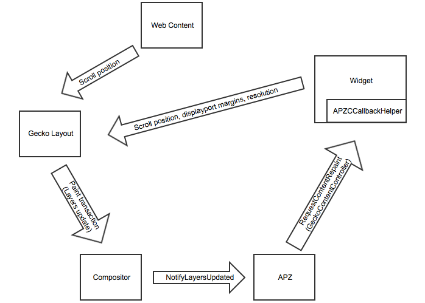

.. _apz:

Asynchronous Panning and Zooming
================================

**This document is a work in progress. Some information may be missing
or incomplete.**

Goals
-----

We need to be able to provide a visual response to user input with
minimal latency. In particular, on devices with touch input, content
must track the finger exactly while panning, or the user experience is
very poor. According to the UX team, 120ms is an acceptable latency
between user input and response.

Context and surrounding architecture
------------------------------------

The fundamental problem we are trying to solve with the Asynchronous
Panning and Zooming (APZ) code is that of responsiveness. By default,
web browsers operate in a “game loop” that looks like this:

::

       while true:
           process input
           do computations
           repaint content
           display repainted content

In browsers the “do computation” step can be arbitrarily expensive
because it can involve running event handlers in web content. Therefore,
there can be an arbitrary delay between the input being received and the
on-screen display getting updated.

Responsiveness is always good, and with touch-based interaction it is
even more important than with mouse or keyboard input. In order to
ensure responsiveness, we split the “game loop” model of the browser
into a multithreaded variant which looks something like this:

::

       Thread 1 (compositor thread)
       while true:
           receive input
           send a copy of input to thread 2
           adjust rendered content based on input
           display adjusted rendered content

       Thread 2 (main thread)
       while true:
           receive input from thread 1
           do computations
           rerender content
           update the copy of rendered content in thread 1

This multithreaded model is called off-main-thread compositing (OMTC),
because the compositing (where the content is displayed on-screen)
happens on a separate thread from the main thread. Note that this is a
very very simplified model, but in this model the “adjust rendered
content based on input” is the primary function of the APZ code.

A couple of notes on APZ's relationship to other browser architecture
improvements:

1. Due to Electrolysis (e10s), Site Isolation (Fission), and GPU Process
   isolation, the above two threads often actually run in different
   processes. APZ is largely agnostic to this, as all communication
   between the two threads for APZ purposes happens using an IPC layer
   that abstracts over communication between threads vs. processes.
2. With the WebRender graphics backend, part of the rendering pipeline is
   also offloaded from the main thread. In this architecture, the
   information sent from the main thread consists of a display list, and
   scrolling-related metadata referencing content in that display list.
   The metadata is kept in a queue until the display list undergoes an
   additional rendering step in the compositor (scene building). At this
   point, we are ready to tell APZ about the new content and have it
   start applying adjustments to it, as further rendering steps beyond
   scene building are done synchronously on each composite.

The compositor in theory can continuously composite previously rendered
content (adjusted on each composite by APZ) to the screen while the
main thread is busy doing other things and rendering new content.

The APZ code takes the input events that are coming in from the hardware
and uses them to figure out what the user is trying to do (e.g. pan the
page, zoom in). It then expresses this user intention in the form of
translation and/or scale transformation matrices. These transformation
matrices are applied to the rendered content at composite time, so that
what the user sees on-screen reflects what they are trying to do as
closely as possible.

Technical overview
------------------

As per the heavily simplified model described above, the fundamental
purpose of the APZ code is to take input events and produce
transformation matrices. This section attempts to break that down and
identify the different problems that make this task non-trivial.

Checkerboarding
~~~~~~~~~~~~~~~

The area of page content for which a display list is built and sent to
the compositor is called the “displayport”. The APZ code is responsible
for determining how large the displayport should be. On the one hand, we
want the displayport to be as large as possible. At the very least it
needs to be larger than what is visible on-screen, because otherwise, as
soon as the user pans, there will be some unpainted area of the page
exposed. However, we cannot always set the displayport to be the entire
page, because the page can be arbitrarily long and this would require an
unbounded amount of memory to store. Therefore, a good displayport size
is one that is larger than the visible area but not so large that it is a
huge drain on memory. Because the displayport is usually smaller than the
whole page, it is always possible for the user to scroll so fast that
they end up in an area of the page outside the displayport. When this
happens, they see unpainted content; this is referred to as
“checkerboarding”, and we try to avoid it where possible.

There are many possible ways to determine what the displayport should be
in order to balance the tradeoffs involved (i.e. having one that is too
big is bad for memory usage, and having one that is too small results in
excessive checkerboarding). Ideally, the displayport should cover
exactly the area that we know the user will make visible. Although we
cannot know this for sure, we can use heuristics based on current
panning velocity and direction to ensure a reasonably-chosen displayport
area. This calculation is done in the APZ code, and a new desired
displayport is frequently sent to the main thread as the user is panning
around.

Multiple scrollable elements
~~~~~~~~~~~~~~~~~~~~~~~~~~~~

Consider, for example, a scrollable page that contains an iframe which
itself is scrollable. The iframe can be scrolled independently of the
top-level page, and we would like both the page and the iframe to scroll
responsively. This means that we want independent asynchronous panning
for both the top-level page and the iframe. In addition to iframes,
elements that have the overflow:scroll CSS property set are also
scrollable. In the display list, scrollable elements are arranged in a
tree structure, and in the APZ code we have a matching tree of
AsyncPanZoomController (APZC) objects, one for each scrollable element.
To manage this tree of APZC instances, we have a single APZCTreeManager
object. Each APZC is relatively independent and handles the scrolling for
its associated scrollable element, but there are some cases in which they
need to interact; these cases are described in the sections below.

Hit detection
~~~~~~~~~~~~~

Consider again the case where we have a scrollable page that contains an
iframe which itself is scrollable. As described above, we will have two
APZC instances - one for the page and one for the iframe. When the user
puts their finger down on the screen and moves it, we need to do some
sort of hit detection in order to determine whether their finger is on
the iframe or on the top-level page. Based on where their finger lands,
the appropriate APZC instance needs to handle the input.

This hit detection is done by APZCTreeManager in collaboration with
WebRender, which has more detailed information about the structure of
the page content than is stored in APZ directly. See
:ref:`this section <wr-hit-test-details>` for more details.

Also note that for some types of input (e.g. when the user puts two
fingers down to do a pinch) we do not want the input to be “split”
across two different APZC instances. In the case of a pinch, for
example, we find a “common ancestor” APZC instance - one that is
zoomable and contains all of the touch input points, and direct the
input to that APZC instance.

Scroll Handoff
~~~~~~~~~~~~~~

Consider yet again the case where we have a scrollable page that
contains an iframe which itself is scrollable. Say the user scrolls the
iframe so that it reaches the bottom. If the user continues panning on
the iframe, the expectation is that the top-level page will start
scrolling. However, as discussed in the section on hit detection, the
APZC instance for the iframe is separate from the APZC instance for the
top-level page. Thus, we need the two APZC instances to communicate in
some way such that input events on the iframe result in scrolling on the
top-level page. This behaviour is referred to as “scroll handoff” (or
“fling handoff” in the case where analogous behaviour results from the
scrolling momentum of the page after the user has lifted their finger).

.. _input-event-untransformation:

Input event untransformation
~~~~~~~~~~~~~~~~~~~~~~~~~~~~

The APZC architecture by definition results in two copies of a “scroll
position” for each scrollable element. There is the original copy on the
main thread that is accessible to web content and the layout and
painting code. And there is a second copy on the compositor side, which
is updated asynchronously based on user input, and corresponds to what
the user visually sees on the screen. Although these two copies may
diverge temporarily, they are reconciled periodically. In particular,
they diverge while the APZ code is performing an async pan or zoom
action on behalf of the user, and are reconciled when the APZ code
requests a repaint from the main thread.

Because of the way input events are represented, this has some
unfortunate consequences. Input event coordinates are represented
relative to the device screen - so if the user touches at the same
physical spot on the device, the same input events will be delivered
regardless of the content scroll position. When the main thread receives
a touch event, it combines that with the content scroll position in order
to figure out what DOM element the user touched. However, because we now
have two different scroll positions, this process may not work perfectly.
A concrete example follows:

Consider a device with screen size 600 pixels tall. On this device, a
user is viewing a document that is 1000 pixels tall, and that is
scrolled down by 200 pixels. That is, the vertical section of the
document from 200px to 800px is visible. Now, if the user touches a
point 100px from the top of the physical display, the hardware will
generate a touch event with y=100. This will get sent to the main
thread, which will add the scroll position (200) and get a
document-relative touch event with y=300. This new y-value will be used
in hit detection to figure out what the user touched. If the document
had a absolute-positioned div at y=300, then that would receive the
touch event.

Now let us add some async scrolling to this example. Say that the user
additionally scrolls the document by another 10 pixels asynchronously
(i.e. only on the compositor thread), and then does the same touch
event. The same input event is generated by the hardware, and as before,
the document will deliver the touch event to the div at y=300. However,
visually, the document is scrolled by an additional 10 pixels so this
outcome is wrong. What needs to happen is that the APZ code needs to
intercept the touch event and account for the 10 pixels of asynchronous
scroll. Therefore, the input event with y=100 gets converted to y=110 in
the APZ code before being passed on to the main thread. The main thread
then adds the scroll position it knows about and determines that the
user touched at a document-relative position of y=310.

Analogous input event transformations need to be done for horizontal
scrolling and zooming.

Content independently adjusting scrolling
~~~~~~~~~~~~~~~~~~~~~~~~~~~~~~~~~~~~~~~~~

As described above, there are two copies of the scroll position in the
APZ architecture - one on the main thread and one on the compositor
thread. Usually for architectures like this, there is a single “source
of truth” value and the other value is simply a copy. However, in this
case that is not easily possible to do. The reason is that both of these
values can be legitimately modified. On the compositor side, the input
events the user is triggering modify the scroll position, which is then
propagated to the main thread. However, on the main thread, web content
might be running Javascript code that programmatically sets the scroll
position (via window.scrollTo, for example). Scroll changes driven from
the main thread are just as legitimate and need to be propagated to the
compositor thread, so that the visual display updates in response.

Because the cross-thread messaging is asynchronous, reconciling the two
types of scroll changes is a tricky problem. Our design solves this
using various flags and generation counters. The general heuristic we
have is that content-driven scroll position changes (e.g. scrollTo from
JS) are never lost. For instance, if the user is doing an async scroll
with their finger and content does a scrollTo in the middle, then some
of the async scroll would occur before the “jump” and the rest after the
“jump”.

Content preventing default behaviour of input events
~~~~~~~~~~~~~~~~~~~~~~~~~~~~~~~~~~~~~~~~~~~~~~~~~~~~

Another problem that we need to deal with is that web content is allowed
to intercept touch events and prevent the “default behaviour” of
scrolling. This ability is defined in web standards and is
non-negotiable. Touch event listeners in web content are allowed call
preventDefault() on the touchstart or first touchmove event for a touch
point; doing this is supposed to “consume” the event and prevent
touch-based panning. As we saw in a previous section, the input event
needs to be untransformed by the APZ code before it can be delivered to
content. But, because of the preventDefault problem, we cannot fully
process the touch event in the APZ code until content has had a chance
to handle it.

To balance the needs of correctness (which calls for allowing web content
to successfully prevent default handling of events if it wishes to) and
responsiveness (which calls for avoiding blocking on web content
Javascript for a potentially-unbounded amount of time before reacting to
an event), APZ gives web content a "deadline" to process the event and
tell APZ whether preventDefault() was called on the event. The deadline
is 400ms from the time APZ receives the event on desktop, and 600ms on
mobile. If web content is able to process the event before this deadline,
the decision to preventDefault() the event or not will be respected. If
web content fails to process the event before the deadline, APZ assumes
preventDefault() will not be called and goes ahead and processes the
event.

To implement this, upon receiving a touch event, APZ immediately returns
an untransformed version that can be dispatched to content. It also
schedules the 400ms or 600ms timeout. There is an API that allows the
main-thread event dispatching code to notify APZ as to whether or not the
default action should be prevented. If the APZ content response timeout
expires, or if the main-thread event dispatching code notifies the APZ of
the preventDefault status, then the APZ continues with the processing of
the events (which may involve discarding the events).

To limit the responsiveness impact of this round-trip to content, APZ
tries to identify cases where it can rule out preventDefault() as a
possible outcome. To this end, the hit-testing information sent to the
compositor includes information about which regions of the page are
occupied by elements that have a touch event listener. If an event
targets an area outside of these regions, preventDefault() can be ruled
out, and the round-trip skipped.

Additionally, recent enhancements to web standards have given page
authors new tools that can further limit the responsiveness impact of
preventDefault():

1. Event listeners can be registered as "passive", which means they
   are not allowed to call preventDefault(). Authors can use this flag
   when writing listeners that only need to observe the events, not alter
   their behaviour via preventDefault(). The presence of passive event
   listeners does not cause APZ to perform the content round-trip.
2. If page authors wish to disable certain types of touch interactions
   completely, they can use the ``touch-action`` CSS property from the
   pointer-events spec to do so declaratively, instead of registering
   event listeners that call preventDefault(). Touch-action flags are
   also included in the hit-test information sent to the compositor, and
   APZ uses this information to respect ``touch-action``. (Note that the
   touch-action information sent to the compositor is not always 100%
   accurate, and sometimes APZ needs to fall back on asking the main
   thread for touch-action information, which again involves a
   round-trip.)

Other event types
~~~~~~~~~~~~~~~~~

The above sections talk mostly about touch events, but over time APZ has
been extended to handle a variety of other event types, such as trackpad
and mousewheel scrolling, scrollbar thumb dragging, and keyboard
scrolling in some cases. Much of the above applies to these other event
types too (for example, wheel events can be prevent-defaulted as well).

Importantly, the "untransformation" described above needs to happen even
for event types which are not handled in APZ, such as mouse click events,
since async scrolling can still affect the correct targeting of such
events.

Technical details
-----------------

This section describes various pieces of the APZ code, and goes into
more specific detail on APIs and code than the previous sections. The
primary purpose of this section is to help people who plan on making
changes to the code, while also not going into so much detail that it
needs to be updated with every patch.

Overall flow of input events
~~~~~~~~~~~~~~~~~~~~~~~~~~~~

This section describes how input events flow through the APZ code.

Disclaimer: some details in this section are out of date (for example,
it assumes the case where the main thread and compositor thread are
in the same process, which is rarely the case these days, so in practice
e.g. steps 6 and 8 involve IPC, not just "stack unwinding").

1.  Input events arrive from the hardware/widget code into the APZ via
    APZCTreeManager::ReceiveInputEvent. The thread that invokes this is
    called the "controller thread", and may or may not be the same as the
    Gecko main thread.
2.  Conceptually the first thing that the APZCTreeManager does is to
    associate these events with “input blocks”. An input block is a set
    of events that share certain properties, and generally are intended
    to represent a single gesture. For example with touch events, all
    events following a touchstart up to but not including the next
    touchstart are in the same block. All of the events in a given block
    will go to the same APZC instance and will either all be processed
    or all be dropped.
3.  Using the first event in the input block, the APZCTreeManager does a
    hit-test to see which APZC it hits. If no APZC is hit, the events are
    discarded and we jump to step 6. Otherwise, the input block is tagged
    with the hit APZC as a tentative target and put into a global APZ
    input queue. In addition the target APZC, the result of the hit test
    also includes whether the input event landed on a "dispatch-to-content"
    region. These are regions of the page where there is something going
    on that requires dispatching the event to content and waiting for
    a response _before_ processing the event in APZ; an example of this
    is a region containing an element with a non-passive event listener,
    as described above. (TODO: Add a section that talks about the other
    uses of the dispatch-to-content mechanism.)
4.

    i.  If the input events landed outside a dispatch-to-content region,
        any available events in the input block are processed. These may
        trigger behaviours like scrolling or tap gestures.
    ii. If the input events landed inside a dispatch-to-content region,
        the events are left in the queue and a timeout is initiated. If
        the timeout expires before step 9 is completed, the APZ assumes
        the input block was not cancelled and the tentative target is
        correct, and processes them as part of step 10.

5.  The call stack unwinds back to APZCTreeManager::ReceiveInputEvent,
    which does an in-place modification of the input event so that any
    async transforms are removed.
6.  The call stack unwinds back to the widget code that called
    ReceiveInputEvent. This code now has the event in the coordinate
    space Gecko is expecting, and so can dispatch it to the Gecko main
    thread.
7.  Gecko performs its own usual hit-testing and event dispatching for
    the event. As part of this, it records whether any touch listeners
    cancelled the input block by calling preventDefault(). It also
    activates inactive scrollframes that were hit by the input events.
8.  The call stack unwinds back to the widget code, which sends two
    notifications to the APZ code on the controller thread. The first
    notification is via APZCTreeManager::ContentReceivedInputBlock, and
    informs the APZ whether the input block was cancelled. The second
    notification is via APZCTreeManager::SetTargetAPZC, and informs the
    APZ of the results of the Gecko hit-test during event dispatch. Note
    that Gecko may report that the input event did not hit any
    scrollable frame at all. The SetTargetAPZC notification happens only
    once per input block, while the ContentReceivedInputBlock
    notification may happen once per block, or multiple times per block,
    depending on the input type.
9.

    i.   If the events were processed as part of step 4(i), the
         notifications from step 8 are ignored and step 10 is skipped.
    ii.  If events were queued as part of step 4(ii), and steps 5-8
         complete before the timeout, the arrival of both notifications
         from step 8 will mark the input block ready for processing.
    iii. If events were queued as part of step 4(ii), but steps 5-8 take
         longer than the timeout, the notifications from step 8 will be
         ignored and step 10 will already have happened.

10. If events were queued as part of step 4(ii) they are now either
    processed (if the input block was not cancelled and Gecko detected a
    scrollframe under the input event, or if the timeout expired) or
    dropped (all other cases). Note that the APZC that processes the
    events may be different at this step than the tentative target from
    step 3, depending on the SetTargetAPZC notification. Processing the
    events may trigger behaviours like scrolling or tap gestures.

If the CSS touch-action property is enabled, the above steps are
modified as follows:

* In step 4, the APZC also requires the allowed touch-action behaviours
  for the input event. This might have been determined as part of the
  hit-test in APZCTreeManager; if not, the events are queued.
* In step 6, the widget code determines the content element at the point
  under the input element, and notifies the APZ code of the allowed
  touch-action behaviours. This notification is sent via a call to
  APZCTreeManager::SetAllowedTouchBehavior on the input thread.
* In step 9(ii), the input block will only be marked ready for processing
  once all three notifications arrive.

Threading considerations
^^^^^^^^^^^^^^^^^^^^^^^^

The bulk of the input processing in the APZ code happens on what we call
“the controller thread”. In practice the controller thread could be the
Gecko main thread, the compositor thread, or some other thread. There are
obvious downsides to using the Gecko main thread - that is,“asynchronous”
panning and zooming is not really asynchronous as input events can only
be processed while Gecko is idle. In an e10s environment, using the Gecko
main thread of the chrome process is acceptable, because the code running
in that process is more controllable and well-behaved than arbitrary web
content. Using the compositor thread as the controller thread could work
on some platforms, but may be inefficient on others. For example, on
Android (Fennec) we receive input events from the system on a dedicated
UI thread. We would have to redispatch the input events to the compositor
thread if we wanted to the input thread to be the same as the compositor
thread. This introduces a potential for higher latency, particularly if
the compositor does any blocking operations - blocking SwapBuffers
operations, for example. As a result, the APZ code itself does not assume
that the controller thread will be the same as the Gecko main thread or
the compositor thread.

Active vs. inactive scrollframes
^^^^^^^^^^^^^^^^^^^^^^^^^^^^^^^^

The number of scrollframes on a page is potentially unbounded. However,
we do not want to create a separate displayport for each scrollframe
right away, as this would require large amounts of memory. Therefore,
scrollframes as designated as either “active” or “inactive”. Active
scrollframes get a displayport, and an APZC on the compositor side.
Inactive scrollframes do not get a displayport (a display list is only
built for their viewport, i.e. what is currently visible) and do not get
an APZC.

Consider a page with a scrollframe that is initially inactive. This
scroll frame does not get an APZC, and therefore events targeting it will
target the APZC for the nearest active scrollable ancestor (let's call it
P; note, the rootmost scroll frame in a given process is always active).
However, the presence of the inactive scroll frame is reflected by a
dispatch-to-content region that prevents events over the frame from
erroneously scrolling P.

When the user starts interacting with that content, the hit-test in the
APZ code hits the dispatch-to-content region of P. The input block
therefore has a tentative target of P when it goes into step 4(ii) in the
flow above. When gecko processes the input event, it must detect the
inactive scrollframe and activate it, as part of step 7. Finally, the
widget code sends the SetTargetAPZC notification in step 8 to notify the
APZ that the input block should really apply to this new APZC. An issue
here is that the transaction containing metadata for the newly active
scroll frame must reach the compositor and APZ before the SetTargetAPZC
notification. If this does not occur within the 400ms timeout, the APZ
code will be unable to update the tentative target, and will continue to
use P for that input block. Input blocks that start after the transaction
will get correctly routed to the new scroll frame as there will now be an
APZC instance for the active scrollframe.

This model implies that when the user initially attempts to scroll an
inactive scrollframe, it may end up scrolling an ancestor scrollframe.
Only after the round-trip to the gecko thread is complete is there an
APZC for async scrolling to actually occur on the scrollframe itself. At
that point the scrollframe will start receiving new input blocks and will
scroll normally.

Note: with Fission (where inactive scroll frames would make it impossible
to target the correct process in all situations; see
:ref:`this section <fission-hit-testing>` for more details) and WebRender
(which makes displayports more lightweight as the actual rendering is
offloaded to the compositor and can be done on demand), inactive scroll
frames are being phased out, and we are moving towards a model where all
scroll frames with nonempty scroll ranges are active and get a
displayport and an APZC. To conserve memory, displayports for scroll
frames which have not been recently scrolled are kept to a "minimal" size
equal to the viewport size.

WebRender Integration
~~~~~~~~~~~~~~~~~~~~~

This section describes how APZ interacts with the WebRender graphics
backend.

Note that APZ predates WebRender, having initially been written to work
with the earlier Layers graphics backend. The design of Layers has
influenced APZ significantly, and this still shows in some places in the
code. Now that the Layers backend has been removed, there may be
opportunities to streamline the interaction between APZ and WebRender.

HitTestingTree
^^^^^^^^^^^^^^

The APZCTreeManager keeps as part of its internal state a tree of
HitTestingTreeNode instances. This is referred to as the HitTestingTree.

The main purpose of the HitTestingTree is to model the spatial
relationships between content that's affected by async scrolling. Tree
nodes fall roughly into the following categories:

* Nodes representing scrollable content in an active scroll frame. These
  nodes are associated with the scroll frame's APZC.
* Nodes representing other content that may move in special ways in
  response to async scrolling, such as fixed content, sticky content, and
  scrollbars.
* (Non-leaf) nodes which do not represent any content, just metadata
  (e.g. a transform) that applies to its descendant nodes.

An APZC may be associated with multiple nodes, if e.g. a scroll frame
scrolls two pieces of content that are interleaved with non-scrolling
content.

Arranging these nodes in a tree allows modelling relationships such as
what content is scrolled by a given scroll frame, what the scroll handoff
relationships are between APZCs, and what content is subject to what
transforms.

An additional use of the HitTestingTree is to allow APZ to keep content
processes up to date about enclosing transforms that they are subject to.
See :ref:`this section <sending-transforms-to-content-processes>` for
more details.

(In the past, with the Layers backend, the HitTestingTree was also used
for compositor hit testing, hence the name. This is no longer the case,
and there may be opportunities to simplify the tree as a result.)

The HitTestingTree is created from another tree data structure called
WebRenderScrollData. The relevant types here are:

* WebRenderScrollData which stores the entire tree.
* WebRenderLayerScrollData, which represents a single "layer" of content,
  i.e. a group of display items that move together when scrolling (or
  metadata applying to a subtree of such layers). In the Layers backend,
  such content would be rendered into a single texture which could then
  be moved asynchronously at composite time. Since a layer of content can
  be scrolled by multiple (nested) scroll frames, a
  WebRenderLayerScrollData may contain scroll metadata for more than one
  scroll frame.
* WebRenderScrollDataWrapper, which wraps WebRenderLayerScrollData
  but "expanded" in a way that each node only stores metadata for
  a single scroll frame. WebRenderScrollDataWrapper nodes have a
  1:1 correspondence with HitTestingTreeNodes.

It's not clear whether the distinction between WebRenderLayerScrollData
and WebRenderScrollDataWrapper is still useful in a WebRender-only world.
The code could potentially be revised such that we directly build and
store nodes of a single type with the behaviour of
WebRenderScrollDataWrapper.

The WebRenderScrollData structure is built on the main thread, and
then shipped over IPC to the compositor where it's used to construct
the HitTestingTree.

WebRenderScrollData is built in WebRenderCommandBuilder, during the
same traversal of the Gecko display list that is used to build the
WebRender display list. As of this writing, the architecture for this is
that, as we walk the Gecko display list, we query it to see if it
contains any information that APZ might need to know (e.g. CSS
transforms) via a call to ``nsDisplayItem::UpdateScrollData(nullptr,
nullptr)``. If this call returns true, we create a
WebRenderLayerScrollData instance for the item, and populate it with the
necessary information in ``WebRenderLayerScrollData::Initialize``. We also
create WebRenderLayerScrollData instances if we detect (via ASR changes)
that we are now processing a Gecko display item that is in a different
scrollframe than the previous item.

The main sources of complexity in this code come from:

1. Ensuring the ScrollMetadata instances end on the proper
   WebRenderLayerScrollData instances (such that every path from a leaf
   WebRenderLayerScrollData node to the root has a consistent ordering of
   scrollframes without duplications).
2. The deferred-transform optimization that is described in more detail
   at the declaration of ``StackingContextHelper::mDeferredTransformItem``.

.. _wr-hit-test-details:

Hit-testing
^^^^^^^^^^^

Since the HitTestingTree is not used for actual hit-testing purposes
with the WebRender backend (see previous section), this section describes
how hit-testing actually works with WebRender.

The Gecko display list contains display items
(``nsDisplayCompositorHitTestInfo``) that store hit-testing state. These
items implement the ``CreateWebRenderCommands`` method and generate a "hit-test
item" into the WebRender display list. This is basically just a rectangle
item in the WebRender display list that is no-op for painting purposes,
but contains information that should be returned by the hit-test (specifically
the hit info flags and the scrollId of the enclosing scrollframe). The
hit-test item gets clipped and transformed in the same way that all the other
items in the WebRender display list do, via clip chains and enclosing
reference frame/stacking context items.

When WebRender needs to do a hit-test, it goes through its display list,
taking into account the current clips and transforms, adjusted for the
most recent async scroll/zoom, and determines which hit-test item(s) are under
the target point, and returns those items. APZ can then take the frontmost
item from that list (or skip over it if it happens to be inside a OOP
subdocument that's ``pointer-events:none``) and use that as the hit target.
Note that the hit-test uses the last transform provided by the
``SampleForWebRender`` API (see next section) which generally reflects the
last composite, and doesn't take into account further changes to the
transforms that have occurred since then. In practice, we should be
compositing frequently enough that this doesn't matter much.

When debugging hit-test issues, it is often useful to apply the patches
on bug 1656260, which introduce a guid on Gecko display items and propagate
it all the way through to where APZ gets the hit-test result. This allows
answering the question "which nsDisplayCompositorHitTestInfo was responsible
for this hit-test result?" which is often a very good first step in
solving the bug. From there, one can determine if there was some other
display item in front that should have generated a
nsDisplayCompositorHitTestInfo but didn't, or if display item itself had
incorrect information. The second patch on that bug further allows exposing
hand-written debug info to the APZ code, so that the WR hit-testing
mechanism itself can be more effectively debugged, in case there is a problem
with the WR display items getting improperly transformed or clipped.

The information returned by WebRender to APZ in response to the hit test
is enough for APZ to identify a HitTestingTreeNode as the target of the
event. APZ can then take actions such as scrolling the target node's
associated APZC, or other appropriate actions (e.g. initiating a scrollbar
drag if a scrollbar thumb node was targeted by a mouse-down event).

Sampling
^^^^^^^^

The compositing step needs to read the latest async transforms from APZ
in order to ensure scrollframes are rendered at the right position. The API for this is
exposed via the ``APZSampler`` class. When WebRender is ready to do a composite,
it invokes ``APZSampler::SampleForWebRender``. In here, APZ gathers all async
transforms that WebRender needs to know about, including transforms to apply
to scrolled content, fixed and sticky content, and scrollbar thumbs.

Along with sampling the APZ transforms, the compositor also triggers APZ
animations to advance to the next timestep (usually the next vsync). This
happens just before reading the APZ transforms.

Fission Integration
~~~~~~~~~~~~~~~~~~~

This section describes how APZ interacts with the Fission (Site Isolation)
project.

Introduction
^^^^^^^^^^^^

Fission is an architectural change motivated by security considerations,
where web content from each origin is isolated in its own process. Since
a page can contain a mixture of content from different origins (for
example, the top level page can be content from origin A, and it can
contain an iframe with content from origin B), that means that rendering
and interacting with a page can now involve coordination between APZ and
multiple content processes.

.. _fission-hit-testing:

Content Process Selection for Input Events
^^^^^^^^^^^^^^^^^^^^^^^^^^^^^^^^^^^^^^^^^^

Input events are initially received in the browser's parent process.
With Fission, the browser needs to decide which of possibly several
content processes an event is targeting.

Since process boundaries correspond to iframe (subdocument) boundaries,
and every (html) document has a root scroll frame, process boundaries are
therefore also scroll frame boundaries. Since APZ already needs a hit
test mechanism to be able to determine which scroll frame an event
targets, this hit test mechanism was a good fit to also use to determine
which content process an event targets.

APZ's hit test was therefore expanded to serve this purpose as well. This
mostly required only minor modifications, such as making sure that APZ
knows about the root scroll frames of iframes even if they're not
scrollable. Since APZ already needs to process all input events to
potentially apply :ref:`untransformations <input-event-untransformation>`
related to async scrolling, as part of this process it now also labels
input events with information identifying which content process they
target.

Hit Testing Accuracy
^^^^^^^^^^^^^^^^^^^^

Prior to Fission, APZ's hit test could afford to be somewhat inaccurate,
as it could fall back on the dispatch-to-content mechanism to wait for
a more accurate answer from the main thread if necessary, suffering a
performance cost only (not a correctness cost).

With Fission, an inaccurate compositor hit test now implies a correctness
cost, as there is no cross-process main-thread fallback mechanism.
(Such a mechanism was considered, but judged to require too much
complexity and IPC traffic to be worth it.)

Luckily, with WebRender the compositor has much more detailed information
available to use for hit testing than it did with Layers. For example,
the compositor can perform accurate hit testing even in the presence of
irregular shapes such as rounded corners.

APZ leverages WebRender's more accurate hit testing ability to aim to
accurately select the target process (and target scroll frame) for an
event in general.

One consequence of this is that the dispatch-to-content mechanism is now
used less often than before (its primary remaining use is handling
`preventDefault()`).

.. _sending-transforms-to-content-processes:

Sending Transforms To Content Processes
^^^^^^^^^^^^^^^^^^^^^^^^^^^^^^^^^^^^^^^

Content processes sometimes need to be able to convert between screen
coordinates and their local coordinates. To do this, they need to know
about any transforms that their containing iframe and its ancestors are
subject to, including async transforms (particularly in cases where the
async transforms persist for more than just a few frames).

APZ has information about these transforms in its HitTestingTree. With
Fission, APZ periodically sends content processes information about these
transforms so that they are kept relatively up to date.

Testing
-------

APZ makes use of several test frameworks to verify the expected behavior
is seen.

Mochitest
~~~~~~~~~

The APZ specific mochitests are useful when specific gestures or events need to be tested
with specific content. The APZ mochitests are located in `gfx/layers/apz/test/mochitest`_.
To run all of the APZ mochitests, run something like the following:

::

    ./mach mochitest ./gfx/layers/apz/test/mochitest

The APZ mochitests are often organized as subtests that run in a group. For example,
the `test_group_hittest-2.html`_ contains >20 subtests like
`helper_hittest_overscroll.html`_. When working on a specific subtest, it is often
helpful to use the `apz.subtest` preference to filter the subtests run to just the
tests you are working on. For example, the following would only run the
`helper_hittest_overscroll.html`_ subtest of the `test_group_hittest-2.html`_ group.

::

    ./mach mochitest --setpref apz.subtest=helper_hittest_overscroll.html \
        ./gfx/layers/apz/test/mochitest/test_group_hittest-2.html

For more information on mochitest, see the `Mochitest Documentation`_.

.. _gfx/layers/apz/test/mochitest: https://searchfox.org/mozilla-central/source/gfx/layers/apz/test/mochitest
.. _test_group_hittest-2.html: https://searchfox.org/mozilla-central/source/gfx/layers/apz/test/mochitest/test_group_hittest-2.html
.. _helper_hittest_overscroll.html: https://searchfox.org/mozilla-central/source/gfx/layers/apz/test/mochitest/helper_hittest_overscroll.html
.. _Mochitest Documentation: /testing/mochitest-plain/index.html

GTest
~~~~~

The APZ specific GTests can be found in `gfx/layers/apz/test/gtest/`_. To run
these tests, run something like the following:

::

    ./mach gtest "APZ*"

For more information, see the `GTest Documentation`_.

.. _GTest Documentation: /gtest/index.html
.. _gfx/layers/apz/test/gtest/: https://searchfox.org/mozilla-central/source/gfx/layers/apz/test/gtest/

Reftests
~~~~~~~~

The APZ reftests can be found in `layout/reftests/async-scrolling/`_ and
`gfx/layers/apz/test/reftest`_. To run the relevant reftests for APZ, run
a large portion of the APZ reftests, run something like the following:

::

    ./mach reftest ./layout/reftests/async-scrolling/

Useful information about the reftests can be found in the `Reftest Documentation`_.

There is no defined process for choosing which directory the APZ reftests
should be placed in, but in general reftests should exist where other
similar tests do.

.. _layout/reftests/async-scrolling/: https://searchfox.org/mozilla-central/source/layout/reftests/async-scrolling/
.. _gfx/layers/apz/test/reftest: https://searchfox.org/mozilla-central/source/gfx/layers/apz/test/reftest/
.. _Reftest Documentation: /layout/Reftest.html

Threading / Locking Overview
----------------------------

Threads
~~~~~~~

There are three threads relevant to APZ: the **controller thread**,
the **updater thread**, and the **sampler thread**. This table lists
which threads play these roles on each platform / configuration:

===================== ============= ============== =============
APZ Thread Name       Desktop       Desktop+GPU    Android
===================== ============= ============== =============
**controller thread** UI main       GPU main       Java UI
**updater thread**    SceneBuilder  SceneBuilder   SceneBuilder
**sampler thread**    RenderBackend RenderBackend  RenderBackend
===================== ============= ============== =============

Locks
~~~~~

There are also a number of locks used in APZ code:

======================= ==============================
Lock type               How many instances
======================= ==============================
APZ tree lock           one per APZCTreeManager
APZC map lock           one per APZCTreeManager
APZC instance lock      one per AsyncPanZoomController
APZ test lock           one per APZCTreeManager
Checkerboard event lock one per AsyncPanZoomController
======================= ==============================

Thread / Lock Ordering
~~~~~~~~~~~~~~~~~~~~~~

To avoid deadlocks, the threads and locks have a global **ordering**
which must be respected.

Respecting the ordering means the following:

- Let "A < B" denote that A occurs earlier than B in the ordering
- Thread T may only acquire lock L, if T < L
- A thread may only acquire lock L2 while holding lock L1, if L1 < L2
- A thread may only block on a response from another thread T while holding a lock L, if L < T

**The lock ordering is as follows**:

1. UI main
2. GPU main (only if GPU process enabled)
3. Compositor thread
4. SceneBuilder thread
5. **APZ tree lock**
6. RenderBackend thread
7. **APZC map lock**
8. **APZC instance lock**
9. **APZ test lock**
10. **Checkerboard event lock**

Example workflows
^^^^^^^^^^^^^^^^^

Here are some example APZ workflows. Observe how they all obey
the global thread/lock ordering. Feel free to add others:

- **Input handling** (with GPU process): UI main -> GPU main -> APZ tree lock -> RenderBackend thread
- **Sync messages** in ``PCompositorBridge.ipdl``: UI main thread -> Compositor thread
- **GetAPZTestData**: Compositor thread -> SceneBuilder thread -> test lock
- **Scene swap**: SceneBuilder thread -> APZ tree lock -> RenderBackend thread
- **Updating hit-testing tree**: SceneBuilder thread -> APZ tree lock -> APZC instance lock
- **Updating APZC map**: SceneBuilder thread -> APZ tree lock -> APZC map lock
- **Sampling and animation deferred tasks** [1]_: RenderBackend thread -> APZC map lock -> APZC instance lock
- **Advancing animations**: RenderBackend thread -> APZC instance lock

.. [1] It looks like there are two deferred tasks that actually need the tree lock,
   ``AsyncPanZoomController::HandleSmoothScrollOverscroll`` and
   ``AsyncPanZoomController::HandleFlingOverscroll``. We should be able to rewrite
   these to use the map lock instead of the tree lock.
   This will allow us to continue running the deferred tasks on the sampler
   thread rather than having to bounce them to another thread.
