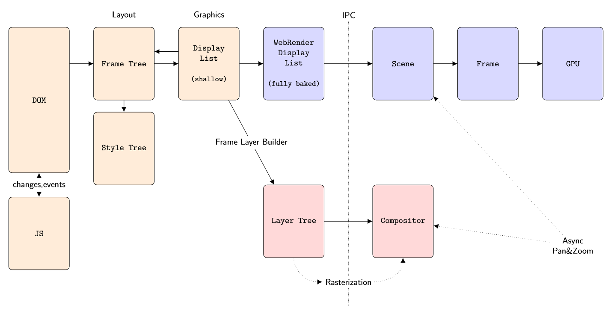
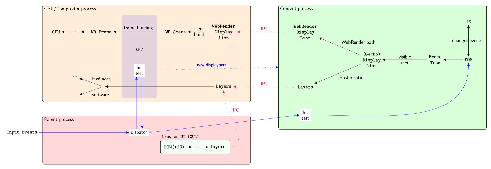
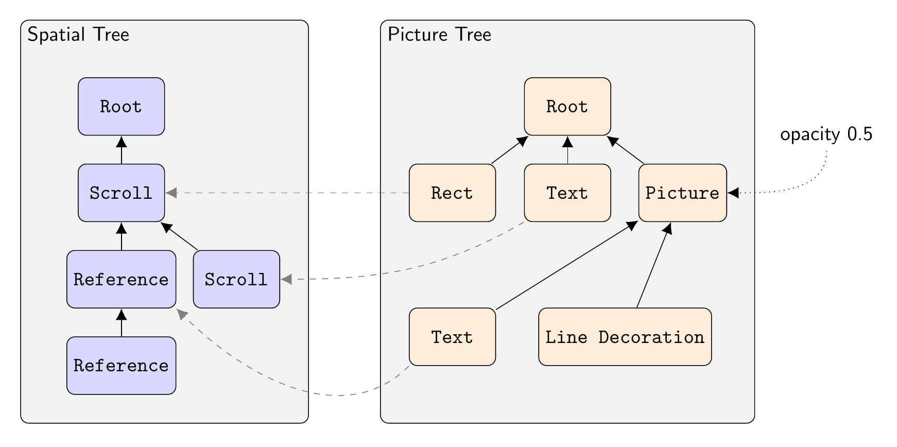
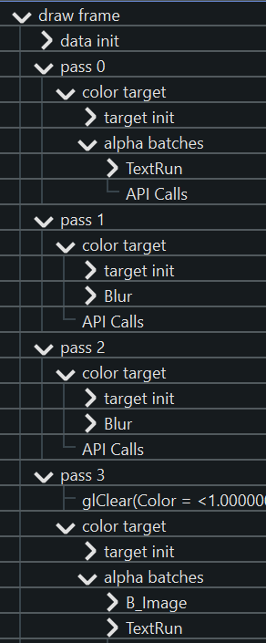

Rendering Overview
==================

This document is an overview of the steps to render a webpage, and how HTML
gets transformed and broken down, step by step, into commands that can execute
on the GPU.

If you're coming into the graphics team with not a lot of background
in browsers, start here :)

.. contents::

High level overview
-------------------



Layout
~~~~~~
Starting at the left in the above image, we have a document
represented by a DOM - a Document Object Model.  A Javascript engine
will execute JS code, either to make changes to the DOM, or to respond to
events generated by the DOM (or do both).

The DOM is a high level description and we don't know what to draw or
where until it is combined with a Cascading Style Sheet (CSS).
Combining these two and figuring out what, where and how to draw
things is the responsibility of the Layout team.  The
DOM is converted into a hierarchical Frame Tree, which nests visual
elements (boxes).  Each element points to some node in a Style Tree
that describes what it should look like -- color, transparency, etc.
The result is that now we know exactly what to render where, what goes
on top of what (layering and blending) and at what pixel coordinate.
This is the Display List.

The Display List is a light-weight data structure because it's shallow
-- it mostly points back to the Frame Tree.  There are two problems
with this.  First, we want to cross process boundaries at this point.
Everything up until now happens in a Content Process (of which there are
several).  Actual GPU rendering happens in a GPU Process (on some
platforms).  Second, everything up until now was written in C++; but
WebRender is written in Rust.  Thus the shallow Display List needs to
be serialized in a completely self-contained binary blob that will
survive Interprocess Communication (IPC) and a language switch (C++ to
Rust).  The result is the WebRender Display List.

WebRender
~~~~~~~~~

The GPU process receives the WebRender Display List blob and
de-serializes it into a Scene.  This Scene contains more than the
strictly visible elements; for example, to anticipate scrolling, we
might have several paragraphs of text extending past the visible page.

For a given viewport, the Scene gets culled and stripped down to a
Frame.  This is also where we start preparing data structures for GPU
rendering, for example getting some font glyphs into an atlas for
rasterizing text.

The final step takes the Frame and submits commands to the GPU to
actually render it.  The GPU will execute the commands and composite
the final page.

Software
~~~~~~~~

The above is the new WebRender-enabled way to do things.  But in the
schematic you'll note a second branch towards the bottom: this is the
legacy code path which does not use WebRender (nor Rust).  In this
case, the Display List is converted into a Layer Tree. The purpose of
this Tree is to try and avoid having to re-render absolutely
everything when the page needs to be refreshed. For example, when
scrolling we should be able to redraw the page by mostly shifting
things around. However that requires those 'things' to still be around
from last time we drew the page.  In other words, visual elements that
are likely to be static and reusable need to be drawn into their own
private "page" (a cache).  Then we can recombine (composite) all of
these when redrawing the actual page.

Figuring out which elements would be good candidates for this, and
striking a balance between good performance versus excessive memory
use, is the purpose of the Layer Tree.  Each 'layer' is a cached image
of some element(s).  This logic also takes occlusion into account, eg.
don't allocate and render a layer for elements that are known to be
completely obscured by something in front of them.

Redrawing the page by combining the Layer Tree with any newly
rasterized elements is the job of the Compositor.


Even when a layer cannot be reused in its entirety, it is likely
that only a small part of it was invalidated.  Thus there is an
elaborate system for tracking dirty rectangles, starting an update by
copying the area that can be salvaged, and then redrawing only what
cannot.

In fact, this idea can be extended to delta-tracking of display lists
themselves. Traversing the layout tree and building a display list is
also not cheap, so the code tries to partially invalidate and rebuild
the display list incrementally when possible.
This optimization is used both for non-WebRender and WebRender in
fact.


Asynchronous Panning And Zooming
~~~~~~~~~~~~~~~~~~~~~~~~~~~~~~~~
Earlier we mentioned that a Scene might contain more elements than are
strictly necessary for rendering what's visible (the Frame).  The
reason for that is Asynchronous Panning and Zooming, or APZ for short.
The browser will feel much more responsive if scrolling & zooming can
short-circuit all of these data transformations and IPC boundaries,
and instead directly update an offset of some layer and recomposite.
(Think of late-latching in a VR context)

This simple idea introduces a lot of complexity: how much extra do you
rasterize, and in which direction?  How much memory can we afford?
What about Javascript that responds to scroll events and perhaps does
something 'interesting' with the page in return?  What about nested
frames or nested scrollbars?  What if we scroll so much that we go
past the boundaries of the Scene that we know about?

See AsyncPanZoom.rst for all that and more.

A Few More Details
~~~~~~~~~~~~~~~~~~

Here's another schematic which basically repeats the previous one, but
showing a little bit more detail.  Note that the direction is reversed
-- the data flow starts at the right.  Sorry about that :)



Some things to note:

- there are multiple content processes, currently 4 of them.  This is
  for security reasons (sandboxing), stability (isolate crashes) and
  performance (multi-core machines);
- ideally each "webpage" would run in its own process for security;
  this is being developed under the term 'fission';
- there is only a single GPU process, if there is one at all;
  some platforms have it as part of the Parent;
- not shown here is the Extension process that isolates WebExtensions;
- for non-WebRender, rasterization happens in the Content Process, and
  we send entire Layers to the GPU/Compositor process (via shared
  memory, only using actual IPC for its metadata like width & height);
- if the GPU process crashes (a bug or a driver issue) we can simply
  restart it, resend the display list, and the browser itself doesn't crash;
- the browser UI is just another set of DOM+JS, albeit one that runs
  with elevated privileges. That is, its JS can do things that
  normal JS cannot.  It lives in the Parent Process, which then uses
  IPC to get it rendered, same as regular Content. (the IPC arrow also
  goes to WebRender Display List but is omitted to reduce clutter);
- UI events get routed to APZ first, to minimize latency. By running
  inside the GPU process, we may have access to data such
  as rasterized clipping masks that enables finer grained hit testing;
- the GPU process talks back to the content process; in particular,
  when APZ scrolls out of bounds, it asks Content to enlarge/shift the
  Scene with a new "display port";
- we still use the GPU when we can for compositing even in the
  non-WebRender case;


WebRender In Detail
-------------------

Converting a display list into GPU commands is broken down into a
number of steps and intermediate data structures.




..

    *Each element in the picture tree points to exactly one node in the spatial
    tree. Only a few of these links are shown for clarity (the dashed lines).*

The Picture Tree
~~~~~~~~~~~~~~~~

The incoming display list uses "stacking contexts".  For example, to
render some text with a drop shadow, a display list will contain three
items:

- "enable shadow" with some parameters such as shadow color, blur size, and offset;
- the text item;
- "pop all shadows" to deactivate shadows;

WebRender will break this down into two distinct elements, or
"pictures".  The first represents the shadow, so it contains a copy of the
text item, but modified to use the shadow's color, and to shift the
text by the shadow's offset.  The second picture contains the original text
to draw on top of the shadow.

The fact that the first picture, the shadow, needs to be blurred, is a
"compositing" property of the picture which we'll deal with later.

Thus, the stack-based display list gets converted into a list of pictures
-- or more generally, a hierarchy of pictures, since items are nested
as per the original HTML.

Example visual elements are a TextRun, a LineDecoration, or an Image
(like a .png file).

Compared to 3D rendering, the picture tree is similar to a scenegraph: it's a
parent/child hierarchy of all the drawable elements that make up the "scene", in
this case the webpage.  One important difference is that the transformations are
stored in a separate tree, the spatial tree.

The Spatial Tree
~~~~~~~~~~~~~~~~

The nodes in the spatial tree represent coordinate transforms.  Every time the
DOM hierarchy needs child elements to be transformed relative to their parent,
we add a new Spatial Node to the tree. All those child elements will then point
to this node as their "local space" reference (aka coordinate frame).  In
traditional 3D terms, it's a scenegraph but only containing transform nodes.

The nodes are called frames, as in "coordinate frame":

- a Reference Frame corresponds to a ``<div>``;
- a Scrolling Frame corresponds to a scrollable part of the page;
- a Sticky Frame corresponds to some fixed position CSS style.

Each element in the picture tree then points to a spatial node inside this tree,
so by walking up and down the tree we can find the absolute position of where
each element should render (traversing down) and how large each element needs to
be (traversing up).  Originally the transform information was part of the
picture tree, as in a traditional scenegraph, but visual elements and their
transforms were split apart for technical reasons.

Some of these nodes are dynamic.  A scroll-frame can obviously scroll, but a
Reference Frame might also use a property binding to enable a live link with
JavaScript, for dynamic updates of (currently) the transform and opacity.

Axis-aligned transformations (scales and translations) are considered "simple",
and are conceptually combined into a single "CoordinateSystem".  When we
encounter a non-axis-aligned transform, we start a new CoordinateSystem.  We
start in CoordinateSystem 0 at the root, and would bump this to CoordinateSystem
1 when we encounter a Reference Frame with a rotation or 3D transform, for
example.  This would then be the CoordinateSystem index for all its children,
until we run into another (nested) non-simple transform, and so on.  Roughly
speaking, as long as we're in the same CoordinateSystem, the transform stack is
simple enough that we have a reasonable chance of being able to flatten it. That
lets us directly rasterize text at its final scale for example, optimizing
away some of the intermediate pictures (offscreen textures).

The layout code positions elements relative to their parent.  Thus to position
the element on the actual page, we need to walk the Spatial Tree all the way to
the root and apply each transform; the result is a ``LayoutToWorldTransform``.

One final step transforms from World to Device coordinates, which deals with
DPI scaling and such.

.. csv-table::
    :header: "WebRender term", "Rough analogy"

      Spatial Tree, Scenegraph -- transforms only
      Picture Tree, Scenegraph -- drawables only (grouping)
      Spatial Tree Rootnode, World Space
      Layout space, Local/Object Space
      Picture, RenderTarget (sort of; see RenderTask below)
      Layout-To-World transform, Local-To-World transform
      World-To-Device transform, World-To-Clipspace transform


The Clip Tree
~~~~~~~~~~~~~

Finally, we also have a Clip Tree, which contains Clip Shapes. For
example, a rounded corner div will produce a clip shape, and since
divs can be nested, you end up with another tree.  By pointing at a Clip Shape,
visual elements will be clipped against this shape plus all parent shapes above it
in the Clip Tree.

As with CoordinateSystems, a chain of simple 2D clip shapes can be collapsed
into something that can be handled in the vertex shader, at very little extra
cost.  More complex clips must be rasterized into a mask first, which we then
sample from to ``discard`` in the pixel shader as needed.

In summary, at the end of scene building the display list turned into
a picture tree, plus a spatial tree that tells us what goes where
relative to what, plus a clip tree.

RenderTask Tree
~~~~~~~~~~~~~~~

Now in a perfect world we could simply traverse the picture tree and start
drawing things: one drawcall per picture to render its contents, plus one
drawcall to draw the picture into its parent.  However, recall that the first
picture in our example is a "text shadow" that needs to be blurred.  We can't
just rasterize blurry text directly, so we need a number of steps or "render
passes" to get the intended effect:



- rasterize the text into an offscreen rendertarget;
- apply one or more downscaling passes until the blur radius is reasonable;
- apply a horizontal Gaussian blur;
- apply a vertical Gaussian blur;
- use the result as an input for whatever comes next, or blit it to
  its final position on the page (or more generally, on the containing
  parent surface/picture).

In the general case, which passes we need and how many of them depends
on how the picture is supposed to be composited (CSS filters, SVG
filters, effects) and its parameters (very large vs. small blur
radius, say).

Thus, we walk the picture tree and build a render task tree: each high
level abstraction like "blur me" gets broken down into the necessary
render passes to get the effect.  The result is again a tree because a
render pass can have multiple input dependencies (eg. blending).

(Cfr. games, this has echoes of the Frostbite Framegraph in that it
dynamically builds up a renderpass DAG and dynamically allocates storage
for the outputs).

If there are complicated clip shapes that need to be rasterized first,
so their output can be sampled as a texture for clip/discard
operations, that would also end up in this tree as a dependency... (I think?).

Once we have the entire tree of dependencies, we analyze it to see
which tasks can be combined into a single pass for efficiency.  We
ping-pong rendertargets when we can, but sometimes the dependencies
cut across more than one level of the rendertask tree, and some
copying is necessary.

Once we've figured out the passes and allocated storage for anything
we wish to persist in the texture cache, we finally start rendering.

When rasterizing the elements into the Picture's offscreen texture, we'd
position them by walking the transform hierarchy as far up as the picture's
transform node, resulting in a ``Layout To Picture`` transform.  The picture
would then go onto the page using a ``Picture To World`` coordinate transform.

Caching
```````

Just as with layers in the software rasterizer, it is not always necessary to
redraw absolutely everything when parts of a document change.  The webrender
equivalent of layers is Slices -- a grouping of pictures that are expected to
render and update together.  Slices are automatically created based on
heuristics and layout hints/flags.

Implementation wise, slices reuse a lot of the existing machinery for Pictures;
in fact they're implemented as a "Virtual picture" of sorts.  The similarities
make sense: both need to allocate offscreen textures in a cache, both will
position and render all their children into it, and both then draw themselves
into their parent as part of the parent's draw.

If a slice isn't expected to change much, we give it a TileCacheInstance. It is
itself made up of Tiles, where each tile will track what's in it, what's
changing, and if it needs to be invalidated and redrawn or not as a result.
Thus the "damage" from changes can be localized to single tiles, while we
salvage the rest of the cache.  If tiles keep seeing a lot of invalidations,
they will recursively divide themselves in a quad-tree like structure to try and
localize the invalidations.  (And conversely, they'll recombine children if
nothing is invalidating them "for a while").

Interning
`````````

To spot invalidated tiles, we need a fast way to compare its contents from the
previous frame with the current frame.  To speed this up, we use interning;
similar to string-interning, this means that each ``TextRun``, ``Decoration``,
``Image`` and so on is registered in a repository (a ``DataStore``) and
consequently referred to by its unique ID. Cache contents can then be encoded as a
list of IDs (one such list per internable element type).  Diffing is then just a
fast list comparison.


Callbacks
`````````
GPU text rendering assumes that the individual font-glyphs are already
available in a texture atlas.  Likewise SVG is not being rendered on
the GPU.  Both inputs are prepared during scene building; glyph
rasterization via a thread pool from within Rust itself, and SVG via
opaque callbacks (back to C++) that produce blobs.
