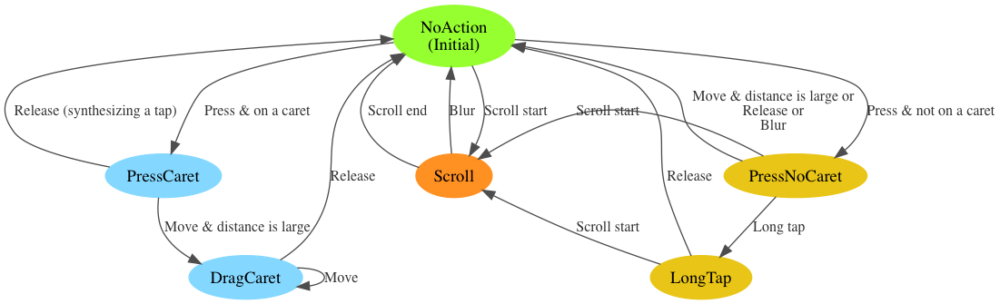

***************
AccessibleCaret
***************

AccessibleCaret is a pair of raindrop shape handles at both ends of selection
highlight, or it is a single handle at the blinking caret in a text area. It
assists the user to change the range of the selection highlight or the position
of the blinking caret on platforms with touch-event support.

Meta Bug
========

`Bug 1124074 <https://bugzilla.mozilla.org/show_bug.cgi?id=1124074>`__ tracks all the open issues.

Gecko implementation details
============================

Preferences
-----------
* ``layout.accessiblecaret.enabled_on_touch`` (Enabled on Firefox with touch-event support since 51.)
* ``layout.accessiblecaret.enabled`` (Defaults off, but it can be turn on to force enable AccessibleCaret.)
* ``layout.accessiblecaret.hide_carets_for_mouse_input`` (Defaults on. Turn
  this on to debug AccessibleCaret on desktop browser with mouse events.)

AccessibleCaretEventHub State Transition Diagram
------------------------------------------------

This diagram depicts the state transition of the state machine in
AccessibleCaretEventHub, which handles external events and callbacks.

Note that the diagram omits some callbacks which do not cause a state transition
such as ``NotifySelectionChanged`` or ``Reflow``.

This table is a mapping of the real events and callback to the actions described
on the edge of the diagram:

+---------------------------------------------------+--------------+
| Real events or callbacks                          | Actions      |
+===================================================+==============+
| ``eMouseDown`` or ``eTouchStart``                 | Press        |
+---------------------------------------------------+--------------+
| ``eMouseMove`` or ``eTouchMove``                  | Move         |
+---------------------------------------------------+--------------+
| ``eMouseUp`` or ``eTouchEnd`` or ``eTouchCancel`` | Release      |
+---------------------------------------------------+--------------+
| ``eMouseLongTap``                                 | Long tap     |
+---------------------------------------------------+--------------+
| ``AsyncPanZoomStarted()``                         | Scroll start |
+---------------------------------------------------+--------------+
| ``AsyncPanZoomStopped()``                         | Scroll end   |
+---------------------------------------------------+--------------+
| ``NotifyBlur()``                                  | Blur         |
+---------------------------------------------------+--------------+

Debug Tips
----------

* Dump AccessibleCaret log from command line: run ``MOZ_LOG=AccessibleCaret:5 ./mach run``.
* Dump AccessibleCaret log by using a preference: Open ``about:config`` and add a pref ``logging.AccessibleCaret`` with value ``debug`` or ``verbose`` (case matters).
* ``AC_LOG()`` is useful to add new logs.

Developers
==========

Current maintainer
------------------

* Ting-Yu Lin <aethanyc@gmail.com>

Developers Emeritus
-------------------

* Morris Tseng <mtseng@mozilla.com>
* Jeremy Chen <jeremychen@mozilla.com>
* Boris Chiou <boris@mozilla.com>*
