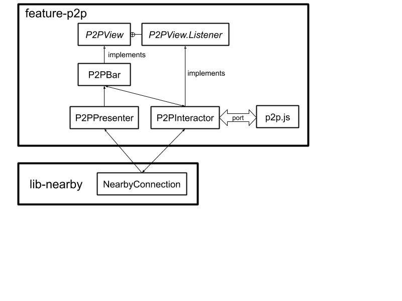

# [Android Components](../../../README.md) > Feature > P2P

A feature that enables sharing of URLs and web pages through peer-to-peer wifi
connections. Because this does not inline external references to images and CSS,
the page on the recipient device will lack those features unless connected to the Internet.
It works best in conjunction with [`feature-readerview`](../readerview).

## Usage

### Setting up the dependency

Use Gradle to download the library from [maven.mozilla.org](https://maven.mozilla.org/) ([Setup repository](../../../README.md#maven-repository)):

```Groovy
implementation "org.mozilla.components:feature-p2p:{latest-version}"
```

### Sample usage

The P2P toolbar has been integrated into [`samples/browser`](../../../samples/browser). Key files are:

* [`BaseBrowserFragment`](../../../samples/browser/src/main/java/org/mozilla/samples/browser/BaseBrowserFragment.kt),
which instantiates `P2PIntegration` and supports permission granting.
* [`P2PIntegration`](../../../samples/browser/src/main/java/org/mozilla/samples/browser/integration/P2PIntegration.kt),
which instantiates `P2PFeature` and contains code to launch and close the toolbar.
* [`DefaultComponents`](../../../samples/browser/src/main/java/org/mozilla/samples/browser/DefaultComponents.kt), which lazily provides a 
[NearbyConnection](../../components/lib/nearby/src/main/java/mozilla/components/lib/nearby/NearbyConnection.kt) and adds the toolbar to the settings menu.
* [`fragment_browser.xml`](../../../samples/browser/src/main/res/layout/fragment_browser.xml), which includes the `P2PBar` widget.

## Structure

The structure of the feature is shown in this block diagram:



## "Freeze-drying" a web page

An [experimental fork](https://github.com/espertus/android-components/tree/p2p-freeze-dry) uses the 
external library [`freeze-dry`](https://github.com/WebMemex/freeze-dry) to package up the entire 
web page. This version was not checked in to this repository because reviewing all of the JavaScript 
code was infeasible. Performance was also an issue.

## License

    This Source Code Form is subject to the terms of the Mozilla Public
    License, v. 2.0. If a copy of the MPL was not distributed with this
    file, You can obtain one at http://mozilla.org/MPL/2.0/
