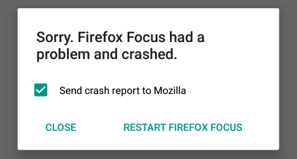
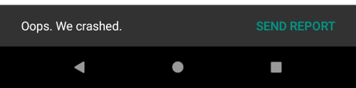

# [Android Components](../../../README.md) > Libraries > Crash

A generic crash reporter component that can report crashes to multiple services.

Main features:

* Support for multiple crash reporting services (included is support for [Sentry](https://sentry.io) and [Socorro](https://wiki.mozilla.org/Socorro)).
* Support for crashes caused by uncaught exceptions.
* Support for native code crashes (currently primarily focused on GeckoView crashes).
* Can optionally prompt the user for confirmation before sending a crash report.
* Support for showing in-app confirmation UI for non-fatal crashes.

## Usage

### Setting up the dependency

Use Gradle to download the library from [maven.mozilla.org](https://maven.mozilla.org/) ([Setup repository](../../../README.md#maven-repository)):

```Groovy
implementation "org.mozilla.components:lib-crash:{latest-version}"
```

### Setting up crash reporting

In the `onCreate()` method of your Application class create a `CrashReporter` instance and call `install()`:

```Kotlin
CrashReporter(
    services = listOf(
        // List the crash reporting services you want to use
    )
).install(this)
```

With this minimal setup the crash reporting library will capture "uncaught exception" crashes and "native code" crashes and forward them to the configured crash reporting services.

⚠️ Note: To avoid conflicting setups do not use any other crash reporting libraries/services independently from this library.

### Recording crash breadcrumbs to supported services

Using the `CrashReporter` instance to record crash breadcrumbs.  These breadcrumbs will then be sent when a crash occurs to aid in debugging.  Breadcrumbs are reported only if the underlying crash reporter service supports it.

⚠️ Note: Directly using Sentry's breadcrumb will not work as expected on Android 10 or above.  Using the `CrashReporter` breadcrumb is preferred. 

```Kotlin
crashReporter.recordCrashBreadcrumb(
  CrashBreadcrumb("Settings button clicked", data, "UI", Level.INFO, Type.USER)
)
```

### Sending crash reports to Sentry

⚠️ Note: The crash reporter library is compiled against the Sentry SDK but it doesn't require it as a dependency. The app using the component is responsible for adding the Sentry dependency to its build files in order to use Sentry crash reporting.

Add a `SentryService` instance to your `CrashReporter` in order to upload crashes to Sentry:

```Kotlin
CrashReporter(
    services = listOf(
        SentryService(applicationContext, "your sentry DSN")
    )
).install(applicationContext)
```

By default only the `DSN` is needed. But there are additional option configuration parameters:

```Kotlin
SentryService(
	applicationContext,
	"your sentry DSN",

	// Optionally add tags that will be sent with every crash report
	tags = mapOf(
		"build_flavor" to BuildConfig.FLAVOR,
		"build_type" to BuildConfig.BUILD_TYPE
	),
	
	// Send an event to Sentry for every native code crash. Native code crashes 
	// can't be uploaded to Sentry currently. But sending an event to Sentry
	// gives you an idea about how often native code crashes. For sending native
	// crash reports add additional services like Socorro.
	sendEventForNativeCrashes = true
)	
```

### Sending crash reports to Mozilla Socorro

[Socorro](https://wiki.mozilla.org/Socorro) is the name for the [Mozilla Crash Stats](https://crash-stats.mozilla.org/) project.

⚠️ Note: Socorro filters crashes by "app name". New app names need to be safelisted for the server to accept the crash. [File a bug](https://bugzilla.mozilla.org/enter_bug.cgi?product=Socorro) if you would like to get your app added to the safelist.

Add a `MozillaSocorroService` instance to your `CrashReporter` in order to upload crashes to Socorro:

```Kotlin
CrashReporter(
    services = listOf(
		MozillaSocorroService(applicationContext, "your app name")
    )
).install(applicationContext)
```

`MozillaSocorroService` will report version information such as App version, Android Component version, Glean version, Application Services version, GeckoView version and Build ID
⚠️ Note: Currently only native code crashes get uploaded to Socorro. Socorro has limited support for "uncaught exception" crashes too, but it is recommended to use a more elaborate solution like Sentry for that.

### Sending crash reports to Glean

[Glean](https://docs.telemetry.mozilla.org/concepts/glean/glean.html) is a new way to collect telemetry by Mozilla. 
This will record crash counts as a labeled counter with each label corresponding to a specific type of crash (`fatal_native_code_crash`, `nonfatal_native_code_crash`, `caught_exception`, `uncaught_exception`, currently).
The list of collected metrics is available in the [metrics.yaml file](metrics.yaml), with their documentation [living here](docs/metrics.md).
Due to the fact that Glean can only be recorded to in the main process and lib-crash runs in a separate process when it runs to handle the crash, 
lib-crash persists the data in a file format and then reads and records the data from the main process when the application is next run since the `GleanCrashReporterService`
constructor is loaded from the main process.

Add a `GleanCrashReporterService` instance to your `CrashReporter` in order to record crashes in Glean:

```Kotlin
CrashReporter(
    services = listOf(
		GleanCrashReporterService()
    )
).install(applicationContext)
```

⚠️ Note: Applications using the `GleanCrashReporterService` are **required** to undergo [Data Collection Review](https://wiki.mozilla.org/Firefox/Data_Collection) for the crash counts that they will be collecting.

### Showing a crash reporter prompt



Optionally the library can show a prompt asking the user for confirmation before sending a crash report.

The behavior can be controlled using the `shouldPrompt` parameter:

```Kotlin
CrashReporter(
    // Always prompt
    shouldPrompt = CrashReporter.Prompt.ALWAYS,
    
    // Or: Only prompt for native crashes
    shouldPrompt = CrashReporter.Prompt.ONLY_NATIVE_CRASH,
    
    // Or: Never show the prompt
    shouldPrompt = CrashReporter.Prompt.NEVER,
    
    // ..
).install(applicationContext)
```

#### Customizing the prompt

The crash reporter prompt can be customized by providing a `PromptConfiguration` object:

```Kotlin
CrashReporter(
	promptConfiguration = CrashReporter.PromptConfiguration(
		appName = "My App",
		organizationName = "My Organization",

		// An additional message that will be shown in the prompt
		message = "We are very sorry!"

		// Use a custom theme for the prompt (Extend Theme.Mozac.CrashReporter)
		theme = android.R.style.Theme_Holo_Dialog
	),

	// ..
).install(applicationContext)
```

#### Handling non-fatal crashes

A native code crash can be non-fatal. In this situation a child process crashed but the main process (in which the application runs) is not affected. In this situation a crash can be handled more gracefully and instead of using the crash reporter prompt of the component an app may want to show an in-app UI for asking the user for confirmation.



Provide a `PendingIntent` that will be invoked when a non-fatal crash occurs:

```Kotlin
// Launch this activity when a crash occurs.
val pendingIntent = PendingIntent.getActivity(
    context,
    0,
    Intent(this, MyActivity::class.java).apply {
        addFlags(Intent.FLAG_ACTIVITY_NEW_TASK)
    },
    PendingIntentUtils.defaultFlags
)

CrashReporter(
    shouldPrompt = CrashReporter.Prompt.ALWAYS,
    services = listOf(
        // ...
    ),
    nonFatalCrashIntent = pendingIntent
).install(this)
```

In your component that receives the Intent (e.g. `Activity`) you can use `Crash.fromIntent()` to receive the `Crash` object. Once the user has approved sending a report call `submitReport()` on your `CrashReporter` instance.

```Kotlin
// In your crash handling component (e.g. Activity)
if (Crash.isCrashIntent(intent) {
	val crash = Crash.fromIntent(intent)
	
	...
}	

// Once the user has confirmed sending a crash report:
crashReporter.submitReport(crash)
```

⚠️ Note: `submitReport()` may block and perform I/O on the calling thread.

### Sending GeckoView crash reports

⚠️ Note: For sending GeckoView crash reports GeckoView **64.0** or higher is required!

Register `CrashHandlerService` as crash handler for GeckoView:

```Kotlin
val settings = GeckoRuntimeSettings.Builder()
    .crashHandler(CrashHandlerService::class.java)
    .build()

// Crashes of this runtime will be forwarded to the crash reporter component
val runtime = GeckoRuntime.create(applicationContext, settings)

// If you are using the browser-engine-gecko component then pass the runtime
// to your code initializing the engine:
val engine = GeckoEngine(applicationContext, defaultSettings, runtime)
```

ℹ️ You can force a child process crash (non fatal!) using a multi-process (E10S) GeckoView by loading the test URL `about:crashcontent`. Using a non-multi-process GeckoView you can use `about:crashparent` to force a fatal crash.

## License

    This Source Code Form is subject to the terms of the Mozilla Public
    License, v. 2.0. If a copy of the MPL was not distributed with this
    file, You can obtain one at http://mozilla.org/MPL/2.0/
