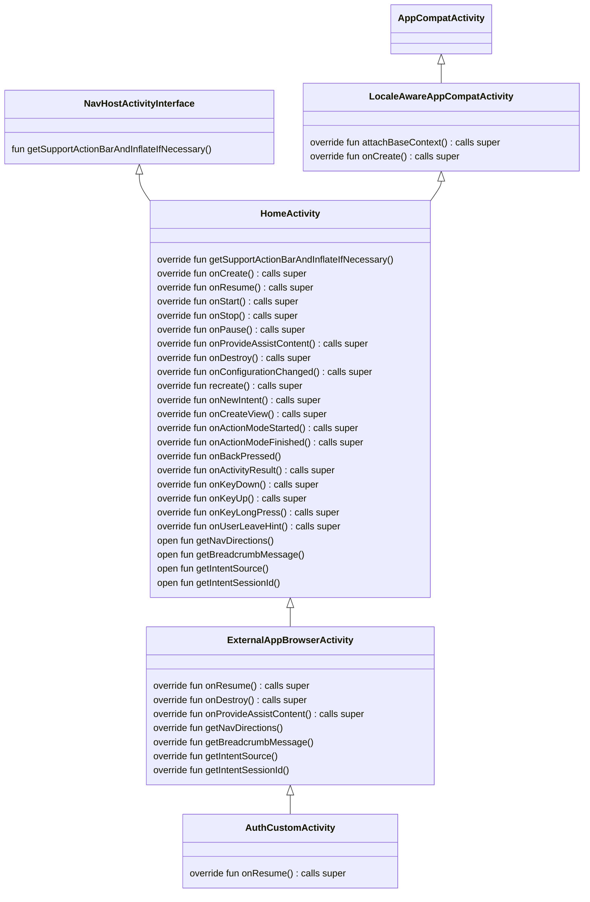

* Start date: 2023-12-06
* RFC PR: [#4732](https://github.com/mozilla-mobile/firefox-android/pull/4732)

## Summary
The Custom Tabs feature is partially implemented by `ExternalAppBrowserActivity` and `AuthCustomTabActivity`. The use of inheritance in these `Activity`s contributes to a closely coupled system.

The aim of this RFC is to strive towards a single `Activity` architecture as is [recommended for Modern Android Development (MAD)](https://developer.android.com/topic/architecture/recommendations#ui-layer).

The initial tasks will aim to:
1. reduce the dependencies between `ExternalAppBrowserActivity` and `HomeActivity`
2. establish clear responsibilities in `HomeActivity`
3. provide a foundation on which to continue refactoring to a single `Activity`

⚠️ This work is exclusively a refactor of the current implementation, there should be no changes to existing behavior or features.

## Motivation
Fenix has [numerous open bugs and feature requests relating to the Custom Tabs feature](https://bugzilla.mozilla.org/show_bug.cgi?id=1815918). To facilitate efficient implementation & debugging of these (and future) bugs we should create code that is easy to maintain. Some notable issues:

1. A close coupling of `ExternalAppBrowserActivity` & `AuthCustomTabActivity` with the `HomeActivity`, which increases the likelihood of:
   * difficult to detect bugs
   * difficultly debugging
   * unexpected behavior
   * making the area resistant to change
   * confusion of responsibility

2. `HomeActivity` has a mix of responsibilities, is bloated and monolithic. It contains unused fields, some incorrect visibility modifiers and generally in need of some house-keeping. These issues may be partly due to it's own downstream dependencies. See [0010-add-state-based-navigation.md](https://github.com/mozilla-mobile/firefox-android/blob/1c8de2d2fa7226f568cd49b2161bb9b5471cbcb5/docs/rfcs/0010-add-state-based-navigation.md) for reading around the navigation issue which includes `HomeActivity`.

3. Inheritance has potential to introduce confusion, for example `ExternalAppBrowserFragment` already has duplicate dependencies defined for `UserInteractionHandler`.

4. `ExternalAppBrowserActivity` contains multiple no-op functions.

### Activity architecture overview
**Note**: This is an abridged abstraction of the mentioned *classes* focusing on only the relevant `public` and `protected` APIs.

#### Observations

1. `HomeActivity` is used as a 'base' `Activity` for `ExternalAppBrowserActivity` and `AuthCustomTabActivity`.

2. `ExternalAppBrowserActivity` overrides the following `AppCompatActivity` functions:
* `onResume()`
* `onDestroy()`
* `onProvideAssistContent()`

which all depend on the `super` (`HomeActivity`) definitions prior to adding the `ExternalAppBrowserActivity` behaviour. `onResume()` is further propagated to `AuthCustomTabActivity` which depends on the `ExternalAppBrowserActivity` implementation.

3. `ExternalAppBrowserActivity` is required to override the following `HomeActivity` defined functions:
* `getNavDirections()`
* `getBreadcrumbMessage()`
* `getIntentSource()`
* `getIntentSessionId()`

It's notable that the `HomeActivity` `getIntentSessionId()` implementation always returns `null` and is required to take a redundant `intent` parameter.
The `HomeActivity` `getNavDirections()` implementation is required to take a redundant `customTabSessionId` parameter.

4. The `ExternalAppBrowserActivity` currently uses the `HomeActivity` `onCreate()` implementation. This forces the Custom Tabs features to to perform unnecessary checks such as:
* `maybeShowSplashScreen()`
* `shouldShowOnboarding()`
* perform checks for Homepage Contile feature activity
* perform checks for Pocket feature activity

This list is not exhaustive but gives an insight into the redundant work being forced upon the `ExternalAppBrowserActivity`. This applies to many of the other `HomeActivity` lifecycle related functions.

## Proposal
Reduce the coupling of the `Activity`s. Establish `HomeActivity` as the *main* `Activity` and define clear responsibilities. Below is an list of suggested refactorings to initiate the decoupling.

1. Remove the no-ops from `ExternalAppBrowserActivity`. [Example PR.](https://github.com/mozilla-mobile/firefox-android/pull/4851)

2. Delegate the `Activity`s 'get nav directions' functionality. This removes the definition from `HomeActivity` and the requirement to override it in `ExternalAppBrowserActivity`. [Example PR.](https://github.com/mozilla-mobile/firefox-android/pull/4854)

3. Delegate the `HomeActivity` 'open to browser' functionality. This removes another responsibility from `HomeActivity`. [Example PR.](https://github.com/mozilla-mobile/firefox-android/pull/4857)

4. Extract the `getBreadcrumbMessage`, `getIntentSource` and `getIntentSessionId` functions from `HomeActivity` using an `Activity` delegate. This removes the definition from `HomeActivity` and the requirement to override it in `ExternalAppBrowserActivity`. [Example PR.](https://github.com/mozilla-mobile/firefox-android/pull/4872)

5. Update `HomeActivity` & `ExternalAppBrowserActivity` with the necessary visibility modifiers to enforce constraints.

6. Extract the `handleRequestDesktopMode` function. This removes another responsibility from `HomeActivity`.

7. Rename `HomeActivity` to be explicit that this is the *main* `Activity`. For info, the Focus application uses a `MainActivity`, the Reference Browser application uses a `BrowserActivity`.

The next steps are less clearly defined and require more investigation on the completion of the above tasks.

* Explore alternatives to the current Inheritance structure. E.g. Kotlin Delegation methods, an alternative 'base' `Activity` model or consolidating `ExternalAppBrowserActivity` & `HomeActivity` into a single `Activity`.
* Prevent unnecessary checks being carried out by `ExternalAppBrowserActivity` in `HomeActivity` lifecycle related functions.

## Drawbacks
* Current reported Custom Tabs Bugzilla bugs may be affected by the changes mentioned here.
* No immediate tangible user facing improvements.

## Rationale and alternatives
### Rationale
* It is well established best practice to ['Prefer composition over inheritence'](https://en.wikipedia.org/wiki/Composition_over_inheritance). An implementation of this principal is also exemplified in AC UI classes, see Reference Browser UI classes e.g. `BrowserActivity` & `BaseBrowserFragment`.
* [Separation of concerns](https://developer.android.com/topic/architecture#separation-of-concerns).
> The most important principle to follow is separation of concerns. It's a common mistake to write all your code in an Activity or a Fragment. These UI-based classes should only contain logic that handles UI and operating system interactions. By keeping these classes as lean as possible, you can avoid many problems related to the component lifecycle, and improve the testability of these classes.
* Reducing the coupling of the `Activity`s and clear delineation of responsibilities should vastly improve their maintainability & testability.

### Alternatives
* Leave the inheritance as-is between `HomeActivity`, `ExternalAppBrowserActivity` & `AuthCustomTabActivity` and only focus on refactoring work.
