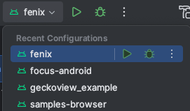

.. _fenix-contributor-guide:

Building Firefox for Android
============================

1. Cloning the repo
-------------------

First, you'll want to `set up your machine to build Firefox </setup>`_.
Follow the instructions there, choosing "GeckoView/Firefox for Android" or "GeckoView/Firefox for Android Artifact Mode" as
the bootstrap option. Please refer to the "Bootstrap" section below to understand better those options.

Once you're set up and have a GeckoView build from the above, please
continue with the following steps.

2. Bootstrap
------------

If you intend to work mainly on GeckoView, you can find more information `here <geckoview/contributor/for-gecko-engineers.html>`_.

Bootstrap configures everything for GeckoView and Fenix (Firefox for Android) development.

.. code-block:: shell

    ./mach bootstrap

You should then choose one the following options:

A- You will not change any GeckoView code, or only Java and JS code on GeckoView:
~~~~~~~~~~~~~~~~~~~~~~~~~~~~~~~~~~~~~~~~~~~~~~~~~~~~~~~~~~~~~~~~~~~~~~~~~~~~~~~~~

Choose: ``3. GeckoView/Firefox for Android Artifact Mode``

Artifact mode downloads pre-built C++ components rather than building them locally, trading bandwidth for time.
(more on Artifact mode)

B- You intend to change GeckoView code:
~~~~~~~~~~~~~~~~~~~~~~~~~~~~~~~~~~~~~~~

Choose: ``4. GeckoView/Firefox for Android``

This will build GeckoView from scratch, and take more time than the option above.

Once ``./mach bootstrap`` is complete, it will automatically write the configuration into a new ``mozconfig`` file.
If you already have a ``mozconfig``, mach will instead output a new configuration that you should append to your existing file.

3. Build GeckoView
------------------

You can now build GeckoView, using

.. code-block:: shell

    ./mach build

.. _build_fenix:

4. Build Fenix or other Android projects Using Android Studio
-------------------------------------------------------------

1. **You will only work on one of those projects: Fenix, Focus, Android Components**

Open your project's folder on Android Studio. You can find it under: ``[your mozilla-central path]/mobile/android``

After ``./mach build`` completed successfully, you will need to use `File/Sync Project with Gradle files`.

2. **You will work on GeckoView only, or GeckoView in integration with the other projects**

Open the root folder (meaning the ``mozilla-central`` folder you just checked out) on Android Studio.
From there, you should be able to choose the project you want to build.

After ``./mach build`` completed successfully, you will need to do a full Gradle Sync.

3. Run Fenix or other Android projects using command line
---------------------------------------------------------

From the root mozilla-central directory, you can run an emulator with the following command:

.. code-block:: shell

    ./mach android-emulator

From the `mobile/android/fenix` working directory, build, install and launch Fenix with:

.. code-block:: shell

    export JAVA_HOME=$HOME/.mozbuild/jdk/jdk-<latest-version>
    export ANDROID_HOME=$HOME/.mozbuild/android-sdk-<os_name>
    ./gradlew :app:installFenixDebug
    "$ANDROID_HOME/platform-tools/adb" shell am start -n org.mozilla.fenix.debug/org.mozilla.fenix.debug.App
