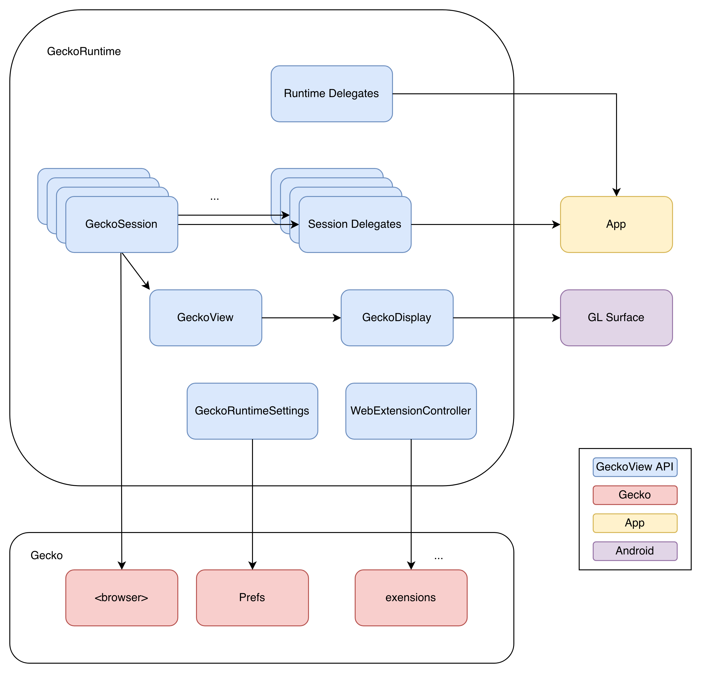
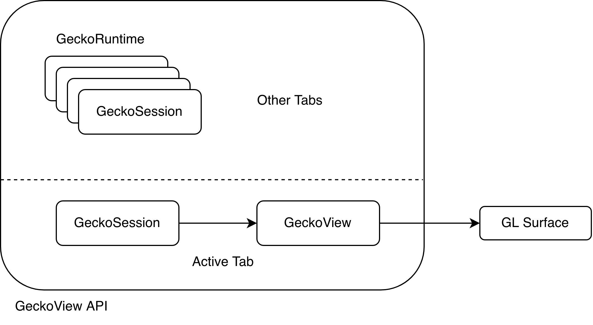
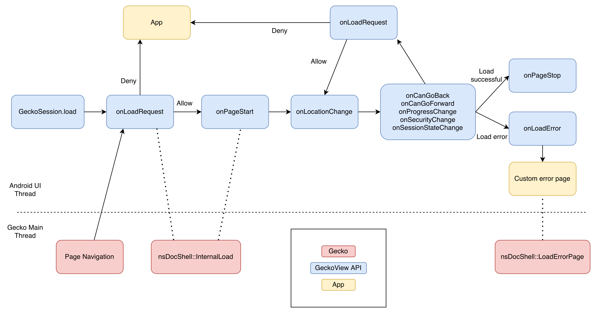
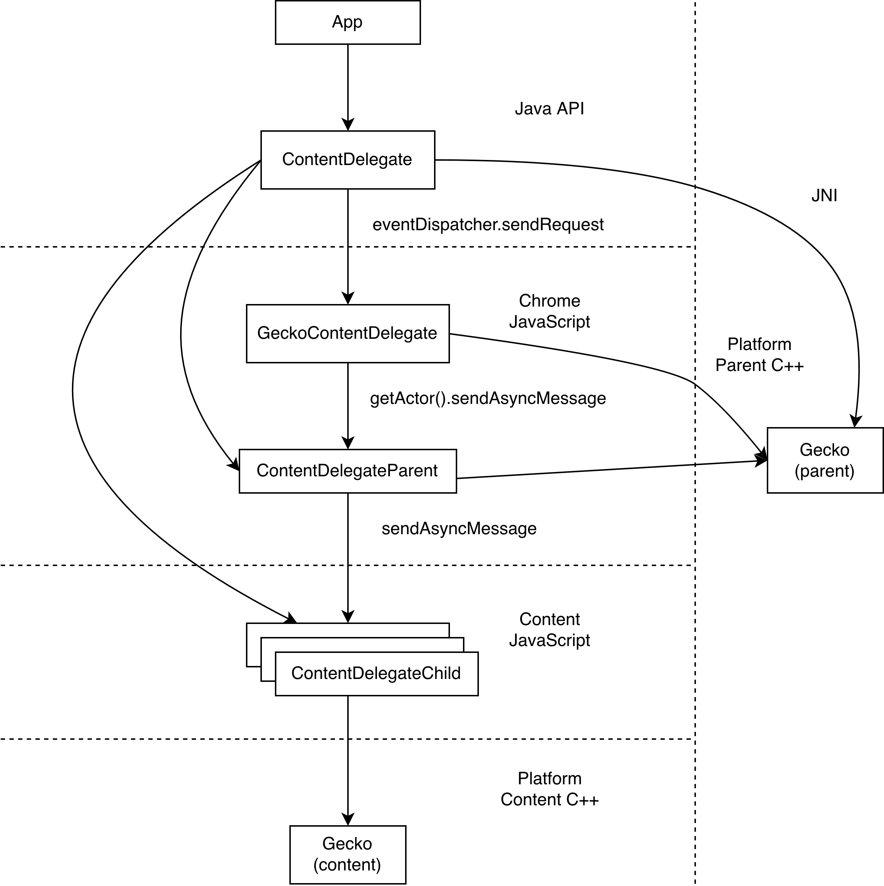

.. -*- Mode: rst; fill-column: 80; -*-

=====================
Architecture overview
=====================

.. contents:: Table of Contents
   :depth: 2
   :local:

Introduction
============

*Gecko* is a Web engine developed by Mozilla and used to power Firefox on
various platforms. A Web engine is roughly comprised of a JavaScript engine, a
Rendering engine, HTML parser, a Network stack, various media encoders, a
Graphics engine, a Layout engine and more.

Code that is part of a browser itself is usually referred to as "chrome" code
(from which the popular Chrome browser takes its name) as opposed to code part
of a Web site, which is usually referred to "content" code or content Web page.

*GeckoView* is an Android library that can be used to embed Gecko into Android
apps. Android apps that embed Gecko this way are usually referred to by
"embedders" or simply "apps".

GeckoView powers all currently active Mozilla browsers on Android, like Firefox
for Android and Firefox Focus.

API
===

The following sections describe parts of the GeckoView API that are public and
exposed to embedders.

   |api-diagram|

Overall tenets
--------------

GeckoView is an opinionated library that contains a minimal UI and makes no
assumption about the type of app that is being used by. Its main consumers
inside Mozilla are browsers, so a lot of features of GeckoView are geared
towards browsers, but there is no assumption that the embedder is actually a
browser (e.g. there is no concept of "tab" in GeckoView).

The GeckoView API tries to retain as little data as possible, delegating most
data storage to apps. Notable exceptions to this rule are: permissions,
extensions and cookies.

View, Runtime and Session
-------------------------

    |view-runtime-session|

There are three main classes in the GeckoView API:

- ``GeckoRuntime`` represents an instance of Gecko running in an app. Normally,
  apps have only one instance of the runtime which lives for as long as the app
  is alive. Any object in the API that is not specific to a *session*
  (more to this later) is usually reachable from the runtime.
- ``GeckoSession`` represents a web site *instance*. You can think of it as a
  *tab* in a browser or a Web view in an app. Any object related to the
  specific session will be reachable from this object. Normally, embedders
  would have many instances of ``GeckoSession`` representing each tab that is
  currently open. Internally, a session is represented as a "window" with one
  single tab in it.
- ``GeckoView`` is an Android ``View`` that embedders can use to paint a
  ``GeckoSession`` in the app. Normally, only ``GeckoSession`` s associated to
  a ``GeckoView`` are actually *alive*, i.e. can receive events, fire timers,
  etc.

Delegates
---------

Because GeckoView has no UI elements and doesn't store a lot of data, it needs
a way to *delegate* behavior when Web sites need functionality that requires
these features.

To do that, GeckoView exposes Java interfaces to the embedders, called
Delegates. Delegates are normally associated to either the runtime, when they
don't refer to a specific session, or a session, when they are
session-specific.

The most important delegates are:

- ``Autocomplete.StorageDelegate`` Which is used by embedders to implement
  autocomplete functionality for logins, addresses and credit cards.
- ``ContentDelegate`` Which receives events from the content Web page like
  "open a new window", "on fullscreen request", "this tab crashed" etc.
- ``HistoryDelegate`` Which receives events about new or modified history
  entries. GeckoView itself does not store history so the app is required to
  listen to history events and store them permanently.
- ``NavigationDelegate`` Informs the embedder about navigation events and
  requests.
- ``PermissionDelegate`` Used to prompt the user for permissions like
  geolocation, notifications, etc.
- ``PromptDelegate`` Implements content-side prompts like alert(), confirm(),
  basic HTTP auth, etc.
- ``MediaSession.Delegate`` Informs the embedder about media elements currently
  active on the page and allows the embedder to pause, resume, receive playback
  state etc.
- ``WebExtension.MessageDelegate`` Used by the embedder to exchange messages
  with built-in extensions. See also `Interacting with Web Content <../consumer/web-extensions.html>`_.

.. _GeckoDisplay:

GeckoDisplay
------------

GeckoView can paint to either a ``SurfaceView`` or a ``TextureView``.

- ``SufaceView`` is what most apps will use and it's the default, it provides a
  barebone wrapper around a GL surface where GeckoView can paint on.
  SurfaceView is not part of normal Android compositing, which means that
  Android is not able to paint (partially) on top of a SurfaceView or apply
  transformations and animations to it.
- ``TextureView`` offers a surface which can be transformed and animated but
  it's slower and requires more memory because it's `triple-buffered
  <https://en.wikipedia.org/wiki/Multiple_buffering#Triple_buffering>`_
  (which is necessary to offer animations).

Most apps will use the ``GeckoView`` class to paint the web page. The
``GeckoView`` class is an Android ``View`` which takes part in the Android view
hierarchy.

Android recycles the ``GeckoView`` whenever the app is not visible, releasing
the associated ``SurfaceView`` or ``TextureView``. This triggers a few actions
on the Gecko side:

- The GL Surface is released, and Gecko is notified in
  `SyncPauseCompositor <https://searchfox.org/mozilla-central/rev/ead7da2d9c5400bc7034ff3f06a030531bd7e5b9/widget/android/nsWindow.cpp#1114>`_.
- The ``<browser>`` associated to the ``GeckoSession`` is `set to inactive <https://searchfox.org/mozilla-central/rev/ead7da2d9c5400bc7034ff3f06a030531bd7e5b9/mobile/android/geckoview/src/main/java/org/mozilla/geckoview/GeckoView.java#553>`_,
  which essentially freezes the JavaScript engine.

Apps that do not use ``GeckoView``, because e.g. they cannot use
``SurfaceView``, need to manage the active state manually and call
``GeckoSession.setActive`` whenever the session is not being painted on the
screen.

Thread safety
-------------

Apps will inevitably have to deal with the Android UI in a significant way.
Most of the Android UI toolkit operates on the UI thread, and requires
consumers to execute method calls on it. The Android UI thread runs an event
loop that can be used to schedule tasks on it from other threads.

Gecko, on the other hand, has its own main thread where a lot of the front-end
interactions happen, and many methods inside Gecko expect to be called on the
main thread.

To not overburden the App with unnecessary multi-threaded code, GeckoView will
always bridge the two "main threads" and redirect method calls as appropriate.
Most GeckoView delegate calls will thus happen on the Android UI thread and
most APIs are expected to be called on the UI thread as well.

This can sometimes create unexpected performance considerations, as illustrated
in later sections.

GeckoResult
-----------

An ubiquitous tool in the GeckoView API is ``GeckoResult``. GeckoResult is a
promise-like class that can be used by apps and by Gecko to return values
asynchronously in a thread-safe way. Internally, ``GeckoResult`` will keep
track of what thread it was created on, and will execute callbacks on the same
thread using the thread's ``Handler``.

When used in Gecko, ``GeckoResult`` can be converted to ``MozPromise`` using
``MozPromise::FromGeckoResult``.

Page load
---------

    |pageload-diagram|

GeckoView offers several entry points that can be used to react to the various
stages of a page load. The interactions can be tricky and surprising so we will
go over them in details in this section.

For each page load, the following delegate calls will be issued:
``onLoadRequest``, ``onPageStart``, ``onLocationChange``,
``onProgressChange``, ``onSecurityChange``, ``onSessionStateChange``,
``onCanGoBack``, ``onCanGoForward``, ``onLoadError``, ``onPageStop``.

Most of the method calls are self-explanatory and offer the App a chance to
update the UI in response to a change in the page load state. The more
interesting delegate calls will be described below.

onPageStart and onPageStop
~~~~~~~~~~~~~~~~~~~~~~~~~~~

``onPageStart`` and ``onPageStop`` are guaranteed to appear in pairs and in
order, and denote the beginning and the end of a page load. In between a start
and stop event, multiple ``onLoadRequest`` and ``onLocationChange`` call can be
executed, denoting redirects.

onLoadRequest
~~~~~~~~~~~~~

``onLoadRequest``, which is perhaps the most important, can be used by the App
to intercept page loads. The App can either *deny* the load, which will stop
the page from loading, and handle it internally, or *allow* the
load, which will load the page in Gecko. ``onLoadRequest`` is called for all
page loads, regardless of whether they were initiated by the app itself, by Web
content, or as a result of a redirect.

When the page load originates in Web content, Gecko has to synchronously
wait for the Android UI thread to schedule the call to ``onLoadRequest`` and
for the App to respond. This normally takes a negligible amount of time, but
when the Android UI thread is busy, e.g. because the App is being painted for
the first time, the delay can be substantial. This is an area of GeckoView that
we are actively trying to improve.

onLoadError
~~~~~~~~~~~

``onLoadError`` is called whenever the page does not load correctly, e.g.
because of a network error or a misconfigured HTTPS server. The App can return
a URL to a local HTML file that will be used as error page internally by Gecko.

onLocationChange
~~~~~~~~~~~~~~~~

``onLocationChange`` is called whenever Gecko commits to a navigation and the
URL can safely displayed in the URL bar.

onSessionStateChange
~~~~~~~~~~~~~~~~~~~~

``onSessionStateChange`` is called whenever any piece of the session state
changes, e.g. form content, scrolling position, zoom value, etc. Changes are
batched to avoid calling this API too frequently.

Apps can use ``onSessionStateChange`` to store the serialized state to
disk to support restoring the session at a later time.

Third-party root certificates
-----------------------------

Gecko maintains its own Certificate Authority store and does not use the
platform's CA store. GeckoView follows the same policy and will not, by
default, read Android's CA store to determine root certificates.

However, GeckoView provides a way to import all third-party CA roots added to
the Android CA store by setting the `enterpriseRootsEnabled
<https://mozilla.github.io/geckoview/javadoc/mozilla-central/org/mozilla/geckoview/GeckoRuntimeSettings.Builder.html#enterpriseRootsEnabled(boolean)>`_
runtime setting to ``true``, this feature is implemented in `EnterpriseRoots
<https://searchfox.org/mozilla-central/rev/26a6a38fb515dbab0bb459c40ec4b877477eefef/mobile/android/geckoview/src/main/java/org/mozilla/gecko/EnterpriseRoots.java>`_

There is not currently any API for an app to manually specify additional CA
roots, although this might change with `Bug 1522162
<https://bugzilla.mozilla.org/show_bug.cgi?id=1522162>`_.

Lite and Omni builds
---------------------

A variation of the default GeckoView build, dubbed `Omni` in the codebase,
provides additional libraries that can be helpful when building a browser app.
Currently, the `Glean
<https://docs.telemetry.mozilla.org/concepts/glean/glean.html>`_ library is
included in the ``geckoview-omni`` package.  The default build ``geckoview``,
which does not contain such libraries, is similarly dubbed `Lite` in the
codebase.

The additional libraries in the Omni package are directly built into Gecko's
main ``.so`` file, ``libxul.so``. These libraries are then declared in the
``.module`` package inside the ``maven`` repository, e.g. see the ``.module``
file for `geckoview-omni
<https://maven.mozilla.org/maven2/org/mozilla/geckoview/geckoview-omni/102.0.20220623063721/geckoview-omni-102.0.20220623063721.module>`_:

.. code-block:: json

      "capabilities": [
        {
          "group": "org.mozilla.geckoview",
          "name": "geckoview-omni",
          "version": "102.0.20220623063721"
        },
        {
          "group": "org.mozilla.telemetry",
          "name": "glean-native",
          "version": "44.1.1"
        }
      ]

Notice the ``org.mozilla.telemetry:glean-native`` capability is declared
alongside ``org.mozilla.geckoview``.

The main Glean library then depends on ``glean-native`` which is either
provided in a standalone package (for apps that do not include GeckoView) or by
the GeckoView capability above.

In Treeherder, the Lite build is denoted with ``Lite``, while the Omni builds
don't have extra denominations as they are the default build, so e.g. for
``x86_64`` the platorm names would be:

- ``Android 7.0 x86-64`` for the Omni build
- ``Android 7.0 x86-64 Lite`` for the Lite build

Extensions
----------

Extensions can be installed using ``WebExtensionController::install`` and
``WebExtensionController::installBuiltIn``, which asynchronously returns a
``WebExtension`` object that can be used to set delegates for
extension-specific behavior.

The ``WebExtension`` object is immutable, and will be replaced every time a
property changes. For instance, to disable an extension, apps can use the
``disable`` method, which will return an updated version of the
``WebExtension`` object.

Internally, all ``WebExtension`` objects representing one extension share the
same delegates, which are stored in ``WebExtensionController``.

Given the extensive sprawling amount of data associated to extensions,
extension installation persists across restarts. Existing extensions can be
listed using ``WebExtensionController::list``.

In addition to ordinary WebExtension APIs, GeckoView allows ``builtIn``
extensions to communicate to the app via native messaging. Apps can register
themselves as native apps and extensions will be able to communicate to the app
using ``connectNative`` and ``sendNativeMessage``. Further information can be
found `here <../consumer/web-extensions.html>`__.

Internals
=========

The following sections describe how Gecko and GeckoView are implemented. These
parts of GeckoView are not normally exposed to embedders.

Process Model
-------------

Internally, Gecko uses a multi-process architecture, most of the chrome code
runs in the *main* process, while content code runs in *child* processes also
called *content* processes. There are additional types of specialized processes
like the *socket* process, which runs parts of the networking code, the *gpu*
process which executes GPU commands, the *extension* process which runs most
extension content code, etc.

We intentionally do not expose our process model to embedders.

To learn more about the multi-process architecture see `Fission for GeckoView
engineers <https://gist.github.com/agi/c900f3e473ff681158c0c907e34780e4>`_.

The majority of the GeckoView Java code runs on the main process, with a thin
glue layer on the child processes, mostly contained in ``GeckoThread``.

Process priority on Android
~~~~~~~~~~~~~~~~~~~~~~~~~~~

On Android, each process is assigned a given priority. When the device is
running low on memory, or when the system wants to conserve resources, e.g.
when the screen has been off for a long period of time, or the battery is low,
Android will sort all processes in reverse priority order and kill, using a
``SIGKILL`` event, enough processes until the given free memory and resource
threshold is reached.

Processes that are necessary to the function of the device get the highest
priority, followed by apps that are currently visible and focused on the
screen, then apps that are visible (but not on focus), background processes and
so on.

Processes that do not have a UI associated to it, e.g. background services,
will normally have the lowest priority, and thus will be killed most
frequently.

To increase the priority of a service, an app can ``bind`` to it. There are
three possible ``bind`` priority values

- ``BIND_IMPORTANT``: The process will be *as important* as the process binding
  to it
- default priority: The process will have lower priority than the process
  binding to it, but still higher priority than a background service
- ``BIND_WAIVE_PRIORITY``: The bind will be ignored for priority
  considerations.

It's important to note that the priority of each service is only relative to
the priority of the app binding to it. If the app is not visible, the app
itself and all services attached to it, regardless of binding, will get
background priority (i.e. the lowest possible priority).

Process management
~~~~~~~~~~~~~~~~~~

Each Gecko process corresponds to an Android ``service`` instance, which has to
be declared in GeckoView's ``AndroidManifest.xml``.

For example, this is the definition of the ``media`` process:

.. code-block::

  <service
          android:name="org.mozilla.gecko.media.MediaManager"
          android:enabled="true"
          android:exported="false"
          android:isolatedProcess="false"
          android:process=":media">

Process creation is controlled by Gecko which interfaces to Android using
``GeckoProcessManager``, which translates Gecko's priority to Android's
``bind`` values.

Because all priorities are waived when the app is in the background, it's not
infrequent that Android kills some of GeckoView's services, while still leaving
the main process alive.

It is therefore very important that Gecko is able to recover from process
disappearing at any moment at runtime.

Priority Hint
~~~~~~~~~~~~~

Internally, GeckoView ties the lifetime of the ``Surface`` associated to a
``GeckoSession`` and the process priority of the process where the session
lives.

The underlying assumption is that a session that is not visible doesn't have a
surface associated to it and it's not being used by the user so it shouldn't
receive high priority status.

The way this is implemented is `by setting
<https://searchfox.org/mozilla-central/rev/5b2d2863bd315f232a3f769f76e0eb16cdca7cb0/mobile/android/geckoview/src/main/java/org/mozilla/geckoview/GeckoView.java#114,123>`_
the ``active`` property on the ``browser`` object to ``false``, which causes
Gecko to de-prioritize the process, assuming that no other windows in the same
process have ``active=true``. See also `GeckoDisplay`_.

However, there are use cases where just looking at the surface is not enough.
For instance, when the user opens the settings menu, the currently selected tab
becomes invisible, but the user will still expect the browser to retain that
tab state with a higher priority than all the other tabs. Similarly, when the
browser is put in the background, the surface associated to the current tab
gets destroyed, but the current tab is still more important than the other
tabs, but because it doesn't have a surface associated to it, we have no way to
differentiate it from all the other tabs.

To solve the above problem, we expose an API for consumers to *boost* a session
priority, `setPriorityHint
<https://mozilla.github.io/geckoview/javadoc/mozilla-central/org/mozilla/geckoview/GeckoSession.html#setPriorityHint(int)>`_.
The priority hint is taken into consideration when calculating the
priority of a process.  Any process that contains either an active session or a
session with the priority hint `is boosted
<https://searchfox.org/mozilla-central/rev/5b2d2863bd315f232a3f769f76e0eb16cdca7cb0/dom/ipc/BrowserParent.cpp#3593>`_
to the highest priority.

Shutdown
--------

Android does not provide apps with a notification whenever the app is shutting
down. As explained in the section above, apps will simply be killed whenever
the system needs to reclaim resources. This means that Gecko on Android will
never shutdown cleanly, and that shutdown actions will never execute.

.. _principals:

Principals
----------

In Gecko, a *website* loaded in a session is represented by an abstraction
called `principal
<https://searchfox.org/mozilla-central/rev/5b2d2863bd315f232a3f769f76e0eb16cdca7cb0/caps/nsIPrincipal.idl>`_.
Principals contain information that is used to determine what permissions have
been granted to the website instance, what APIs are available to it, which
container the page is loaded in, is the page in private browsing or not, etc.

Principals are used throughout the Gecko codebase, GeckoView, however, does not
expose the concept to the API. This is intentional, as exposing it would
potentially expose the app to various security sensitive concepts, which would
violate the "secure" requirement for the GeckoView API.

The absence of principals from the API is, e.g., why GeckoView does not offer a
way to set permissions given a URL string, as permissions are internally stored
by principal. See also `Setting Permissions`_.

To learn more about principals see `this talk by Bobby Holley
<https://www.youtube.com/watch?v=28FPetl5Fl4>`_.

Window model
------------

Internally, Gecko has the concept of *window* and *tab*. Given that GeckoView
doesn't have the concept of tab (since it might be used to build something that
is *not* a browser) we hide Gecko tabs from the GeckoView API.

Each ``GeckoSession`` corresponds to a Gecko ``window`` object with exactly one
``tab`` in it. Because of this you might see ``window`` and ``session`` used
interchangeably in the code.

Internally, Gecko uses ``window`` s for other things other than
``GeckoSession``, so we have to sometime be careful about knowing which windows
belong to GeckoView and which don't. For example, the background extension page
is implemented as a ``window`` object that doesn't paint to a surface.

EventDispatcher
---------------

The GeckoView codebase is written in C++, JavaScript and Java, it runs across
processes and often deals with asynchronous and garbage-collected code with
complex lifetime dependencies. To make all of this work together, GeckoView
uses a cross-language event-driven architecture.

The main orchestrator of this event-driven architecture is ``EventDispatcher``.
Each language has an implementation of ``EventDispatcher`` that can be used to
fire events that are reachable from any language.

Each window (i.e. each session) has its own ``EventDispatcher`` instance, which
is also present on the content process. There is also a global
``EventDispatcher`` that is used to send and receive events that are not
related to a specific session.

Events can have data associated to it, which is represented as a
``GeckoBundle`` (essentially a ``String``-keyed variant map) on the Java and
C++ side, and a plain object on the JavaScript side. Data is automatically
converted back and forth by ``EventDispatcher``.

In Java, events are fired in the same thread where the listener was registered,
which allows us to ensure that events are received in a consistent order and
data is kept consistent, so that we by and large don't have to worry about
multi-threaded issues.

JNI
---

GeckoView code uses the Java Native Interface or JNI to communicate between
Java and C++ directly. Our JNI exports are generated from the Java source code
whenever the ``@WrapForJNI`` annotation is present. For non-GeckoView code, the
list of classes for which we generate imports is defined at
``widget/android/bindings``.

The lifetime of JNI objects depends on their native implementation:

- If the class implements ``mozilla::SupportsWeakPtr``, the Java object will
  store a ``WeakPtr`` to the native object and will not own the lifetime of the
  object.
- If the class implements ``AddRef`` and ``Release`` from ``nsISupports``, the
  Java object will store a ``RefPtr`` to the native object and will hold a
  strong reference until the Java object releases the object using
  ``DisposeNative``.
- If neither cases apply, the Java object will store a C++ pointer to the
  native object.

Calling Runtime delegates from native code
~~~~~~~~~~~~~~~~~~~~~~~~~~~~~~~~~~~~~~~~~~

Runtime delegates can be reached directly using the ``GeckoRuntime`` singleton.
A common pattern is to expose a ``@WrapForJNI`` method on ``GeckoRuntime`` that
will call the delegate, that than can be used on the native side. E.g.

.. code:: java

  @WrapForJNI
  private void featureCall() {
    ThreadUtils.runOnUiThread(() -> {
      if (mFeatureDelegate != null) {
        mFeatureDelegate.feature();
      }
    });
  }

And then, on the native side:

.. code:: cpp

  java::GeckoRuntime::LocalRef runtime = java::GeckoRuntime::GetInstance();
  if (runtime != nullptr) {
    runtime->FeatureCall();
  }

Session delegates
~~~~~~~~~~~~~~~~~

``GeckoSession`` delegates require a little more care, as there's a copy of a
delegate for each ``window``. Normally, a method on ``android::nsWindow`` is
added which allows Gecko code to call it. A reference to ``nsWindow`` can be
obtained from a ``nsIWidget`` using ``nsWindow::From``:

.. code:: cpp

  RefPtr<nsWindow> window = nsWindow::From(widget);
  window->SessionDelegateFeature();

The ``nsWindow`` implementation can then forward the call to
``GeckoViewSupport``, which is the JNI native side of ``GeckoSession.Window``.

.. code:: cpp

  void nsWindow::SessionDelegateFeature() {
    auto acc(mGeckoViewSupport.Access());
    if (!acc) {
      return;
    }
    acc->SessionDelegateFeature(aResponse);
  }

Which can in turn forward the call to the Java side using the JNI stubs.

.. code:: cpp

  auto GeckoViewSupport::SessionDelegateFeature() {
    GeckoSession::Window::LocalRef window(mGeckoViewWindow);
    if (!window) {
      return;
    }
    window->SessionDelegateFeature();
  }

And finally, the Java implementation calls the session delegate.

.. code:: java

  @WrapForJNI
  private void sessionDelegateFeature() {
    final GeckoSession session = mOwner.get();
    if (session == null) {
      return;
    }
    ThreadUtils.postToUiThread(() -> {
      final FeatureDelegate delegate = session.getFeatureDelegate();
      if (delegate == null) {
          return;
      }
      delegate.feature();
    });
  }

.. _permissions:

Permissions
-----------

There are two separate but related permission concepts in GeckoView: `Content`
permissions and `Android` permissions. See also the related `consumer doc
<../consumer/permissions.html>`_ on permissions.

Content permissions
~~~~~~~~~~~~~~~~~~~

Content permissions are granted to individual web sites (more precisely,
`principals`_) and are managed internally using ``nsIPermissionManager``.
Content permissions are used by Gecko to keep track which website is allowed to
access a group of Web APIs or functionality. The Web has the concept of
permissions, but not all Gecko permissions map to Web-exposed permissions.

For instance, the ``Notification`` permission, which allows websites to fire
notifications to the user, is exposed to the Web through
`Notification.requestPermission
<https://developer.mozilla.org/en-US/docs/Web/API/Notification/requestPermission>`_,
while the `autoplay` permission, which allows websites to play video and audio
without user interaction, is not exposed to the Web and websites have no way to
set or request this permission.

GeckoView retains content permission data, which is an explicit violation of
the design principle of not storing data. This is done because storing
permissions is very complex, making a mistake when dealing with permissions
often ends up being a security vulnerability, and because permissions depend on
concepts that are not exposed to the GeckoView API like `principals`_.

Android permissions
~~~~~~~~~~~~~~~~~~~

Consumers of GeckoView are Android apps and therefore they have to receive
permission to use certain features on behalf of websites.

For instance, when a website requests Geolocation permission for the first
time, the app needs to request the corresponding Geolocation Android permission
in order to receive position data.

You can read more about Android permissions on `this doc
<https://developer.android.com/guide/topics/permissions/overview>`_.

Implementation
~~~~~~~~~~~~~~

The main entry point from Gecko is ``nsIContentPermissionPrompt.prompt``, which
is handled in the `Permission module
<https://searchfox.org/mozilla-central/rev/256f84391cf5d4e3a4d66afbbcd744a5bec48956/mobile/android/components/geckoview/GeckoViewPermission.jsm#21>`_
in the same process where the request is originated.

The permission module calls the child actor `GeckoViewPermission
<https://searchfox.org/mozilla-central/rev/9dc5ffe42635b602d4ddfc9a4b8ea0befc94975a/mobile/android/actors/GeckoViewPermissionChild.jsm#47>`_
which issues a `GeckoView:ContentPermission
<https://searchfox.org/mozilla-central/rev/9dc5ffe42635b602d4ddfc9a4b8ea0befc94975a/mobile/android/actors/GeckoViewPermissionChild.jsm#75>`_
request to the Java front-end as needed.

Media permissions are requested using a global observer, and therefore are
handled in a `Process actor
<https://searchfox.org/mozilla-central/rev/9dc5ffe42635b602d4ddfc9a4b8ea0befc94975a/mobile/android/actors/GeckoViewPermissionProcessChild.jsm#41>`_,
media permissions requests have enough information to redirect the request to
the corresponding window child actor, with the exception of requests that are
not associated with a window, which are redirected to the `current active
window
<https://searchfox.org/mozilla-central/rev/9dc5ffe42635b602d4ddfc9a4b8ea0befc94975a/mobile/android/actors/GeckoViewPermissionProcessParent.jsm#28-35>`_.

Setting permissions
~~~~~~~~~~~~~~~~~~~

Permissions are stored in a map between a `principal <#principals>`_ and a list
of permission (key, value) pairs. To prevent security vulnerabilities, GeckoView
does not provide a way to set permissions given an arbitrary URL and requires
consumers to get hold of the `ContentPermission
<https://mozilla.github.io/geckoview/javadoc/mozilla-central/org/mozilla/geckoview/GeckoSession.PermissionDelegate.ContentPermission.html>`_
object. The ContentPermission object is returned in `onLocationChange
<https://mozilla.github.io/geckoview/javadoc/mozilla-central/org/mozilla/geckoview/GeckoSession.NavigationDelegate.html#onLocationChange(org.mozilla.geckoview.GeckoSession,java.lang.String,java.util.List)>`_
upon navigation, making it unlikely to have confusion bugs whereby the
permission is given to the wrong website.

Internally, some permissions are only present when a certain override is set,
e.g. Tracking Protection override permissions are only present when the page
has been given a TP override. Because the only way to set the value of a
permission is to get hold of the ``ContentPermission`` object, `we manually insert
<https://searchfox.org/mozilla-central/rev/5b2d2863bd315f232a3f769f76e0eb16cdca7cb0/mobile/android/modules/geckoview/GeckoViewNavigation.jsm#605-625>`_
a `trackingprotection` permission on every page load.

Autofill Support
----------------

GeckoView supports third-party autofill providers through Android's `autofill framework <https://developer.android.com/guide/topics/text/autofill>`_. Internally, this support is referred to as `autofill`.

Document tree
~~~~~~~~~~~~~

The autofill Java front-end is located in the `Autofill class
<https://searchfox.org/mozilla-central/rev/9dc5ffe42635b602d4ddfc9a4b8ea0befc94975a/mobile/android/geckoview/src/main/java/org/mozilla/geckoview/Autofill.java#37>`_.
GeckoView maintains a virtual tree structure of the current document for each
``GeckoSession``.

The virtual tree structure is composed of `Node
<https://searchfox.org/mozilla-central/rev/9dc5ffe42635b602d4ddfc9a4b8ea0befc94975a/mobile/android/geckoview/src/main/java/org/mozilla/geckoview/Autofill.java#593>`_
objects which are immutable. Data associated to a node, including mutable data
like the current value, is stored in a separate `NodeData
<https://searchfox.org/mozilla-central/rev/9dc5ffe42635b602d4ddfc9a4b8ea0befc94975a/mobile/android/geckoview/src/main/java/org/mozilla/geckoview/Autofill.java#171>`_
class. Only HTML nodes that are relevant to autofilling are referenced in the
virtual structure and each node is associated to a root node, e.g. the root
``<form>`` element. All root nodes are children of the autofill `mRoot
<https://searchfox.org/mozilla-central/rev/9dc5ffe42635b602d4ddfc9a4b8ea0befc94975a/mobile/android/geckoview/src/main/java/org/mozilla/geckoview/Autofill.java#210>`_
node, hence making the overall structure a tree rather than a collection of
trees. Note that the root node is the only node in the virtual structure that
does not correspond to an actual element on the page.

Internally, nodes are assigned a unique ``UUID`` string, which is used to match
nodes between the Java front-end and the data stored in GeckoView's chrome
Javascript. The autofill framework itself requires integer IDs for nodes, so we
store a mapping between UUIDs and integer IDs in the associated ``NodeData``
object. The integer IDs are used only externally, while internally only the
UUIDs are used. The reason why we use a separate ID structure from the autofill
framework is that this allows us to `generate UUIDs
<https://searchfox.org/mozilla-central/rev/7e34cb7a0094a2f325a0c9db720cec0a2f2aca4f/mobile/android/actors/GeckoViewAutoFillChild.jsm#217-220>`_
directly in the isolated content processes avoiding an IPC roundtrip to the
main process.

Each ``Node`` object is associated to an ``EventCallback`` object which is
invoked whenever the node is autofilled by the autofill framework.

Detecting autofillable nodes
~~~~~~~~~~~~~~~~~~~~~~~~~~~~

GeckoView scans every web page for password ``<input>`` elements whenever the
``pageshow`` event `fires
<https://searchfox.org/mozilla-central/rev/9dc5ffe42635b602d4ddfc9a4b8ea0befc94975a/mobile/android/actors/GeckoViewAutoFillChild.jsm#74-78>`_.

It also uses ``DOMFormHasPassword`` and ``DOMInputPasswordAdded`` to detect
whenever a password element is added to the DOM after the ``pageshow`` event.

Prefs
-----

`Preferences </modules/libpref/index.html>`_ (or prefs) are used throughtout
Gecko to configure the browser, enable custom features, etc.

GeckoView does not directly expose prefs to Apps. A limited set configuration
options is exposed through ``GeckoRuntimeSettings``.

``GeckoRuntimeSettings`` can be easily mapped to a Gecko ``pref`` using
``Pref``, e.g.

.. code:: java

  /* package */ final Pref<Boolean> mPrefExample =
     new Pref<Boolean>("example.pref", false);

The value of the pref can then be read internally using ``mPrefExample.get``
and written to using ``mPrefExample.commit``.

Front-end and back-end
----------------------

    |code-layers|

Gecko and GeckoView code can be divided in five layers:

- **Java API** the outermost code layer that is publicly accessible to
  GeckoView embedders.
- **Java Front-End** All the Java code that supports the API and talks directly
  to the Android APIs and to the JavaScript and C++ front-ends.
- **JavaScript Front-End** The main interface to the Gecko back-end (or Gecko
  proper) in GeckoView is JavaScript, we use this layer to call into Gecko and
  other utilities provided by Gecko, code lives in ``mobile/android``
- **C++ Front-End** A smaller part of GeckoView is written in C++ and interacts
  with Gecko directly, most of this code is lives in ``widget/android``.
- **C++/Rust Back-End** This is often referred to as "platform", includes all
  core parts of Gecko and is usually accessed to in GeckoView from the C++
  front-end or the JavaScript front-end.

Modules and Actors
------------------

GeckoView's JavaScript Front-End is largely divided into units called modules
and actors. For each feature, each window will have an instance of a Module, a
parent-side Actor and (potentially many) content-side Actor instances. For a
detailed description of this see `here <https://gist.github.com/agi/c900f3e473ff681158c0c907e34780e4#actors>`__.

Testing infrastructure
----------------------

For a detailed description of our testing infrastructure see `GeckoView junit
Test Framework <junit.html>`_.

