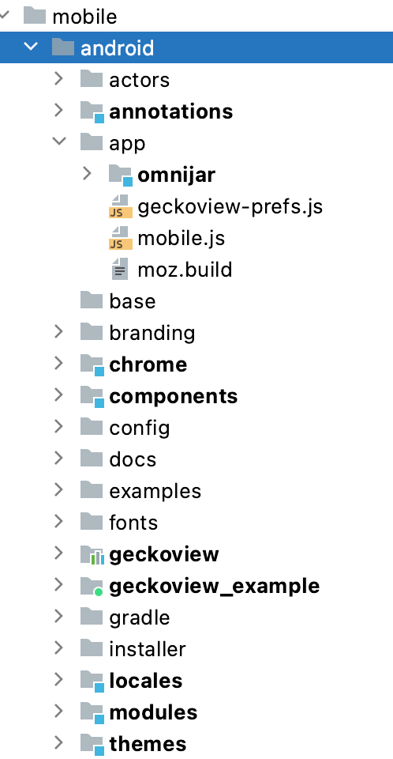

.. -*- Mode: rst; fill-column: 80; -*-

.. _geckoview-contributor-guide:

=================
Contributor Guide
=================

Table of contents
=================

.. contents:: :local:

GeckoView Contributor Quick Start Guide
=======================================

This is a guide for developers who want to contribute to the GeckoView
project. If you want to get started using GeckoView in your app then you
should refer to the
`wiki <https://wiki.mozilla.org/Mobile/GeckoView#Get_Started>`_.

Performing a bug fix
--------------------

As a first step, you need to set up :ref:`mozilla-central <mozilla-central-setup>`,
and :ref:`Bootstrap <bootstrap-setup>` and build the project.

Once you have got GeckoView building and running, you will want to start
contributing. There is a general guide to `Performing a Bug Fix for Git
Developers <contributing-to-mc.html>`_ for you to follow. To contribute to
GeckoView specifically, you will need the following additional
information.

Running tests and linter locally
~~~~~~~~~~~~~~~~~~~~~~~~~~~~~~~~

To ensure that your patch does not break existing functionality in
GeckoView, you can run the junit test suite with the following command

::

   ./mach geckoview-junit

This command also allows you to run individual tests or test classes,
e.g.

::

   ./mach geckoview-junit org.mozilla.geckoview.test.NavigationDelegateTest
   ./mach geckoview-junit org.mozilla.geckoview.test.NavigationDelegateTest#loadUnknownHost

If your patch makes a GeckoView JavaScript module, you should run ESLint
as well:

::

   ./mach lint -l eslint mobile/android/modules/geckoview/

To see information on other options, simply run
``./mach geckoview-junit --help``; of particular note for dealing with
intermittent test failures are ``--repeat N`` and
``--run-until-failure``, both of which do exactly what you’d expect.

Updating the changelog and API documentation
~~~~~~~~~~~~~~~~~~~~~~~~~~~~~~~~~~~~~~~~~~~~

If the patch that you want to submit changes the public API for
GeckoView, you must ensure that the API documentation is kept up to
date. To check whether your patch has altered the API, run the following
command.

.. code:: bash

   ./mach lint --linter android-api-lint

The output of this command will inform you if any changes you have made
break the existing API. Review the changes and follow the instructions
it provides.

If the linter asks you to update the changelog, please ensure that you
follow the correct format for changelog entries. Under the heading for
the next release version, add a new entry for the changes that you are
making to the API, along with links to any relevant files, and bug
number e.g.

::

   - Added [`GeckoRuntimeSettings.Builder#aboutConfigEnabled`][71.12] to control whether or
     not `about:config` should be available.
     ([bug 1540065]({{bugzilla}}1540065))

   [71.12]: {{javadoc_uri}}/GeckoRuntimeSettings.Builder.html#aboutConfigEnabled(boolean)

Submitting to the ``try`` server
~~~~~~~~~~~~~~~~~~~~~~~~~~~~~~~~

It is advisable to run your tests before submitting your patch. You can
do this using Mozilla’s ``try`` server. To submit a GeckoView patch to
``try`` before submitting it for review, type:

.. code:: bash

   ./mach try auto

This will automatically select tests to run from our suite. If your patch
passes on ``try`` you can be (fairly) confident that it will land successfully
after review.

Tagging a reviewer
~~~~~~~~~~~~~~~~~~

When submitting a patch to Phabricator, if you know who you want to
review your patch, put their Phabricator handle against the
``reviewers`` field.

If you don’t know who to tag for a review in the Phabricator submission
message, leave the field blank and, after submission, follow the link to
the patch in Phabricator and scroll to the bottom of the screen until
you see the comment box.

- Select the ``Add Action`` drop down and pick the ``Change Reviewers`` option.
- In the presented box, add ``geckoview-reviewers``. Selecting this group as the reviewer will notify all the members of the GeckoView team there is a patch to review.
- Click ``Submit`` to submit the reviewer change request.

Include GeckoView as a dependency
---------------------------------

If you want to include a development version of GeckoView as a
dependency inside another app, you must link to a local copy. There are
several ways to achieve this, but the preferred way is to use Gradle’s
*dependency substitution* mechanism, for which there is first-class
support in ``mozilla-central`` and a pattern throughout Mozilla’s
GeckoView-consuming ecosystem.

The good news is that ``mach build`` produces everything you need, so
that after the configuration below, you should find that the following
commands rebuild your local GeckoView and then consume your local
version in the downstream project.

.. code:: sh

   cd /path/to/mozilla-central && ./mach build
   cd /path/to/project && ./gradlew assembleDebug

**Be sure that your ``mozconfig`` specifies the correct ``--target``
argument for your target device.** Many projects use “ABI splitting” to
include only the target device’s native code libraries in APKs deployed
to the device. On x86-64 and aarch64 devices, this can result in
GeckoView failing to find any libraries, because valid x86 and ARM
libraries were not included in a deployed APK. Avoid this by setting
``--target`` to the exact ABI that your device supports.

Dependency substiting your local GeckoView into a Mozilla project
~~~~~~~~~~~~~~~~~~~~~~~~~~~~~~~~~~~~~~~~~~~~~~~~~~~~~~~~~~~~~~~~~

Most GeckoView-consuming projects produced by Mozilla support dependency
substitution via ``local.properties``. These projects include:

- `Fenix <https://github.com/mozilla-mobile/firefox-android/tree/main/fenix>`_
- `reference-browser <https://github.com/mozilla-mobile/reference-browser>`_
- `android-components <https://github.com/mozilla-mobile/firefox-android/tree/main/android-components>`_
- `Firefox Reality <https://github.com/MozillaReality/FirefoxReality>`_

Simply edit (or create) the file ``local.properties`` in the project
root and include a line like:

.. code:: properties

   dependencySubstitutions.geckoviewTopsrcdir=/path/to/mozilla-central

The default object directory – the one that a plain ``mach build``
discovers – will be used. You can optionally specify a particular object
directory with an additional line like:

.. code:: properties

   dependencySubstitutions.geckoviewTopobjdir=/path/to/object-directory

With these lines, the GeckoView-consuming project should use the
GeckoView AAR produced by ``mach build`` in your local
``mozilla-central``.

**Remember to remove the lines in ``local.properties`` when you want to
return to using the published GeckoView builds!**

Dependency substituting your local GeckoView into a non-Mozilla project
~~~~~~~~~~~~~~~~~~~~~~~~~~~~~~~~~~~~~~~~~~~~~~~~~~~~~~~~~~~~~~~~~~~~~~~

In projects that don’t have first-class support for dependency
substitution already, you can do the substitution yourself. See the
documentation in
`substitue-local-geckoview.gradle <https://hg.mozilla.org/mozilla-central/file/tip/substitute-local-geckoview.gradle>`_,
but roughly: in each Gradle project that consumes GeckoView, i.e., in
each ``build.gradle`` with a
``dependencies { ... 'org.mozilla.geckoview:geckoview-...' }`` block,
include lines like:

.. code:: groovy

   ext.topsrcdir = "/path/to/mozilla-central"
   ext.topobjdir = "/path/to/object-directory" // Optional.
   apply from: "${topsrcdir}/substitute-local-geckoview.gradle"

**Remember to remove the lines from all ``build.gradle`` files when you
want to return to using the published GeckoView builds!**

Next Steps
----------

-  Get started with `Native Debugging <native-debugging.html>`_

